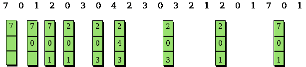

# 最优页面替换算法

> 原文:[https://www . geesforgeks . org/optimal-page-replacement-algorithm/](https://www.geeksforgeeks.org/optimal-page-replacement-algorithm/)

先决条件:[页面替换算法](https://www.geeksforgeeks.org/operating-system-page-replacement-algorithm/)

在操作系统中，每当引用一个新的页面并且该页面不在内存中时，就会发生页面错误，并且操作系统会用新需要的页面替换一个现有页面。不同的页面替换算法建议不同的方法来决定替换哪个页面。所有算法的目标都是减少页面错误的数量。
在该算法中，OS 替换未来最长时间内不会使用的页面。

示例:

```
Input : Number of frames, fn = 3
        Reference String, pg[] = {7, 0, 1, 2,
               0, 3, 0, 4, 2, 3, 0, 3, 2, 1,
               2, 0, 1, 7, 0, 1};
Output : No. of hits = 11 
         No. of misses = 9

Input : Number of frames, fn = 4 
        Reference String, pg[] = {7, 0, 1, 2, 
                  0, 3, 0, 4, 2, 3, 0, 3, 2};
Output : No. of hits = 7
         No. of misses = 6

```

这个想法很简单，对于每一个参考，我们都遵循:

1.  如果引用的页面已经存在，增加命中次数。
2.  如果不存在，请查找将来是否有从未被引用的页面。如果存在这样的页面，请用新页面替换此页面。如果不存在这样的页面，就找一个将来引用最远的页面。用新页面替换此页面。



```
// CPP program to demonstrate optimal page
// replacement algorithm.
#include <bits/stdc++.h>
using namespace std;

// Function to check whether a page exists
// in a frame or not
bool search(int key, vector<int>& fr)
{
    for (int i = 0; i < fr.size(); i++)
        if (fr[i] == key)
            return true;
    return false;
}

// Function to find the frame that will not be used
// recently in future after given index in pg[0..pn-1]
int predict(int pg[], vector<int>& fr, int pn, int index)
{
    // Store the index of pages which are going
    // to be used recently in future
    int res = -1, farthest = index;
    for (int i = 0; i < fr.size(); i++) {
        int j;
        for (j = index; j < pn; j++) {
            if (fr[i] == pg[j]) {
                if (j > farthest) {
                    farthest = j;
                    res = i;
                }
                break;
            }
        }

        // If a page is never referenced in future,
        // return it.
        if (j == pn)
            return i;
    }

    // If all of the frames were not in future,
    // return any of them, we return 0\. Otherwise
    // we return res.
    return (res == -1) ? 0 : res;
}

void optimalPage(int pg[], int pn, int fn)
{
    // Create an array for given number of
    // frames and initialize it as empty.
    vector<int> fr;

    // Traverse through page reference array
    // and check for miss and hit.
    int hit = 0;
    for (int i = 0; i < pn; i++) {

        // Page found in a frame : HIT
        if (search(pg[i], fr)) {
            hit++;
            continue;
        }

        // Page not found in a frame : MISS

        // If there is space available in frames.
        if (fr.size() < fn)
            fr.push_back(pg[i]);

        // Find the page to be replaced.
        else {
            int j = predict(pg, fr, pn, i + 1);
            fr[j] = pg[i];
        }
    }
    cout << "No. of hits = " << hit << endl;
    cout << "No. of misses = " << pn - hit << endl;
}

// Driver Function
int main()
{
    int pg[] = { 7, 0, 1, 2, 0, 3, 0, 4, 2, 3, 0, 3, 2 };
    int pn = sizeof(pg) / sizeof(pg[0]);
    int fn = 4;
    optimalPage(pg, pn, fn);
    return 0;
}
```

输出:

```
No. of hits = 7
No. of misses = 6
```

*   上述实现可以使用散列来优化。我们可以用一个[无序集](https://www.geeksforgeeks.org/unorderd_set-stl-uses/)来代替向量，这样搜索操作就可以在 O(1)时间内完成。
*   请注意，最佳页面替换算法并不实用，因为我们无法预测未来。然而，它被用作其他页面替换算法的参考。