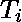
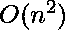

# 磁带上的最佳存储

> 原文:[https://www.geeksforgeeks.org/optimal-storage-tapes/](https://www.geeksforgeeks.org/optimal-storage-tapes/)

给定存储在计算机磁带上的程序，每个程序的长度为，其中，找出程序在磁带中的存储顺序，平均检索时间(MRT 给出为)最小。
**例:**

```
Input : n = 3
        L[] = { 5, 3, 10 }
Output : Order should be { 3, 5, 10 } with MRT = 29/3
```

**先决条件:** [磁带数据存储](https://en.wikipedia.org/wiki/Magnetic_tape_data_storage#Sequential_access_to_data)

让我们首先分解问题，了解需要做什么。
磁带只提供数据的顺序存取。在录音带/磁带中，与光盘不同，磁带中的第五首歌曲不能直接播放。播放第五首歌必须遍历前四首歌的长度。因此，为了访问某些数据，磁带的磁头应该相应地定位。
现在假设音频长度分别为 5、7、3 和 2 分钟的磁带中有 4 首歌曲。为了播放第四首歌曲，我们需要遍历 5 + 7 + 3 = 15 分钟的音频长度，然后定位磁带头。
数据检索时间是指检索/访问整个数据所花费的时间。因此，第四首歌的检索时间是 15 + 2 = 17 分钟。
现在，考虑到磁带中的所有程序被检索的频率相等，并且每次磁带头都指向磁带的前面，可以定义一个新的术语，称为平均检索时间(MRT)。
假设程序的检索时间为。因此
捷运是所有此类的平均值。因此或
对磁带中数据的顺序访问有一些限制。必须定义磁带中数据/程序的存储顺序，以便获得最少的 MRT。因此，存储顺序对于减少数据检索/访问时间变得非常重要。
因此，任务变得更简单–定义正确的顺序，从而最小化 MRT，即最小化术语
例如，假设有 3 个程序，长度分别为 2、5 和 4。所以总共有 3 个！= 6 种可能的存储顺序。

<figure class="table">

|   | 命令 | 总检索时间 | 平均检索时间 |
| one | 1 2 3 | 2 + (2 + 5) + (2 + 5 + 4) = 20 | 20/3 |
| Two | 1 3 2 | 2 + (2 + 4) + (2 + 4 + 5) = 19 | 19/3 |
| three | 2 1 3 | 5 + (5 + 2) + (5 + 2 + 4) = 23 | 23/3 |
| four | 2 3 1 | 5 + (5 + 4) + (5 + 4 + 2) = 25 | 25/3 |
| five | 3 1 2 | 4 + (4 + 2) + (4 + 2 + 5) = 21 | 21/3 |
| six | 3 2 1 | 4 + (4 + 5) + (4 + 5 + 2) = 24 | 24/3 |

</figure>

很明显，按照存储程序的第二顺序，平均检索时间最少。
在上例中，第一个节目的长度加‘n’次，第二个加‘n-1’次……以此类推，直到最后一个节目只加一次。因此，仔细的分析表明，为了最小化 MRT，具有更大长度的程序应该放在末尾，以便减少总和。或者，程序的长度应该按照递增的顺序排序。这就是正在使用的**贪婪算法**——在每一步中，我们立即选择将时间最少的程序放在第一位，以便一点一点地建立问题的最终优化解决方案。
下面是实现:

## C++

```
// CPP Program to find the order
// of programs for which MRT is
// minimized
#include <bits/stdc++.h>

using namespace std;

// This functions outputs the required
// order and Minimum Retrieval Time
void findOrderMRT(int L[], int n)
{
    // Here length of i'th program is L[i]
    sort(L, L + n);

    // Lengths of programs sorted according to increasing
    // lengths. This is the order in which the programs
    // have to be stored on tape for minimum MRT
    cout << "Optimal order in which programs are to be"
            "stored is: ";
    for (int i = 0; i < n; i++)
        cout << L[i] << " ";
    cout << endl;

    // MRT - Minimum Retrieval Time
    double MRT = 0;
    for (int i = 0; i < n; i++) {
        int sum = 0;
        for (int j = 0; j <= i; j++)
            sum += L[j];
        MRT += sum;
    }
    MRT /= n;
    cout << "Minimum Retrieval Time of this"
           " order is " << MRT;
}

// Driver Code to test above function
int main()
{
    int L[] = { 2, 5, 4 };
    int n = sizeof(L) / sizeof(L[0]);
    findOrderMRT(L, n);
    return 0;
}
```

## Java 语言(一种计算机语言，尤用于创建网站)

```
// Java Program to find the order
// of programs for which MRT is
// minimized
import java.io.*;
import java .util.*;

class GFG
{

// This functions outputs
// the required order and
// Minimum Retrieval Time
static void findOrderMRT(int []L,
                         int n)
{
    // Here length of
    // i'th program is L[i]
    Arrays.sort(L);

    // Lengths of programs sorted
    // according to increasing lengths.
    // This is the order in which
    // the programs have to be stored
    // on tape for minimum MRT
    System.out.print("Optimal order in which " +
              "programs are to be stored is: ");
    for (int i = 0; i < n; i++)
        System.out.print(L[i] + " ");
        System.out.println();

    // MRT - Minimum Retrieval Time
    double MRT = 0;
    for (int i = 0; i < n; i++)
    {
        int sum = 0;
        for (int j = 0; j <= i; j++)
            sum += L[j];
        MRT += sum;
    }
    MRT /= n;
    System.out.print( "Minimum Retrieval Time" +
                    " of this order is " + MRT);
}

// Driver Code
public static void main (String[] args)
{
    int []L = { 2, 5, 4 };
    int n = L.length;
    findOrderMRT(L, n);
}
}

// This code is contributed
// by anuj_67.
```

## C#

```
// C# Program to find the
// order of programs for
// which MRT is minimized
using System;

class GFG
{

// This functions outputs
// the required order and
// Minimum Retrieval Time
static void findOrderMRT(int []L,
                         int n)
{
    // Here length of
    // i'th program is L[i]
    Array.Sort(L);

    // Lengths of programs sorted
    // according to increasing lengths.
    // This is the order in which
    // the programs have to be stored
    // on tape for minimum MRT
    Console.Write("Optimal order in " +  
                  "which programs are" +
                  " to be stored is: ");
    for (int i = 0; i < n; i++)
        Console.Write(L[i] + " ");
        Console.WriteLine();

    // MRT - Minimum Retrieval Time
    double MRT = 0;
    for (int i = 0; i < n; i++)
    {
        int sum = 0;
        for (int j = 0; j <= i; j++)
            sum += L[j];
        MRT += sum;
    }
    MRT /= n;
    Console.WriteLine("Minimum Retrieval " +
                  "Time of this order is " +
                                       MRT);
}

// Driver Code
public static void Main ()
{
    int []L = { 2, 5, 4 };
    int n = L.Length;
    findOrderMRT(L, n);
}
}

// This code is contributed
// by anuj_67.
```

## java 描述语言

```
<script>

// Javascript Program to find the order
// of programs for which MRT is
// minimized

// This functions outputs
// the required order and
// Minimum Retrieval Time
function findOrderMRT(L, n)
{
    // Here length of
    // i'th program is L[i]
    L.sort();

    // Lengths of programs sorted
    // according to increasing lengths.
    // This is the order in which
    // the programs have to be stored
    // on tape for minimum MRT
   document.write("Optimal order in which " +
              "programs are to be stored is: ");
    for (let i = 0; i < n; i++)
        document.write(L[i] + " ");
        document.write("<br/>");

    // MRT - Minimum Retrieval Time
    let MRT = 0;
    for (let i = 0; i < n; i++)
    {
        let sum = 0;
        for (let j = 0; j <= i; j++)
            sum += L[j];
        MRT += sum;
    }
    MRT /= n;
   document.write( "Minimum Retrieval Time" +
                    " of this order is " + MRT);
}

// driver code

     let L = [ 2, 5, 4 ];
    let n = L.length;
    findOrderMRT(L, n);

</script>
```

**输出:**

```
Optimal order in which programs are to be stored are: 2 4 5 
Minimum Retrieval Time of this order is 6.33333
```

上述程序的时间复杂度就是排序的时间复杂度，也就是(因为 std::sort()在中运行)如果用冒泡排序代替 std::sort()，就需要
你可能认为上面这个特定代码的时间复杂度应该是因为‘mrt’计算中的两个循环，也就是，但是一定要记住，凭直觉，所用的 for 循环也可以这样编码，避免两个循环:

```
for (int i = 0; i < n; i++)
    MRT += (n - i) * L[i];
```