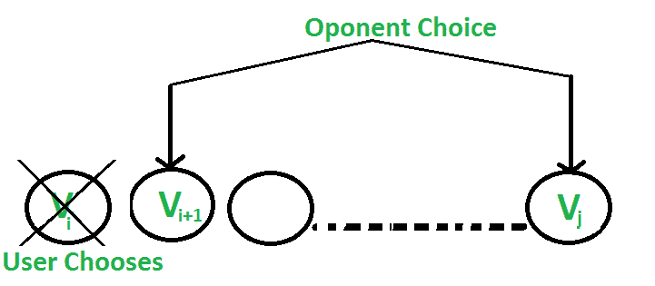
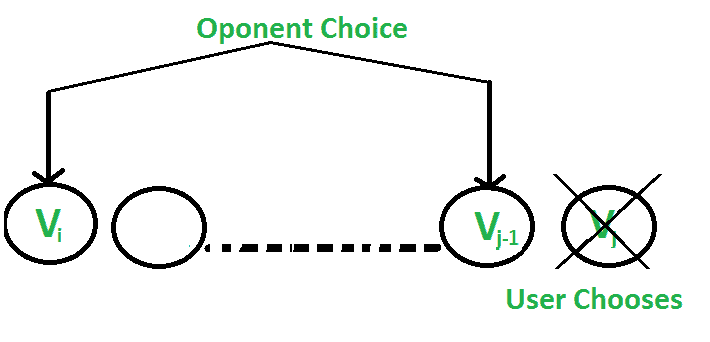

# 游戏的最佳策略| DP-31

> 原文:[https://www . geesforgeks . org/a-game-DP-31/最优策略/](https://www.geeksforgeeks.org/optimal-strategy-for-a-game-dp-31/)

考虑一排值为 v1 的 n 个硬币。。。vn，其中 n 是偶数。我们轮流和对手比赛。在每一回合中，玩家从该行中选择第一枚或最后一枚硬币，将其从该行中永久移除，并获得硬币的价值。确定如果我们先行动，我们肯定能赢的最大可能金额。
注意:对手和用户一样聪明。

让我们用几个例子来理解这个问题:

1.  5、3、7、10:用户收集的最大值为 15(10 + 5)
2.  8、15、3、7:用户收集的最大值为 22(7 + 15)

在每一步都选择最好的是否给出了一个最优解？No.
在第二个例子中，游戏是这样完成的:

1.  …….用户选择 8。
    ……。对手选择 15。
    ……。用户选择 7。
    ……。对手选择 3。
    用户采集的总值为 15(8 + 7)
2.  …….用户选择 7。
    ……。对手选择 8。
    ……。用户选择 15。
    ……。对手选择 3。
    用户采集的总值为 22(7 + 15)

所以如果用户遵循第二种游戏状态，虽然第一招不是最好的，但是可以收集最大值。

**进场:**由于双方选手实力相当，双方都会尽量降低对方获胜的可能性。现在让我们看看对手是如何做到这一点的。

有两种选择:

*   用户选择价值为“Vi”的“ith”硬币:对手选择(i+1)硬币或 jth 硬币。对手打算选择给用户留下**最小值**的硬币。
    即用户可以采集值 **Vi + min(F(i+2，j)，F(i+1，j-1) )** 。



*   用户选择价值为“Vj”的“jth”硬币:对手选择“with”硬币或(j-1)th”硬币。对手打算选择给用户留下最小值的硬币，即用户可以收集值 **Vj + min(F(i+1，j-1)，F(i，j-2) )** 。



以下是基于上述两个选择的递归解决方案。我们最多有两个选择。

```
F(i, j) represents the maximum value the user
can collect from i'th coin to j'th coin.

F(i, j) = Max(Vi + min(F(i+2, j), F(i+1, j-1) ), 
              Vj + min(F(i+1, j-1), F(i, j-2) ))
As user wants to maximise the number of coins. 

Base Cases
    F(i, j) = Vi           If j == i
    F(i, j) = max(Vi, Vj)  If j == i + 1
```

## C++

```
// C++ program to find out
// maximum value from a given
// sequence of coins
#include <bits/stdc++.h>
using namespace std;

// Returns optimal value possible
// that a player can collect from
// an array of coins of size n.
// Note than n must be even
int optimalStrategyOfGame(
    int* arr, int n)
{
    // Create a table to store
    // solutions of subproblems
    int table[n][n];

    // Fill table using above
    // recursive formula. Note
    // that the table is filled
    // in diagonal fashion (similar
    // to http:// goo.gl/PQqoS),
    // from diagonal elements to
    // table[0][n-1] which is the result.
    for (int gap = 0; gap < n; ++gap) {
        for (int i = 0, j = gap; j < n; ++i, ++j) {
            // Here x is value of F(i+2, j),
            // y is F(i+1, j-1) and
            // z is F(i, j-2) in above recursive
            // formula
            int x = ((i + 2) <= j)
                        ? table[i + 2][j]
                        : 0;
            int y = ((i + 1) <= (j - 1))
                        ? table[i + 1][j - 1]
                        : 0;
            int z = (i <= (j - 2))
                        ? table[i][j - 2]
                        : 0;

            table[i][j] = max(
                arr[i] + min(x, y),
                arr[j] + min(y, z));
        }
    }

    return table[0][n - 1];
}

// Driver program to test above function
int main()
{
    int arr1[] = { 8, 15, 3, 7 };
    int n = sizeof(arr1) / sizeof(arr1[0]);
    printf("%d\n",
           optimalStrategyOfGame(arr1, n));

    int arr2[] = { 2, 2, 2, 2 };
    n = sizeof(arr2) / sizeof(arr2[0]);
    printf("%d\n",
           optimalStrategyOfGame(arr2, n));

    int arr3[] = { 20, 30, 2, 2, 2, 10 };
    n = sizeof(arr3) / sizeof(arr3[0]);
    printf("%d\n",
           optimalStrategyOfGame(arr3, n));

    return 0;
}
```

## Java 语言(一种计算机语言，尤用于创建网站)

```
// Java program to find out maximum
// value from a given sequence of coins
import java.io.*;

class GFG {

    // Returns optimal value possible
    // that a player can collect from
    // an array of coins of size n.
    // Note than n must be even
    static int optimalStrategyOfGame(
        int arr[], int n)
    {
        // Create a table to store
        // solutions of subproblems
        int table[][] = new int[n][n];
        int gap, i, j, x, y, z;

        // Fill table using above recursive formula.
        // Note that the tableis filled in diagonal
        // fashion (similar to http:// goo.gl/PQqoS),
        // from diagonal elements to table[0][n-1]
        // which is the result.
        for (gap = 0; gap < n; ++gap) {
            for (i = 0, j = gap; j < n; ++i, ++j) {

                // Here x is value of F(i+2, j),
                // y is F(i+1, j-1) and z is
                // F(i, j-2) in above recursive formula
                x = ((i + 2) <= j)
                        ? table[i + 2][j]
                        : 0;
                y = ((i + 1) <= (j - 1))
                        ? table[i + 1][j - 1]
                        : 0;
                z = (i <= (j - 2))
                        ? table[i][j - 2]
                        : 0;

                table[i][j] = Math.max(
                    arr[i] + Math.min(x, y),
                    arr[j] + Math.min(y, z));
            }
        }

        return table[0][n - 1];
    }

    // Driver program
    public static void main(String[] args)
    {
        int arr1[] = { 8, 15, 3, 7 };
        int n = arr1.length;
        System.out.println(
            ""
            + optimalStrategyOfGame(arr1, n));

        int arr2[] = { 2, 2, 2, 2 };
        n = arr2.length;
        System.out.println(
            ""
            + optimalStrategyOfGame(arr2, n));

        int arr3[] = { 20, 30, 2, 2, 2, 10 };
        n = arr3.length;
        System.out.println(
            ""
            + optimalStrategyOfGame(arr3, n));
    }
}

// This code is contributed by vt_m
```

## 蟒蛇 3

```
# Python3 program to find out maximum
# value from a given sequence of coins

# Returns optimal value possible that
# a player can collect from an array
# of coins of size n. Note than n
# must be even
def optimalStrategyOfGame(arr, n):

    # Create a table to store
    # solutions of subproblems
    table = [[0 for i in range(n)]
                for i in range(n)]

    # Fill table using above recursive
    # formula. Note that the table is
    # filled in diagonal fashion
    # (similar to http://goo.gl / PQqoS),
    # from diagonal elements to
    # table[0][n-1] which is the result.
    for gap in range(n):
        for j in range(gap, n):
            i = j - gap

            # Here x is value of F(i + 2, j),
            # y is F(i + 1, j-1) and z is
            # F(i, j-2) in above recursive
            # formula
            x = 0
            if((i + 2) <= j):
                x = table[i + 2][j]
            y = 0
            if((i + 1) <= (j - 1)):
                y = table[i + 1][j - 1]
            z = 0
            if(i <= (j - 2)):
                z = table[i][j - 2]
            table[i][j] = max(arr[i] + min(x, y),
                              arr[j] + min(y, z))
    return table[0][n - 1]

# Driver Code
arr1 = [ 8, 15, 3, 7 ]
n = len(arr1)
print(optimalStrategyOfGame(arr1, n))

arr2 = [ 2, 2, 2, 2 ]
n = len(arr2)
print(optimalStrategyOfGame(arr2, n))

arr3 = [ 20, 30, 2, 2, 2, 10]
n = len(arr3)
print(optimalStrategyOfGame(arr3, n))

# This code is contributed
# by sahilshelangia
```

## C#

```
// C# program to find out maximum
// value from a given sequence of coins
using System;

public class GFG {

    // Returns optimal value possible that a player
    // can collect from an array of coins of size n.
    // Note than n must be even
    static int optimalStrategyOfGame(int[] arr, int n)
    {
        // Create a table to store solutions of subproblems
        int[, ] table = new int[n, n];
        int gap, i, j, x, y, z;

        // Fill table using above recursive formula.
        // Note that the tableis filled in diagonal
        // fashion (similar to http:// goo.gl/PQqoS),
        // from diagonal elements to table[0][n-1]
        // which is the result.
        for (gap = 0; gap < n; ++gap) {
            for (i = 0, j = gap; j < n; ++i, ++j) {

                // Here x is value of F(i+2, j),
                // y is F(i+1, j-1) and z is
                // F(i, j-2) in above recursive formula
                x = ((i + 2) <= j) ? table[i + 2, j] : 0;
                y = ((i + 1) <= (j - 1)) ? table[i + 1, j - 1] : 0;
                z = (i <= (j - 2)) ? table[i, j - 2] : 0;

                table[i, j] = Math.Max(arr[i] + Math.Min(x, y),
                                       arr[j] + Math.Min(y, z));
            }
        }

        return table[0, n - 1];
    }

    // Driver program

    static public void Main()
    {
        int[] arr1 = { 8, 15, 3, 7 };
        int n = arr1.Length;
        Console.WriteLine("" + optimalStrategyOfGame(arr1, n));

        int[] arr2 = { 2, 2, 2, 2 };
        n = arr2.Length;
        Console.WriteLine("" + optimalStrategyOfGame(arr2, n));

        int[] arr3 = { 20, 30, 2, 2, 2, 10 };
        n = arr3.Length;
        Console.WriteLine("" + optimalStrategyOfGame(arr3, n));
    }
}

// This code is contributed by ajit
```

## 服务器端编程语言（Professional Hypertext Preprocessor 的缩写）

```
<?php
// PHP program to find out maximum value
// from a given sequence of coins

// Returns optimal value possible that a
// player can collect from an array of
// coins of size n. Note than n must be even
function optimalStrategyOfGame($arr, $n)
{
    // Create a table to store solutions
    // of subproblems
    $table = array_fill(0, $n,
             array_fill(0, $n, 0));

    // Fill table using above recursive formula.
    // Note that the table is filled in diagonal
    // fashion (similar to http://goo.gl/PQqoS),
    // from diagonal elements to table[0][n-1]
    // which is the result.
    for ($gap = 0; $gap < $n; ++$gap)
    {
        for ($i = 0, $j = $gap; $j < $n; ++$i, ++$j)
        {

            // Here x is value of F(i+2, j),
            // y is F(i+1, j-1) and z is F(i, j-2)
            // in above recursive formula
            $x = (($i + 2) <= $j) ?
               $table[$i + 2][$j] : 0;
            $y = (($i + 1) <= ($j - 1)) ?
                 $table[$i + 1][$j - 1] : 0;
            $z = ($i <= ($j - 2)) ?
               $table[$i][$j - 2] : 0;

            $table[$i][$j] = max($arr[$i] + min($x, $y),
                                 $arr[$j] + min($y, $z));
        }
    }

    return $table[0][$n - 1];
}

// Driver Code
$arr1 = array( 8, 15, 3, 7 );
$n = count($arr1);
print(optimalStrategyOfGame($arr1, $n) . "\n");

$arr2 = array( 2, 2, 2, 2 );
$n = count($arr2);
print(optimalStrategyOfGame($arr2, $n) . "\n");

$arr3 = array(20, 30, 2, 2, 2, 10);
$n = count($arr3);
print(optimalStrategyOfGame($arr3, $n) . "\n");

// This code is contributed by chandan_jnu
?>
```

## java 描述语言

```
<script>

// Javascript program to find out maximum
// value from a given sequence of coins

// Returns optimal value possible
// that a player can collect from
// an array of coins of size n.
// Note than n must be even
function optimalStrategyOfGame(arr, n)
{

    // Create a table to store
    // solutions of subproblems
    let table = new Array(n);
    let gap, i, j, x, y, z;

    for(let d = 0; d < n; d++)
    {
        table[d] = new Array(n);
    }

    // Fill table using above recursive formula.
    // Note that the tableis filled in diagonal
    // fashion (similar to http:// goo.gl/PQqoS),
    // from diagonal elements to table[0][n-1]
    // which is the result.
    for(gap = 0; gap < n; ++gap)
    {
        for(i = 0, j = gap; j < n; ++i, ++j)
        {

            // Here x is value of F(i+2, j),
            // y is F(i+1, j-1) and z is
            // F(i, j-2) in above recursive formula
            x = ((i + 2) <= j) ? table[i + 2][j] : 0;
            y = ((i + 1) <= (j - 1)) ?
            table[i + 1][j - 1] : 0;
            z = (i <= (j - 2)) ? table[i][j - 2] : 0;

            table[i][j] = Math.max(
                arr[i] + Math.min(x, y),
                arr[j] + Math.min(y, z));
        }
    }
    return table[0][n - 1];
}

// Driver code
let arr1 = [ 8, 15, 3, 7 ];
let n = arr1.length;
document.write("" + optimalStrategyOfGame(arr1, n) +
               "</br>");

let arr2 = [ 2, 2, 2, 2 ];
n = arr2.length;
document.write("" + optimalStrategyOfGame(arr2, n) +
               "</br>");

let arr3 = [ 20, 30, 2, 2, 2, 10 ];
n = arr3.length;
document.write("" + optimalStrategyOfGame(arr3, n));

// This code is contributed by divyesh072019

</script>
```

**输出:**

```
22
4
42
```

**复杂度分析:**

*   **时间复杂度:** O(n <sup>2</sup> )。
    嵌套 for 循环的使用给 n <sup>2</sup> 带来了时间复杂性。
*   **辅助空间:** O(n <sup>2</sup> )。
    作为二维表格用于存储状态。

**注:**上述解决方案可以通过每次选择使用较少的比较次数来优化。请参考下文。
[**一局最优策略|第二集**](https://www.geeksforgeeks.org/optimal-strategy-for-a-game-set-2/)

**练习:**
当用户希望只赢而不是以最大值赢时，你对策略的想法。和上面的问题一样，硬币的数量是偶数。
贪婪方法能很好地工作并给出最优解吗？如果硬币数量是奇数，你的答案会改变吗？请看[两角硬币游戏](https://www.geeksforgeeks.org/coin-game-of-two-corners/)
本文由[阿施·巴纳瓦尔](https://www.facebook.com/barnwal.aashish)整理。如果您发现任何不正确的地方，请写评论，或者您想分享更多关于上面讨论的主题的信息