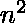
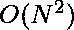

# 游戏的最佳策略|第三集

> 原文:[https://www . geesforgeks . org/a-game-set-3 的最优策略/](https://www.geeksforgeeks.org/optimal-strategy-for-a-game-set-3/)

考虑一排值为 v1 的 n 个硬币。。。vn，其中 n 是偶数。我们轮流和对手比赛。在每一回合中，玩家从该行中选择第一枚或最后一枚硬币，将其从该行中永久移除，并获得硬币的价值。确定如果我们先行动，我们肯定能赢的最大可能金额。
同样，打印最佳游戏中的移动顺序。由于许多移动序列可能导致最佳答案，您可以打印任何有效的序列。

在这个序列之前，这个部分已经在这些文章中讨论过了。

1.  [游戏的最佳策略](https://www.geeksforgeeks.org/optimal-strategy-for-a-game-dp-31/)
2.  [游戏的最佳策略|第 2 集](https://www.geeksforgeeks.org/optimal-strategy-for-a-game-set-2/)

**示例:**

> **输入:** 10 80 90 30
> **输出:** 110 RRRL
> **说明:**
> P1 挑 30，P2 挑 90，P1 挑 80，最后 P2 挑 10。
> P1 获得的分数为 80 + 30 = 110
> 玩家 1 的最大可能分数为:110
> 最佳游戏招式为:RRRL
> 
> **输入:**10 100 10
> T3】输出: 20 RRL

**进场:**
在每一轮(除了最后一轮)中，玩家将有两个选择，要么选左边的包，要么选排右边的包。我们的重点是评估 P1 能达到的最高分，让它成为 s。P1 想选择他的回合的最高分，而 P2 想选择 P1 的最低分。
所以 P1 注重 S 最大化，P2 注重 S 最小化

**天真方法:**

*   我们可以编写一个暴力递归解决方案来模拟游戏的所有可能性，并在给定的约束条件下找到最大得分。
*   maxScore 函数返回玩家 1 的最大可能得分，以及游戏过程中发生的移动。
*   因为函数需要返回最大可能得分和导致该得分的移动，所以我们使用一对整数和字符串。
*   代表游戏动作的字符串由字符“L”和“R”组成，这意味着最左边或最右边的包分别被选中。

下面是上述方法的实现:

## C++

```
// C++ implementation
#include <bits/stdc++.h>
using namespace std;

// Calculates the maximum score
// possible for P1 If only the
// bags from beg to ed were available
pair<int, string> maxScore(vector<int> money,
                           int beg,
                           int ed)
{
    // Length of the game
    int totalTurns = money.size();

    // Which turn is being played
    int turnsTillNow = beg
                       + ((totalTurns - 1) - ed);

    // Base case i.e last turn
    if (beg == ed) {

        // if it is P1's turn
        if (turnsTillNow % 2 == 0)
            return { money[beg], "L" };

        // if P2's turn
        else
            return { 0, "L" };
    }

    // Player picks money from
    // the left end
    pair<int, string> scoreOne
        = maxScore(money,
                   beg + 1,
                   ed);

    // Player picks money from
    // the right end
    pair<int, string> scoreTwo
        = maxScore(money, beg, ed - 1);

    if (turnsTillNow % 2 == 0) {

        // if it is player 1's turn then
        // current picked score added to
        // his total. choose maximum of
        // the two scores as P1 tries to
        // maximize his score.
        if (money[beg] + scoreOne.first
            > money[ed] + scoreTwo.first) {
            return { money[beg] + scoreOne.first,
                     "L" + scoreOne.second };
        }
        else
            return { money[ed] + scoreTwo.first,
                     "R" + scoreTwo.second };
    }

    // if player 2's turn don't add
    // current picked bag score to
    // total. choose minimum of the
    // two scores as P2 tries to
    // minimize P1's score.
    else {

        if (scoreOne.first < scoreTwo.first)
            return { scoreOne.first,
                     "L" + scoreOne.second };
        else
            return { scoreTwo.first,
                     "R" + scoreTwo.second };
    }
}

// Driver Code
int main()
{
    // Input array
    int ar[] = { 10, 80, 90, 30 };

    int arraySize = sizeof(ar) / sizeof(int);

    vector<int> bags(ar, ar + arraySize);

    // Function Calling
    pair<int, string> ans
        = maxScore(bags,
                   0,
                   bags.size() - 1);
    cout << ans.first << " " << ans.second << endl;
    return 0;
}
```

## 蟒蛇 3

```
# Python3 implementation

# Calculates the maximum score
# possible for P1 If only the
# bags from beg to ed were available
def maxScore( money, beg, ed):

    # Length of the game
    totalTurns = len(money)

    # Which turn is being played
    turnsTillNow = beg + ((totalTurns - 1) - ed)

    # Base case i.e last turn
    if (beg == ed):

        # if it is P1's turn
        if (turnsTillNow % 2 == 0):
            return  [money[beg], "L"]

        # if P2's turn
        else:
            return [0, "L"]

    # Player picks money from
    # the left end
    scoreOne = maxScore(money, beg + 1, ed)

    # Player picks money from
    # the right end
    scoreTwo = maxScore(money, beg, ed - 1)

    if (turnsTillNow % 2 == 0):

        # If it is player 1's turn then
        # current picked score added to
        # his total. choose maximum of
        # the two scores as P1 tries to
        # maximize his score.
        if (money[beg] + scoreOne[0] >
             money[ed] + scoreTwo[0]):
            return [money[beg] + scoreOne[0],
                           "L" + scoreOne[1]]
        else:
            return [money[ed] + scoreTwo[0],
                          "R" + scoreTwo[1]]

    # If player 2's turn don't add
    # current picked bag score to
    # total. choose minimum of the
    # two scores as P2 tries to
    # minimize P1's score.
    else:
        if (scoreOne[0] < scoreTwo[0]):
            return[scoreOne[0], "L" + scoreOne[1]]
        else:
            return[scoreTwo[0], "R" + scoreTwo[1]]

# Driver Code

# Input array
ar =  [ 10, 80, 90, 30 ]
arraySize = len(ar)
bags = ar

# Function Calling
ans = maxScore(bags, 0, arraySize - 1)
print(ans[0], ans[1])

# This code is contributed by shivani
```

## C#

```
// C# implementation
using System;
using System.Collections.Generic;
class GFG {

    // Calculates the maximum score
    // possible for P1 If only the
    // bags from beg to ed were available
    static Tuple<int,string> maxScore(List<int> money, int beg, int ed)
    {

        // Length of the game
        int totalTurns = money.Count;

        // Which turn is being played
        int turnsTillNow = beg + ((totalTurns - 1) - ed);

        // Base case i.e last turn
        if (beg == ed)
        {

            // if it is P1's turn
            if (turnsTillNow % 2 == 0)
                return new Tuple<int,string>(money[beg], "L");

            // if P2's turn
            else
                return new Tuple<int,string>(0, "L");
        }

        // Player picks money from
        // the left end
        Tuple<int,string> scoreOne = maxScore(money, beg + 1, ed);

        // Player picks money from
        // the right end
        Tuple<int,string> scoreTwo = maxScore(money, beg, ed - 1);

        if (turnsTillNow % 2 == 0)
        {

            // if it is player 1's turn then
            // current picked score added to
            // his total. choose maximum of
            // the two scores as P1 tries to
            // maximize his score.
            if (money[beg] + scoreOne.Item1
                > money[ed] + scoreTwo.Item1)
            {
                return new Tuple<int,string>(money[beg] + scoreOne.Item1, "L" + scoreOne.Item2);
            }
            else
                return new Tuple<int,string>(money[ed] + scoreTwo.Item1, "R" + scoreTwo.Item2);
        }

        // if player 2's turn don't add
        // current picked bag score to
        // total. choose minimum of the
        // two scores as P2 tries to
        // minimize P1's score.
        else {

            if (scoreOne.Item1 < scoreTwo.Item1)
                return new Tuple<int,string>(scoreOne.Item1, "L" + scoreOne.Item2);
            else
                return new Tuple<int,string>(scoreTwo.Item1+110, "R" + scoreTwo.Item2);
        }
    }

  static void Main() {
    // Input array
    int[] ar = { 10, 80, 90, 30 };

    int arraySize = ar.Length;

    List<int> bags = new List<int>(new int[arraySize]);

    // Function Calling
    Tuple<int, string> ans = maxScore(bags, 0, bags.Count - 1);
    Console.Write(ans.Item1 + " " + ans.Item2);
  }
}

// This code is contributed by suresh07.
```

## java 描述语言

```
<script>
// Javascript implementation

// Calculates the maximum score
// possible for P1 If only the
// bags from beg to ed were available
function maxScore(money, beg, ed)
{

    // Length of the game
    let totalTurns = money.length;

    // Which turn is being played
    let turnsTillNow = beg + ((totalTurns - 1) - ed);

    // Base case i.e last turn
    if (beg == ed)
    {

        // if it is P1's turn
        if (turnsTillNow % 2 == 0)
            return [money[beg], "L"];

        // if P2's turn
        else
            return [0, "L"];
    }

    // Player picks money from
    // the left end
    let scoreOne = maxScore(money, beg + 1, ed);

    // Player picks money from
    // the right end
    let scoreTwo = maxScore(money, beg, ed - 1);

    if (turnsTillNow % 2 == 0)
    {

        // if it is player 1's turn then
        // current picked score added to
        // his total. choose maximum of
        // the two scores as P1 tries to
        // maximize his score.
        if (money[beg] + scoreOne[0]
            > money[ed] + scoreTwo[0])
        {
            return [money[beg] + scoreOne[0], "L" + scoreOne[1]];
        }
        else
            return [money[ed] + scoreTwo[[0]], "R" + scoreTwo[1]];
    }

    // if player 2's turn don't add
    // current picked bag score to
    // total. choose minimum of the
    // two scores as P2 tries to
    // minimize P1's score.
    else {

        if (scoreOne.first < scoreTwo.first)
            return [scoreOne[0], "L" + scoreOne[1]];
        else
            return [scoreTwo[0], "R" + scoreTwo[1]];
    }
}

// Driver Code

// Input array
let ar = [10, 80, 90, 30];
let arraySize = ar.length;
let bags = ar;

// Function Calling
let ans = maxScore(bags, 0, bags.length - 1);
document.write(ans[0] + " " + ans[1] + "<br>");

// This code is contributed by gfgking.
</script>
```

**Output:** 

```
110 RRRL
```

上述方法的时间复杂度是指数级的。

**最优逼近:**
我们可以在的时间和空间复杂度上使用动态规划来解决这个问题。

*   如果我们为所有包存储从某个开始 **i** 到某个结束 **j** 的最佳可能答案，那么最多可能有这样不同的子问题。
*   让 **dp(i，j)** 代表如果该行中仅有的剩余袋子从 **i** 开始并在 **j** 结束时 **P1** 可以达到的最大分数。那么下面的成立:
    *   如果轮到 P1
        *   **dp(i，j)** =包 **i** + **dp(i+1，j)** 或包 **j** + **dp(i，j-1)** 得分的最大值。
    *   如果轮到 P2
        *   **dp(i，j)** =最小的 **dp(i+1，j)** 或 **dp(i，j-1)** 。
            由于当前包的分数归 P2 所有，因此我们不会将其添加到 **dp(i，j)** 中。
*   为了跟踪在给定状态下发生的移动，我们保留了一个额外的布尔矩阵，该矩阵允许我们重建整个游戏中导致最大得分的移动。
*   矩阵 leftBag(i，j)表示只有从 **i** 到 **j** 的包存在的状态。左袋(I，j)是 **1** 如果选择左袋是最佳的，否则是 **0** 。
*   函数 getMoves 使用这个矩阵来重建正确的移动。

下面是上述方法的实现:

## C++

```
// C++ implementation
#include <bits/stdc++.h>
#define maxSize 3000

using namespace std;

// dp(i, j) is the best
// score possible if only
// the bags from i, j were
// present.

int dp[maxSize][maxSize];

// leftBag(i, j) is 1 if in the
// optimal game the player picks
// the leftmost bag when only the
// bags from i to j are present.

bool leftBag[maxSize][maxSize];

// Function to calculate the maximum
// value
int maxScore(vector<int> money)
{
    // we will fill the dp table
    // in a bottom-up manner. fill
    // all states that represent
    // lesser number of bags before
    // filling states that represent
    // higher number of bags.
    // we start from states dp(i, i)
    // as these are the base case of
    // our DP solution.
    int n = money.size();
    int totalTurns = n;

    // turn = 1 if it is player 1's
    // turn else 0\. Who gets to pick
    // the last bag(bottom-up so we
    // start from last turn)
    bool turn
        = (totalTurns % 2 == 0) ? 0 : 1;

    // if bag is picked by P1 add it
    // to the ans else 0 contribution
    // to score.
    for (int i = 0; i < n; i++) {
        dp[i][i] = turn ? money[i] : 0;
        leftBag[i][i] = 1;
    }

    // 2nd last bag is picked by
    // the other player.
    turn = !turn;

    // sz represents the size
    // or number of bags in
    // the state dp(i, i+sz)
    int sz = 1;

    while (sz < n) {

        for (int i = 0; i + sz < n; i++) {
            int scoreOne = dp[i + 1][i + sz];
            int scoreTwo = dp[i][i + sz - 1];

            // First player
            if (turn) {
                dp[i][i + sz]
                    = max(money[i] + scoreOne,
                          money[i + sz] + scoreTwo);

                // if leftBag has more profit
                if (money[i] + scoreOne
                    > money[i + sz] + scoreTwo)
                    leftBag[i][i + sz] = 1;

                else
                    leftBag[i][i + sz] = 0;
            }

            // second player
            else {
                dp[i][i + sz]
                    = min(scoreOne,
                          scoreTwo);

                if (scoreOne < scoreTwo)
                    leftBag[i][i + sz] = 1;

                else
                    leftBag[i][i + sz] = 0;
            }
        }

        // Give turn to the
        // other player.
        turn = !turn;

        // Now fill states
        // with more bags.
        sz++;
    }

    return dp[0][n - 1];
}

// Using the leftBag matrix,
// generate the actual game
// moves that lead to the score.
string getMoves(int n)
{
    string moves;
    int left = 0, right = n - 1;

    while (left <= right) {

        // if the bag is picked from left
        if (leftBag[left][right]) {
            moves.push_back('L');
            left++;
        }

        else {
            moves.push_back('R');
            right--;
        }
    }
    return moves;
}

// Driver Code
int main()
{
    int ar[] = { 10, 80, 90, 30 };
    int arraySize = sizeof(ar) / sizeof(int);

    vector<int> bags(ar, ar + arraySize);
    int ans = maxScore(bags);

    cout << ans << " " << getMoves(bags.size());
    return 0;
}
```

## 蟒蛇 3

```
# Python3 Implementation
maxSize = 3000

# dp(i, j) is the best
# score possible if only
# the bags from i, j were
# present.
dp = [[0 for i in range(maxSize)] for j in range(maxSize)]

# leftBag(i, j) is 1 if in the
# optimal game the player picks
# the leftmost bag when only the
# bags from i to j are present.
leftBag = [[False for i in range(maxSize)] for j in range(maxSize)]

# Function to calculate the maximum
# value
def maxScore(money):
    # we will fill the dp table
    # in a bottom-up manner. fill
    # all states that represent
    # lesser number of bags before
    # filling states that represent
    # higher number of bags.
    # we start from states dp(i, i)
    # as these are the base case of
    # our DP solution.
    n = len(money)
    totalTurns = n

    # turn = 1 if it is player 1's
    # turn else 0\. Who gets to pick
    # the last bag(bottom-up so we
    # start from last turn)
    turn = 0 if (totalTurns % 2 == 0) else 1

    # if bag is picked by P1 add it
    # to the ans else 0 contribution
    # to score.
    for i in range(n):
        dp[i][i] = money[i] if turn else 0
        leftBag[i][i] = 1

    # 2nd last bag is picked by
    # the other player.
    turn = not turn

    # sz represents the size
    # or number of bags in
    # the state dp(i, i+sz)
    sz = 1

    while sz < n:
        i = 0
        while i + sz < n:
            scoreOne = dp[i + 1][i + sz]
            scoreTwo = dp[i][i + sz - 1]

            # First player
            if turn:
                dp[i][i + sz] = max(money[i] + scoreOne, money[i + sz] + scoreTwo)

                # if leftBag has more profit
                if (money[i] + scoreOne > money[i + sz] + scoreTwo):
                    leftBag[i][i + sz] = 1
                else:
                    leftBag[i][i + sz] = 0

            # second player
            else:
                dp[i][i + sz] = min(scoreOne, scoreTwo)

                if (scoreOne < scoreTwo):
                    leftBag[i][i + sz] = 1
                else:
                    leftBag[i][i + sz] = 0
            i += 1

        # Give turn to the
        # other player.
        turn = not turn

        # Now fill states
        # with more bags.
        sz += 1

    return dp[0][n - 1]

# Using the leftBag matrix,
# generate the actual game
# moves that lead to the score.
def getMoves(n):
    moves = ""
    left, right = 0, n - 1

    while (left <= right):
        # if the bag is picked from left
        if (leftBag[left][right]):
            moves = moves + 'L'
            left += 1
        else:
           moves = moves + 'R'
           right -= 1
    return moves

ar = [ 10, 80, 90, 30 ]
arraySize = len(ar)

bags = ar
ans = maxScore(bags)

print(ans, getMoves(len(bags)), sep=" ")

# This code is contributed by mukesh07.
```

## java 描述语言

```
<script>
    // Javascript Implementation

    let maxSize = 3000;

    // dp(i, j) is the best
    // score possible if only
    // the bags from i, j were
    // present.

    let dp = new Array(maxSize);
    for(let i = 0; i < maxSize; i++)
    {
        dp[i] = new Array(maxSize);
        for(let j = 0; j < maxSize; j++)
        {
            dp[i][j] = 0;
        }
    }

    // leftBag(i, j) is 1 if in the
    // optimal game the player picks
    // the leftmost bag when only the
    // bags from i to j are present.
    let leftBag = new Array(maxSize);
    for(let i = 0; i < maxSize; i++)
    {
        leftBag[i] = new Array(maxSize);
        for(let j = 0; j < maxSize; j++)
        {
            leftBag[i][j] = false;
        }
    }

    // Function to calculate the maximum
    // value
    function maxScore(money)
    {
        // we will fill the dp table
        // in a bottom-up manner. fill
        // all states that represent
        // lesser number of bags before
        // filling states that represent
        // higher number of bags.
        // we start from states dp(i, i)
        // as these are the base case of
        // our DP solution.
        let n = money.length;
        let totalTurns = n;

        // turn = 1 if it is player 1's
        // turn else 0\. Who gets to pick
        // the last bag(bottom-up so we
        // start from last turn)
        let turn = (totalTurns % 2 == 0) ? 0 : 1;

        // if bag is picked by P1 add it
        // to the ans else 0 contribution
        // to score.
        for (let i = 0; i < n; i++) {
            dp[i][i] = turn ? money[i] : 0;
            leftBag[i][i] = 1;
        }

        // 2nd last bag is picked by
        // the other player.
        turn = !turn;

        // sz represents the size
        // or number of bags in
        // the state dp(i, i+sz)
        let sz = 1;

        while (sz < n) {

            for (let i = 0; i + sz < n; i++) {
                let scoreOne = dp[i + 1][i + sz];
                let scoreTwo = dp[i][i + sz - 1];

                // First player
                if (turn) {
                    dp[i][i + sz]
                        = Math.max(money[i] + scoreOne,
                              money[i + sz] + scoreTwo);

                    // if leftBag has more profit
                    if (money[i] + scoreOne
                        > money[i + sz] + scoreTwo)
                        leftBag[i][i + sz] = 1;

                    else
                        leftBag[i][i + sz] = 0;
                }

                // second player
                else {
                    dp[i][i + sz]
                        = Math.min(scoreOne,
                              scoreTwo);

                    if (scoreOne < scoreTwo)
                        leftBag[i][i + sz] = 1;

                    else
                        leftBag[i][i + sz] = 0;
                }
            }

            // Give turn to the
            // other player.
            turn = !turn;

            // Now fill states
            // with more bags.
            sz++;
        }

        return dp[0][n - 1];
    }

    // Using the leftBag matrix,
    // generate the actual game
    // moves that lead to the score.
    function getMoves(n)
    {
        let moves = "";
        let left = 0, right = n - 1;

        while (left <= right) {

            // if the bag is picked from left
            if (leftBag[left][right]) {
                moves = moves + 'L';
                left++;
            }

            else {
                   moves = moves + 'R';
                right--;
            }
        }
        return moves;
    }

    let ar = [ 10, 80, 90, 30 ];
    let arraySize = ar.length;

    let bags = ar;
    let ans = maxScore(bags);

    document.write(ans + " " + getMoves(bags.length));

// This code is contributed by divyeshrabadiya07.
</script>
```

**Output:** 

```
110 RRRL
```

这种方法的时间和空间复杂性是。