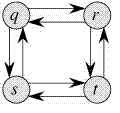

# 动态规划中的最优子结构性质| DP-2

> 原文:[https://www . geesforgeks . org/optimal-substructure-property-in-dynamic-programming-DP-2/](https://www.geeksforgeeks.org/optimal-substructure-property-in-dynamic-programming-dp-2/)

正如我们在[集合 1](https://www.geeksforgeeks.org/dynamic-programming-set-1/) 中所讨论的，以下是一个问题的两个主要性质，表明给定的问题可以使用动态规划来解决:
1)重叠子问题
2)最优子结构

我们已经在[集合 1](https://www.geeksforgeeks.org/dynamic-programming-set-1/) 中讨论了重叠子问题属性。让我们在这里讨论最优子结构性质。

**2)最优子结构:**如果给定问题的最优解可以通过使用其子问题的最优解来获得，则给定问题具有最优子结构性质。

例如，最短路径问题具有以下最优子结构性质:
如果节点 x 位于从源节点 u 到目的节点 v 的最短路径中，那么从 u 到 v 的最短路径是从 u 到 x 的最短路径和从 x 到 v 的最短路径的组合。标准的全对最短路径算法，如[弗洛伊德-沃肖尔](https://www.geeksforgeeks.org/dynamic-programming-set-16-floyd-warshall-algorithm/)和用于负权重边的单源最短路径算法，如[贝尔曼-福特](https://www.geeksforgeeks.org/dynamic-programming-set-23-bellman-ford-algorithm/)是动态规划的典型例子。

另一方面，最长路径问题不具有最优子结构性质。这里所说的最长路径是指两个节点之间最长的简单路径(没有循环的路径)。考虑一下 [CLRS 书](http://ressources.unisciel.fr/algoprog/s00aaroot/aa00module1/res/%5BCormen-AL2011%5DIntroduction_To_Algorithms-A3.pdf)中给出的以下未加权图。从 q 到 t 有两条最长路径:q→r→t 和 q→s→t，与最短路径不同，这些最长路径不具有最优子结构性质。比如最长路径 q→r→t 不是 q 到 r 的最长路径和 r 到 t 的最长路径的组合，因为 q 到 r 的最长路径是 q→s→t→r，r 到 t 的最长路径是 r→q→s→t。

我们将在[动态编程](https://www.geeksforgeeks.org/fundamentals-of-algorithms/#DynamicProgramming)的后续帖子中介绍一些示例问题。

如果你发现任何不正确的地方，或者你想分享更多关于上面讨论的话题的信息，请写评论。

**参考文献:**
[【http://en.wikipedia.org/wiki/Optimal_substructure】](http://en.wikipedia.org/wiki/Optimal_substructure)
[CLRS 书](http://ressources.unisciel.fr/algoprog/s00aaroot/aa00module1/res/%5BCormen-AL2011%5DIntroduction_To_Algorithms-A3.pdf)