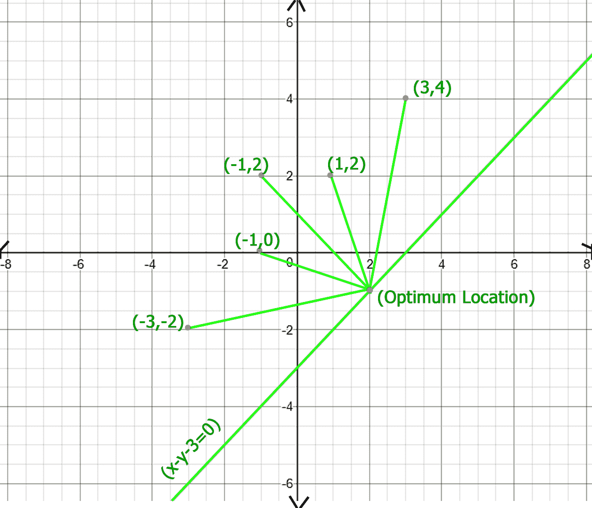

# 最小化总距离的最佳点位置

> 原文:[https://www . geesforgeks . org/optimal-location-point-minimum-total-distance/](https://www.geeksforgeeks.org/optimum-location-point-minimize-total-distance/)

给定一组点 as 和一条线 ax+by+c = 0。我们需要在给定的线上找到一个点，对于这个点，与给定的点集的距离之和是最小的。

**示例:**



```
In above figure optimum location of point of x - y - 3 = 0 line 
is (2, -1), whose total distance with other points is 20.77, 
which is minimum obtainable total distance.
```

如果我们在无限远的地方取给定直线上的一点，那么总距离成本将是无限的，现在当我们将直线上的这一点向给定点移动时，总距离成本开始减少，一段时间后，它再次开始增加，在直线的另一端达到无穷大，所以距离成本曲线看起来像一条 U 形曲线，我们必须找到这条 U 形曲线的底值。

由于 U 型曲线不是单调递增或递减的，所以我们不能用二分搜索法来寻找最底点，这里我们将使用三元搜索来寻找最底点，三元搜索在每次迭代中跳过三分之一的搜索空间，您可以在这里阅读更多关于三元搜索的内容。

因此，解决方案如下进行，我们从低和高开始，分别初始化为一些最小和最大的值，然后我们开始迭代，在每次迭代中，我们计算两个 mid，mid1 和 mid2，它们代表搜索空间中的 1/3 和 2/3 位置，我们用 mid1 和 mid2 计算所有点的总距离，并通过比较这些距离成本来更新低或高，这个迭代一直持续到低和高变得近似相等。

## C++

```
//  C/C++ program to find optimum location and total cost
#include <bits/stdc++.h>
using namespace std;
#define sq(x) ((x) * (x))
#define EPS 1e-6
#define N 5

//  structure defining a point
struct point {
    int x, y;
    point() {}
    point(int x, int y)
        : x(x)
        , y(y)
    {
    }
};

//  structure defining a line of ax + by + c = 0 form
struct line {
    int a, b, c;
    line(int a, int b, int c)
        : a(a)
        , b(b)
        , c(c)
    {
    }
};

//  method to get distance of point (x, y) from point p
double dist(double x, double y, point p)
{
    return sqrt(sq(x - p.x) + sq(y - p.y));
}

/*  Utility method to compute total distance all points
    when choose point on given line has x-coordinate
    value as X   */
double compute(point p[], int n, line l, double X)
{
    double res = 0;

    //  calculating Y of chosen point by line equation
    double Y = -1 * (l.c + l.a * X) / l.b;
    for (int i = 0; i < n; i++)
        res += dist(X, Y, p[i]);

    return res;
}

//  Utility method to find minimum total distance
double findOptimumCostUtil(point p[], int n, line l)
{
    double low = -1e6;
    double high = 1e6;

    // loop until difference between low and high
    // become less than EPS
    while ((high - low) > EPS) {
        // mid1 and mid2 are representative x co-ordiantes
        // of search space
        double mid1 = low + (high - low) / 3;
        double mid2 = high - (high - low) / 3;

        //
        double dist1 = compute(p, n, l, mid1);
        double dist2 = compute(p, n, l, mid2);

        // if mid2 point gives more total distance,
        // skip third part
        if (dist1 < dist2)
            high = mid2;

        // if mid1 point gives more total distance,
        // skip first part
        else
            low = mid1;
    }

    // compute optimum distance cost by sending average
    // of low and high as X
    return compute(p, n, l, (low + high) / 2);
}

//  method to find optimum cost
double findOptimumCost(int points[N][2], line l)
{
    point p[N];

    //  converting 2D array input to point array
    for (int i = 0; i < N; i++)
        p[i] = point(points[i][0], points[i][1]);

    return findOptimumCostUtil(p, N, l);
}

//  Driver code to test above method
int main()
{
    line l(1, -1, -3);
    int points[N][2] = {
        { -3, -2 }, { -1, 0 }, { -1, 2 }, { 1, 2 }, { 3, 4 }
    };
    cout << findOptimumCost(points, l) << endl;
    return 0;
}
```

## Java 语言(一种计算机语言，尤用于创建网站)

```
// A Java program to find optimum location
// and total cost
class GFG {
    static double sq(double x) { return ((x) * (x)); }
    static int EPS = (int)(1e-6) + 1;
    static int N = 5;

    // structure defining a point
    static class point {
        int x, y;
        point() {}

        public point(int x, int y)
        {
            this.x = x;
            this.y = y;
        }
    };

    // structure defining a line of ax + by + c = 0 form
    static class line {
        int a, b, c;

        public line(int a, int b, int c)
        {
            this.a = a;
            this.b = b;
            this.c = c;
        }
    };

    // method to get distance of point (x, y) from point p
    static double dist(double x, double y, point p)
    {
        return Math.sqrt(sq(x - p.x) + sq(y - p.y));
    }

    /* Utility method to compute total distance all points
        when choose point on given line has x-coordinate
        value as X */
    static double compute(point p[], int n, line l,
                          double X)
    {
        double res = 0;

        // calculating Y of chosen point by line equation
        double Y = -1 * (l.c + l.a * X) / l.b;
        for (int i = 0; i < n; i++)
            res += dist(X, Y, p[i]);

        return res;
    }

    // Utility method to find minimum total distance
    static double findOptimumCostUtil(point p[], int n,
                                      line l)
    {
        double low = -1e6;
        double high = 1e6;

        // loop until difference between low and high
        // become less than EPS
        while ((high - low) > EPS) {
            // mid1 and mid2 are representative x
            // co-ordiantes of search space
            double mid1 = low + (high - low) / 3;
            double mid2 = high - (high - low) / 3;

            double dist1 = compute(p, n, l, mid1);
            double dist2 = compute(p, n, l, mid2);

            // if mid2 point gives more total distance,
            // skip third part
            if (dist1 < dist2)
                high = mid2;

            // if mid1 point gives more total distance,
            // skip first part
            else
                low = mid1;
        }

        // compute optimum distance cost by sending average
        // of low and high as X
        return compute(p, n, l, (low + high) / 2);
    }

    // method to find optimum cost
    static double findOptimumCost(int points[][], line l)
    {
        point[] p = new point[N];

        // converting 2D array input to point array
        for (int i = 0; i < N; i++)
            p[i] = new point(points[i][0], points[i][1]);

        return findOptimumCostUtil(p, N, l);
    }

    // Driver Code
    public static void main(String[] args)
    {
        line l = new line(1, -1, -3);
        int points[][] = { { -3, -2 },
                           { -1, 0 },
                           { -1, 2 },
                           { 1, 2 },
                           { 3, 4 } };
        System.out.println(findOptimumCost(points, l));
    }
}

// This code is contributed by Rajput-Ji
```

## 蟒蛇 3

```
# A Python3 program to find optimum location
# and total cost
import math

class Optimum_distance:

    # Class defining a point
    class Point:

        def __init__(self, x, y):

            self.x = x
            self.y = y 

    # Class defining a line of ax + by + c = 0 form
    class Line:

        def __init__(self, a, b, c):

            self.a = a
            self.b = b
            self.c = c

    # Method to get distance of point
    # (x, y) from point p
    def dist(self, x, y, p):

        return math.sqrt((x - p.x) ** 2 +
                         (y - p.y) ** 2)

    # Utility method to compute total distance
    # all points when choose point on given
    # line has x-coordinate value as X
    def compute(self, p, n, l, x):

        res = 0

        y = -1 * (l.a*x + l.c) / l.b

        # Calculating Y of chosen point
        # by line equation
        for i in range(n):
            res += self.dist(x, y, p[i])

        return res

    # Utility method to find minimum total distance
    def find_Optimum_cost_untill(self, p, n, l):

        low = -1e6
        high = 1e6

        eps = 1e-6 + 1

        # Loop until difference between low
        # and high become less than EPS
        while((high - low) > eps):

              # mid1 and mid2 are representative x
            # co-ordiantes of search space
            mid1 = low + (high - low) / 3
            mid2 = high - (high - low) / 3

            dist1 = self.compute(p, n, l, mid1)
            dist2 = self.compute(p, n, l, mid2)

            # If mid2 point gives more total
            # distance, skip third part
            if (dist1 < dist2):
                high = mid2

            # If mid1 point gives more total
            # distance, skip first part
            else:
                low = mid1

        # Compute optimum distance cost by
        # sending average of low and high as X
        return self.compute(p, n, l, (low + high) / 2)

    # Method to find optimum cost
    def find_Optimum_cost(self, p, l):

        n = len(p)
        p_arr = [None] * n

        # Converting 2D array input to point array
        for i in range(n):
            p_obj = self.Point(p[i][0], p[i][1])
            p_arr[i] =  p_obj

        return self.find_Optimum_cost_untill(p_arr, n, l)

 # Driver Code
if __name__ == "__main__":

    obj = Optimum_distance()
    l = obj.Line(1, -1, -3)

    p = [ [ -3, -2 ], [ -1, 0 ],
          [ -1, 2 ], [ 1, 2 ],
          [ 3, 4 ] ]

    print(obj.find_Optimum_cost(p, l))

# This code is contributed by Sulu_mufi
```

## C#

```
// C# program to find optimum location
// and total cost
using System;

class GFG {
    static double sq(double x) { return ((x) * (x)); }

    static int EPS = (int)(1e-6) + 1;
    static int N = 5;

    // structure defining a point
    public class point {
        public int x, y;
        public point() {}

        public point(int x, int y)
        {
            this.x = x;
            this.y = y;
        }
    };

    // structure defining a line
    // of ax + by + c = 0 form
    public class line {
        public int a, b, c;

        public line(int a, int b, int c)
        {
            this.a = a;
            this.b = b;
            this.c = c;
        }
    };

    // method to get distance of
    // point (x, y) from point p
    static double dist(double x, double y, point p)
    {
        return Math.Sqrt(sq(x - p.x) + sq(y - p.y));
    }

    /* Utility method to compute total distance
    of all points when choose point on
    given line has x-coordinate value as X */
    static double compute(point[] p, int n, line l,
                          double X)
    {
        double res = 0;

        // calculating Y of chosen point
        // by line equation
        double Y = -1 * (l.c + l.a * X) / l.b;
        for (int i = 0; i < n; i++)
            res += dist(X, Y, p[i]);

        return res;
    }

    // Utility method to find minimum total distance
    static double findOptimumCostUtil(point[] p, int n,
                                      line l)
    {
        double low = -1e6;
        double high = 1e6;

        // loop until difference between
        // low and high become less than EPS
        while ((high - low) > EPS) {
            // mid1 and mid2 are representative
            // x co-ordiantes of search space
            double mid1 = low + (high - low) / 3;
            double mid2 = high - (high - low) / 3;

            double dist1 = compute(p, n, l, mid1);
            double dist2 = compute(p, n, l, mid2);

            // if mid2 point gives more total distance,
            // skip third part
            if (dist1 < dist2)
                high = mid2;

            // if mid1 point gives more total distance,
            // skip first part
            else
                low = mid1;
        }

        // compute optimum distance cost by
        // sending average of low and high as X
        return compute(p, n, l, (low + high) / 2);
    }

    // method to find optimum cost
    static double findOptimumCost(int[, ] points, line l)
    {
        point[] p = new point[N];

        // converting 2D array input to point array
        for (int i = 0; i < N; i++)
            p[i] = new point(points[i, 0], points[i, 1]);

        return findOptimumCostUtil(p, N, l);
    }

    // Driver Code
    public static void Main(String[] args)
    {
        line l = new line(1, -1, -3);
        int[, ] points = { { -3, -2 },
                           { -1, 0 },
                           { -1, 2 },
                           { 1, 2 },
                           { 3, 4 } };
        Console.WriteLine(findOptimumCost(points, l));
    }
}

// This code is contributed by 29AjayKumar
```

## java 描述语言

```
<script>

// A JavaScript program to find optimum location
// and total cost

function sq(x)
{
    return x*x;
}

let EPS = (1e-6) + 1;
let N = 5;

// structure defining a point
class point
{
    constructor(x,y)
    {
        this.x=x;
        this.y=y;
    }
}

// structure defining a line of ax + by + c = 0 form
class line
{
    constructor(a,b,c)
    {
        this.a = a;
            this.b = b;
            this.c = c;
    }

}

// method to get distance of point (x, y) from point p
function dist(x,y,p)
{
    return Math.sqrt(sq(x - p.x) + sq(y - p.y));
}

/* Utility method to compute total distance all points
        when choose point on given line has x-coordinate
        value as X */
function compute(p,n,l,X)
{
    let res = 0;

        // calculating Y of chosen point by line equation
        let Y = -1 * (l.c + l.a * X) / l.b;
        for (let i = 0; i < n; i++)
            res += dist(X, Y, p[i]);

        return res;
}
// Utility method to find minimum total distance
function findOptimumCostUtil(p,n,l)
{
     let low = -1e6;
        let high = 1e6;

        // loop until difference between low and high
        // become less than EPS
        while ((high - low) > EPS) {
            // mid1 and mid2 are representative x
            // co-ordiantes of search space
            let mid1 = low + (high - low) / 3;
            let mid2 = high - (high - low) / 3;

            let dist1 = compute(p, n, l, mid1);
            let dist2 = compute(p, n, l, mid2);

            // if mid2 point gives more total distance,
            // skip third part
            if (dist1 < dist2)
                high = mid2;

            // if mid1 point gives more total distance,
            // skip first part
            else
                low = mid1;
        }

        // compute optimum distance cost by sending average
        // of low and high as X
        return compute(p, n, l, (low + high) / 2);
}

// method to find optimum cost
function findOptimumCost(points,l)
{
    let p = new Array(N);

        // converting 2D array input to point array
        for (let i = 0; i < N; i++)
            p[i] = new point(points[i][0], points[i][1]);

        return findOptimumCostUtil(p, N, l);
}

// Driver Code
let l = new line(1, -1, -3);
let points= [[ -3, -2 ],
             [ -1, 0 ],
             [ -1, 2 ],
             [ 1, 2 ],
             [ 3, 4 ]];
document.write(findOptimumCost(points, l));

// This code is contributed by rag2127

</script>
```

**Output**

```
20.7652
```

本文由 [**乌卡什·特里维迪**](https://in.linkedin.com/in/utkarsh-trivedi-253069a7) 供稿。如果你喜欢 GeeksforGeeks 并想投稿，你也可以使用[write.geeksforgeeks.org](https://write.geeksforgeeks.org)写一篇文章或者把你的文章邮寄到 review-team@geeksforgeeks.org。看到你的文章出现在极客博客主页上，帮助其他极客。
如果发现有不正确的地方，或者想分享更多关于上述话题的信息，请写评论。