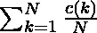
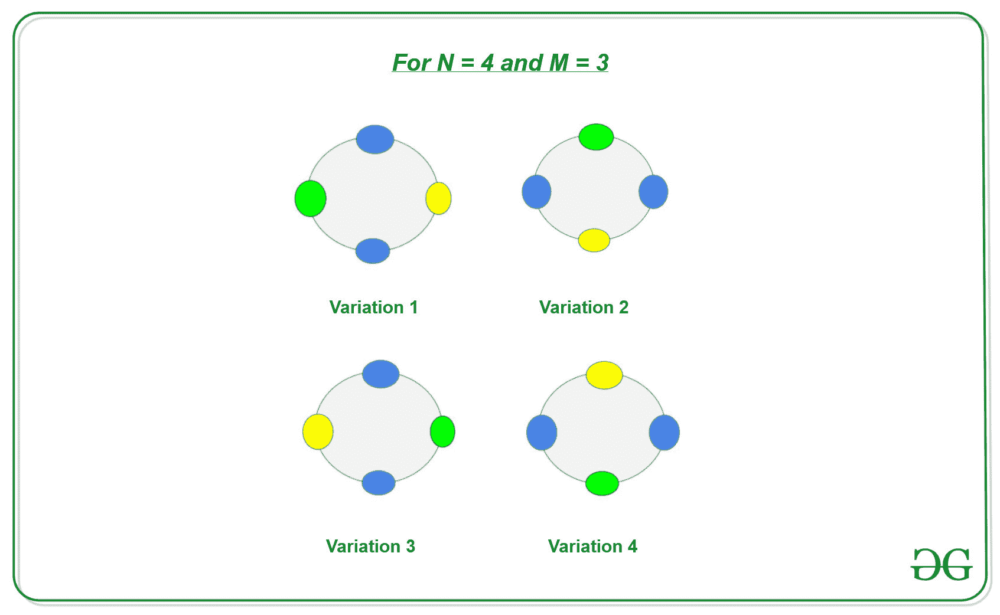
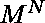
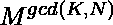
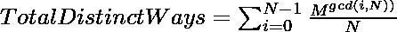

# 轨道计数定理或伯恩赛德引理

> 原文:[https://www . geesforgeks . org/轨道-计数-定理-or-burnsides-lemma/](https://www.geeksforgeeks.org/orbit-counting-theorem-or-burnsides-lemma/)

**伯恩赛德引理**有时也被称为**轨道计数定理**。是[群论](https://www.geeksforgeeks.org/subgroup-and-order-of-group-mathematics/)的成果之一。它用于计算对称的不同物体。它基本上给了我们**公式来计算组合的总数，其中两个相对于旋转或反射彼此对称的物体被计算为单个代表**。

因此，伯恩赛德引理指出，不同物体的总数是:
，其中:

*   **c(k)** 是应用 Kth 旋转时保持不变的组合数，并且
*   **N** 是改变 N 个元素位置的方式总数。

**例如:**
让我们考虑一下我们有一条 **N** 宝石的项链，我们可以用 **M** 颜色给它上色。如果两条项链在旋转后相似，则这两条项链被认为是相似的，并被视为一个不同的组合。现在让我们假设我们有 **N = 4** 石头和 **M = 3** 颜色，那么

因为我们有 N 块石头，因此，通过旋转，每条项链有 N 种可能的变化:



**观察:**有 N 种方法可以改变项链的位置，因为我们可以通过 **0** 到**N–1**的时间来旋转它。

1.  给项链上色有种方法。如果转数为 0，则所有方式保持不变。
2.  如果旋转的次数是 1，那么在所有的方式中，只有 **M** 项链是不同的。
3.  一般来说，如果转数为 **K** ，项链在所有方式中保持不变。

因此，对于用 **M** 颜色着色后的 **N** 宝石的不同项链的总数，是每次旋转时所有不同项链的总和。由
给出

下面是上述方法的实现:

## C++

```
// C++ program for implementing the
// Orbit counting theorem
// or Burnside's Lemma

#include <bits/stdc++.h>
using namespace std;

// Function to find result using
// Orbit counting theorem
// or Burnside's Lemma
void countDistinctWays(int N, int M)
{

    int ans = 0;

    // According to Burnside's Lemma
    // calculate distinct ways for each
    // rotation
    for (int i = 0; i < N; i++) {

        // Find GCD
        int K = __gcd(i, N);
        ans += pow(M, K);
    }

    // Divide By N
    ans /= N;

    // Print the distinct ways
    cout << ans << endl;
}

// Driver Code
int main()
{

    // N stones and M colors
    int N = 4, M = 3;

    // Function call
    countDistinctWays(N, M);

    return 0;
}
```

## Java 语言(一种计算机语言，尤用于创建网站)

```
// Java program for implementing the
// Orbit counting theorem
// or Burnside's Lemma
class GFG{

static int gcd(int a, int b)
{
    if (a == 0)
        return b;

    return gcd(b % a, a);
}

// Function to find result using
// Orbit counting theorem
// or Burnside's Lemma
static void countDistinctWays(int N, int M)
{
    int ans = 0;

    // According to Burnside's Lemma
    // calculate distinct ways for each
    // rotation
    for(int i = 0; i < N; i++)
    {
        // Find GCD
        int K = gcd(i, N);
        ans += Math.pow(M, K);
    }

    // Divide By N
    ans /= N;

    // Print the distinct ways
    System.out.print(ans);
}

// Driver Code
public static void main(String []args)
{

    // N stones and M colors
    int N = 4, M = 3;

    // Function call
    countDistinctWays(N, M);
}
}

// This code is contributed by rutvik_56
```

## C#

```
// C# program for implementing the
// Orbit counting theorem
// or Burnside's Lemma
using System;
class GFG
{
static int gcd(int a, int b)
{
    if (a == 0)
        return b;       
    return gcd(b % a, a);
}

// Function to find result using
// Orbit counting theorem
// or Burnside's Lemma
static void countDistinctWays(int N, int M)
{
    int ans = 0;

    // According to Burnside's Lemma
    // calculate distinct ways for each
    // rotation
    for(int i = 0; i < N; i++)
    {
        // Find GCD
        int K = gcd(i, N);
        ans += (int)Math.Pow(M, K);
    }

    // Divide By N
    ans /= N;

    // Print the distinct ways
    Console.Write(ans);
}

// Driver Code
public static void Main(string []args)
{

    // N stones and M colors
    int N = 4, M = 3;

    // Function call
    countDistinctWays(N, M);
}
}

// This code is contributed by pratham76
```

## java 描述语言

```
<script>

// Javascript <script>

// Javascript program for implementing the
// Orbit counting theorem
// or Burnside's Lemma

function gcd(a, b)
{
    if (a == 0)
        return b;

    return gcd(b % a, a);
}

// Function to find result using
// Orbit counting theorem
// or Burnside's Lemma
function countDistinctWays(N, M)
{
    let ans = 0;

    // According to Burnside's Lemma
    // calculate distinct ways for each
    // rotation
    for(let i = 0; i < N; i++)
    {
        // Find GCD
        let K = gcd(i, N);
        ans += Math.pow(M, K);
    }

    // Divide By N
    ans /= N;

    // Prlet the distinct ways
    document.write(ans);
}

// Driver Code

    // N stones and M colors
    let N = 4, M = 3;

    // Function call
    countDistinctWays(N, M);

</script>
```

**Output:** 

```
24
```