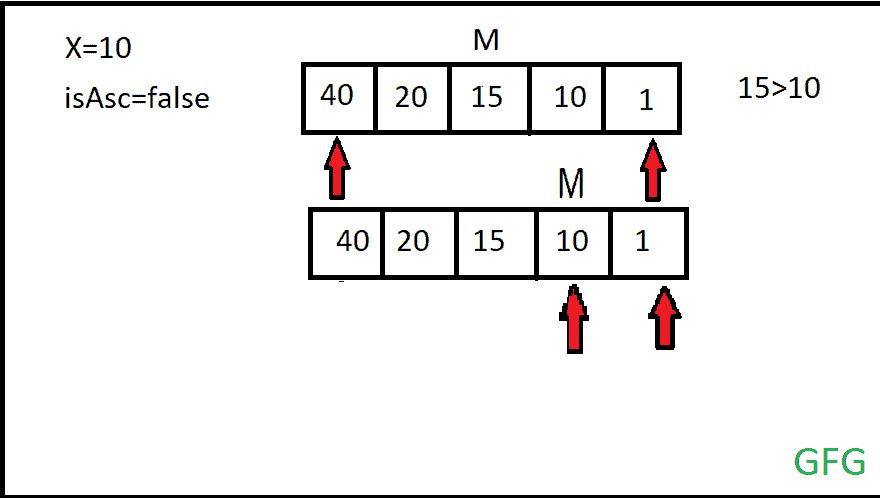

# 秩序不可知的二分搜索法

> 原文:[https://www.geeksforgeeks.org/order-agnostic-binary-search/](https://www.geeksforgeeks.org/order-agnostic-binary-search/)

**<u>订单不可知的二分搜索法</u>** 是[二分搜索法算法](https://www.geeksforgeeks.org/binary-search/)的修改版。在这个修改后的二分搜索法中，还有一个条件检查。这种算法背后的直觉是，如果排序数组的顺序没有给出会怎样。所以这里检查第一个元素的值是大于还是小于最后一个元素。

*   **如果** **第一个元素小于** **最后一个元素**-那么如果搜索键值 **X** 小于间隔的中间，那么结束指针将被更改为中间-1，否则开始将被更改为中间+ 1。
*   **如果第一个元素大于最后一个元素-** 那么如果搜索键值 **X** 小于间隔的中间，那么开始指针将移动到中间元素的下一个元素，否则结束指针将移动到中间元素的前面。

最后，如果搜索关键字值与中间元素匹配，则找到被赋予搜索的元素。

**<u>实现秩序不可知的二分搜索法:</u>**

让我们借助一个例子来看看秩序不可知论二分搜索法的实现。

给定一个大小为 **N** 的[数组](https://www.geeksforgeeks.org/array-data-structure/)、 **arr[ ]** 和一个元素 **X** ，该数组以任意顺序(升序或降序)排序，任务是找出元素 **x** 是否存在于数组中。如果是，则打印其索引，否则打印 **-1。**

**示例:**

> **输入:** arr[] = {40，10，5，2，1}，N=5，X=10
> **输出:** 1
> **解释:**
> 
> 
> 
> 数组按降序排序，元素出现在索引 1 处。
> 
> **输入:** arr[] = {1}，N=1，X=10
> **输出:** -1

**方法:**强力方法是线性遍历数组，检查数组中是否存在元素。如果数组的排序顺序是已知的——升序/降序，对该算法的优化将是使用[二分搜索法](https://www.geeksforgeeks.org/binary-search/)。可以使用二分搜索法的变体，即订单不可知的二分搜索法，如下所述:

按照以下步骤使用订单不可知的二分搜索法解决问题:

*   如果**arr[开始]** 小于**arr[结束]** ，则将布尔变量 **isAsc** 初始化为 **true** ，否则将其设置为 **false。**
*   [遍历一段时间循环](https://www.geeksforgeeks.org/c-c-while-loop-with-examples/)直到**开始**小于等于**结束**，并执行以下步骤:
    *   将变量**中间**初始化为**开始**和**结束的平均值。**
    *   如果 **arr【中】**等于 **X，**则返回**中**的值作为答案，
    *   如果阵列按升序排列，请执行以下步骤:
        *   如果 **arr【中】**小于 **X，**则将 **start** 的值设置为 **middle+1** ，否则将 **end** 的值设置为 **middle-1。**
    *   否则，如果 **arr【中】**小于 **X，**则将 **end** 的值设置为 **middle-1** 否则将 **start** 的值设置为 **middle+1。**
*   执行上述步骤后，由于没有找到元素，返回 **-1** 的值作为答案。

**订单不可知的二分搜索法**的迭代实现。

## C++

```
// C++ program for the above approach
#include <bits/stdc++.h>
using namespace std;

// An iterative binary search function.
int binarySearch(int arr[], int start, int end, int x)
{

    // Checking the sorted order of the given array
    bool isAsc = arr[start] < arr[end];
    while (start <= end) {
        int middle = start + (end - start) / 2;

        // Check if x is present at mid
        if (arr[middle] == x)
            return middle;

        // Ascending order
        if (isAsc == true) {

            // If x greater, ignore left half
            if (arr[middle] < x)
                start = middle + 1;

            // If x smaller, ignore right half
            else
                end = middle - 1;
        }

        // Descending order
        else {

            // If x smaller, ignore left half
            if (arr[middle] > x)
                start = middle + 1;

            // If x greater, ignore right half
            else
                end = middle - 1;
        }
    }

    // Element is not present
    return -1;
}

// Driver Code
int main()
{
    int arr[] = { 40, 10, 5, 2, 1 };
    int x = 10;
    int n = sizeof(arr) / sizeof(arr[0]);
    cout << binarySearch(arr, 0, n - 1, x);

    return 0;
}
```

## Java 语言(一种计算机语言，尤用于创建网站)

```
// Java program for the above approach
import java.util.*;
class GFG {

// An iterative binary search function.
static int binarySearch(int arr[], int start, int end, int x)
{

    // Checking the sorted order of the given array
    boolean isAsc = arr[start] < arr[end];
    while (start <= end) {
        int middle = start + (end - start) / 2;

        // Check if x is present at mid
        if (arr[middle] == x)
            return middle;

        // Ascending order
        if (isAsc == true) {

            // If x greater, ignore left half
            if (arr[middle] < x)
                start = middle + 1;

            // If x smaller, ignore right half
            else
                end = middle - 1;
        }

        // Descending order
        else {

            // If x smaller, ignore left half
            if (arr[middle] > x)
                start = middle + 1;

            // If x greater, ignore right half
            else
                end = middle - 1;
        }
    }

    // Element is not present
    return -1;
}

    // Driver Code
    public static void main(String[] args)
    {
    int arr[] = { 40, 10, 5, 2, 1 };
    int x = 10;
    int n = arr.length;
    System.out.println(binarySearch(arr, 0, n - 1, x));
    }
}

// This code is contributed by sanjoy_62.
```

## java 描述语言

```
<script>

        // JavaScript Program to implement
        // the above approach

        // An iterative binary search function.
        function binarySearch(arr, start, end, x) {

            // Checking the sorted order of the given array
            let isAsc = arr[start] < arr[end];
            while (start <= end) {
                let middle = start + Math.floor((end - start) / 2);

                // Check if x is present at mid
                if (arr[middle] == x)
                    return middle;

                // Ascending order
                if (isAsc == true) {

                    // If x greater, ignore left half
                    if (arr[middle] < x)
                        start = middle + 1;

                    // If x smaller, ignore right half
                    else
                        end = middle - 1;
                }

                // Descending order
                else {

                    // If x smaller, ignore left half
                    if (arr[middle] > x)
                        start = middle + 1;

                    // If x greater, ignore right half
                    else
                        end = middle - 1;
                }
            }

            // Element is not present
            return -1;
        }

        // Driver Code
        let arr = [40, 10, 5, 2, 1];
        let x = 10;
        let n = arr.length;
        document.write(binarySearch(arr, 0, n - 1, x));

    // This code is contributed by Potta Lokesh
    </script>
```

**Output:** 

```
1
```

***时间复杂度:** O(log(N))。*
***辅助空间:** O(1)*

[**递归**](https://www.geeksforgeeks.org/recursion/) **实现顺序不可知二分搜索法:**

## C++

```
// C++ program for the above approach
#include <bits/stdc++.h>
using namespace std;

// A recursive binary search function.
// It returns location of x in given
// array arr[l..r] is present,
// otherwise -1
int binarySearch(int arr[], int start,
                 int end, int x)
{
    bool isAsc = arr[start] < arr[end];
    if (end >= start) {
        int middle = start + (end - start) / 2;

        // If the element is present
        // at the middle itself
        if (arr[middle] == x)
            return middle;

        if (isAsc == true) {

            // If element is smaller than mid,
            // then it can only be
            // present in left subarray
            if (arr[middle] > x)
                return binarySearch(
                    arr, start,
                    middle - 1, x);

            // Else the element can only be present
            // in right subarray
            return binarySearch(arr, middle + 1,
                                end, x);
        }
        else {
            if (arr[middle] < x)
                return binarySearch(arr, start,
                                    middle - 1, x);

            // Else the element can only be present
            // in left subarray
            return binarySearch(arr, middle + 1,
                                end, x);
        }
    }

    // Element not found
    return -1;
}

// Driver Code
int main(void)
{
    int arr[] = { 40, 10, 5, 2, 1 };
    int x = 10;
    int n = sizeof(arr) / sizeof(arr[0]);
    cout << binarySearch(arr, 0, n - 1, x);

    return 0;
}
```

**Output:** 

```
1
```

***时间复杂度:** O(log(N))。*
***辅助空间:** O(1)*