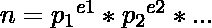
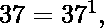
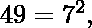

# 有序质数签名

> 原文:[https://www.geeksforgeeks.org/ordered-prime-signature/](https://www.geeksforgeeks.org/ordered-prime-signature/)

给定一个数 n，求有序素数签名，利用这个求给定数 n 的除数。
任何正整数，‘n’都可以用它的素数因子的形式表示。如果‘n’有 p <sub>1</sub> ，p <sub>2</sub> ，等等。作为它的素因子，那么 n 可以表示为:

现在，把得到的‘n’的素因子的指数按非递减顺序排列。如此获得的排列被称为正整数“n”的**有序素数签名**。
**例:**

```
Input : n = 20
Output :  
The Ordered Prime Signature of 20 is : 
{ 1, 2 }
The total number of divisors of 20 is 6

Input : n = 13
Output :  
The Ordered Prime Signature of 13 is : 
{ 1 }
The total number of divisors of 13 is 2
```

**说明:**

1.  有序素数签名 20 = { 1，2 }
2.  有序素数签名 37 = { 1 }
3.  49 = { 2 }的有序素数签名

从上面的讨论可以确定，1 的素签名是{ 1 }。此外，所有质数都有相同的签名，即{ 1 }，一个数的质数签名，即一个质数的 k 次幂(比如说，25 是 5 的 2 次幂)，总是{ k }。
例如:

> 100 = { 2，2 }的有序素签名，如 100 = 2^2 × 5^2
> 现在给每个元素加 1 得到{ 3，3 }，乘积是 3 × 3 = 9，
> 即 100 的除数总数是 9。
> 他们是 1、2、4、5、10、20、25、50、100。

**方法:**
1)找到数的素因子分解
2)在向量中存储对应于素因子的每个指数
3)按升序排列向量
4)为向量中的每个元素添加一个
5)乘以所有元素

## C++

```
// CPP to find total number of divisors of a
// number, using ordered prime signature
#include <bits/stdc++.h>
using namespace std;

// Finding primes upto entered number
vector<int> primes(int n)
{
    bool prime[n + 1];

    // Finding primes by Sieve
    // of Eratosthenes method
    memset(prime, true, sizeof(prime));

    for (int i = 2; i * i <= n; i++)
    {

        // If prime[i] is not changed,
        // then it is prime
        if (prime[i] == true) {

            // Update all multiples of p
            for (int j = i * 2; j <= n; j += i)
                prime[j] = false;
        }
    }

    vector<int> arr;

    // Forming array of the prime numbers found
    for (int i = 2; i <= n; i++)
    {
        if (prime[i])
            arr.push_back(i);
    }
    return arr;
}

// Finding ordered prime signature of the number
vector<int> signature( int n)
{
    vector<int> r = primes(n);

    // Map to store prime factors and
    // the related exponents
    map<int, int> factor;

    // Declaring an iterator for map
    map<int, int>::iterator it;
    vector<int> sort_exp;
    int k, t = n;
    it = factor.begin();

    // Finding prime factorization of the number
    for (int i = 0; i < r.size(); i++)
    {
        if (n % r[i] == 0) {
            k = 0;
            while (n % r[i] == 0) {
                n = n / r[i];
                k++;
            }

            // Storing the prime factor and
            // its exponent in map
            factor.insert(it, pair<int, int>(r[i], k));

            // Storing the exponent in a vector
            sort_exp.push_back(k);
        }
    }

    // Sorting the stored exponents
    sort(sort_exp.begin(), sort_exp.end());

    // Printing the prime signature
    cout << " The Ordered Prime Signature of " <<
         t << " is : \n{ ";

    for (int i = 0; i < sort_exp.size(); i++)
    {
        if (i != sort_exp.size() - 1)
            cout << sort_exp[i] << ", ";
        else
            cout << sort_exp[i] << " }\n";
    }
    return sort_exp;
}

// Finding total number of divisors of the number
void divisors(int n)
{
    int f = 1, l;
    vector<int> div = signature(n);
    l = div.size();

    // Adding one to each element present
    for (int i = 0; i < l; i++)
    {

        // in ordered prime signature
        div[i] += 1;

        // Multiplying the elements
        f *= div[i];
    }
    cout << "The total number of divisors of " <<
          n << " is " << f << "\n";
}

// Driver Method
int main()
{
    int n = 13;
    divisors(n);
    return 0;
}
```

## Java 语言(一种计算机语言，尤用于创建网站)

```
// JAVA to find total number of divisors of a
// number, using ordered prime signature
import java.util.*;

class GFG
{
    static class pair
    {
        int first, second;
        public pair(int first, int second) 
        {
            this.first = first;
            this.second = second;
        }   
    }

// Finding primes upto entered number
static Vector<Integer> primes(int n)
{
    boolean []prime = new boolean[n + 1];

    // Finding primes by Sieve
    // of Eratosthenes method  
    Arrays.fill(prime, true);

    for (int i = 2; i * i <= n; i++)
    {

        // If prime[i] is not changed,
        // then it is prime
        if (prime[i] == true) {

            // Update all multiples of p
            for (int j = i * 2; j <= n; j += i)
                prime[j] = false;
        }
    }   
    Vector<Integer> arr = new Vector<>();

    // Forming array of the prime numbers found
    for (int i = 2; i <= n; i++)
    {
        if (prime[i])
            arr.add(i);
    }
    return arr;
}

// Finding ordered prime signature of the number
static Vector<Integer> signature( int n)
{
    Vector<Integer> r = primes(n);

    // Map to store prime factors and
    // the related exponents
    HashMap<Integer,Integer> factor = new HashMap<>();

    // Declaring an iterator for map
  //  HashMap<Integer,Integer>::iterator it;
    Vector<Integer> sort_exp = new Vector<>();
    int k, t = n;
    int it = 0;

    // Finding prime factorization of the number
    for (int i = 0; i < r.size(); i++)
    {
        if (n % r.get(i) == 0)
        {
            k = 0;
            while (n % r.get(i) == 0)
            {
                n = n / r.get(i);
                k++;
            }

            // Storing the prime factor and
            // its exponent in map
            factor.put(r.get(i), k);

            // Storing the exponent in a vector
            sort_exp.add(k);
        }
    }

    // Sorting the stored exponents
    Collections.sort(sort_exp);

    // Printing the prime signature
    System.out.print(" The Ordered Prime Signature of " + 
         t+ " is : \n{ ");

    for (int i = 0; i < sort_exp.size(); i++)
    {
        if (i != sort_exp.size() - 1)
            System.out.print(sort_exp.get(i) + ", ");
        else
            System.out.print(sort_exp.get(i) + " }\n");
    }
    return sort_exp;
}

// Finding total number of divisors of the number
static void divisors(int n)
{
    int f = 1, l;
    Vector<Integer> div = signature(n);
    l = div.size();

    // Adding one to each element present
    for (int i = 0; i < l; i++)
    {

        // in ordered prime signature
        //div[i] += 1;

        // Multiplying the elements
        f *= (div.get(i) + 1);
    }
    System.out.print("The total number of divisors of " + 
          n + " is " +  f + "\n");
}

// Driver code
public static void main(String[] args)
{
    int n = 13;
    divisors(n);
}
}

// This code is contributed by aashish1995
```

## C#

```
// C# to find total number
// of divisors of a number,
// using ordered prime signature
using System;
using System.Collections.Generic;

class GFG
{
    // Finding primes
    // upto entered number
    static List<int> primes(int n)
    {
        bool []prime = new bool[n + 1];

        // Finding primes by Sieve
        // of Eratosthenes method
        for (int i = 0; i < n + 1; i++)
            prime[i] = true;

        for (int i = 2; i * i <= n; i++)
        {

            // If prime[i] is not 
            // changed, then it is prime
            if (prime[i] == true)
            {

                // Update all multiples of p
                for (int j = i * 2;
                         j <= n; j += i)
                    prime[j] = false;
            }
        }

        List<int> arr = new List<int>();

        // Forming array of the
        // prime numbers found
        for (int i = 2; i <= n; i++)
        {
            if (prime[i])
                arr.Add(i);
        }
        return arr;
    }

    // Finding ordered prime
    // signature of the number
    static List<int> signature( int n)
    {
        List<int> r = primes(n);

        // Map to store prime factors
        // and the related exponents
        var factor = new Dictionary<int, int>();

        List<int> sort_exp = new List<int>();
        int k, t = n;

        // Finding prime factorization
        // of the number
        for (int i = 0; i < r.Count; i++)
        {
            if (n % r[i] == 0)
            {
                k = 0;
                while (n % r[i] == 0)
                {
                    n = n / r[i];
                    k++;
                }

                // Storing the prime factor
                // and its exponent in map
                factor.Add(r[i], k);

                // Storing the exponent
                // in a List
                sort_exp.Add(k);
            }
        }

        // Sorting the
        // stored exponents
        sort_exp.Sort();

        // Printing the
        // prime signature
        Console.Write(" The Ordered Prime Signature of " +
                                        t + " is : \n{ ");

        for (int i = 0; i < sort_exp.Count; i++)
        {
            if (i != sort_exp.Count - 1)
                Console.Write(sort_exp[i] + ", ");
            else
                Console.Write(sort_exp[i] + " }\n");
        }
        return sort_exp;
    }

    // Finding total number
    // of divisors of the number
    static void divisors(int n)
    {
        int f = 1, l;
        List<int> div = signature(n);
        l = div.Count;

        // Adding one to each
        // element present
        for (int i = 0; i < l; i++)
        {

            // in ordered
            // prime signature
            div[i] += 1;

            // Multiplying
            // the elements
            f *= div[i];
        }
        Console.Write("The total number of divisors of " +
                                   n + " is " + f + "\n");
    }

    // Driver Code
    static void Main()
    {
        int n = 13;
        divisors(n);
    }
}

// This code is contributed by
// Manish Shaw(manishshaw1)
```

**Output:** 

```
The Ordered Prime Signature of 13 is : 
{ 1 }
The total number of divisors of 13 is 2
```

**应用:**
求一个数的有序素签名在求除数中有效用。事实上，一个数的除数总数可以从该数的有序素签名中推断出来。要做到这一点，只需给有序质数签名中的每个元素添加一个，然后将这些元素相乘。这样得到的积给出了数的除数的总数(包括 1 和数本身)。