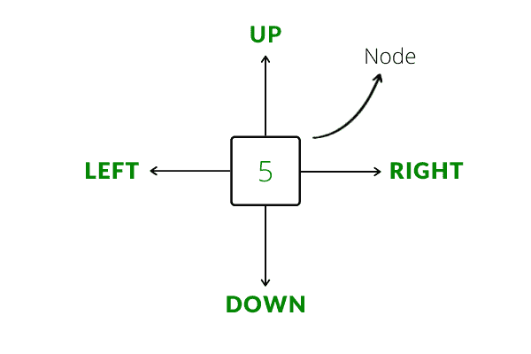

# 正交链表

> 原文:[https://www.geeksforgeeks.org/orthogonal-linked-list/](https://www.geeksforgeeks.org/orthogonal-linked-list/)

正交链表是由称为节点的基本元素组成的数据结构(类似于链表)。正交链表中的每个节点指向 4 个其他节点，即上、下、左和右。本质上，就像矩阵是数组的 2D 版本，正交链表是线性链表的 2D 版本。



**将矩阵转换为正交链表的算法:**

1.  为矩阵中的每个单元格创建一个节点。在映射中，还存储单元格的值和指向为该单元格创建的节点的指针。
2.  如果当前行 **(i)** 不是矩阵的第 **0** 行，将当前节点的向上指针设置为其正上方单元格的节点(使用映射获取正确的指针)，并将上方节点的向下指针设置为当前节点。
3.  同样，如果当前列 **(j)** 不是矩阵的 **0** 列，则将当前节点的左指针设置为当前节点左侧单元格的节点，并将该节点设置为当前节点的左指针
4.  对矩阵中的每个单元格重复过程 1 至 3
5.  返回 map[matrix[0][0]]，将指针返回到正交链表的左上角节点

下面是上面算法的一个实现。

```
Input:
    matrix = {
    {1, 2, 3},
    {4, 5, 6},
    {7, 8, 9}
    }

Output: 
    A Node pointing to the top-left corner of the orthogonal linked list.

       ^      ^      ^
       |      |      |
    <--1 <--> 2 <--> 3-->
       ^      ^      ^
       |      |      |
       v      v      v
    <--4 <--> 5 <--> 6-->
       ^      ^      ^
       |      |      |
       v      v      v
    <--7 <--> 8 <--> 9-->
       |      |      |
       v      v      v
```

## C++

```
#include <bits/stdc++.h>
using namespace std;

struct MatrixNode
{
    int _val;
    MatrixNode* _u; // pointer to node above
    MatrixNode* _d; // pointer to node below
    MatrixNode* _l; // pointer to node towards left
    MatrixNode* _r; // pointer to node towards right

    // Constructor for MatrixNode
    MatrixNode( int val = 0,
                MatrixNode* u = nullptr,
                MatrixNode* d = nullptr,
                MatrixNode* l = nullptr,
                MatrixNode* r = nullptr )
        {
            _val = val;
            _u = u;
            _d = d;
            _l = l;
            _r = r;
        }
};

MatrixNode* BuildOrthogonalList(int matrix[][3], int r, int c)
{
    // an unordered_map to store the {value, pointers} pair
    // for easy access while building the list
    unordered_map<int, MatrixNode*> mp;

    for(int i = 0; i < r; i++)
    {
        for(int j = 0; j < c; j++)
        {
            // create a newNode for each entry in the matrix
            MatrixNode* newNode = new MatrixNode(matrix[i][j]);
            // store the pointer of the new node
            mp[matrix[i][j]] = newNode;

            // set the up and down pointing pointers correctly
            if(i != 0)
            {
                newNode->_u = mp[matrix[i - 1][j]];
                mp[matrix[i - 1][j]]->_d = newNode;
            }

            // similarly set the left and right pointing pointers
            if(j != 0)
            {
                newNode->_l = mp[matrix[i][j - 1]];
                mp[matrix[i][j - 1]]->_r = newNode;
            }
        }
    }

    // return the start of the list
    return mp[matrix[0][0]];
}

void PrintOrthogonalList(MatrixNode* head)
{
    MatrixNode* curRow; // will point to the begin of each row
    MatrixNode* cur; // will traverse each row and print the element
    for(curRow = head; curRow != nullptr; curRow = curRow->_d)
    {
        for(cur = curRow; cur != nullptr; cur = cur->_r)
        {
            cout << cur->_val << " ";
        }
        cout << endl;
    }
}

int main()
{
    int matrix[3][3] = {
        {1, 2, 3},
        {4, 5, 6},
        {7, 8, 9}
    };

    MatrixNode* list = BuildOrthogonalList(matrix, 3, 3);
    PrintOrthogonalList(list);

    return 0;
}
```

**应用:**
正交链表最常见的应用是在稀疏矩阵表示中。简而言之，稀疏矩阵是其大部分元素为零(或任何已知常数)的矩阵。它们经常出现在科学应用中。将稀疏矩阵表示为 2D 阵列是对内存的巨大浪费。相反，稀疏矩阵被表示为正交链表。我们只为矩阵中的非零元素创建一个节点，在每个节点中，我们存储值、行索引和列索引以及指向其他节点的必要指针。这节省了大量的性能开销，并且是实现稀疏矩阵的最节省内存的方法。