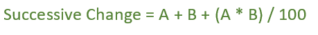

# 连续变化的总百分比变化

> 原文:[https://www . geesforgeks . org/整体-百分比-连续变化/](https://www.geeksforgeeks.org/overall-percentage-change-from-successive-changes/)

给定一个代表百分比变化的数组 Arr。任务是确定这些百分比变化后的百分比增长。

**示例:**

```
Input:  arr[] = {10, 20, 30, 10}
Output: Percentage change is = 88.76 %

Input:  arr[] = {20, 15, 9, 7}
Output: Percentage change is = 60.94 %

```

**无连续变化的解:-**

> 让我们取一个数 N = 120。
> 并且百分比变化给出为，arr[] = {10，20，30，10}
> 现在，如果我们首先将 120 增加 10%，即 120 * 1.1，我们再次得到 N = 132
> 如果我们将其增加 20%，即 132 * 1.2，我们再次得到 N = 158.4
> 如果我们将其增加 30%，即 158.4 * 1.3，我们得到 N = 205.92 【T4
> 
> 现在，百分比变化=(226.51–120)/120 = 0.8876
> 百分比变化= 0.8876 * 100 = 88.76 %



这个公式是如何工作的？
设 x 为初始值。A%变化后，x 的值变为(x + x*A/100)
连续 B%变化后，x 的值变为(x + x*A/100) + (x + x*A/100)*B/100。所以 x 值的增量是 x*(A + B + A*B/100)/100。从百分比来看，我们可以说数值增加了(A+b+ A * B/100%)

**进场:-**

1.  简单地说，在 arr[0]和 arr[1]之间应用连续的变化公式，并将结果存储在结果变量中
2.  Now, calculate successive change between result and arr[2] using above formula and store the result in result variable and so on..

    以下是上述方法的实现:

    ## C++

    ```
    // C++ implementation of above approach
    #include <bits/stdc++.h>
    using namespace std;

    float successiveChange(int arr[], int N)
    {
        float var1, var2, result = 0;

        var1 = arr[0];
        var2 = arr[1];

        // Calculate successive change of 1st 2 change
        result = var1 + var2 + (float(var1 * var2) / 100);

        // Calculate successive change
        // for rest of the value
        for (int i = 2; i < N; i++)
            result = result + arr[i] + (float(result * arr[i]) / 100);

        return result;
    }

    // Driver code
    int main()
    {
        int arr[] = {10, 20, 30, 10};
        int N = sizeof(arr) / sizeof(arr[0]);

        // Calling function
        float result = successiveChange(arr, N);

        cout << "Percentage change is = " << result << " %";
        return 0;
    }
    ```

    ## Java 语言(一种计算机语言，尤用于创建网站)

    ```
      // Java implementation of above approach

    import java.io.*;

    class GFG {

    static float successiveChange(int arr[], int N)
    {
        float var1, var2, result = 0;

        var1 = arr[0];
        var2 = arr[1];

        // Calculate successive change of 1st 2 change
        result = var1 + var2 + ((var1 * var2) / 100);

        // Calculate successive change
        // for rest of the value
        for (int i = 2; i < N; i++)
            result = result + arr[i] + ((result * arr[i]) / 100);

        return result;
    }

    // Driver code
        public static void main (String[] args) {
            int []arr = {10, 20, 30, 10};
        int N = arr.length;

        // Calling function
        float result = successiveChange(arr, N);

        System.out.println("Percentage change is = " + result + " %");
        }
    }
    // This code is contributed by shs..
    ```

    ## 蟒蛇 3

    ```
    # Python implementation of above approach
    def successiveChange(arr, N):

        result = 0;

        var1 = arr[0];
        var2 = arr[1];

        # Calculate successive change of 1st 2 change
        result = float(var1 + var2 + 
                (float(var1 * var2) / 100));

        # Calculate successive change
        # for rest of the value
        for i in range(2, N):
            result = (result + arr[i] +
                     (float(result * arr[i]) / 100));

        return result;

    # Driver code
    arr = [10, 20, 30, 10];
    N = len(arr) ;

    # Calling function
    result = successiveChange(arr, N);
    print ("Percentage change is = %.2f" % 
                           (result), "%");

    # This code is contributed 
    # by Shivi_Aggarwal

    ```

    ## C#

    ```
    // C# implementation of above approach
    using System;

    class GFG {

    static float successiveChange(int []arr, int N)
    {
        float var1, var2, result = 0;

        var1 = arr[0];
        var2 = arr[1];

        // Calculate successive change of 1st 2 change
        result = var1 + var2 + ((var1 * var2) / 100);

        // Calculate successive change
        // for rest of the value
        for (int i = 2; i < N; i++)
            result = result + arr[i] + ((result * arr[i]) / 100);

        return result;
    }

    // Driver code
        public static void Main () {
            int []arr = {10, 20, 30, 10};
        int N = arr.Length;

        // Calling function
        float result = successiveChange(arr, N);

        Console.WriteLine("Percentage change is = " + result + " %");
        }
    }
    // This code is contributed by shs..
    ```

    ## 服务器端编程语言（Professional Hypertext Preprocessor 的缩写）

    ```
    <?php
    // PHP implementation of above approach

    function successiveChange($arr, $N)
    {
        $result = 0;

        $var1 = $arr[0];
        $var2 = $arr[1];

        // Calculate successive change 
        // of 1st 2 change
        $result = $var1 + $var2 + 
                (($var1 * $var2) / 100);

        // Calculate successive change
        // for rest of the value
        for ($i = 2; $i <$N; $i++)
            $result = $result + $arr[$i] + 
                    (($result * $arr[$i]) / 100);

        return $result;
    }

    // Driver code
    $arr = array(10, 20, 30, 10);
    $N = count($arr);

    // Calling function
    $result = successiveChange($arr, $N);

    echo "Percentage change is = " , 
                     $result , " %";

    // This code is contributed by shs..
    ?>
    ```

    **Output:**

    ```
    Percentage change is = 88.76 %

    ```