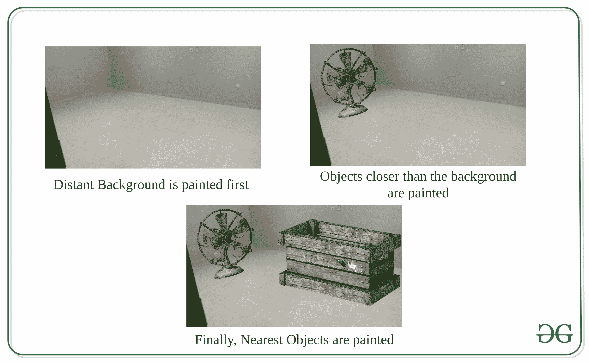

# 计算机图形学中的画家算法

> 原文:[https://www . geesforgeks . org/painter-算法在计算机中的图形/](https://www.geeksforgeeks.org/painters-algorithm-in-computer-graphics/)

**Painter 的算法**是 **1972** 中**休厄尔斯**介绍的算法。

这些算法使用的技术是**图像空间**和**物体空间**。

这个算法的名字叫做 Painter's，因为它的工作原理就像一个画家在创作一幅**油画**。就像一个艺术家画画一样，他从一张空画布开始他的绘画，艺术家首先要做的是为这幅画创建一个**背景层**，在这个层之后他开始创建**另一个对象层**一个接一个的**。这样，他就完成了他的绘画，根据绘画的要求，部分或全部覆盖上一层。**

**该算法基本上是通过考虑**多边形与观察者的距离来绘制视图平面中的**多边形。首先绘制离观察者更远的多边形。之后，根据需要，在更远的多边形上开始绘制更近的多边形。**

**在该算法中，场景中的多边形或表面首先被扫描，然后在帧缓冲器中从观看者的视点开始以**最大深度**的多边形或我们可以说最小 z 值开始的**递减距离**中被绘制。**

**首先执行**深度排序**，其中多边形根据其**可见性顺序**或深度优先级列出。**

**由于该算法使用深度优先的概念，因此也被称为**深度优先算法**或**优先算法**。**

**帧缓冲区用背景色绘制。然后最远的多边形进入帧缓冲区。为此，像素信息将被改变，即具有最远多边形的背景的信息被背景的信息替换。当我们从一个多边形移动到另一个多边形，并以最近的多边形结束时，这将被重复改变。**

**通常**比较**是在多边形相互重叠时进行的。最常用的比较方法叫做**最小-最大方法**。为此，在多边形周围绘制矩形，使矩形与多边形完全匹配。**

**然后，矩形将检查它们是否相互重叠。如果观察到矩形不重叠，那么我们认为这些表面也不重叠。如果矩形重叠，则曲面也会重叠，如下图所示:**

****

**为了找出哪个矩形是重叠的，我们需要找到测试重叠的矩形的最小和最大 x 和 y 值。如果其中一个矩形的最小 y 值大于另一个矩形的最大 y 值，则它们不会重叠，并且由于矩形没有重叠，因此曲面也不会重叠。**

**对 x 坐标进行同样的测试。**

**如果曲面重叠，我们不知道哪个曲面应该出现在另一个曲面的顶部。为了找出哪个表面将出现在顶部，在两个重叠表面的深度值上使用了 **【最小值-最大值】**的**原理。****

****示例:****

****

### **画家法的算法**

**以下是该算法的步骤:**

1.  **根据深度递减或 z 的最大值对各种表面进行分类。**
2.  **现在扫描转换各种表面，从深度最大的表面开始。**
3.  **比较是在各种重叠表面的基础上进行的，因此用户将确定哪个表面保持可见。**
4.  **在刷新缓冲区中，输入确定表面(即确定可见的表面)的强度值。**
5.  **将对所有可用的表面重复上述过程。**
6.  **然而，如果观察到重叠，那么它们是进一步测试的需要。需要进行以下测试:**