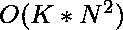

# 油漆工的隔断问题|第二集

> 原文:[https://www . geesforgeks . org/painter-partition-problem-set-2/](https://www.geeksforgeeks.org/painters-partition-problem-set-2/)

我们必须油漆 n 块长度为{A1，A2，..An}。有 k 个可用的油漆工，每个油漆工需要 1 个单位的时间来绘制 1 个单位的纸板。问题是在任何油漆工只画连续的木板部分，比如木板{2，3，4}或只画木板{1}或什么都不画但不画木板{2，4，5}的限制下，找到完成这项工作的最短时间。

**示例:**

```
Input : k = 2, A = {10, 10, 10, 10} 
Output : 20.
Here we can divide the boards into 2
equal sized partitions, so each painter 
gets 20 units of board and the total
time taken is 20\. 

Input : k = 2, A = {10, 20, 30, 40} 
Output : 60.
Here we can divide first 3 boards for
one painter and the last board for 
second painter.
```

在[之前的帖子](https://www.geeksforgeeks.org/painters-partition-problem/)中，我们讨论了一种基于动态规划的方法，该方法具有时间复杂度和的额外空间。
在这篇文章中，我们将研究一种使用二分搜索法的更有效的方法。我们知道二分搜索法不变量有两个主要部分:
*目标值总是在搜索范围内。
*搜索范围将在每个循环中减小，以便可以到达终点。

我们还知道，该范围内的值必须按排序顺序排列。这里，我们的目标值是板的最佳分配中的连续部分的最大和。现在我们如何申请二分搜索法？我们可以固定目标值可能的低到高范围，并缩小搜索范围以获得最佳分配。

我们可以看到，在这个范围内，最高的可能值是数组中所有元素的总和，当我们为棋盘的所有部分分配一个画师时，就会出现这种情况。该范围的最低可能值是数组 max 的最大值，因为在这种分配中，我们可以将 max 分配给一个油漆工，并将其他部分分开，使它们的成本小于或等于 max，并尽可能接近 max。现在，如果我们考虑在上述场景中使用 x 画师，很明显，随着范围内的值增加，x 的值减少，反之亦然。由此我们可以求出 x=k 时的目标值，并利用辅助函数求出 x，给出了一个油漆工能画的最大截面长度时所需的最小油漆工数。

## C++

```
// CPP program for painter's partition problem
#include <iostream>
#include <climits>
using namespace std;

// return the maximum element from the array
int getMax(int arr[], int n)
{
    int max = INT_MIN;
    for (int i = 0; i < n; i++)
        if (arr[i] > max)
            max = arr[i];
    return max;
}

// return the sum of the elements in the array
int getSum(int arr[], int n)
{
    int total = 0;
    for (int i = 0; i < n; i++)
        total += arr[i];
    return total;
}

// find minimum required painters for given maxlen
// which is the maximum length a painter can paint
int numberOfPainters(int arr[], int n, int maxLen)
{
    int total = 0, numPainters = 1;

    for (int i = 0; i < n; i++) {
        total += arr[i];

        if (total > maxLen) {

            // for next count
            total = arr[i];
            numPainters++;
        }
    }

    return numPainters;
}

int partition(int arr[], int n, int k)
{
    int lo = getMax(arr, n);
    int hi = getSum(arr, n);

    while (lo < hi) {
        int mid = lo + (hi - lo) / 2;
        int requiredPainters = numberOfPainters(arr, n, mid);

        // find better optimum in lower half
        // here mid is included because we
        // may not get anything better
        if (requiredPainters <= k)
            hi = mid;

        // find better optimum in upper half
        // here mid is excluded because it gives
        // required Painters > k, which is invalid
        else
            lo = mid + 1;
    }

    // required
    return lo;
}

// driver function
int main()
{
    int arr[] = { 1, 2, 3, 4, 5, 6, 7, 8, 9 };
    int n = sizeof(arr) / sizeof(arr[0]);
    int k = 3;
    cout << partition(arr, n, k) << endl;
    return 0;
}
```

## Java 语言(一种计算机语言，尤用于创建网站)

```
// Java Program for painter's partition problem
import java.util.*;
import java.io.*;

class GFG {
    // return the maximum element from the array
    static int getMax(int arr[], int n)
    {
        int max = Integer.MIN_VALUE;
        for (int i = 0; i < n; i++)
            if (arr[i] > max)
                max = arr[i];
        return max;
    }

    // return the sum of the elements in the array
    static int getSum(int arr[], int n)
    {
        int total = 0;
        for (int i = 0; i < n; i++)
            total += arr[i];
        return total;
    }

    // find minimum required painters for given maxlen
    // which is the maximum length a painter can paint
    static int numberOfPainters(int arr[], int n, int maxLen)
    {
        int total = 0, numPainters = 1;

        for (int i = 0; i < n; i++) {
            total += arr[i];

            if (total > maxLen) {

                // for next count
                total = arr[i];
                numPainters++;
            }
        }

        return numPainters;
    }

    static int partition(int arr[], int n, int k)
    {
        int lo = getMax(arr, n);
        int hi = getSum(arr, n);

        while (lo < hi) {
            int mid = lo + (hi - lo) / 2;
            int requiredPainters = numberOfPainters(arr, n, mid);

            // find better optimum in lower half
            // here mid is included because we
            // may not get anything better
            if (requiredPainters <= k)
                hi = mid;

            // find better optimum in upper half
            // here mid is excluded because it gives
            // required Painters > k, which is invalid
            else
                lo = mid + 1;
        }

        // required
        return lo;
    }

    // Driver code
    public static void main(String args[])
    {
        int arr[] = { 1, 2, 3, 4, 5, 6, 7, 8, 9 };

        // Calculate size of array.
        int n = arr.length;
        int k = 3;
        System.out.println(partition(arr, n, k));
    }
}

// This code is contributed by Sahil_Bansall
```

## 蟒蛇 3

```
# Python program for painter's partition problem

# Find minimum required painters for given maxlen
# which is the maximum length a painter can paint
def numberOfPainters(arr, n, maxLen):
    total = 0
    numPainters = 1

    for i in arr:
        total += i

        if (total > maxLen):

            # for next count
            total = i
            numPainters += 1

    return numPainters

def partition(arr, n, k):
    lo = max(arr)
    hi = sum(arr)

    while (lo < hi):
        mid = lo + (hi - lo) // 2
        requiredPainters = numberOfPainters(arr, n, mid)

        # find better optimum in lower half
        # here mid is included because we
        # may not get anything better
        if (requiredPainters <= k):
            hi = mid

        # find better optimum in upper half
        # here mid is excluded because it gives
        # required Painters > k, which is invalid
        else:
            lo = mid + 1

    # required
    return lo

# Driver code
arr = [1, 2, 3, 4, 5, 6, 7, 8, 9]
n = len(arr)
k = 3
print(int(partition(arr, n, k)))
```

## C#

```
// C# Program for painter's
// partition problem
using System;

class GFG {

    // return the maximum
    // element from the array
    static int getMax(int[] arr, int n)
    {
        int max = int.MinValue;
        for (int i = 0; i < n; i++)
            if (arr[i] > max)
                max = arr[i];
        return max;
    }

    // return the sum of the
    // elements in the array
    static int getSum(int[] arr, int n)
    {
        int total = 0;
        for (int i = 0; i < n; i++)
            total += arr[i];
        return total;
    }

    // find minimum required
    // painters for given
    // maxlen which is the
    // maximum length a painter
    // can paint
    static int numberOfPainters(int[] arr,
                                int n, int maxLen)
    {
        int total = 0, numPainters = 1;

        for (int i = 0; i < n; i++) {
            total += arr[i];

            if (total > maxLen) {

                // for next count
                total = arr[i];
                numPainters++;
            }
        }

        return numPainters;
    }

    static int partition(int[] arr,
                         int n, int k)
    {
        int lo = getMax(arr, n);
        int hi = getSum(arr, n);

        while (lo < hi) {
            int mid = lo + (hi - lo) / 2;
            int requiredPainters = numberOfPainters(arr, n, mid);

            // find better optimum in lower
            // half here mid is included
            // because we may not get
            // anything better
            if (requiredPainters <= k)
                hi = mid;

            // find better optimum in upper
            // half here mid is excluded
            // because it gives required
            // Painters > k, which is invalid
            else
                lo = mid + 1;
        }

        // required
        return lo;
    }

    // Driver code
    static public void Main()
    {
        int[] arr = { 1, 2, 3, 4, 5,
                      6, 7, 8, 9 };

        // Calculate size of array.
        int n = arr.Length;
        int k = 3;
        Console.WriteLine(partition(arr, n, k));
    }
}

// This code is contributed by ajit
```

## 服务器端编程语言（Professional Hypertext Preprocessor 的缩写）

```
<?php
// PHP program for painter's
// partition problem

// return the maximum
// element from the array
function getMax($arr, $n)
{
    $max = PHP_INT_MIN;
    for ($i = 0; $i < $n; $i++)
        if ($arr[$i] > $max)
            $max = $arr[$i];
    return $max;
}

// return the sum of the
// elements in the array
function getSum($arr, $n)
{
    $total = 0;
    for ($i = 0; $i < $n; $i++)
        $total += $arr[$i];
    return $total;
}

// find minimum required painters
// for given maxlen which is the
// maximum length a painter can paint
function numberOfPainters($arr, $n,
                          $maxLen)
{
    $total = 0; $numPainters = 1;

    for ($i = 0; $i < $n; $i++)
    {
        $total += $arr[$i];

        if ($total > $maxLen)
        {

            // for next count
            $total = $arr[$i];
            $numPainters++;
        }
    }

    return $numPainters;
}

function partition($arr, $n, $k)
{
    $lo = getMax($arr, $n);
    $hi = getSum($arr, $n);

    while ($lo < $hi)
    {
        $mid = $lo + ($hi - $lo) / 2;
        $requiredPainters =
                    numberOfPainters($arr,
                                     $n, $mid);

        // find better optimum in
        // lower half here mid is
        // included because we may
        // not get anything better
        if ($requiredPainters <= $k)
            $hi = $mid;

        // find better optimum in
        // upper half here mid is
        // excluded because it
        // gives required Painters > k,
        // which is invalid
        else
            $lo = $mid + 1;
    }

    // required
    return floor($lo);
}

// Driver Code
$arr = array(1, 2, 3,
             4, 5, 6,
             7, 8, 9);
$n = sizeof($arr);
$k = 3;

echo partition($arr, $n, $k), "\n";

// This code is contributed by ajit
?>
```

## java 描述语言

```
<script>

// Javascript Program for painter's partition problem

// Return the maximum element from the array
function getMax(arr, n)
{
    let max = Number.MIN_VALUE;
    for(let i = 0; i < n; i++)
        if (arr[i] > max)
            max = arr[i];

    return max;
}

// Return the sum of the elements in the array
function getSum(arr, n)
{
    let total = 0;
    for(let i = 0; i < n; i++)
        total += arr[i];

    return total;
}

// Find minimum required paleters for given maxlen
// which is the maximum length a paleter can palet
function numberOfPaleters(arr, n, maxLen)
{
    let total = 0, numPaleters = 1;

    for(let i = 0; i < n; i++)
    {
        total += arr[i];

        if (total > maxLen)
        {

            // For next count
            total = arr[i];
            numPaleters++;
        }
    }
    return numPaleters;
}

function partition(arr, n, k)
{
    let lo = getMax(arr, n);
    let hi = getSum(arr, n);

    while (lo < hi)
    {
        let mid = lo + (hi - lo) / 2;
        let requiredPaleters = numberOfPaleters(
            arr, n, mid);

        // Find better optimum in lower half
        // here mid is included because we
        // may not get anything better
        if (requiredPaleters <= k)
            hi = mid;

        // find better optimum in upper half
        // here mid is excluded because it gives
        // required Paleters > k, which is invalid
        else
            lo = mid + 1;
    }

    // Required
    return lo;
}

// Driver code
let arr = [ 1, 2, 3, 4, 5, 6, 7, 8, 9 ];

// Calculate size of array.
let n = arr.length;
let k = 3;

document.write(Math.round(partition(arr, n, k)));

// This code is contributed by sanjoy_62

</script>
```

**输出:**

```
17
```

为了更好地理解，请用纸和笔描绘程序中给出的例子。
上述方法的时间复杂度为![O(N * log (sum (arr[]))      ](img/46c218b5d829fa5a8b61f5e56ea55737.png "Rendered by QuickLaTeX.com")。
参考文献:
[https://articles . leetcode . com/the-paintiers-partition-problem-ii/](https://articles.leetcode.com/the-painters-partition-problem-part-ii/)
[https://www . topcoder . com/community/data-science/data-science-tutors/binary-search/](https://www.topcoder.com/community/data-science/data-science-tutorials/binary-search/)
问于:Google，Codenation。