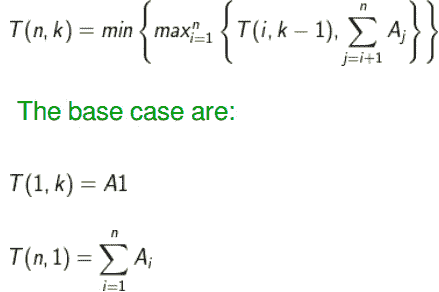
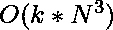
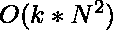

# 油漆工的隔断问题

> 原文:[https://www.geeksforgeeks.org/painters-partition-problem/](https://www.geeksforgeeks.org/painters-partition-problem/)

我们必须油漆 n 块长度为{A1，A2…An}的木板。有 k 个可用的油漆工，每个油漆工需要 1 个单位的时间来绘制 1 个单位的纸板。问题是找到最短的时间来完成
这项工作，条件是任何油漆工只能画连续的木板部分，比如木板{2，3，4}或只有木板{1}或什么都不画但不能画木板{2，4，5}。

**示例:**

```
Input : k = 2, A = {10, 10, 10, 10} 
Output : 20.
Here we can divide the boards into 2
equal sized partitions, so each painter 
gets 20 units of board and the total
time taken is 20\. 

Input : k = 2, A = {10, 20, 30, 40} 
Output : 60.
Here we can divide first 3 boards for
one painter and the last board for 
second painter.
```

从上面的例子中，很明显，将板分成 k 个相等分区的策略并不适用于所有情况。我们可以观察到这个问题可以**分解**为:给定一个非负整数的数组 A 和一个正整数 k，我们必须把 A 分成 k 个更少的分区，这样一个分区中元素的最大和，整体分区最小。所以对于上面的第二个例子，可能的**师**是:

*一个分区:所以时间是 100。

*两个分区:(10) & (20，30，40)，所以时间是 90。同样我们可以把第一个分割线
放在 20 (= >时间 70)或 30 (= >时间 60)之后；所以这意味着最小时间:(100，90，70，60)是 60。
一个**蛮力**的解决方案是考虑所有可能的连续分区集，计算每种情况下的最大和分区，并返回所有这些情况下的最小值。

**1)最优子结构:**
我们可以使用递归实现天真解，具有以下最优子结构属性:
假设我们已经有 k-1 个分区(使用 k-2 个除法器)，我们现在必须放置第 k-1 个除法器来获得 k 个分区。
我们如何做到这一点？我们可以把第 k-1 个除法器放在第 I 个和第 i+1 个元素之间，其中 i = 1 到 n。请注意，把它放在第一个元素之前和把它放在最后一个元素之后是一样的。
这种排列的总成本可以计算为以下的**最大值**:
a)最后一个分区的成本:sum(Ai..An)，其中第 k-1 个分割器是元素 I 之前的
。
b)在第 k-1 个分割器左侧已经形成的任何分区的最大成本。这里的
a)可以通过使用简单的**辅助函数**来计算数组中两个索引之间的元素之和
来找到。如何找出 b)？
我们可以观察到，b)实际上是尽可能公平地放置 k-2 分隔符
，所以是给定问题的**子问题**。因此我们可以将最优
子结构性质写成如下递推关系:



下面是上述递归方程的实现:

## C++

```
// CPP program for The painter's partition problem
#include <climits>
#include <iostream>
using namespace std;

// function to calculate sum between two indices
// in array
int sum(int arr[], int from, int to)
{
    int total = 0;
    for (int i = from; i <= to; i++)
        total += arr[i];
    return total;
}

// for n boards and k partitions
int partition(int arr[], int n, int k)
{
    // base cases   
    if (k == 1) // one partition
        return sum(arr, 0, n - 1);   
    if (n == 1)  // one board
        return arr[0];

    int best = INT_MAX;

    // find minimum of all possible maximum
    // k-1 partitions to the left of arr[i],
    // with i elements, put k-1 th divider
    // between arr[i-1] & arr[i] to get k-th
    // partition
    for (int i = 1; i <= n; i++)
        best = min(best, max(partition(arr, i, k - 1),
                                sum(arr, i, n - 1)));

    return best;
}

int main()
{
    int arr[] = { 10, 20, 60, 50, 30, 40 };
    int n = sizeof(arr) / sizeof(arr[0]);
    int k = 3;
    cout << partition(arr, n, k) << endl;

    return 0;
}
```

## Java 语言(一种计算机语言，尤用于创建网站)

```
// Java Program for The painter's partition problem
import java.util.*;
import java.io.*;

class GFG
{
// function to calculate sum between two indices
// in array
static int sum(int arr[], int from, int to)
{
    int total = 0;
    for (int i = from; i <= to; i++)
        total += arr[i];
    return total;
}

// for n boards and k partitions
static int partition(int arr[], int n, int k)
{
    // base cases   
    if (k == 1) // one partition
        return sum(arr, 0, n - 1);   
    if (n == 1)  // one board
        return arr[0];

    int best = Integer.MAX_VALUE;

    // find minimum of all possible maximum
    // k-1 partitions to the left of arr[i],
    // with i elements, put k-1 th divider
    // between arr[i-1] & arr[i] to get k-th
    // partition
    for (int i = 1; i <= n; i++)
        best = Math.min(best, Math.max(partition(arr, i, k - 1),
                                sum(arr, i, n - 1)));

    return best;
}

// Driver code
public static void main(String args[])
{
 int arr[] = { 10, 20, 60, 50, 30, 40 };

    // Calculate size of array.
    int n = arr.length;
        int k = 3;
 System.out.println(partition(arr, n, k));
}
}

// This code is contributed by Sahil_Bansall
```

## 蟒蛇 3

```
# Python program for The painter's
# partition problem function to
# calculate sum between two indices
# in array
def sum(arr, frm, to):
    total = 0;
    for i in range(frm, to + 1):
        total += arr[i]
    return total

# for n boards and k partitions
def partition(arr, n, k):

    # base cases
    if k == 1: # one partition
        return sum(arr, 0, n - 1)
    if n == 1: # one board
        return arr[0]
    best = 100000000

    # find minimum of all possible 
    # maximum k-1 partitions to 
    # the left of arr[i], with i
    # elements, put k-1 th divider
    # between arr[i-1] & arr[i] to
    # get k-th partition
    for i in range(1, n + 1):
        best = min(best,
               max(partition(arr, i, k - 1),
                         sum(arr, i, n - 1)))
    return best

# Driver Code
arr = [10, 20, 60, 50, 30, 40 ]
n = len(arr)
k = 3
print(partition(arr, n, k))

# This code is contributed
# by sahilshelangia
```

## C#

```
// C# Program for The painter's partition problem
using System;

class GFG {

// function to calculate sum
// between two indices in array
static int sum(int []arr, int from, int to)
{
    int total = 0;
    for (int i = from; i <= to; i++)
        total += arr[i];
    return total;
}

// for n boards and k partitions
static int partition(int []arr, int n, int k)
{
    // base cases
    if (k == 1) // one partition
        return sum(arr, 0, n - 1);

    if (n == 1) // one board
        return arr[0];

    int best = int.MaxValue;

    // find minimum of all possible maximum
    // k-1 partitions to the left of arr[i],
    // with i elements, put k-1 th divider
    // between arr[i-1] & arr[i] to get k-th
    // partition
    for (int i = 1; i <= n; i++)
        best = Math.Min(best, Math.Max(partition(arr, i, k - 1),
                                           sum(arr, i, n - 1)));

    return best;
}

// Driver code
public static void Main()
{
    int []arr = {10, 20, 60, 50, 30, 40};

    // Calculate size of array.
    int n = arr.Length;
    int k = 3;

    // Function calling
    Console.WriteLine(partition(arr, n, k));
}
}

// This code is contributed by vt_m
```

## 服务器端编程语言（Professional Hypertext Preprocessor 的缩写）

```
<?php
// PHP program for The
// painter's partition problem

// function to calculate sum
// between two indices in array
function sum($arr, $from, $to)
{
    $total = 0;
    for ($i = $from; $i <= $to; $i++)
        $total += $arr[$i];
    return $total;
}

// for n boards
// and k partitions
function partition($arr, $n, $k)
{
    // base cases
    if ($k == 1) // one partition
        return sum($arr, 0, $n - 1);
    if ($n == 1) // one board
        return $arr[0];

    $best = PHP_INT_MAX;

    // find minimum of all possible
    // maximum k-1 partitions to the
    // left of arr[i], with i elements,
    // put k-1 th divider between
    // arr[i-1] & arr[i] to get k-th
    // partition
    for ($i = 1; $i <= $n; $i++)
        $best = min($best,
                max(partition($arr, $i, $k - 1),
                          sum($arr, $i, $n - 1)));

    return $best;
}
// Driver Code
$arr = array(10, 20, 60,
             50, 30, 40);
$n = sizeof($arr);
$k = 3;
echo partition($arr, $n, $k), "\n";

// This code is contributed by ajit
?>
```

## java 描述语言

```
<script>

// JavaScript Program for The painter's
// partition problem

// Function to calculate sum between
// two indices in array
function sum(arr, from, to)
{
    let total = 0;
    for(let i = from; i <= to; i++)
        total += arr[i];

    return total;
}

// For n boards and k partitions
function partition(arr, n, k)
{

    // Base cases  
    if (k == 1) // one partition
        return sum(arr, 0, n - 1);  
    if (n == 1)  // one board
        return arr[0];

    let best = Number.MAX_VALUE;

    // Find minimum of all possible maximum
    // k-1 partitions to the left of arr[i],
    // with i elements, put k-1 th divider
    // between arr[i-1] & arr[i] to get k-th
    // partition
    for(let i = 1; i <= n; i++)
        best = Math.min(best,
               Math.max(partition(arr, i, k - 1),
                              sum(arr, i, n - 1)));

    return best;
}

// Driver Code
let arr = [ 10, 20, 60, 50, 30, 40 ];

// Calculate size of array.
let n = arr.length;
let k = 3;

document.write(partition(arr, n, k));

// This code is contributed by susmitakundugoaldanga

</script>
```

**输出:**

```
90
```

上述解的**时间复杂度**是指数的。

**2)重叠子问题:**
下面是上式中 T(4，3)的部分递归树。

```
      T(4, 3)
     /    /    \ ..         
T(1, 2)  T(2, 2) T(3, 2) 
          /..      /..     
      T(1, 1)    T(1, 1)
```

我们可以观察到，上述问题中很多像 T(1，1)这样的子问题正在一次又一次地被解决。由于这个问题的这两个性质，我们可以用**动态规划**来解决，可以用自上而下的记忆方法，也可以用自下而上的
表格方法。以下是自下而上的表格实现:

## C++

```
// A DP based CPP program for painter's partition problem
#include <climits>
#include <iostream>
using namespace std;

// function to calculate sum between two indices
// in array
int sum(int arr[], int from, int to)
{
    int total = 0;
    for (int i = from; i <= to; i++)
        total += arr[i];
    return total;
}

// bottom up tabular dp
int findMax(int arr[], int n, int k)
{
    // initialize table
    int dp[k + 1][n + 1] = { 0 };

    // base cases
    // k=1
    for (int i = 1; i <= n; i++)
        dp[1][i] = sum(arr, 0, i - 1);

    // n=1
    for (int i = 1; i <= k; i++)
        dp[i][1] = arr[0];

    // 2 to k partitions
    for (int i = 2; i <= k; i++) { // 2 to n boards
        for (int j = 2; j <= n; j++) {

            // track minimum
            int best = INT_MAX;

            // i-1 th separator before position arr[p=1..j]
            for (int p = 1; p <= j; p++)
                best = min(best, max(dp[i - 1][p],
                              sum(arr, p, j - 1)));      

            dp[i][j] = best;
        }
    }

    // required
    return dp[k][n];
}

// driver function
int main()
{
    int arr[] = { 10, 20, 60, 50, 30, 40 };
    int n = sizeof(arr) / sizeof(arr[0]);
    int k = 3;
    cout << findMax(arr, n, k) << endl;
    return 0;
}
```

## Java 语言(一种计算机语言，尤用于创建网站)

```
// A DP based Java program for
// painter's partition problem
import java.util.*;
import java.io.*;

class GFG
{
// function to calculate sum between two indices
// in array
static int sum(int arr[], int from, int to)
{
    int total = 0;
    for (int i = from; i <= to; i++)
        total += arr[i];
    return total;
}

// bottom up tabular dp
static int findMax(int arr[], int n, int k)
{
    // initialize table
    int dp[][] = new int[k+1][n+1];

    // base cases
    // k=1
    for (int i = 1; i <= n; i++)
        dp[1][i] = sum(arr, 0, i - 1);

    // n=1
    for (int i = 1; i <= k; i++)
        dp[i][1] = arr[0];

    // 2 to k partitions
    for (int i = 2; i <= k; i++) { // 2 to n boards
        for (int j = 2; j <= n; j++) {

            // track minimum
            int best = Integer.MAX_VALUE;

            // i-1 th separator before position arr[p=1..j]
            for (int p = 1; p <= j; p++)
                best = Math.min(best, Math.max(dp[i - 1][p],
                              sum(arr, p, j - 1)));      

            dp[i][j] = best;
        }
    }

    // required
    return dp[k][n];
}

// Driver code
public static void main(String args[])
{
 int arr[] = { 10, 20, 60, 50, 30, 40 };

    // Calculate size of array.
    int n = arr.length;
        int k = 3;
 System.out.println(findMax(arr, n, k));
}
}

// This code is contributed by Sahil_Bansall
```

## 蟒蛇 3

```
# A DP based Python3 program for
# painter's partition problem

# function to calculate sum between
# two indices in list
def sum(arr, start, to):
    total = 0
    for i in range(start, to + 1):
        total += arr[i]
    return total

# bottom up tabular dp
def findMax(arr, n, k):

    # initialize table
    dp = [[0 for i in range(n + 1)]
             for j in range(k + 1)]

    # base cases
    # k=1
    for i in range(1, n + 1):
        dp[1][i] = sum(arr, 0, i - 1)

    # n=1
    for i in range(1, k + 1):
        dp[i][1] = arr[0]

    # 2 to k partitions
    for i in range(2, k + 1): # 2 to n boards
        for j in range(2, n + 1):

            # track minimum
            best = 100000000

            # i-1 th separator before position arr[p=1..j]
            for p in range(1, j + 1):
                best = min(best, max(dp[i - 1][p],
                                 sum(arr, p, j - 1)))    

            dp[i][j] = best

    # required
    return dp[k][n]

# Driver Code
arr = [10, 20, 60, 50, 30, 40]
n = len(arr)
k = 3
print(findMax(arr, n, k))

# This code is contributed by ashutosh450
```

## C#

```
// A DP based C# program for
// painter's partition problem
using System;

class GFG {

// function to calculate sum between
// two indices in array
static int sum(int []arr, int from, int to)
{
    int total = 0;
    for (int i = from; i <= to; i++)
        total += arr[i];
    return total;
}

// bottom up tabular dp
static int findMax(int []arr, int n, int k)
{
    // initialize table
    int [,]dp = new int[k+1,n+1];

    // base cases
    // k=1
    for (int i = 1; i <= n; i++)
        dp[1,i] = sum(arr, 0, i - 1);

    // n=1
    for (int i = 1; i <= k; i++)
        dp[i,1] = arr[0];

    // 2 to k partitions
    for (int i = 2; i <= k; i++) { // 2 to n boards
        for (int j = 2; j <= n; j++) {

            // track minimum
            int best = int.MaxValue;

            // i-1 th separator before position arr[p=1..j]
            for (int p = 1; p <= j; p++)
                best = Math.Min(best, Math.Max(dp[i - 1,p],
                                      sum(arr, p, j - 1)));

            dp[i,j] = best;
        }
    }

    // required
    return dp[k,n];
}

// Driver code
public static void Main()
{
    int []arr = {10, 20, 60, 50, 30, 40};

    // Calculate size of array.
    int n = arr.Length;
    int k = 3;
    Console.WriteLine(findMax(arr, n, k));
}
}

// This code is contributed by vt_m
```

## 服务器端编程语言（Professional Hypertext Preprocessor 的缩写）

```
<?php
// A DP based PHP program for
// painter's partition problem

// function to calculate sum
// between two indices in array
function sum($arr, $from, $to)
{
    $total = 0;
    for ($i = $from; $i <= $to; $i++)
        $total += $arr[$i];
    return $total;
}

// bottom up tabular dp
function findMax($arr, $n, $k)
{
    // initialize table
    $dp[$k + 1][$n + 1] = array( 0 );

    // base cases
    // k=1
    for ($i = 1; $i <= $n; $i++)
        $dp[1][$i] = sum($arr, 0,
                         $i - 1);

    // n=1
    for ($i = 1; $i <= $k; $i++)
        $dp[$i][1] = $arr[0];

    // 2 to k partitions
    for ($i = 2; $i <= $k; $i++)
    {
        // 2 to n boards
        for ($j = 2; $j <= $n; $j++)
        {

            // track minimum
            $best = PHP_INT_MAX;

            // i-1 th separator before
            // position arr[p=1..j]
            for ($p = 1; $p <= $j; $p++)
                $best = min($best, max($dp[$i - 1][$p],
                               sum($arr, $p, $j - 1)));    

            $dp[$i][$j] = $best;
        }
    }

    // required
    return $dp[$k][$n];
}

// Driver Code
$arr = array (10, 20, 60,
              50, 30, 40 );
$n = sizeof($arr);
$k = 3;
echo findMax($arr, $n, $k) ,"\n";

// This code is contributed by m_kit
?>
```

## java 描述语言

```
<script>
    // A DP based Javascript program for
    // painter's partition problem

    // function to calculate sum between
    // two indices in array
    function sum(arr, from, to)
    {
        let total = 0;
        for (let i = from; i <= to; i++)
            total += arr[i];
        return total;
    }

    // bottom up tabular dp
    function findMax(arr, n, k)
    {
        // initialize table
        let dp = new Array(k+1);
        for(let i = 0; i < k + 1; i++)
        {
            dp[i] = new Array(n + 1);
        }

        // base cases
        // k=1
        for (let i = 1; i <= n; i++)
            dp[1][i] = sum(arr, 0, i - 1);

        // n=1
        for (let i = 1; i <= k; i++)
            dp[i][1] = arr[0];

        // 2 to k partitions
        for (let i = 2; i <= k; i++) { // 2 to n boards
            for (let j = 2; j <= n; j++) {

                // track minimum
                let best = Number.MAX_VALUE;

                // i-1 th separator before position arr[p=1..j]
                for (let p = 1; p <= j; p++)
                    best = Math.min(best, Math.max(dp[i - 1][p],
                                          sum(arr, p, j - 1)));

                dp[i][j] = best;
            }
        }

        // required
        return dp[k][n];
    }

    // Driver code
    let arr = [10, 20, 60, 50, 30, 40];

    // Calculate size of array.
    let n = arr.length;
    let k = 3;
    document.write(findMax(arr, n, k));

    // This code is contributed by mukesh07.
</script>
```

**输出:**

```
90
```

**优化:**

1)上述程序的**时间复杂度**为。通过预先计算一个数组中的累积和，可以很容易地将其归结为，从而避免重复调用 sum 函数:

## C++

```
int sum[n+1] = {0};

 // sum from 1 to i elements of arr
 for (int i = 1; i <= n; i++)
   sum[i] = sum[i-1] + arr[i-1];

 for (int i = 1; i <= n; i++)
   dp[1][i] = sum[i];

and using it to calculate the result as:
best = min(best, max(dp[i-1][p], sum[j] - sum[p]));
```

## Java 语言(一种计算机语言，尤用于创建网站)

```
int sum[] = new int[n+1];

 // sum from 1 to i elements of arr
 for (int i = 1; i <= n; i++)
   sum[i] = sum[i-1] + arr[i-1];

 for (int i = 1; i <= n; i++)
   dp[1][i] = sum[i];

and using it to calculate the result as:
best = Math.min(best, Math.max(dp[i-1][p], sum[j] - sum[p]));

// This code is contributed by divyesh072019.
```

## C#

```
int[] sum = new int[n+1];

 // sum from 1 to i elements of arr
 for (int i = 1; i <= n; i++)
   sum[i] = sum[i-1] + arr[i-1];

 for (int i = 1; i <= n; i++)
   dp[1,i] = sum[i];

and using it to calculate the result as:
best = Math.Min(best, Math.Max(dp[i-1][p], sum[j] - sum[p]));

// This code is contributed by divyeshrabadiya07.
```

2)虽然这里我们考虑将 A 分成 k 个或更少的分区，但是我们可以观察到
**最优情况**总是在我们将 A 分成正好 k 个分区时出现。所以我们可以用:

## C++

```
for (int i = k-1; i <= n; i++)
    best = min(best, max( partition(arr, i, k-1),
                            sum(arr, i, n-1)));
```

## Java 语言(一种计算机语言，尤用于创建网站)

```
for (int i = k-1; i <= n; i++)
      best = Math.min(best, Math.max(partition(arr, i, k-1),
                              sum(arr, i, n-1)));

// This code is contributed by pratham76.
```

## C#

```
for(int i = k - 1; i <= n; i++)
    best = Math.Min(best, Math.Max(partition(arr, i, k - 1),
                                         sum(arr, i, n - 1)));

// This code is contributed by rutvik_56
```

## java 描述语言

```
for(var i = k - 1; i <= n; i++)
      best = Math.min(best, Math.max(partition(arr, i, k - 1),
                                           sum(arr, i, n - 1)));

// This code is contributed by Ankita saini
```

并相应地修改其他实现。
**练习:**
能用二分搜索法想出解决办法吗？详情请参考[分配最小页数](https://www.geeksforgeeks.org/allocate-minimum-number-pages/)。
**参考文献:**
[https://articles . leetcode . com/the-paintiers-partition-problem/](https://articles.leetcode.com/the-painters-partition-problem/)