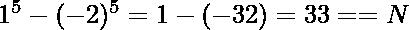

# 一对整数，其五次幂之差为 X

> 原文:[https://www . geeksforgeeks . org/整数对的五次方差为 x/](https://www.geeksforgeeks.org/pair-of-integers-having-difference-of-their-fifth-power-as-x/)

给定一个整数 **X** ，任务是找到一对 **A** 和 **B** 使得它们的五次方差为 X，即**A<sup>5</sup>–B<sup>5</sup>= X**。如果没有这样的双印“不可能”。

> **输入:** X = 33
> **输出:** 1 -2
> **解释:**
> 
> **输入:** N = 211
> **输出:** -2 -3
> **解释:**
> 

**天真方法:**一个简单的解决方案是使用两个 for 循环，一个用于 A，一个用于 B，范围从-10 <sup>9</sup> 到 10 <sup>9</sup> 。
**高效途径:**思路是利用数学技术**缩小 A 和 B** 的范围。

自 A<sup>5</sup>–B<sup>5</sup>= X =>A<sup>5</sup>= X+B<sup>5</sup>。要使 A 尽可能高，B 也必须尽可能高，这从不等式中可以明显看出。

> 考虑 A = N 和 B = N–1
> =>N<sup>5</sup>–(N–1)<sup>5</sup>= x .

通过[二项式展开](https://www.geeksforgeeks.org/program-print-binomial-expansion-series/)，我们知道

> (p+1)y<sup>p</sup>T9】=(y+1)<sup>p+1</sup>–y<sup>p+1</sup>T10】=(p+1)(y+1)<sup>p</sup>T8】

所以我们可以说 LHS 的最大值是 4N <sup>4</sup> 。

> 因此 4N<sup>5</sup><= X
> =>N<=(X/5)<sup>1/5</sup>。
> = >这就给了我们 **N ~ 120。**

由于 A 和 B 也可以是负数，我们简单的外推一下范围，最终得到的范围是 **[-120，120]。**

以下是上述方法的实现:

## C++

```
// C++ implementation to find a pair
// of integers A & B such that
// difference of fifth power is
// equal to the given number X

#include <bits/stdc++.h>
using namespace std;

// Function to find a pair
// of integers A & B such that
// difference of fifth power is
// equal to the given number X
void findPair(int x)
{
    int lim = 120;

    // Loop to choose every possible
    // pair with in the range
    for (int i = -lim; i <= lim; i++) {
        for (int j = -lim; j <= lim; j++) {

            // Check if equation holds
            if (pow(i, 5) - pow(j, 5) == x) {
                cout << i << ' ' << j << endl;
                return;
            }
        }
    }
    cout << "-1";
}

// Driver Code
signed main()
{
    int X = 33;

    // Function Call
    findPair(X);
    return 0;
}
```

## Java 语言(一种计算机语言，尤用于创建网站)

```
// Java implementation to find a
// pair of integers A & B such
// that difference of fifth power
// is equal to the given number X
class GFG{

// Function to find a pair
// of integers A & B such that
// difference of fifth power is
// equal to the given number X
static void findPair(int x)
{
    int lim = 120;

    // Loop to choose every possible
    // pair with in the range
    for(int i = -lim; i <= lim; i++)
    {
       for(int j = -lim; j <= lim; j++)
       {

          // Check if equation holds
          if (Math.pow(i, 5) -
              Math.pow(j, 5) == x)
          {
              System.out.print(i + " " +
                               j + "\n");
              return;
          }
       }
    }
    System.out.print("-1");
}

// Driver Code
public static void main(String[] args)
{
    int X = 33;

    // Function Call
    findPair(X);
}
}

// This code is contributed by PrinciRaj1992
```

## 蟒蛇 3

```
# Python3 implementation to find 
# a pair of integers A & B such 
# that difference of fifth power
# is equal to the given number X
import math

# Function to find a pair
# of integers A & B such that
# difference of fifth power is
# equal to the given number X
def findPair(x):

    lim = 120

    # Loop to choose every possible
    # pair with in the range
    for i in range(-lim, lim + 1):
        for j in range(-lim, lim + 1):

            # Check if equation holds
            if (math.pow(i, 5) -
                math.pow(j, 5) == x):
                print (i, end = ' ')
                print (j, end = '\n')
                return

    print ("-1")

# Driver Code
X = 33

# Function Call
findPair(X)

# This code is contributed by PratikBasu
```

## C#

```
// C# implementation to find a
// pair of integers A & B such
// that difference of fifth power
// is equal to the given number X
using System;

class GFG{

// Function to find a pair of
// integers A & B such that
// difference of fifth power is
// equal to the given number X
static void findPair(int x)
{
    int lim = 120;

    // Loop to choose every possible
    // pair with in the range
    for(int i = -lim; i <= lim; i++)
    {
       for(int j = -lim; j <= lim; j++)
       {

          // Check if equation holds
          if (Math.Pow(i, 5) -
              Math.Pow(j, 5) == x)
          {
              Console.Write(i + " " +
                            j + "\n");
              return;
          }
       }
    }
    Console.Write("-1");
}

// Driver code
public static void Main(String[] args)
{
    int X = 33;

    // Function call
    findPair(X);
}
}

// This code is contributed by 29AjayKumar
```

## java 描述语言

```
<script>

// JavaScript implementation to find a
// pair of integers A & B such
// that difference of fifth power
// is equal to the given number X

// Function to find a pair
// of integers A & B such that
// difference of fifth power is
// equal to the given number X
function findPair(x)
{
    let lim = 120;

    // Loop to choose every possible
    // pair with in the range
    for(let i = -lim; i <= lim; i++)

    for(let j = -lim; j <= lim; j++)

        // Check if equation holds
        if (Math.pow(i, 5) -Math.pow(j, 5) == x)
        {
            document.write(i + " "+ j);
            return;
        }

    document.write("-1");
}

// Driver Code

    let X = 33;

    // Function Call
    findPair(X);

// This code is contributed by mohan

</script>
```

**Output:** 

```
1 -2
```

**时间复杂度:** O(240*240)