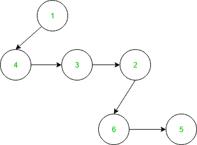
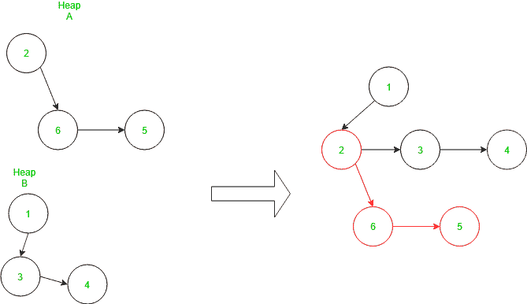
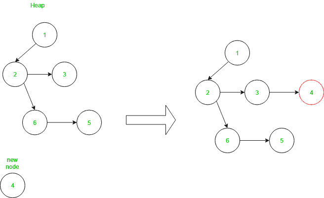
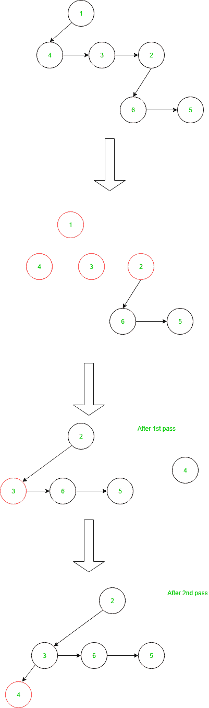

# 配对堆

> 原文:[https://www.geeksforgeeks.org/pairing-heap/](https://www.geeksforgeeks.org/pairing-heap/)

配对堆就像简化形式[斐波那契堆](https://www.geeksforgeeks.org/fibonacci-heap-set-1-introduction/)。它还维护[最小堆](https://www.geeksforgeeks.org/heap-data-structure/)的属性，即父节点值小于其子节点值。可以认为是一个自调整的二项式堆。
每个节点都有一个指向左子节点的指针，左子节点指向该子节点的下一个兄弟节点。
配对堆示例如下:



**在配对堆中加入或合并**
要加入两个堆，首先，我们比较堆的根节点如果第一个堆的根节点小于第二个堆的根节点，那么第二个堆的根节点成为第一个堆的根节点的左子节点，反之亦然。这个过程的时间复杂度为 O(1)。
合并示例如下:



**在配对堆中插入** :
要在堆中插入一个新节点，创建一个新节点，并如上所述将其与现有堆合并。因此，这个函数的时间复杂度为 O(1)。
插入示例如下:



**配对堆中的删除** :
配对堆中的删除只发生在根节点。首先删除根、左子和左子的所有兄弟之间的链接。然后合并通过**两遍法**分离左子和所有兄弟得到的树子树，删除根节点。一次从左到右合并分离的子树，然后从右到左合并子树，形成新的堆，而不违反最小堆的条件。这个过程需要 O(log n)个时间，其中 n 是节点数。
删除示例如下:



以下是上述方法的实现:

## CPP14

```
#include<bits/stdc++.h>
using namespace std;

// Heap structure
struct HeapNode {

    int key;
    HeapNode *leftChild;
    HeapNode *nextSibling;

    HeapNode():
        leftChild(NULL), nextSibling(NULL) {}

    // creates a new node
    HeapNode(int key_, HeapNode *leftChild_, HeapNode *nextSibling_):
        key(key_), leftChild(leftChild_), nextSibling(nextSibling_) {}

        // Adds a child and sibling to the node
    void addChild(HeapNode *node) {
        if(leftChild == NULL)
            leftChild = node;
        else {
            node->nextSibling = leftChild;
            leftChild = node;
        }
    }
};

// Returns true if root of the tree
// is null otherwise returns false
bool Empty(HeapNode *node) {
    return (node == NULL);
}

// Function to merge two heaps
HeapNode *Merge(HeapNode *A, HeapNode *B)
{
    // If any of the two-nodes is null
    // the return the not null node
    if(A == NULL) return B;
    if(B == NULL) return A;

    // To maintain the min heap condition compare   
    // the nodes and node with minimum value become 
    // parent of the other node
    if(A->key < B->key) {                 
        A->addChild(B);
        return A;        
    }
    else {
        B->addChild(A);
        return B;
    }

    return NULL; // Unreachable
}

// Returns the root value of the heap
int Top(HeapNode *node) {
    return node->key;
}

// Function to insert the new node in the heap
HeapNode *Insert(HeapNode *node, int key) {
    return Merge(node, new HeapNode(key, NULL, NULL));
}

// This method is used when we want to delete root node
HeapNode *TwoPassMerge(HeapNode *node) {
    if(node == NULL || node->nextSibling == NULL)
        return node;
    else {
        HeapNode *A, *B, *newNode;
        A = node;
        B = node->nextSibling;
        newNode = node->nextSibling->nextSibling;

        A->nextSibling = NULL;
        B->nextSibling = NULL;

        return Merge(Merge(A, B), TwoPassMerge(newNode));
    }

    return NULL; // Unreachable
}

// Function to delete the root node in heap
HeapNode *Delete(HeapNode *node) {
    return TwoPassMerge(node->leftChild);
}

struct PairingHeap {
    HeapNode *root;

    PairingHeap():
        root(NULL) {}

    bool Empty(void) {
        return ::Empty(root);
    }

    int Top(void) {
        return ::Top(root);
    }

    void Insert(int key) {
        root = ::Insert(root, key);
    }

    void Delete(void) {
        root = ::Delete(root);
    }

    void Join(PairingHeap other) {
        root = ::Merge(root, other.root);
    }

};

// Driver Code
int main(void) {

    PairingHeap heap1, heap2;
    heap2.Insert(5);
    heap2.Insert(2);

    heap2.Insert(6);
    heap1.Insert(1);
    heap1.Insert(3);
    heap1.Insert(4);

    heap1.Join(heap2);

    cout << heap1.Top() << endl;
    heap1.Delete();

    cout << heap1.Top() << endl;
    cout<< (heap1.Empty()?"True":"False");

    return 0;
}
```

## 蟒蛇 3

```
# Heap structure
class HeapNode:

    # creates a new node
    def __init__(self, key_=None, leftChild_=None, nextSibling_=None):
        self.key = key_
        self.leftChild = leftChild_
        self.nextSibling = nextSibling_

    # Adds a child and sibling to the node
    def addChild(self, node):
        if(self.leftChild == None):
            self.leftChild = node
        else:
            node.nextSibling = self.leftChild
            self.leftChild = node

# Returns true if root of the tree
# is None otherwise returns false

def Empty(node):
    return (node == None)

# Function to merge two heaps

def Merge(A, B):

    # If any of the two-nodes is None
    # the return the not None node
    if(A == None):
        return B
    if(B == None):
        return A

    # To maintain the min heap condition compare
    # the nodes and node with minimum value become
    # parent of the other node
    if(A.key < B.key):
        A.addChild(B)
        return A
    B.addChild(A)
    return B

# Returns the root value of the heap

def Top(node):
    return node.key

# Function to insert the new node in the heap
def Insert(node, key):
    return Merge(node, HeapNode(key,))

# This method is used when we want to delete root node
def TwoPassMerge(node):
    if(node == None or node.nextSibling == None):
        return node
    A = node
    B = node.nextSibling
    newNode = node.nextSibling.nextSibling

    A.nextSibling = None
    B.nextSibling = None

    return Merge(Merge(A, B), TwoPassMerge(newNode))

# Function to delete the root node in heap
def Delete(node):
    return TwoPassMerge(node.leftChild)

class PairingHeap:
    def __init__(self):
        self.root = None

    def Empty(self):
        return Empty(self.root)

    def Top(self):
        return Top(self.root)

    def Insert(self, key):
        self.root = Insert(self.root, key)

    def Delete(self):
        self.root = Delete(self.root)

    def Join(self, other):
        self.root = Merge(self.root, other.root)

# Driver Code
if __name__ == '__main__':

    heap1, heap2 = PairingHeap(), PairingHeap()
    heap2.Insert(5)
    heap2.Insert(2)

    heap2.Insert(6)
    heap1.Insert(1)
    heap1.Insert(3)
    heap1.Insert(4)

    heap1.Join(heap2)

    print(heap1.Top())
    heap1.Delete()

    print(heap1.Top())
    print(heap1.Empty())
# This code is contributed by Amartya Ghosh
```

**Output:** 

```
1
2
False
```

**时间复杂度:**
**插入:** O(1)
**合并:** O(1)
**删除:** O(logN)
**辅助空间** : O(1)。