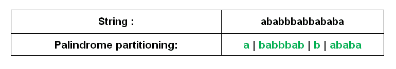

# 回文分区| DP-17

> 原文:[https://www . geesforgeks . org/回文-分区-dp-17/](https://www.geeksforgeeks.org/palindrome-partitioning-dp-17/)

给定一个字符串，如果该分区的每个子串都是回文，那么该字符串的分区就是一个*回文分区*。例如，“aba|b|bbabb|a|b|aba”是“ababbbabbababa”的回文分区。确定给定字符串的回文分区所需的最少切割。例如，“ababbbabbababa”至少需要 3 个切口。这三个切口是“a | babbbab | b |亚的斯亚贝巴”。如果一个字符串是回文，那么至少需要 0 个切割。如果长度为 n 的字符串包含所有不同的字符，则需要最小 n-1 个切割。



示例:

> 输入:str = "geek"
> 输出:2
> 我们需要进行最少 2 次切割，即“g ee k”
> 输入:str = "aaaa"
> 输出:0
> 字符串已经是回文了。
> 输入:str = "abcde"
> 输出:4
> 输入:str = "abbac"
> 输出:1

这个问题是[矩阵链乘法](https://www.geeksforgeeks.org/matrix-chain-multiplication-dp-8/)问题的变种。如果字符串是回文，那么我们只需返回 0。否则，像矩阵链乘法问题一样，我们尝试在所有可能的地方进行切割，递归计算每个切割的成本并返回最小值。
假设给定的字符串是 str，minPalPartion()是返回回文分区所需最少切割的函数。以下是最佳子结构特性。

**使用递归**

```
// i is the starting index and j is the ending index. i must be passed as 0 and j as n-1
minPalPartion(str, i, j) = 0 if i == j. // When string is of length 1.
minPalPartion(str, i, j) = 0 if str[i..j] is palindrome.

// If none of the above conditions is true, then minPalPartion(str, i, j) can be 
// calculated recursively using the following formula.
minPalPartion(str, i, j) = Min { minPalPartion(str, i, k) + 1 +
                                 minPalPartion(str, k+1, j) } 
                           where k varies from i to j-1
```

## C++

```
// C++ Code for Palindrome Partitioning
// Problem
#include <bits/stdc++.h>
using namespace std;

bool isPalindrome(string String, int i, int j)
{
    while(i < j)
    {
      if(String[i] != String[j])
        return false; 
      i++;
      j--;
    }
    return true;
}
int minPalPartion(string String, int i, int j)
{
    if( i >= j || isPalindrome(String, i, j) )
      return 0;
    int ans = INT_MAX, count;
    for(int k = i; k < j; k++)
    {
      count = minPalPartion(String, i, k) +
        minPalPartion(String, k + 1, j) + 1;

      ans = min(ans, count);
    }
    return ans;
}
// Driver code
int main() {
    string str = "ababbbabbababa";
    cout << "Min cuts needed for " <<
      "Palindrome Partitioning is " << 
      minPalPartion(str, 0, str.length() - 1) << endl;
    return 0;
}
// This code is contributed by rag2127
```

## Java 语言(一种计算机语言，尤用于创建网站)

```
// Java Code for Palindrome Partitioning
// Problem
public class GFG
{

  static boolean isPalindrome(String string, int i, int j)
  {
    while(i < j)
    {
      if(string.charAt(i) != string.charAt(j))
        return false; 
      i++;
      j--;
    }
    return true;
  }

  static int minPalPartion(String string, int i, int j)
  {   
    if( i >= j || isPalindrome(string, i, j) )
      return 0;
    int ans = Integer.MAX_VALUE, count;
    for(int k = i; k < j; k++)
    {
      count = minPalPartion(string, i, k) +
        minPalPartion(string, k + 1, j) + 1;

      ans = Math.min(ans, count);
    }
    return ans;
  }

  // Driver code
  public static void main(String args[])
  {
    String str = "ababbbabbababa";
    System.out.println("Min cuts needed for "
                       + "Palindrome Partitioning is " + minPalPartion(str, 0, str.length() - 1));
  }
}

// This code is contributed by adityapande88.
```

## 蟒蛇 3

```
# Python code for implementation of Naive Recursive
# approach
def isPalindrome(x):
    return x == x[::-1]

def minPalPartion(string, i, j):
    if i >= j or isPalindrome(string[i:j + 1]):
        return 0
    ans = float('inf')
    for k in range(i, j):
        count = (
            1 + minPalPartion(string, i, k)
            + minPalPartion(string, k + 1, j)
        )
        ans = min(ans, count)
    return ans

def main():
    string = "ababbbabbababa"
     print(
     "Min cuts needed for Palindrome Partitioning is ",
     minPalPartion(string, 0, len(string) - 1),
    )

if __name__ == "__main__":
    main()

# This code is contributed by itsvinayak
```

## C#

```
// C# Code for Palindrome Partitioning
// Problem
using System;
public class GFG
{

  static bool isPalindrome(string String, int i, int j)
  {
    while(i < j)
    {
      if(String[i] != String[j])
        return false; 
      i++;
      j--;
    }
    return true;
  }

  static int minPalPartion(string String, int i, int j)
  {   
    if( i >= j || isPalindrome(String, i, j) )
      return 0;
    int ans = Int32.MaxValue, count;
    for(int k = i; k < j; k++)
    {
      count = minPalPartion(String, i, k) +
        minPalPartion(String, k + 1, j) + 1;

      ans = Math.Min(ans, count);
    }
    return ans;
  }

  // Driver code
  static public void Main (){
    string str = "ababbbabbababa";
    Console.WriteLine("Min cuts needed for "+
                      "Palindrome Partitioning is " +
                      minPalPartion(str, 0, str.Length - 1));
  }
}

// This code is contributed by avanitrachhadiya2155
```

## java 描述语言

```
<script>

// Javascript code for Palindrome
// Partitioning Problem
function isPalindrome(String, i, j)
{
    while (i < j)
    {
        if (String[i] != String[j])
            return false;

        i++;
        j--;
    }
    return true;
}

function minPalPartion(String, i, j)
{
    if (i >= j || isPalindrome(String, i, j))
        return 0;

    let ans = Number.MAX_VALUE, count;

    for(let k = i; k < j; k++)
    {
        count = minPalPartion(String, i, k) +
        minPalPartion(String, k + 1, j) + 1;
        ans = Math.min(ans, count);
    }
    return ans;
}

// Driver code
let str = "ababbbabbababa";
document.write("Min cuts needed for " +
               "Palindrome Partitioning is " +
               minPalPartion(str, 0, str.length - 1));

// This code is contributed by suresh07

</script>
```

**输出:**

```
Min cuts needed for Palindrome Partitioning is 3 
```

**使用动态规划:**
以下是动态规划解。它将子问题的解存储在两个数组 P[][]和 C[][]中，并重用计算出的值。

## C++

```
// Dynamic Programming Solution for
// Palindrome Partitioning Problem
#include <bits/stdc++.h>
using namespace std;

// Returns the minimum number of cuts
// needed to partition a string
// such that every part is a palindrome
int minPalPartion(string str)
{
    // Get the length of the string
    int n = str.length();

    /* Create two arrays to build the solution
       in bottom up manner
    C[i][j] = Minimum number of cuts needed for
              palindrome partitioning
              of substring str[i..j]
    P[i][j] = true if substring str[i..j] is
              palindrome, else false
    Note that C[i][j] is 0 if P[i][j] is true */
    int C[n][n];
    bool P[n][n];

    // Every substring of length 1 is a palindrome
    for (int i = 0; i < n; i++) {
        P[i][i] = true;
        C[i][i] = 0;
    }

    /* L is substring length. Build the
    solution in bottom up manner by
    considering all substrings of
    length starting from 2 to n.
    The loop structure is same as Matrix
    Chain Multiplication problem
    ( See https:// www.geeksforgeeks.org/matrix-chain-multiplication-dp-8/ )*/
    for (int L = 2; L <= n; L++) {

        // For substring of length L, set
        // different possible starting indexes
        for (int i = 0; i < n - L + 1; i++) {
            int j = i + L - 1; // Set ending index

            // If L is 2, then we just need to
            // compare two characters. Else
            // need to check two corner characters
            // and value of P[i+1][j-1]
            if (L == 2)
                P[i][j] = (str[i] == str[j]);
            else
                P[i][j] = (str[i] == str[j]) && P[i + 1][j - 1];

            // IF str[i..j] is palindrome, then C[i][j] is 0
            if (P[i][j] == true)
                C[i][j] = 0;
            else {

                // Make a cut at every possible
                // location starting from i to j,
                // and get the minimum cost cut.
                C[i][j] = INT_MAX;
                for (int k = i; k <= j - 1; k++)
                    C[i][j] = min(C[i][j], C[i][k] + C[k + 1][j] + 1);
            }
        }
    }

    // Return the min cut value for
    // complete string. i.e., str[0..n-1]
    return C[0][n - 1];
}

// Driver code
int main()
{
    string str = "ababbbabbababa";
    cout << "Min cuts needed for Palindrome"
            " Partitioning is "
         << minPalPartion(str);
    return 0;
}

// This code is contributed by rathbhupendra
```

## C

```
// Dynamic Programming Solution for Palindrome Partitioning Problem
#include <limits.h>
#include <stdio.h>
#include <string.h>

// A utility function to get minimum of two integers
int min(int a, int b) { return (a < b) ? a : b; }

// Returns the minimum number of cuts needed to partition a string
// such that every part is a palindrome
int minPalPartion(char* str)
{
    // Get the length of the string
    int n = strlen(str);

    /* Create two arrays to build the solution in bottom up manner
       C[i][j] = Minimum number of cuts needed for palindrome partitioning
                 of substring str[i..j]
       P[i][j] = true if substring str[i..j] is palindrome, else false
       Note that C[i][j] is 0 if P[i][j] is true */
    int C[n][n];
    bool P[n][n];

    int i, j, k, L; // different looping variables

    // Every substring of length 1 is a palindrome
    for (i = 0; i < n; i++) {
        P[i][i] = true;
        C[i][i] = 0;
    }

    /* L is substring length. Build the solution in bottom up manner by
       considering all substrings of length starting from 2 to n.
       The loop structure is same as Matrix Chain Multiplication problem (
       See https:// www.geeksforgeeks.org/matrix-chain-multiplication-dp-8/ )*/
    for (L = 2; L <= n; L++) {
        // For substring of length L, set different possible starting indexes
        for (i = 0; i < n - L + 1; i++) {
            j = i + L - 1; // Set ending index

            // If L is 2, then we just need to compare two characters. Else
            // need to check two corner characters and value of P[i+1][j-1]
            if (L == 2)
                P[i][j] = (str[i] == str[j]);
            else
                P[i][j] = (str[i] == str[j]) && P[i + 1][j - 1];

            // IF str[i..j] is palindrome, then C[i][j] is 0
            if (P[i][j] == true)
                C[i][j] = 0;
            else {

                // Make a cut at every possible location starting from i to j,
                // and get the minimum cost cut.
                C[i][j] = INT_MAX;
                for (k = i; k <= j - 1; k++)
                    C[i][j] = min(C[i][j], C[i][k] + C[k + 1][j] + 1);
            }
        }
    }

    // Return the min cut value for complete string. i.e., str[0..n-1]
    return C[0][n - 1];
}

// Driver program to test above function
int main()
{
    char str[] = "ababbbabbababa";
    printf("Min cuts needed for Palindrome Partitioning is %d",
           minPalPartion(str));
    return 0;
}
```

## Java 语言(一种计算机语言，尤用于创建网站)

```
// Java Code for Palindrome Partitioning
// Problem
public class GFG {
    // Returns the minimum number of cuts needed
    // to partition a string such that every
    // part is a palindrome
    static int minPalPartion(String str)
    {
        // Get the length of the string
        int n = str.length();

        /* Create two arrays to build the solution
           in bottom up manner
           C[i][j] = Minimum number of cuts needed
                     for palindrome partitioning
                     of substring str[i..j]
           P[i][j] = true if substring str[i..j] is
                     palindrome, else false
           Note that C[i][j] is 0 if P[i][j] is
           true */
        int[][] C = new int[n][n];
        boolean[][] P = new boolean[n][n];

        int i, j, k, L; // different looping variables

        // Every substring of length 1 is a palindrome
        for (i = 0; i < n; i++) {
            P[i][i] = true;
            C[i][i] = 0;
        }

        /* L is substring length. Build the solution in
         bottom up manner by considering all substrings
         of length starting from 2 to n. The loop
         structure is same as Matrix Chain Multiplication
         problem (
        See https:// www.geeksforgeeks.org/matrix-chain-multiplication-dp-8/ )*/
        for (L = 2; L <= n; L++) {
            // For substring of length L, set different
            // possible starting indexes
            for (i = 0; i < n - L + 1; i++) {
                j = i + L - 1; // Set ending index

                // If L is 2, then we just need to
                // compare two characters. Else need to
                // check two corner characters and value
                // of P[i+1][j-1]
                if (L == 2)
                    P[i][j] = (str.charAt(i) == str.charAt(j));
                else
                    P[i][j] = (str.charAt(i) == str.charAt(j)) && P[i + 1][j - 1];

                // IF str[i..j] is palindrome, then
                // C[i][j] is 0
                if (P[i][j] == true)
                    C[i][j] = 0;
                else {
                    // Make a cut at every possible
                    // localtion starting from i to j,
                    // and get the minimum cost cut.
                    C[i][j] = Integer.MAX_VALUE;
                    for (k = i; k <= j - 1; k++)
                        C[i][j] = Integer.min(C[i][j],
                                              C[i][k] + C[k + 1][j] + 1);
                }
            }
        }

        // Return the min cut value for complete
        // string. i.e., str[0..n-1]
        return C[0][n - 1];
    }

    // Driver program to test above function
    public static void main(String args[])
    {
        String str = "ababbbabbababa";
        System.out.println("Min cuts needed for "
                           + "Palindrome Partitioning is " + minPalPartion(str));
    }
}
// This code is contributed by Sumit Ghosh
```

## 蟒蛇 3

```
# Dynamic Programming Solution for
# Palindrome Partitioning Problem

# Returns the minimum number of
# cuts needed to partition a string
# such that every part is a palindrome
def minPalPartion(str):

    # Get the length of the string
    n = len(str)

    # Create two arrays to build the
    # solution in bottom up manner
    # C[i][j] = Minimum number of cuts
    # needed for palindrome
    # partitioning of substring str[i..j]
    # P[i][j] = true if substring str[i..j]
    # is palindrome, else false. Note that
    # C[i][j] is 0 if P[i][j] is true
    C = [[0 for i in range(n)]
            for i in range(n)]
    P = [[False for i in range(n)]
                for i in range(n)]

    # different looping variables
    j = 0
    k = 0
    L = 0

    # Every substring of length
    # 1 is a palindrome
    for i in range(n):
        P[i][i] = True;
        C[i][i] = 0;

    # L is substring length. Build the
    # solution in bottom-up manner by
    # considering all substrings of
    # length starting from 2 to n.
    # The loop structure is the same as
    # Matrix Chain Multiplication problem 
    # (See https://www.geeksforgeeks.org / matrix-chain-multiplication-dp-8/ )
    for L in range(2, n + 1):

        # For substring of length L, set
        # different possible starting indexes
        for i in range(n - L + 1):
            j = i + L - 1 # Set ending index

            # If L is 2, then we just need to
            # compare two characters. Else
            # need to check two corner characters
            # and value of P[i + 1][j-1]
            if L == 2:
                P[i][j] = (str[i] == str[j])
            else:
                P[i][j] = ((str[i] == str[j]) and
                             P[i + 1][j - 1])

            # IF str[i..j] is palindrome,
            # then C[i][j] is 0
            if P[i][j] == True:
                C[i][j] = 0
            else:

                # Make a cut at every possible
                # location starting from i to j,
                # and get the minimum cost cut.
                C[i][j] = 100000000
                for k in range(i, j):
                    C[i][j] = min (C[i][j], C[i][k] +
                                   C[k + 1][j] + 1)

    # Return the min cut value for
    # complete string. i.e., str[0..n-1]
    return C[0][n - 1]

# Driver code
str = "ababbbabbababa"
print ('Min cuts needed for Palindrome Partitioning is',
                                     minPalPartion(str))

# This code is contributed
# by Sahil shelangia
```

## C#

```
// C# Code for Palindrome Partitioning
// Problem
using System;

class GFG {
    // Returns the minimum number of cuts needed
    // to partition a string such that every
    // part is a palindrome
    static int minPalPartion(String str)
    {
        // Get the length of the string
        int n = str.Length;

        /* Create two arrays to build the solution
        in bottom up manner
        C[i][j] = Minimum number of cuts needed
                    for palindrome partitioning
                    of substring str[i..j]
        P[i][j] = true if substring str[i..j] is
                    palindrome, else false
        Note that C[i][j] is 0 if P[i][j] is
        true */
        int[, ] C = new int[n, n];
        bool[, ] P = new bool[n, n];

        int i, j, k, L; // different looping variables

        // Every substring of length 1 is a palindrome
        for (i = 0; i < n; i++) {
            P[i, i] = true;
            C[i, i] = 0;
        }

        /* L is substring length. Build the solution in
        bottom up manner by considering all substrings
        of length starting from 2 to n. The loop
        structure is same as Matrix Chain Multiplication
        problem (
        See https:// www.geeksforgeeks.org/matrix-chain-multiplication-dp-8/ )*/
        for (L = 2; L <= n; L++) {
            // For substring of length L, set different
            // possible starting indexes
            for (i = 0; i < n - L + 1; i++) {
                j = i + L - 1; // Set ending index

                // If L is 2, then we just need to
                // compare two characters. Else need to
                // check two corner characters and value
                // of P[i+1][j-1]
                if (L == 2)
                    P[i, j] = (str[i] == str[j]);
                else
                    P[i, j] = (str[i] == str[j]) && P[i + 1, j - 1];

                // IF str[i..j] is palindrome, then
                // C[i][j] is 0
                if (P[i, j] == true)
                    C[i, j] = 0;
                else {
                    // Make a cut at every possible
                    // localtion starting from i to j,
                    // and get the minimum cost cut.
                    C[i, j] = int.MaxValue;
                    for (k = i; k <= j - 1; k++)
                        C[i, j] = Math.Min(C[i, j], C[i, k]
                                                        + C[k + 1, j] + 1);
                }
            }
        }

        // Return the min cut value for complete
        // string. i.e., str[0..n-1]
        return C[0, n - 1];
    }

    // Driver program
    public static void Main()
    {
        String str = "ababbbabbababa";
        Console.Write("Min cuts needed for "
                      + "Palindrome Partitioning is " + minPalPartion(str));
    }
}

// This code is contributed by Sam007
```

## 服务器端编程语言（Professional Hypertext Preprocessor 的缩写）

```
<?php
// Dynamic Programming Solution for Palindrome Partitioning Problem

// Returns the minimum number of cuts needed to partition a string
// such that every part is a palindrome
function minPalPartion($str)
{
    // Get the length of the string
    $n = strlen($str);

    /* Create two arrays to build the solution in bottom up manner
       C[i][j] = Minimum number of cuts needed for palindrome partitioning
                 of substring str[i..j]
       P[i][j] = true if substring str[i..j] is palindrome, else false
       Note that C[i][j] is 0 if P[i][j] is true */
    $C = array_fill(0, $n, array_fill(0, $n, NULL));
    $P = array_fill(false, $n, array_fill(false, $n, NULL));

    // Every substring of length 1 is a palindrome
    for ($i=0; $i<$n; $i++)
    {
        $P[$i][$i] = true;
        $C[$i][$i] = 0;
    }

    /* L is substring length. Build the solution in a bottom-up manner by
       considering all substrings of length starting from 2 to n.
       The loop structure is same as Matrix Chain Multiplication problem (
       See https://www.geeksforgeeks.org/matrix-chain-multiplication-dp-8/ )*/
    for ($L=2; $L<=$n; $L++)
    {
        // For substring of length L, set different possible starting indexes
        for ($i=0; $i<$n-$L+1; $i++)
        {
            $j = $i+$L-1; // Set ending index

            // If L is 2, then we just need to compare two characters. Else
            // need to check two corner characters and value of P[i+1][j-1]
            if ($L == 2)
                $P[$i][$j] = ($str[$i] == $str[$j]);
            else
                $P[$i][$j] = ($str[$i] == $str[$j]) && $P[$i+1][$j-1];

            // IF str[i..j] is palindrome, then C[i][j] is 0
            if ($P[$i][$j] == true)
                $C[$i][$j] = 0;
            else
            {
                // Make a cut at every possible location starting from i to j,
                // and get the minimum cost cut.
                $C[$i][$j] = PHP_INT_MAX;
                for ($k=$i; $k<=$j-1; $k++)
                    $C[$i][$j] = min ($C[$i][$j], $C[$i][$k] + $C[$k+1][$j]+1);
            }
        }
    }

    // Return the min cut value for complete string. i.e., str[0..n-1]
    return $C[0][$n-1];
}

// Driver program to test the above function

$str = "ababbbabbababa";
echo "Min cuts needed for Palindrome Partitioning is "
           .minPalPartion($str);
return 0;
?>
```

## java 描述语言

```
<script>
// javascript Code for Palindrome Partitioning
// Problem

    // Returns the minimum number of cuts needed
    // to partition a string such that every
    // part is a palindrome
    function minPalPartion( str)
    {

        // Get the length of the string
        var n = str.length;

        /*
         * Create two arrays to build the solution in bottom up manner C[i][j] = Minimum
         * number of cuts needed for palindrome partitioning of substring str[i..j]
         * P[i][j] = true if substring str[i..j] is palindrome, else false Note that
         * C[i][j] is 0 if P[i][j] is true
         */
        var C = Array(n).fill().map(()=>Array(n).fill(0));
        var P =  Array(n).fill().map(()=>Array(n).fill(false));

        var i, j, k, L; // different looping variables

        // Every substring of length 1 is a palindrome
        for (i = 0; i < n; i++) {
            P[i][i] = true;
            C[i][i] = 0;
        }

        /*
         * L is substring length. Build the solution in bottom up manner by considering
         * all substrings of length starting from 2 to n. The loop structure is same as
         * Matrix Chain Multiplication problem ( See https://
         * www.geeksforgeeks.org/matrix-chain-multiplication-dp-8/ )
         */
        for (L = 2; L <= n; L++) {
            // For substring of length L, set different
            // possible starting indexes
            for (i = 0; i < n - L + 1; i++) {
                j = i + L - 1; // Set ending index

                // If L is 2, then we just need to
                // compare two characters. Else need to
                // check two corner characters and value
                // of P[i+1][j-1]
                if (L == 2)
                    P[i][j] = (str.charAt(i) == str.charAt(j));
                else
                    P[i][j] = (str.charAt(i) == str.charAt(j)) && P[i + 1][j - 1];

                // IF str[i..j] is palindrome, then
                // C[i][j] is 0
                if (P[i][j] == true)
                    C[i][j] = 0;
                else {
                    // Make a cut at every possible
                    // localtion starting from i to j,
                    // and get the minimum cost cut.
                    C[i][j] = Number.MAX_VALUE;
                    for (k = i; k <= j - 1; k++)
                        C[i][j] = Math.min(C[i][j], C[i][k] + C[k + 1][j] + 1);
                }
            }
        }

        // Return the min cut value for complete
        // string. i.e., str[0..n-1]
        return C[0][n - 1];
    }

    // Driver program to test above function

        var str = "ababbbabbababa";
        document.write("Min cuts needed for " + "Palindrome Partitioning is " + minPalPartion(str));

// This code is contributed by Rajput-Ji
</script>
```

**输出:**

```
Min cuts needed for Palindrome Partitioning is 3 
```

**时间复杂度:** O(n <sup>3</sup>

我们可以进一步优化上面的代码。不用在 O(n^2 单独计算 C[i]，我们可以用 P[i]本身来做。下面是这个问题的高度优化代码:

## C++

```
#include <bits/stdc++.h>
using namespace std;

int minCut(string a)
{
    int cut[a.length()];
    bool palindrome[a.length()][a.length()];
    memset(palindrome, false, sizeof(palindrome));
    for (int i = 0; i < a.length(); i++)
    {
        int minCut = i;
        for (int j = 0; j <= i; j++)
        {
            if (a[i] == a[j] && (i - j < 2 || palindrome[j + 1][i - 1]))
            {
                palindrome[j][i] = true;
                minCut = min(minCut, j == 0 ? 0 : (cut[j - 1] + 1));
            }
        }
        cut[i] = minCut;
    }
    return cut[a.length() - 1];
}

// Driver code
int main()
{
    cout << minCut("aab") << endl;
    cout << minCut("aabababaxx") << endl;
    return 0;
}

// This code is contributed by divyesh072019.
```

## Java 语言(一种计算机语言，尤用于创建网站)

```
import java.io.*;

class GFG {

    public static int minCut(String a)
    {
        int[] cut = new int[a.length()];
        boolean[][] palindrome = new boolean[a.length()][a.length()];

        for (int i = 0; i < a.length(); i++) {
            int minCut = i;
            for (int j = 0; j <= i; j++) {
                if (a.charAt(i) == a.charAt(j) && (i - j < 2 || palindrome[j + 1][i - 1])) {
                    palindrome[j][i] = true;
                    minCut = Math.min(minCut, j == 0 ? 0 : (cut[j - 1] + 1));
                }
            }
            cut[i] = minCut;
        }

        return cut[a.length() - 1];
    }

    public static void main(String[] args)
    {
        System.out.println(minCut("aab"));
        System.out.println(minCut("aabababaxx"));
    }
}
```

## 蟒蛇 3

```
def minCut(a):

    cut = [0 for i in range(len(a))]
    palindrome = [[False for i in range(len(a))] for j in range(len(a))]
    for i in range(len(a)):
        minCut = i;
        for j in range(i + 1):
            if (a[i] == a[j] and (i - j < 2 or palindrome[j + 1][i - 1])):      
                palindrome[j][i] = True;
                minCut = min(minCut,0 if  j == 0 else (cut[j - 1] + 1));
        cut[i] = minCut;  
    return cut[len(a) - 1];

# Driver code
if __name__=='__main__':

    print(minCut("aab"))
    print(minCut("aabababaxx"))

    # This code is contributed by rutvik_56
```

## C#

```
using System;
using System.Collections.Generic;  
class GFG
{  
    static int minCut(string a)
    {
        int[] cut = new int[a.Length];
        bool[,] palindrome = new bool[a.Length, a.Length];  
        for (int i = 0; i < a.Length; i++)
        {
            int minCut = i;
            for (int j = 0; j <= i; j++)
            {
                if (a[i] == a[j] && (i - j < 2 ||
                                     palindrome[j + 1, i - 1]))
                {
                    palindrome[j, i] = true;
                    minCut = Math.Min(minCut, j == 0 ? 0 : (cut[j - 1] + 1));
                }
            }
            cut[i] = minCut;
        }
        return cut[a.Length - 1];
    }

  // Driver code       
  static void Main()
  {
    Console.WriteLine(minCut("aab"));
    Console.WriteLine(minCut("aabababaxx"));
  }
}

// This code is contributed by divyeshrabadiya07.
```

## java 描述语言

```
<script>

function minCut(a)
    {
        var cut = new Array(a.length);
        var palindrome = new Array(a.length);

        for (var i = 0; i < a.length; i++) {
            var minCut = i;
            for (var j = 0; j <= i; j++) {
                if (a.charAt(i) == a.charAt(j) && (i - j < 5 || palindrome[j + 1][i - 1])) {
                    palindrome[j,i] = true;
                    minCut = Math.min(minCut, j == 0 ? 0 : (cut[j - 1] + 1));
                }
            }
            cut[i] = minCut;
        }

        return cut[a.length - 1];
    }

        document.write(minCut("aab")+"<br>");
        document.write(minCut("aabababaxx"));

// This code is contributed by shivanisinghss2110
</script>
```

**对上述方法的优化**
在上述方法中，我们可以在找到所有回文子串的同时计算最小割。如果我们找到所有回文子串 1 <sup>st</sup> 然后我们计算最小割，时间复杂度会降低到 O(n <sup>2</sup> )。
感谢 [**Vivek**](https://www.geeksforgeeks.org/dynamic-programming-set-17-palindrome-partitioning/#comment-1459162424) 建议本次优化。

## C++

```
// Dynamic Programming Solution for Palindrome Partitioning Problem
#include <iostream>
#include <bits/stdc++.h>
#include <string.h>
using namespace std;

// A utility function to get minimum of two integers
int min(int a, int b) { return (a < b) ? a : b; }

// Returns the minimum number of cuts needed to partition a string
// such that every part is a palindrome
int minPalPartion(char* str)
{

    // Get the length of the string
    int n = strlen(str);

    /* Create two arrays to build the solution in bottom-up manner
       C[i] = Minimum number of cuts needed for a palindrome partitioning
                 of substring str[0..i]
       P[i][j] = true if substring str[i..j] is palindrome, else false
       Note that C[i] is 0 if P[0][i] is true */
    int C[n];
    bool P[n][n];

    int i, j, k, L; // different looping variables

    // Every substring of length 1 is a palindrome
    for (i = 0; i < n; i++) {
        P[i][i] = true;
    }

    /* L is substring length. Build the solution in bottom up manner by
       considering all substrings of length starting from 2 to n. */
    for (L = 2; L <= n; L++) {
        // For substring of length L, set different possible starting indexes
        for (i = 0; i < n - L + 1; i++) {
            j = i + L - 1; // Set ending index

            // If L is 2, then we just need to compare two characters. Else
            // need to check two corner characters and value of P[i+1][j-1]
            if (L == 2)
                P[i][j] = (str[i] == str[j]);
            else
                P[i][j] = (str[i] == str[j]) && P[i + 1][j - 1];
        }
    }

    for (i = 0; i < n; i++) {
        if (P[0][i] == true)
            C[i] = 0;
        else {
            C[i] = INT_MAX;
            for (j = 0; j < i; j++) {
                if (P[j + 1][i] == true && 1 + C[j] < C[i])
                    C[i] = 1 + C[j];
            }
        }
    }

    // Return the min cut value for complete string. i.e., str[0..n-1]
    return C[n - 1];
}

// Driver program to test above function
int main()
{
    char str[] = "ababbbabbababa";
    cout <<"Min cuts needed for Palindrome Partitioning is " << minPalPartion(str);
    return 0;
}

// This code is contributed by shivanisinghss2110
```

## C

```
// Dynamic Programming Solution for Palindrome Partitioning Problem
#include <limits.h>
#include <stdio.h>
#include <stdbool.h>
#include <string.h>

// A utility function to get minimum of two integers
int min(int a, int b) { return (a < b) ? a : b; }

// Returns the minimum number of cuts needed to partition a string
// such that every part is a palindrome
int minPalPartion(char* str)
{
    // Get the length of the string
    int n = strlen(str);

    /* Create two arrays to build the solution in bottom-up manner
       C[i] = Minimum number of cuts needed for a palindrome partitioning
                 of substring str[0..i]
       P[i][j] = true if substring str[i..j] is palindrome, else false
       Note that C[i] is 0 if P[0][i] is true */
    int C[n];
    bool P[n][n];

    int i, j, k, L; // different looping variables

    // Every substring of length 1 is a palindrome
    for (i = 0; i < n; i++) {
        P[i][i] = true;
    }

    /* L is substring length. Build the solution in bottom up manner by
       considering all substrings of length starting from 2 to n. */
    for (L = 2; L <= n; L++) {
        // For substring of length L, set different possible starting indexes
        for (i = 0; i < n - L + 1; i++) {
            j = i + L - 1; // Set ending index

            // If L is 2, then we just need to compare two characters. Else
            // need to check two corner characters and value of P[i+1][j-1]
            if (L == 2)
                P[i][j] = (str[i] == str[j]);
            else
                P[i][j] = (str[i] == str[j]) && P[i + 1][j - 1];
        }
    }

    for (i = 0; i < n; i++) {
        if (P[0][i] == true)
            C[i] = 0;
        else {
            C[i] = INT_MAX;
            for (j = 0; j < i; j++) {
                if (P[j + 1][i] == true && 1 + C[j] < C[i])
                    C[i] = 1 + C[j];
            }
        }
    }

    // Return the min cut value for complete string. i.e., str[0..n-1]
    return C[n - 1];
}

// Driver program to test above function
int main()
{
    char str[] = "ababbbabbababa";
    printf("Min cuts needed for Palindrome Partitioning is %d",
           minPalPartion(str));
    return 0;
}
```

## Java 语言(一种计算机语言，尤用于创建网站)

```
// Java Code for Palindrome Partitioning
// Problem
public class GFG {
    // Returns the minimum number of cuts needed
    // to partition a string such that every part
    // is a palindrome
    static int minPalPartion(String str)
    {
        // Get the length of the string
        int n = str.length();

        /* Create two arrays to build the solution
        in bottom up manner
           C[i] = Minimum number of cuts needed for
           palindrome partitioning of substring
           str[0..i]
           P[i][j] = true if substring str[i..j] is
           palindrome, else false
           Note that C[i] is 0 if P[0][i] is true */
        int[] C = new int[n];
        boolean[][] P = new boolean[n][n];

        int i, j, k, L; // different looping variables

        // Every substring of length 1 is a palindrome
        for (i = 0; i < n; i++) {
            P[i][i] = true;
        }

        /* L is substring length. Build the solution
        in bottom up manner by considering all substrings
        of length starting from 2 to n. */
        for (L = 2; L <= n; L++) {
            // For substring of length L, set different
            // possible starting indexes
            for (i = 0; i < n - L + 1; i++) {
                j = i + L - 1; // Set ending index

                // If L is 2, then we just need to
                // compare two characters. Else need to
                // check two corner characters and value
                // of P[i+1][j-1]
                if (L == 2)
                    P[i][j] = (str.charAt(i) == str.charAt(j));
                else
                    P[i][j] = (str.charAt(i) == str.charAt(j)) && P[i + 1][j - 1];
            }
        }

        for (i = 0; i < n; i++) {
            if (P[0][i] == true)
                C[i] = 0;
            else {
                C[i] = Integer.MAX_VALUE;
                for (j = 0; j < i; j++) {
                    if (P[j + 1][i] == true && 1 + C[j] < C[i])
                        C[i] = 1 + C[j];
                }
            }
        }

        // Return the min cut value for complete
        // string. i.e., str[0..n-1]
        return C[n - 1];
    }

    // Driver program to test above function
    public static void main(String args[])
    {
        String str = "ababbbabbababa";
        System.out.println("Min cuts needed for "
                           + "Palindrome Partitioning"
                           + " is " + minPalPartion(str));
    }
}
// This code is contributed by Sumit Ghosh
```

## 蟒蛇 3

```
# Dynamic Programming Solution for
# Palindrome Partitioning Problem
import sys

# Returns the minimum number of cuts
# needed to partition a string such
# that every part is a palindrome
def minPalPartion(str1):

    # Get the length of the string
    n = len(str1);

    # Create two arrays to build the solution
    # in bottom up manner
    # C[i] = Minimum number of cuts needed
    # for palindrome partitioning of
    # substring str[0..i]
    # P[i][j] = true if substring str[i..j]
    # is palindrome, else false
    # Note that C[i] is 0 if P[0][i] is true
    C = [0]*(n + 1);
    P = [[False for x in range(n + 1)] for y in range(n + 1)];

    # Every substring of length 1 is
    # a palindrome
    for i in range(n):
        P[i][i] = True;

    # L is substring length. Build the solution
    # in bottom up manner by considering all
    # substrings of length starting from 2 to n.
    for L in range(2, n + 1):

        # For substring of length L, set
        # different possible starting indexes
        for i in range(n - L + 1):
            j = i + L - 1;

            # Set ending index
            # If L is 2, then we just need to
            # compare two characters. Else need
            # to check two corner characters and
            # value of P[i + 1][j-1]
            if (L == 2):
                P[i][j] = (str1[i] == str1[j]);
            else:
                P[i][j] = ((str1[i] == str1[j]) and P[i + 1][j - 1]);
    for i in range(n):
        if (P[0][i] == True):
            C[i] = 0;
        else:
            C[i] = sys.maxsize;
            for j in range(i):
                if(P[j + 1][i] == True and 1 + C[j] < C[i]):
                    C[i] = 1 + C[j];

    # Return the min cut value for complete
    # string. i.e., str[0..n-1]
    return C[n - 1];

# Driver Code
str1 = "ababbbabbababa";
print("Min cuts needed for Palindrome Partitioning is", minPalPartion(str1));

# This code is contributed by mits
```

## C#

```
// C# Code for Palindrome Partitioning
// Problem
using System;

class GFG {

    // Returns the minimum number of cuts needed
    // to partition a string such that every part
    // is a palindrome
    static int minPalPartion(String str)
    {
        // Get the length of the string
        int n = str.Length;

        /* Create two arrays to build the solution
        in bottom up manner
        C[i] = Minimum number of cuts needed for
        palindrome partitioning of substring
        str[0..i]
        P[i][j] = true if substring str[i..j] is
        palindrome, else false
        Note that C[i] is 0 if P[0][i] is true */
        int[] C = new int[n];
        bool[, ] P = new bool[n, n];

        int i, j, L; // different looping variables

        // Every substring of length 1 is a palindrome
        for (i = 0; i < n; i++) {
            P[i, i] = true;
        }

        /* L is substring length. Build the solution
        in bottom up manner by considering all substrings
        of length starting from 2 to n. */
        for (L = 2; L <= n; L++) {
            // For substring of length L, set different
            // possible starting indexes
            for (i = 0; i < n - L + 1; i++) {
                j = i + L - 1; // Set ending index

                // If L is 2, then we just need to
                // compare two characters. Else need to
                // check two corner characters and value
                // of P[i+1][j-1]
                if (L == 2)
                    P[i, j] = (str[i] == str[j]);
                else
                    P[i, j] = (str[i] == str[j]) && P[i + 1, j - 1];
            }
        }

        for (i = 0; i < n; i++) {
            if (P[0, i] == true)
                C[i] = 0;
            else {
                C[i] = int.MaxValue;
                for (j = 0; j < i; j++) {
                    if (P[j + 1, i] == true && 1 + C[j] < C[i])
                        C[i] = 1 + C[j];
                }
            }
        }

        // Return the min cut value for complete
        // string. i.e., str[0..n-1]
        return C[n - 1];
    }

    // Driver program
    public static void Main()
    {
        String str = "ababbbabbababa";
        Console.Write("Min cuts needed for "
                      + "Palindrome Partitioning"
                      + " is " + minPalPartion(str));
    }
}

// This code is contributed by Sam007
```

## 服务器端编程语言（Professional Hypertext Preprocessor 的缩写）

```
<?php
// Dynamic Programming Solution for
// Palindrome Partitioning Problem

// Returns the minimum number of cuts
// needed to partition a string such
// that every part is a palindrome
function minPalPartion(&$str)
{

    // Get the length of the string
    $n = strlen($str);

    /* Create two arrays to build the solution
    in bottom up manner
    C[i] = Minimum number of cuts needed
           for palindrome partitioning of
           substring str[0..i]
    P[i][j] = true if substring str[i..j]
    is palindrome, else false
    Note that C[i] is 0 if P[0][i] is true */
    $C = array_fill(0, $n, 0);
    $p = array_fill(0, 10, array_fill(0, 10, 0));

    // Every substring of length 1 is
    // a palindrome
    for ($i = 0; $i < $n; $i++)
    {
        $P[$i][$i] = true;
    }

    /* L is substring length. Build the solution
    in bottom up manner by considering all
    substrings of length starting from 2 to n. */
    for ($L = 2; $L <= $n; $L++)
    {
        // For substring of length L, set
        // different possible starting indexes
        for ($i = 0; $i < $n - $L + 1; $i++)
        {
            $j = $i + $L - 1; // Set ending index

            // If L is 2, then we just need to
            // compare two characters. Else need
            // to check two corner characters and
            // value of P[i+1][j-1]
            if ($L == 2)
                $P[$i][$j] = ($str[$i] == $str[$j]);
            else
                $P[$i][$j] = ($str[$i] == $str[$j]) &&
                              $P[$i + 1][$j - 1];
        }
    }

    for ($i = 0; $i < $n; $i++)
    {
        if ($P[0][$i] == true)
            $C[$i] = 0;
        else
        {
            $C[$i] = PHP_INT_MAX;
            for($j = 0; $j < $i; $j++)
            {
                if($P[$j + 1][$i] == true &&
                       1 + $C[$j] < $C[$i])
                    $C[$i] = 1 + $C[$j];
            }
        }
    }

    // Return the min cut value for complete
    // string. i.e., str[0..n-1]
    return $C[$n - 1];
}

// Driver Code
$str = "ababbbabbababa";
echo "Min cuts needed for Palindrome " .
     "Partitioning is " . minPalPartion($str);

// This code is contributed by rathbhupendra
?>
```

## java 描述语言

```
<script>
// javascript Code for Palindrome Partitioning
// Problem

    // Returns the minimum number of cuts needed
    // to partition a string such that every part
    // is a palindrome
    function minPalPartion(str)
    {

        // Get the length of the string
        var n = str.length;

        /*
         * Create two arrays to build the solution in bottom up manner C[i] = Minimum
         * number of cuts needed for palindrome partitioning of substring str[0..i]
         * P[i][j] = true if substring str[i..j] is palindrome, else false Note that
         * C[i] is 0 if P[0][i] is true
         */
        var C = Array(n).fill(0);
        var P = Array(n).fill().map(()=>Array(n).fill(false));

        var i, j, k, L; // different looping variables

        // Every substring of length 1 is a palindrome
        for (i = 0; i < n; i++) {
            P[i][i] = true;
        }

        /*
         * L is substring length. Build the solution in bottom up manner by considering
         * all substrings of length starting from 2 to n.
         */
        for (L = 2; L <= n; L++)
        {

            // For substring of length L, set different
            // possible starting indexes
            for (i = 0; i < n - L + 1; i++) {
                j = i + L - 1; // Set ending index

                // If L is 2, then we just need to
                // compare two characters. Else need to
                // check two corner characters and value
                // of P[i+1][j-1]
                if (L == 2)
                    P[i][j] = (str.charAt(i) == str.charAt(j));
                else
                    P[i][j] = (str.charAt(i) == str.charAt(j)) && P[i + 1][j - 1];
            }
        }

        for (i = 0; i < n; i++) {
            if (P[0][i] == true)
                C[i] = 0;
            else {
                C[i] = Number.MAX_VALUE;
                for (j = 0; j < i; j++) {
                    if (P[j + 1][i] == true && 1 + C[j] < C[i])
                        C[i] = 1 + C[j];
                }
            }
        }

        // Return the min cut value for complete
        // string. i.e., str[0..n-1]
        return C[n - 1];
    }

    // Driver program to test above function
    var str = "ababbbabbababa";
    document.write("Min cuts needed for " + "Palindrome Partitioning" + " is " + minPalPartion(str));

// This code is contributed by gauravrajput1
</script>
```

**输出:**

```
Min cuts needed for Palindrome Partitioning is 3 
```

**时间复杂度:** O(n <sup>2</sup>

**用死记硬背解决这个问题。**
基本思想是缓存递归函数中计算的间歇结果。我们可以将这些结果放入一个 hashmap/无序 _map 中。
为了计算 Hashmap 的键，我们将使用字符串的开始和结束索引作为键，即[“start _ index”。append("end_index")]将是 Hashmap 的键。

下面是上述方法的实现:

## C++

```
// Using memoizatoin to solve the partition problem.
#include <bits/stdc++.h>
using namespace std;
// Function to check if input string is palindrome or not
bool is palindrome(string input, int start, int end)
{
    // Using two pointer technique to check palindrome
    while (start < end) {
        if (input[start] != input[end])
            return false;
        start++;
        end--;
    }
    return true;
}

// Function to find keys for the Hashmap
string convert(int a, int b)
{
    return to_string(a) + "" + to_string(b);
}

// Returns the minimum number of cuts needed to partition a string
// such that every part is a palindrome
int minpalparti_memo(string input, int i, int j, unordered_map<string, int>& memo)
{
    if (i > j)
        return 0;
    // Key for the Input String
    string ij = convert(i, j);

    // If the no of partitions for string "ij" is already calculated
    // then return the calculated value using the Hashmap
    if (memo.find(ij) != memo.end()) {
        return memo[ij];
    }
    // Every String of length 1 is a palindrome
    if (i == j) {
        memo[ij] = 0;
        return 0;
    }
    if (ispalindrome(input, i, j)) {
        memo[ij] = 0;
        return 0;
    }
    int minimum = INT_MAX;
    // Make a cut at every possible location starting from i to j
    for (int k = i; k < j; k++) {
        int left_min = INT_MAX;
        int right_min = INT_MAX;
        string left = convert(i, k);
        string right = convert(k + 1, j);

        // If left cut is found already
        if (memo.find(left) != memo.end()) {
            left_min = memo[left];
        }
        // If right cut is found already
        if (memo.find(right) != memo.end()) {
            right_min = memo[right];
        }

        // Recursively calculating for left and right strings
        if (left_min == INT_MAX)
            left_min = minpalparti_memo(input, i, k, memo);
        if (right_min == INT_MAX)
            right_min = minpalparti_memo(input, k + 1, j, memo);

        // Taking minimum of all k possible cuts
        minimum = min(minimum, left_min + 1 + right_min);
    }

    memo[ij] = minimum;
    // Return the min cut value for complete string.
    return memo[ij];
}
int main()
{
    string input = "ababbbabbababa";
    unordered_map<string, int> memo;
    cout << minpalparti_memo(input, 0, input.length() - 1, memo) << endl;
    return 0;
}
```

## 蟒蛇 3

```
# Using memoizatoin to solve the partition problem.

# Function to check if input string is pallindrome or not
def ispallindrome(input, start, end):

    # Using two pointer technique to check pallindrome
    while (start < end):
        if (input[start] != input[end]):
            return False;
        start += 1
        end -= 1
    return True;

# Function to find keys for the Hashmap
def convert(a, b):
    return str(a) + str(b);

# Returns the minimum number of cuts needed to partition a string
# such that every part is a palindrome
def minpalparti_memo(input, i, j, memo):

    if (i > j):
        return 0;

    # Key for the Input String
    ij = convert(i, j);

    # If the no of partitions for string "ij" is already calculated
    # then return the calculated value using the Hashmap
    if (ij in memo):
        return memo[ij];

    # Every String of length 1 is a pallindrome
    if (i == j):
        memo[ij] = 0;
        return 0;
    if (ispallindrome(input, i, j)):
        memo[ij] = 0;
        return 0;  
    minimum = 1000000000

    # Make a cut at every possible location starting from i to j
    for k in range(i, j):
        left_min = 1000000000
        right_min = 1000000000
        left = convert(i, k);
        right = convert(k + 1, j);

        # If left cut is found already
        if (left in memo):
            left_min = memo[left];

        # If right cut is found already
        if (right in memo):
            right_min = memo[right];

        # Recursively calculating for left and right strings
        if (left_min == 1000000000):
            left_min = minpalparti_memo(input, i, k, memo);
        if (right_min == 1000000000):
            right_min = minpalparti_memo(input, k + 1, j, memo);

        # Taking minimum of all k possible cuts
        minimum = min(minimum, left_min + 1 + right_min);
    memo[ij] = minimum;

    # Return the min cut value for complete string.
    return memo[ij];

  # Driver code
if __name__=='__main__':

    input = "ababbbabbababa";
    memo = dict()
    print(minpalparti_memo(input, 0, len(input) - 1, memo))

# This code is contributed by Pratham76.
```

**时间复杂度:** O(n <sup>2</sup> )