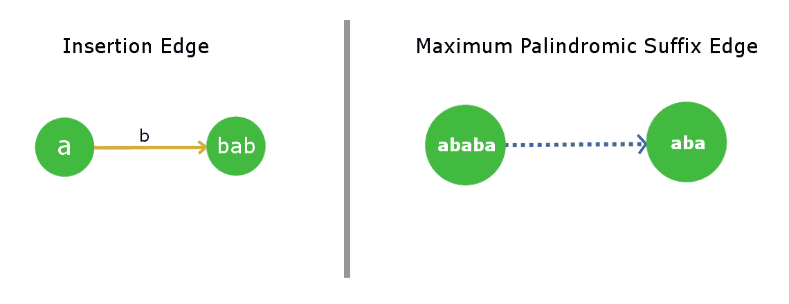
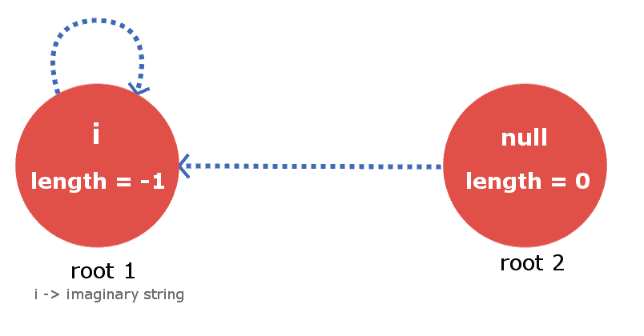
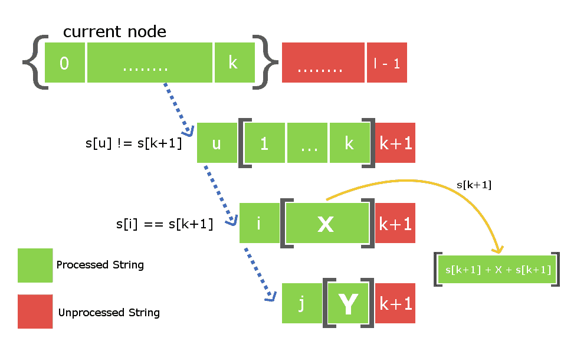
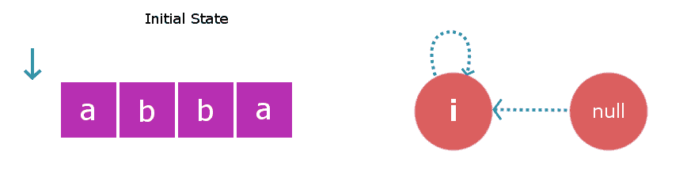
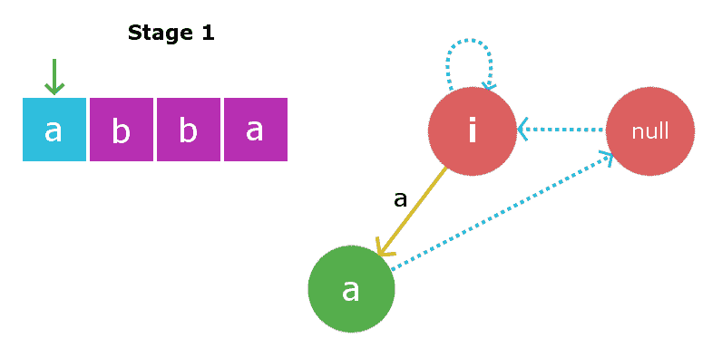
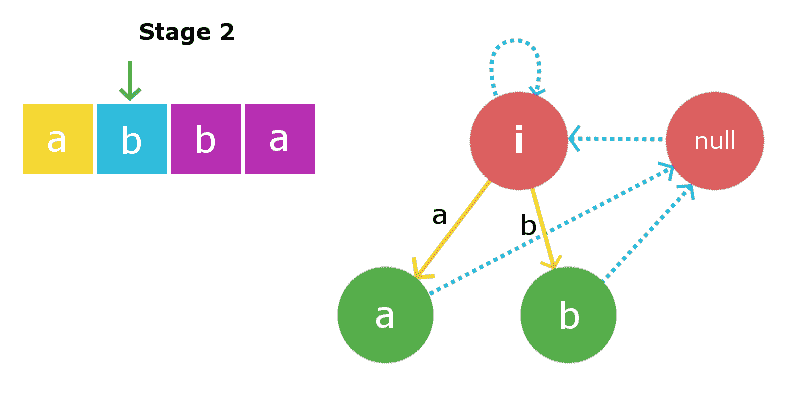
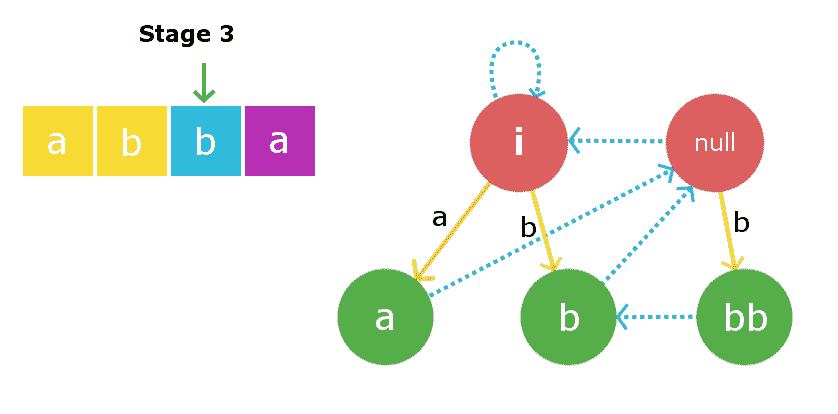
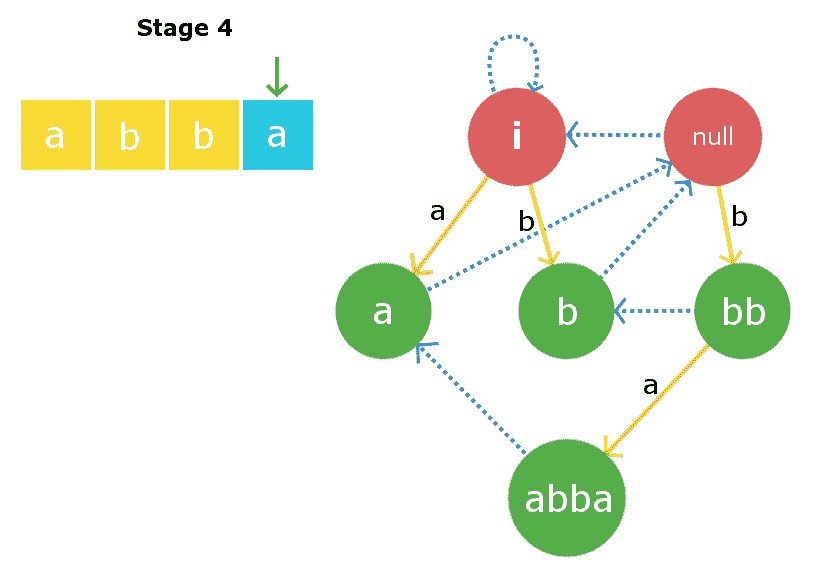

# 回文树|简介&实现

> 原文:[https://www . geeksforgeeks . org/回文-树-简介-实现/](https://www.geeksforgeeks.org/palindromic-tree-introduction-implementation/)

我们遇到了各种各样的问题，如字符串中回文的最大长度、回文子串的数量以及回文子串上许多更有趣的问题。这些回文子串问题大多有一些 DP O(n <sup>2</sup> )解(n 是给定串的长度)或者我们有一个复杂的算法像 [Manacher 的算法](https://www.geeksforgeeks.org/manachers-algorithm-linear-time-longest-palindromic-substring-part-4/)在线性时间内解决回文问题。

在本文中，我们将研究一个有趣的数据结构，它将以更简单的方式解决所有上述类似的问题。这种数据结构是由**米哈伊尔·鲁宾奇克**发明的。

```
Features of Palindromic Tree : Online query and updation
                               Easy to implement                               
                               Very Fast
```

**回文树的结构**

回文树的实际结构是**接近有向图**。它实际上是两个共享一些公共节点的树的合并结构(为了更好地理解，请参见下图)。树节点通过存储它们的索引来存储给定字符串的回文子串。
此树由两种类型的边组成:
1)插入边(加权边)
2)最大回文后缀(未加权)

**插入边:**
从节点 **u** 到 **v** 的插入边加上一些权重 **x** 意味着节点 v 是通过在 u 处的字符串的前端和末端插入 x 而形成的。由于 u 已经是回文，因此在节点 v 处得到的字符串也将是回文。
**x** 将是每个边的单个字符。因此，一个节点最多可以有 26 条插入边(考虑小写字母字符串)。在我们的绘画作品中，我们将使用<font color="Orange">橙色</font>作为边缘。

**最大回文后缀边:**
顾名思义，对于一个节点，这条边将指向它的最大回文后缀字符串节点。我们不会将整个字符串本身视为最大回文后缀，因为这没有意义(自循环)。为了简单起见，我们将它称为后缀边(除了完整的字符串之外，我们指的是最大后缀)。很明显，每个节点只有 1 个后缀边，因为我们不会在树中存储重复的字符串。我们将使用<font color="Blue">蓝色虚线边缘</font>作为其图示。

[](https://media.geeksforgeeks.org/wp-content/uploads/17380071_1339816332769500_1143056574_o.png)

**根节点及其约定:**
该树/图数据结构将包含 **2 个根虚拟节点**。更确切地说，把它看作是两棵树的根，这两棵树是连在一起的。
*Root-1* 将是一个伪节点，它将描述一个用于*长度= -1* 的字符串(从实现的角度，您可以很容易地推断出我们为什么这样使用)。*根-2* 将是一个节点，它将描述一个长度= 0*的空字符串*。

根-1 有一个连接到自身的后缀边(自循环)。至于长度为-1 的任何虚数字符串，其最大回文后缀也将是虚数，因此这是合理的。现在，根-2 的后缀边也将连接到根-1。对于空字符串(长度为 0)，不存在长度小于 0 的真正回文后缀字符串。

[](https://media.geeksforgeeks.org/wp-content/uploads/17439531_1339816346102832_1608791293_n.png)

**建立回文树**

为了构建回文树，我们将简单地一个接一个地插入字符串中的字符，直到我们到达它的末尾，当我们完成插入时，我们将与回文树在一起，它将包含给定字符串的所有不同的回文子字符串。我们需要确保的是，在每次插入新字符时，我们的回文树都保持上述特征。让我们看看如何完成它。

假设给我们一个长度为 **l** 的字符串 **s** ，我们将该字符串插入到索引 **k** (k < l-1)中。现在，我们需要插入 **(k+1)第**个字符。插入第(k+1)个字符意味着插入以索引(k+1)结束的最长回文节点。所以，最长的回文串将是(**的[k+1]'+“X”+' s[k+1]'**)形式，X 本身就是回文。现在的事实是，字符串 X 位于索引< k+1，是回文。因此，它将已经存在于我们的回文树中，因为我们保持了它的基本属性，即它将包含所有不同的回文子串。

因此，要插入字符 **s[k+1]** ，我们只需要在我们的树中找到字符串 X，并将插入边缘从权重为 s[k+1]的 X 指向一个新节点，该节点包含 **s[k+1]+X+s[k+1]** 。现在的主要工作是在有效时间内找到字符串 X。我们知道，我们正在存储所有节点的后缀链接。因此，要跟踪带有字符串 X 的节点，我们只需要向下移动当前节点的后缀链接，即包含插入 s[k]的节点。为了更好的理解，请看下图。

下图中的当前节点告诉我们，在处理完从 0 到 k 的所有索引后，在索引 k 处结束的是最大的回文，蓝色虚线路径是从当前节点到树中其他已处理节点的后缀边的链接。字符串 X 将存在于这些位于后缀链接链上的节点之一中。我们所需要的是通过在链中迭代来找到它。

为了找到包含字符串 X 的所需节点，我们将在后缀链接链中的每个节点的末尾放置第 k+1 个字符，并检查相应后缀链接字符串的第一个字符是否等于第 k+1 个字符。

一旦我们找到 X 字符串，我们将引导一个权重为 s[k+1]的插入边，并将其链接到包含以索引 k+1 结束的最大回文的新节点。下图中括号之间的数组元素是存储在树中的节点。

[](https://media.geeksforgeeks.org/wp-content/uploads/17431829_1341904152560718_575533818_o.png)

还有一件事要做。由于我们已经在这个 s[k+1]插入处创建了一个新节点，因此我们还必须用它的后缀 link child 连接它。同样，为了做到这一点，我们将使用上面从节点 X 向下的后缀链接迭代来找到一些新的字符串 **Y** ，使得 **s[k+1] + Y + s[k+1]** 是新创建的节点的最大回文后缀。一旦找到它，我们将把新创建的节点的后缀链接与节点 y 连接起来。

**注**:找到字符串 x 有两种可能，第一种可能是字符串 **s[k+1]Xs[k+1]** 不存在于树中，第二种可能是如果已经存在于树中。在第一种情况下，我们将以同样的方式进行，但在第二种情况下，我们不会单独创建一个新节点，而是将插入边从 X 链接到树中已经存在的 **S[k+1]+X+S[k+1]** 节点。我们也不需要添加后缀链接，因为节点将已经包含它的后缀链接。

考虑一根长度为 4*的绳子。*

在初始状态，我们将有两个伪根节点，一个长度为-1(一些假想的字符串 **i** )，第二个长度为 0 的**空**字符串。此时，我们还没有在树中插入任何字符。根 1，即长度为-1 的根节点将是进行插入的当前节点。

[](https://media.geeksforgeeks.org/wp-content/uploads/17467920_1341903835894083_903983119_n.png)

第一阶段:我们将插入**s【0】**，即“ **a** ”。我们将从当前节点即根 1 开始检查。在长度为-1 的字符串的开头和结尾插入“a”将产生长度为 1 的字符串，该字符串将是“a”。因此，我们创建了一个新节点“a”，并将插入边从 root1 直接指向这个新节点。现在，长度为 1 的字符串的最大回文后缀字符串将是空字符串，因此它的后缀链接将指向根 2，即空字符串。现在当前节点将是这个新节点“a”。

[](https://media.geeksforgeeks.org/wp-content/uploads/17439827_1341903842560749_390303617_n.png)

第二阶段:我们将插入**s【1】**，即“ **b** ”。插入过程将从当前节点开始，即“a”节点。我们将从当前节点开始遍历后缀链接链，直到找到合适的 X 字符串，因此在遍历后缀链接时，我们再次发现 root1 是 X 字符串。再次将“b”插入长度为-1 的字符串将产生长度为 1 的字符串，即字符串“b”。该节点的后缀链接将变为空字符串，如上文插入中所述。现在当前节点将是这个新节点“b”。

[](https://media.geeksforgeeks.org/wp-content/uploads/17410351_1341903849227415_701414514_n.png)

第三阶段:我们将插入**s【2】**即“ **b** ”。再次从当前节点开始，我们将遍历它的后缀链接，找到所需的 X 字符串。在这种情况下，它被发现是根 2，即空字符串，因为在空字符串的前面和末尾添加“b”会产生长度为 2 的回文“bb”。因此，我们将创建一个新节点“ **bb** ”，并将插入边缘从空字符串指向新创建的字符串。现在，这个当前节点的最大后缀回文将是节点“b”。因此，我们将把后缀边从这个新创建的节点链接到节点“b”。当前节点现在变成节点“bb”。

[](https://media.geeksforgeeks.org/wp-content/uploads/17474730_1341903845894082_542267262_n.png)

第四阶段:我们将插入**s【3】**，即“ **a** ”。插入过程从当前节点开始，在这种情况下，当前节点本身是最大的 X 字符串，因此 **s[0] + X + s[3]** 是回文。因此，我们将创建一个新节点“ **abba** ”，并将当前节点“bb”的插入边链接到这个新创建的边权重为“a”的节点。现在，这个新创建的节点链接的后缀将链接到节点“a”，因为这是最大的回文后缀。

[](https://media.geeksforgeeks.org/wp-content/uploads/17393153_1341903855894081_1019464410_n.png)

**上述实现的 C++实现如下:**

```
// C++ program to demonstrate working of
// palindromic tree
#include "bits/stdc++.h"
using namespace std;

#define MAXN  1000

struct Node
{
    // store start and end indexes of current
    // Node inclusively
    int start, end;

    // stores length of substring
    int length;

    // stores insertion Node for all characters a-z
    int insertEdg[26];

    // stores the Maximum Palindromic Suffix Node for
    // the current Node
    int suffixEdg;
};

// two special dummy Nodes as explained above
Node root1, root2;

// stores Node information for constant time access
Node tree[MAXN];

// Keeps track the current Node while insertion
int currNode;
string s;
int ptr;

void insert(int idx)
{
//STEP 1//

    /* search for Node X such that s[idx] X S[idx]
       is maximum palindrome ending at position idx
       iterate down the suffix link of currNode to
       find X */
    int tmp = currNode;
    while (true)
    {
        int curLength = tree[tmp].length;
        if (idx - curLength >= 1 and s[idx] == s[idx-curLength-1])
            break;
        tmp = tree[tmp].suffixEdg;
    }

    /* Now we have found X ....
     * X = string at Node tmp
     * Check : if s[idx] X s[idx] already exists or not*/
    if(tree[tmp].insertEdg[s[idx]-'a'] != 0)
    {
        // s[idx] X s[idx] already exists in the tree
        currNode = tree[tmp].insertEdg[s[idx]-'a'];
        return;
    }

    // creating new Node
    ptr++;

    // making new Node as child of X with
    // weight as s[idx]
    tree[tmp].insertEdg[s[idx]-'a'] = ptr;

    // calculating length of new Node
    tree[ptr].length = tree[tmp].length + 2;

    // updating end point for new Node
    tree[ptr].end = idx;

    // updating the start for new Node
    tree[ptr].start = idx - tree[ptr].length + 1;

//STEP 2//

    /* Setting the suffix edge for the newly created
       Node tree[ptr]. Finding some String Y such that
       s[idx] + Y + s[idx] is longest possible
       palindromic suffix for newly created Node.*/

    tmp = tree[tmp].suffixEdg;

    // making new Node as current Node
    currNode = ptr;
    if (tree[currNode].length == 1)
    {
        // if new palindrome's length is 1
        // making its suffix link to be null string
        tree[currNode].suffixEdg = 2;
        return;
    }
    while (true)
    {
        int curLength = tree[tmp].length;
        if (idx-curLength >= 1 and s[idx] == s[idx-curLength-1])
            break;
        tmp = tree[tmp].suffixEdg;
    }

    // Now we have found string Y
    // linking current Nodes suffix link with s[idx]+Y+s[idx]
    tree[currNode].suffixEdg = tree[tmp].insertEdg[s[idx]-'a'];
}

// driver program
int main()
{
    // initializing the tree
    root1.length = -1;
    root1.suffixEdg = 1;
    root2.length = 0;
    root2.suffixEdg = 1;

    tree[1] = root1;
    tree[2] = root2;
    ptr = 2;
    currNode = 1;

    // given string
    s = "abcbab";
    int l = s.length();

    for (int i=0; i<l; i++)
        insert(i);

    // printing all of its distinct palindromic
    // substring
    cout << "All distinct palindromic substring for "
         << s << " : \n";
    for (int i=3; i<=ptr; i++)
    {
        cout << i-2 << ") ";
        for (int j=tree[i].start; j<=tree[i].end; j++)
            cout << s[j];
        cout << endl;
    }

    return 0;
}
```

输出:

```
All distinct palindromic substring for abcbab : 
1)a
2)b
3)c
4)bcb
5)abcba
6)bab

```

**时间复杂度**
构建过程的时间复杂度将是 **O(k*n)** ，这里“ *n* ”是字符串的长度，‘*k*’是每次插入字符时在后缀链接中找到字符串 X 和字符串 Y 所需的额外迭代。让我们试着近似常数“k”。我们将考虑像**s = " aaaaaabcccccccdeeeeeef "**这样的最坏情况。在这种情况下，对于连续字符的类似条纹，每个索引将需要额外的 2 次迭代来找到后缀链接中的字符串 X 和 Y，但是一旦它到达某个索引 **i** ，这样 s[i]！=s[i-1]最大长度后缀的最左边指针将达到其最右边的限制。因此，为了一切我当 *s【我】！=s[i-1]* ，它将总共花费 n 次迭代(每次迭代的总和)，对于剩余的 I，当 s[i]==s[i-1]时，它需要 2 次迭代，所有这些 I 的总和需要 2*n 次迭代。因此，在这种情况下，我们的复杂度大约是 O(3*n) ~ O(n)。所以，我们大致可以说，常数因子‘k’会非常小。因此，我们可以认为整体复杂度为线性 **O(字符串长度)**。为了更好地理解，您可以参考参考链接。

**参考文献:**

*   [http://codeforces.com/blog/entry/13959](http://codeforces.com/blog/entry/13959)
*   [http://adilet.org/blog/25-09-14/](http://adilet.org/blog/25-09-14/)

本文由 **[尼提什·库马尔](https://www.linkedin.com/in/nk17kumar/)** 供稿。如果你喜欢极客博客并想投稿，你也可以用 contribute.geeksforgeeks.org 写一篇文章或者把你的文章邮寄到 contribute@geeksforgeeks.org。看到你的文章出现在极客博客主页上，帮助其他极客。

如果你发现任何不正确的地方，或者你想分享更多关于上面讨论的话题的信息，请写评论。