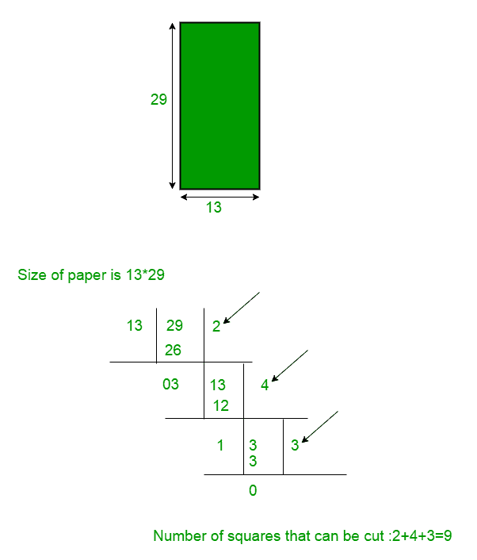

# 切成最小方块数的纸|第 2 套

> 原文:[https://www . geesforgeks . org/paper-cut-minimum-number-squares-set-2/](https://www.geeksforgeeks.org/paper-cut-minimum-number-squares-set-2/)

给定一张大小为 A x B 的纸，任务是将纸切成任何大小的正方形。找出能从纸上切下的最小方块数。

**示例:**

```
Input  : 36 x 30
Output : 5
Explanation : 
3 (squares of size 12x12) + 
2 (squares of size 18x18)

Input  : 4 x 5
Output : 5
Explanation : 
1 (squares of size 4x4) + 
4 (squares of size 1x1)
```

用谷歌提问

我们已经在[之前的](https://www.geeksforgeeks.org/paper-cut-minimum-number-squares/)文章中讨论了**贪婪**方法来解决这个问题。但是以前的方法并不总是奏效。例如，对于上面的第一个测试用例，它失败了。因此，在本文中，我们使用**动态规划**来解决这个问题。

我们知道，如果我们想从纸上切下最小数量的正方形，那么我们必须首先从纸上切下最大的正方形，最大的正方形将与纸的较小的一边具有相同的边。例如，如果纸张的尺寸是 13 x 29，那么最大的正方形就是 13 边。所以我们可以切 2 个尺寸为 13×13(29/13 = 2)的正方形。现在剩余的纸张大小将为 3 x 13。同样，我们可以用 4 个大小为 3×3 的正方形和 3 个大小为 1×1 的正方形来切割剩余的纸张。所以至少可以从 13×29 的纸上切下 9 个正方形。



**解释** :
minimumSquare 是一个试图在某个位置分割矩形的函数。对这两个部分递归调用该函数。尝试所有可能的拆分，选择结果最少的那个。基本情况是当两边相等时，即输入已经是一个正方形，在这种情况下，结果是我们试图找到最接近中心的切割，这将导致我们的最小结果。

假设我们有一个矩形，宽度是 N，高度是 m。

*   如果(N == M)，那么它就是一个正方形，不需要做任何事情。
*   否则，我们可以将矩形分成另外两个较小的矩形(N–x，M)和(x，M)，这样就可以递归求解。
*   同样，我们也可以把它分为(N，M–x)和(N，x)

我们还需要知道这里的一个边缘情况，即 N=11，M=13，反之亦然。以下是给定测试用例的最佳答案:


在这种情况下，我们的方法将返回 8，但正如您所见，我们可以将纸张切割成最小的 6 个正方形。出现这种情况是因为在最优解中没有贯穿整个正方形的垂直线或水平线。

下面是使用动态编程实现上述想法。

## C++

```
// C++ program to find minimum number of squares
// to cut a paper using Dynamic Programming
#include<bits/stdc++.h>
using namespace std;

const int MAX = 300;
int dp[MAX][MAX];

// Returns min number of squares needed
int minimumSquare(int m, int n)
{
    // Initializing max values to vertical_min
    // and horizontal_min
    int vertical_min = INT_MAX;
    int horizontal_min = INT_MAX;

    // N=11 & M=13 is a special case
    if(n==13 && m==11) return 6;
    if(m==13 && n==11) return 6;

    // If the given rectangle is already a square
    if (m == n)
        return 1;

    // If the answer for the given rectangle is
    // previously calculated return that answer
    if (dp[m][n])
            return dp[m][n];

    /* The rectangle is cut horizontally and
       vertically into two parts and the cut
       with minimum value is found for every
       recursive call.
    */

    for (int i = 1;i<= m/2;i++)
    {
        // Calculating the minimum answer for the
        // rectangles with width equal to n and length
        // less than m for finding the cut point for
        // the minimum answer
        horizontal_min = min(minimumSquare(i, n) +
                minimumSquare(m-i, n), horizontal_min);
    }

    for (int j = 1;j<= n/2;j++)
    {
        // Calculating the minimum answer for the
        // rectangles with width less than n and
        // length equal to m for finding the cut
        // point for the minimum answer
        vertical_min = min(minimumSquare(m, j) +
                minimumSquare(m, n-j), vertical_min);
    }

    // Minimum of the vertical cut or horizontal
    // cut to form a square is the answer
    dp[m][n] = min(vertical_min, horizontal_min);

    return dp[m][n];
}

// Driver code
int main()
{
    int m = 30, n = 35;

    // Function call
    cout << minimumSquare(m, n);
    return 0;
}

// This code is contributed by Utkarsh Gupta
```

## Java 语言(一种计算机语言，尤用于创建网站)

```
// Java program to find minimum number of
// squares to cut a paper using Dynamic
// Programming
import java.io.*;

class GFG {

    static int dp[][] = new int[300][300];

    // Returns min number of squares needed
    static int minimumSquare(int m, int n)
    {
        // Initializing max values to
        // vertical_min and horizontal_min
        int vertical_min = Integer.MAX_VALUE;
        int horizontal_min = Integer.MAX_VALUE;

        // N=11 & M=13 is a special case
        if(n==13 && m==11) return 6;
        if(m==13 && n==11) return 6;

        // If the given rectangle is
        // already a square
        if (m == n)
            return 1;

        // If the answer for the given
        // rectangle is previously
        // calculated return that answer
        if (dp[m][n] != 0)
            return dp[m][n];

        /* The rectangle is cut horizontally
        and vertically into two parts and
        the cut with minimum value is found
        for every recursive call.
        */

        for (int i = 1; i <= m / 2; i++)
        {
            // Calculating the minimum answer
            // for the rectangles with width
            // equal to n and length less than
            // m for finding the cut point for
            // the minimum answer
            horizontal_min
                = Math.min(minimumSquare(i, n)
                           + minimumSquare(m - i, n),
                           horizontal_min);
        }

        for (int j = 1; j <= n / 2; j++) {
            // Calculating the minimum answer
            // for the rectangles with width
            // less than n and length equal to
            // m for finding the cut point for
            // the minimum answer
            vertical_min
                = Math.min(minimumSquare(m, j)
                           + minimumSquare(m, n - j),
                           vertical_min);
        }

        // Minimum of the vertical cut or
        // horizontal cut to form a square
        // is the answer
        dp[m][n] = Math.min(vertical_min, horizontal_min);

        return dp[m][n];
    }

    // Driver code
    public static void main(String[] args)
    {
        int m = 30, n = 35;

        // Function call
        System.out.println(minimumSquare(m, n));
    }
}
// This code is contributed by Prerna Saini
```

## 蟒蛇 3

```
# Python3 program to find minimum
# number of squares
# to cut a paper using Dynamic Programming

MAX = 300
dp = [[0 for i in range(MAX)] for i in range(MAX)]

# Returns min number of squares needed

def minimumSquare(m, n):

    # Initializing max values to
    # vertical_min
    # and horizontal_min
    vertical_min = 10000000000
    horizontal_min = 10000000000

    # N=11 & M=13 is a special case
    if n == 13 and m == 11:
        return 6
    if m == 13 and n == 11:
        return 6

    # If the given rectangle is
    # already a square
    if m == n:
        return 1

    # If the answer for the given rectangle is
    # previously calculated return that answer
    if dp[m][n] != 0:
        return dp[m][n]

    # The rectangle is cut horizontally and
    # vertically into two parts and the cut
    # with minimum value is found for every
    # recursive call.
    for i in range(1, m//2+1):

        # Calculating the minimum answer for the
        # rectangles with width equal to n and length
        # less than m for finding the cut point for
        # the minimum answer
        horizontal_min = min(minimumSquare(i, n) +
                             minimumSquare(m-i, n), horizontal_min)
    for j in range(1, n//2+1):

        # Calculating the minimum answer for the
        # rectangles with width equal to n and length
        # less than m for finding the cut point for
        # the minimum answer
        vertical_min = min(minimumSquare(m, j) +
                           minimumSquare(m, n-j), vertical_min)

    # Minimum of the vertical cut or horizontal
    # cut to form a square is the answer
    dp[m][n] = min(vertical_min, horizontal_min)
    return dp[m][n]

# Driver code
if __name__ == '__main__':
    m = 30
    n = 35

    # Function call
    print(minimumSquare(m, n))

# This code is contributed by sahilshelangia
```

## C#

```
// C# program to find minimum number of
// squares to cut a paper using Dynamic
// Programming
using System;

class GFG {

    static int[, ] dp = new int[300, 300];

    // Returns min number of squares needed
    static int minimumSquare(int m, int n)
    {
        // Initializing max values to
        // vertical_min and horizontal_min
        int vertical_min = int.MaxValue;
        int horizontal_min = int.MaxValue;

        // N=11 & M=13 is a special case
        if(n==13 && m==11) return 6;
        if(m==13 && n==11) return 6;

        // If the given rectangle is
        // already a square
        if (m == n)
            return 1;

        // If the answer for the given
        // rectangle is previously
        // calculated return that answer
        if (dp[m, n] != 0)
            return dp[m, n];

        /* The rectangle is cut horizontally
        and vertically into two parts and
        the cut with minimum value is found
        for every recursive call.
        */

        for (int i = 1; i <= m / 2; i++)
        {
            // Calculating the minimum answer
            // for the rectangles with width
            // equal to n and length less than
            // m for finding the cut point for
            // the minimum answer
            horizontal_min
                = Math.Min(minimumSquare(i, n)
                               + minimumSquare(m - i, n),
                           horizontal_min);
        }

        for (int j = 1; j <= n / 2; j++)
        {
            // Calculating the minimum answer
            // for the rectangles with width
            // less than n and length equal to
            // m for finding the cut point for
            // the minimum answer
            vertical_min
                = Math.Min(minimumSquare(m, j)
                               + minimumSquare(m, n - j),
                           vertical_min);
        }

        // Minimum of the vertical cut or
        // horizontal cut to form a square
        // is the answer
        dp[m, n] = Math.Min(vertical_min, horizontal_min);

        return dp[m, n];
    }

    // Driver code
    public static void Main()
    {
        int m = 30, n = 35;

        // Function call
        Console.WriteLine(minimumSquare(m, n));
    }
}

// This code is contributed by anuj_67.
```

## java 描述语言

```
<script>
    // Javascript program to find minimum number of
    // squares to cut a paper using Dynamic
    // Programming

    let dp = new Array(300);
    for(let i = 0; i < 300; i++)
    {
        dp[i] = new Array(300);
        for(let j = 0; j < 300; j++)
        {   
            dp[i][j] = 0;
        }
    }

    // Returns min number of squares needed
    function minimumSquare(m, n)
    {
        // Initializing max values to
        // vertical_min and horizontal_min
        let vertical_min = Number.MAX_VALUE;
        let horizontal_min = Number.MAX_VALUE;

        // N=11 & M=13 is a special case
        if(n==13 && m==11) return 6;
        if(m==13 && n==11) return 6;

        // If the given rectangle is
        // already a square
        if (m == n)
            return 1;

        // If the answer for the given
        // rectangle is previously
        // calculated return that answer
        if (dp[m][n] != 0)
            return dp[m][n];

        /* The rectangle is cut horizontally
        and vertically into two parts and
        the cut with minimum value is found
        for every recursive call.
        */

        for (let i = 1; i <= parseInt(m / 2, 10); i++)
        {
            // Calculating the minimum answer
            // for the rectangles with width
            // equal to n and length less than
            // m for finding the cut point for
            // the minimum answer
            horizontal_min
                = Math.min(minimumSquare(i, n)
                           + minimumSquare(m - i, n),
                           horizontal_min);
        }

        for (let j = 1; j <= parseInt(n / 2, 10); j++) {
            // Calculating the minimum answer
            // for the rectangles with width
            // less than n and length equal to
            // m for finding the cut point for
            // the minimum answer
            vertical_min
                = Math.min(minimumSquare(m, j)
                           + minimumSquare(m, n - j),
                           vertical_min);
        }

        // Minimum of the vertical cut or
        // horizontal cut to form a square
        // is the answer
        dp[m][n] = Math.min(vertical_min, horizontal_min);

        return dp[m][n];
    }

    let m = 30, n = 35;

    // Function call
    document.write(minimumSquare(m, n));

 // This code is contributed by divyesh072019.
</script>
```

**Output**

```
5
```

本文由 [**【阿尤什·戈维尔】**](https://www.linkedin.com/in/ayush-govil-a7b5b2103/) **【阿迪雅·尼哈尔·库马尔·辛格】** [**深安舒·阿加尔瓦尔**](https://www.linkedin.com/in/deepanshu-aggarwal/?originalSubdomain=in) 供稿。如果你喜欢 GeeksforGeeks 并想投稿，你也可以使用[write.geeksforgeeks.org](https://write.geeksforgeeks.org)写一篇文章或者把你的文章邮寄到 contribute@geeksforgeeks.org。看到你的文章出现在极客博客主页上，帮助其他极客。
如果发现有不正确的地方，或者想分享更多关于上述话题的信息，请写评论。