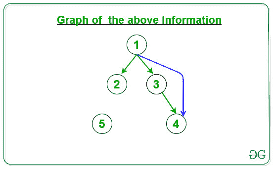

# 伪命题定理

> 原文:[https://www.geeksforgeeks.org/paranthesis-theorem/](https://www.geeksforgeeks.org/paranthesis-theorem/)

**括号定理**用于图的 [DFS。它指出深度优先搜索树中的后代有一个有趣的属性。如果 **v 是 u** 的后裔，那么 v 的**发现时间要晚于 u** 的**发现时间。
在图 g = (V，E)的任何**](https://www.geeksforgeeks.org/depth-first-search-or-dfs-for-a-graph/) **[DFS 遍历](https://www.geeksforgeeks.org/depth-first-search-or-dfs-for-a-graph/)中，对于任意两个顶点 u 和 V，恰好存在以下情况之一:**

*   区间**【d【u】、f【u】】****【d【v】、f【v】】**完全不相交， **u** 和 **v** 都不是深度优先森林中另一个的后代。
*   区间 **[d[u]，f[u]]** 包含在区间 **[d[v]，f[v]]** 内，u 是深度优先树中 v 的后代。
*   区间 **[d[v]，f[v]]** 完全包含在区间 **[d[u]，f[u]]** 内，v 是深度优先树中 u 的后代。

**边的分类:**
[DFS 遍历](https://www.geeksforgeeks.org/depth-first-search-or-dfs-for-a-graph/)可以用来对输入图 G=(V，E)的边进行分类。根据深度优先森林，可以定义四种边缘类型:

1.  **树边:**是在图中应用 DFS 后得到的树中存在的边。
2.  **前向边:**它是一条边(u，v)，这样 v 是后代，但不是 DFS 树的一部分。
3.  **后沿:**它是一条边(u，v)，这样 v 是边 u 的祖先，但不是 DFS 树的一部分。后边缘的存在表示有向图中的循环。
4.  **交叉边:**是连接两个节点的边，使得它们之间没有任何祖先和后代关系。

给定一个由 **N** 顶点和 **M** 边组成的[图](https://www.geeksforgeeks.org/graph-and-its-representations/)，任务是将 M 条边分为[树边、前向边、后向边和交叉边](https://www.geeksforgeeks.org/tree-back-edge-and-cross-edges-in-dfs-of-graph/)。

**示例:**

> **输入:** N = 5，M = 7，arr[][] = { { 1，2 }，{ 1，3 }，{ 3，4}，{ 1，4 }，{ 2，5 }，{ 5，1 }，{ 3，2 } }
> **输出:**
> {1，2} - >树边
> {1，3} - >树边
> {3，4} - >树边
> {1，4 } 5} - >树边
> {5，1} - >倒边
> {3，2} - >横边
> **说明:**
> 1。 绿色边缘:树边缘
> 2。蓝色边缘:前边缘
> 3。黑边:后沿
> 4。红边:交叉边
> 以下是上述信息的给定图形:
> 
> 
> 
> **输入:** N = 5，M = 4，arr[][] = { { 1，2 }，{ 1，3 }，{ 3，4 }，{ 1，4 } }
> **输出:**
> {1，2} - >树边
> {1，3} - >树边
> {3，4} - >树边
> {1，4} - >前进边
> **说明:【T11 绿色边缘:树边缘
> 2。蓝色边缘:前边缘
> 3。黑边:后沿
> 4。红色边缘:交叉边缘
> 以下是上述信息的给定图形:** 
> 
> 

**进场:**

1.  在给定的图上使用 DFS 遍历来查找每个节点的发现时间和完成时间以及父节点。
2.  通过使用括号定理，在以下条件下对给定的边进行分类:
    *   **树边:**对于任意边 **(U，V)** ，如果节点 U 是节点 V 的**父节点**，那么 **(U，V)** 就是给定图的**树边**。
    *   **前向边:**对于任意边 **(U，V)** ，如果**节点 V** **的发现时间和结束时间与**节点 U 的发现时间和结束时间完全重叠， **(U，V)** 即为给定图的**前向边**。
    *   **后向边:**对于任意边 **(U，V)** ，如果**节点 U** **的发现时间和结束时间与**节点 V** 的发现时间和结束时间完全重叠**，那么 **(U，V)** 就是给定图的**后向边**。
    *   **交叉边:**对于任意边 **(U，V)** ，如果**节点 U** **的发现时间和结束时间与**节点 V** 的发现时间和结束时间不重叠**，那么 **(U，V)** 就是给定图形的**交叉边**。

下面是上述方法的实现:

## C++

```
// C++ program for the above approach

#include "bits/stdc++.h"
using namespace std;

// For recording time
int tim = 0;

// For creating Graph
vector<list<int> > G;

// For calculating Discovery time
// and finishing time of nodes
vector<int> disc, fin;

// For finding Parent of node
vector<int> Par;

// For storing color of node
vector<char> Color;

// Recursive function for DFS
// to update the
void DFS_Visit(int v)
{

    // Make the current nodes as visited
    Color[v] = 'G';

    // Increment the time
    tim = tim + 1;

    // Assign the Discovery node of
    // node v
    disc[v] = tim;

    // Traverse the adjacency list of
    // vertex v
    for (auto& it : G[v]) {

        // If the nodes is not visited,
        // then mark the parent of the
        // current node and call DFS_Visit
        // for the current node
        if (Color[it] == 'W') {
            Par[it] = v;
            DFS_Visit(it);
        }
    }
    Color[v] = 'B';
    tim = tim + 1;
    fin[v] = tim;
}

void DFS(vector<list<int> >& G)
{

    // Initialise Par, disc, fin and
    // Color vector to size of graph
    Par.resize(G.size());
    disc.resize(G.size());
    fin.resize(G.size());
    Color.resize(G.size());

    // Initialise the Par[], Color[],
    // disc[], fin[]
    for (int i = 1; i < G.size(); i++) {
        Color[i] = 'W';
        Par[i] = 0;
        disc[i] = 0;
        fin[i] = 0;
    }

    // For every vertex if nodes is
    // not visited then call DFS_Visit
    // to update the discovery and
    // finishing time of the node
    for (int i = 1; i < G.size(); i++) {

        // If color is 'W', then
        // node is not visited
        if (Color[i] == 'W') {
            DFS_Visit(i);
        }
    }
}

// Function to check whether
// time intervals of x and y overlaps
// or not
bool checkOverlap(int x, int y)
{

    // Find the time intervals
    int x1 = disc[x], y1 = fin[x];
    int x2 = disc[y], y2 = fin[y];

    // Complete overlaps
    if (x2 > x1 && y1 > y2) {
        return true;
    }
    else {
        return false;
    }
}

// Function to check which Edges
// (x, y) belongs
string checkEdge(int x, int y)
{

    // For Tree Edge
    // If x is parent of y, then it
    // is Tree Edge
    if (Par[y] == x) {
        return "Tree Edge";
    }

    // For Forward Edge
    else if (checkOverlap(x, y)) {
        return "Forward Edge";
    }

    // For Backward Edge
    else if (checkOverlap(y, x)) {
        return "Backward Edge";
    }

    else {
        return "Cross Edge";
    }
}

// Function call to find the Tree Edge,
// Back Edge, Forward Edge, and Cross Edge
void solve(int arr[][2], int N, int M)
{

    // Create graph of N size
    G.resize(N + 1);

    // Traverse each edges
    for (int i = 0; i < M; i++) {

        int x = arr[i][0];
        int y = arr[i][1];

        // Make Directed graph
        G[x].push_back(y);
    }

    // DFS call to calculate discovery
    // and finishing time for each node
    DFS(G);

    // Condition for Tree Edge, Forward
    // Edges, Backward Edge and Cross Edge
    for (int i = 0; i < M; i++) {

        int x = arr[i][0];
        int y = arr[i][1];

        // Function call to check Edges
        cout << "{" << x << ", " << y
             << "} -> " << checkEdge(x, y)
             << endl;
    }
}

// Driver Code
int main()
{

    // Number of Nodes
    int N = 5;

    // Number of Edges
    int M = 7;

    // Edges for the graph
    int arr[M][2]
        = { { 1, 2 }, { 1, 3 },
            { 3, 4 }, { 1, 4 },
            { 2, 5 }, { 5, 1 },
            { 3, 1 } };

    // Function Call
    solve(arr, N, M);

    return 0;
}
```

## 蟒蛇 3

```
# Python3 program for the above approach

# For recording time
tim = 0

# For creating Graph
G=[]

# For calculating Discovery time
# and finishing time of nodes
disc, fin=[],[]

# For finding Parent of node
Par=[]

# For storing color of node
Color=[]

# Recursive function for DFS
# to update the
def DFS_Visit(v):
    global tim
    # Make the current nodes as visited
    Color[v] = 'G'

    # Increment the time
    tim += 1

    # Assign the Discovery node of
    # node v
    disc[v] = tim

    # Traverse the adjacency list of
    # vertex v
    for it in G[v]:

        # If the nodes is not visited,
        # then mark the parent of the
        # current node and call DFS_Visit
        # for the current node
        if (Color[it] == 'W') :
            Par[it] = v
            DFS_Visit(it)

    Color[v] = 'B'
    tim = tim + 1
    fin[v] = tim

def DFS(G):
    global Par,disc,fin,Color
    # Initialise Par, disc, fin and
    # Color vector to size of graph
    Par=[-1]*len(G)
    disc=[-1]*len(G)
    fin=[-1]*len(G)
    Color=['']*len(G)

    # Initialise the Par[], Color[],
    # disc[], fin[]
    for i in range(1,len(G)):
        Color[i] = 'W'
        Par[i] = 0
        disc[i] = 0
        fin[i] = 0

    # For every vertex if nodes is
    # not visited then call DFS_Visit
    # to update the discovery and
    # finishing time of the node
    for i in range(1,len(G)):

        # If color is 'W', then
        # node is not visited
        if (Color[i] == 'W') :
            DFS_Visit(i)

# Function to check whether
# time intervals of x and y overlaps
# or not
def checkOverlap(x, y):

    # Find the time intervals
    x1 = disc[x]; y1 = fin[x]
    x2 = disc[y]; y2 = fin[y]

    # Complete overlaps
    if (x2 > x1 and y1 > y2) :
        return True

    else :
        return False

# Function to check which Edges
# (x, y) belongs
def checkEdge(x, y):

    # For Tree Edge
    # If x is parent of y, then it
    # is Tree Edge
    if (Par[y] == x) :
        return "Tree Edge"

    # For Forward Edge
    elif (checkOverlap(x, y)) :
        return "Forward Edge"

    # For Backward Edge
    elif (checkOverlap(y, x)) :
        return "Backward Edge"

    else :
        return "Cross Edge"

# Function call to find the Tree Edge,
# Back Edge, Forward Edge, and Cross Edge
def solve(arr, N, M):
    global G
    # Create graph of N size
    G=[[] for _ in range(N + 1)]

    # Traverse each edges
    for i in range(M):

        x = arr[i][0]
        y = arr[i][1]

        # Make Directed graph
        G[x].append(y)

    # DFS call to calculate discovery
    # and finishing time for each node
    DFS(G)

    # Condition for Tree Edge, Forward
    # Edges, Backward Edge and Cross Edge
    for i in range(M):

        x = arr[i][0]
        y = arr[i][1]

        # Function call to check Edges
        print("({0},{1})->".format(x,y),checkEdge(x, y))

# Driver Code
if __name__ == '__main__':

    # Number of Nodes
    N = 5

    # Number of Edges
    M = 7

    # Edges for the graph
    arr= [[1, 2] , [1, 3 ],
        [3, 4] , [1, 4 ],
        [2, 5] , [5, 1 ],
        [3, 1]] 

    # Function Call
    solve(arr, N, M)
```

**Output:** 

```
{1, 2} -> Tree Edge
{1, 3} -> Tree Edge
{3, 4} -> Tree Edge
{1, 4} -> Forward Edge
{2, 5} -> Tree Edge
{5, 1} -> Backward Edge
{3, 1} -> Backward Edge
```

**时间复杂度:** O(N)，其中 N 为图中节点总数。

**辅助空间:** O(N)