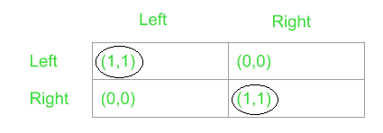
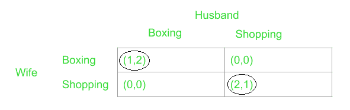
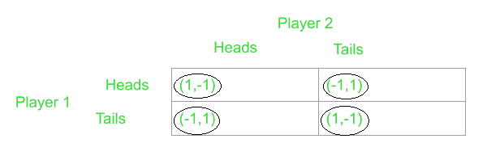
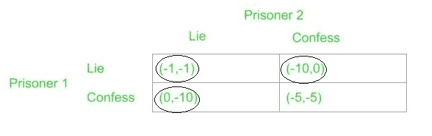

# 帕累托最优及其在博弈论中的应用

> 原文:[https://www . geesforgeks . org/Pareto-optimization-and-it-application-in-game-theory/](https://www.geeksforgeeks.org/pareto-optimality-and-its-application-in-game-theory/)

先决条件:[博弈论](https://www.geeksforgeeks.org/game-theory/)

当讨论博弈论中的策略时，经常从玩家的角度提及。然而，当策略从观察者的角度形成时，观察者的主要动机是希望每个玩家都有最好的结果；也就是说，当从社会平衡的角度形成策略时，那么结果被称为帕累托最优结果。

如果一个结果不能被任何其他结果所支配，那么它就是帕累托最优的。具体来说，在选择帕累托结果时，很明显，对于所有玩家来说，没有其他结果能证明比这个结果更好。除此之外，一个参与者严格选择帕累托最优结果而不是任何其他结果。

例如，考虑对两个玩家有回报的两个结果为 **(5，8)** 和 **(5，6)** 。在这里，很明显，选择任何一个结果对玩家一来说都没有意义，因为他/她无论如何都会得到 **5** 的回报。然而，选择第一个结果会稍微有利于玩家二，因为他/她会收到一个 **8** 而不是 **6** 。因此，选择第一个结果意味着两个参与者都获得了他们能获得的最好回报，这就是为什么在这种情况下这是帕累托最优结果。

让我们考虑几个流行的两人游戏，并分析每个游戏的帕累托最优结果:

1.  **协调游戏:**这个游戏中的场景堪比两个人从相反的方向走在人行道上。如果两者都选择坚持各自的左或右，将证明对双方都有利。但是，如果其中任何一个偏离了这个选择，它们就容易发生碰撞。这个游戏的支付矩阵如下:
     
    从上面的矩阵中，很明显结果 **(1，1)** 是这个游戏的帕累托最优。
2.  **两性之战:**这可以认为是一对夫妻之间的情况。丈夫提出去看拳击比赛的想法，妻子出于显而易见的原因，更喜欢购物而不是拳击。他们有不同的兴趣，但最重要的是两个人都想在一起度过一天。这意味着妻子会和丈夫一起去看拳击比赛，最终她会得到 1 英镑的回报，而丈夫会享受 2 英镑的回报，而不是独自去购物，两个人都只得到 0 英镑的回报。这个游戏的支付矩阵看起来是这样的:
     
    因此，我们可以观察到 **(2，1)** 和 **(1，2)** 是这种情况下的帕累托最优结果。
3.  **匹配便士游戏:**两个玩家的游戏目标不同。两个玩家都有两个面一个头一个尾的硬币。玩家一必须尝试将自己的硬币与玩家二的硬币匹配，玩家二必须确保自己的硬币与玩家一不匹配。因此，在硬币匹配的情况下，玩家一得到一些正收益，玩家二得到相等的负收益。相反，在不匹配的情况下，玩家二得到正回报，玩家一得到负回报。给定的支付矩阵更好地证明了这一点:
     
    在这个游戏中，如果玩家一选择正面，玩家二显然会用反面来回应。同样，如果玩家二选择了尾巴，玩家一会有兴趣玩尾巴来获胜，这些选择会以循环的方式重复。因此，很明显，每个玩家的决定都直接受到对方的影响，没有任何玩家会选择获胜的主导策略。因此，支付矩阵中的所有结果本质上都是帕累托最优的，这在零和博弈的情况下非常常见。
4.  [**囚徒困境**](https://www.geeksforgeeks.org/prisoners-dilemma-game-theory/) :我们来考虑两个因某种罪行被定罪的囚徒。由于缺乏证据，这些囚犯仅被判处一年监禁。现在，这两个囚犯都被秘密谈话，如果他们背叛了另一个，就被释放。然而，被背叛的人现在会被判十年监禁，这是一个更大的负面回报。此外，如果两个囚犯都背叛了对方，那么两人都将被判处五年监禁。
     
    颇耐人寻味的是，这场比赛的结局(-1，-1)、(0，-10)和(-10，0)都是帕累托最优。结果(-5，-5)不是帕累托最优的，因为它是由结果(-1，-1)支配的帕累托最优。另一个有趣的观察是(-5，-5)，这是游戏中唯一的非帕累托最优结果，也是每个玩家期望玩的主导策略，使其成为[纳什均衡](https://en.wikipedia.org/wiki/Nash_equilibrium)。这就是为什么囚徒困境是这样的困境！