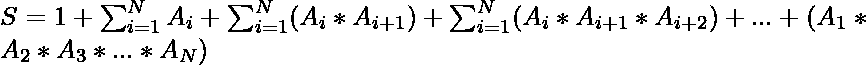

# 使用给定 N 个数字的给定数学表达式的奇偶性

> 原文:[https://www . geeksforgeeks . org/给定数学表达式的奇偶性-使用给定的 n 个数字/](https://www.geeksforgeeks.org/parity-of-the-given-mathematical-expression-using-given-n-numbers/)

给定 **N** 个正整数 **A <sub>1</sub> ，A <sub>2</sub> ，…，A <sub>N</sub>** ，任务是确定表达式 S 的奇偶性。
对于给定的 **N** 个数字，表达式 S 给出为:


**示例:**

> **输入:** N = 3，A1 = 2，A2 = 3，A3 = 1
> **输出:**偶
> **解释:**
> S = 1+(2+3+1)+(2 * 3+3 * 1+1 * 2)+(2 * 3 * 1)= 24，为偶
> 
> **输入:** N = 2，A1 = 2，A2 = 4
> **输出:**奇数
> **说明:**
> S = 1 + (2 + 4) + (2 * 4) = 15，为奇数

**天真法:**这个问题的天真法是把 A <sub>i</sub> 的所有值插在给定的表达式中，求给定表达式的奇偶性。这种方法不适用于更高的 N 值，因为对于更高阶的数，乘法不是常数运算。此外，该值可能变得太大，可能会导致整数溢出。

**高效方法:**想法是对表达式执行一些处理，并将表达式简化为更简单的项，这样就可以在不计算值的情况下检查奇偶性。设 N = 3。然后:

*   表达式 S 是:

> 1+(A<sub>1</sub>+A<sub>2</sub>+A<sub>3</sub>)+((A<sub>1</sub>* A<sub>2</sub>)+(A<sub>2</sub>* A<sub>3</sub>)+(A<sub>3</sub>* A<sub>1</sub>)+(A<sub>1</sub>* A<sub>2</sub>* A

*   现在，同样的表达式被重组如下:

> (1+A<sub>1</sub>)+(A<sub>2</sub>+A<sub>1</sub>* A<sub>2</sub>)+(A<sub>3</sub>+A<sub>3</sub>* A<sub>1</sub>)+(A<sub>2</sub>* A<sub>3</sub>+A<sub>1</sub>* A<sub>2</sub>* A <sub>(1+A<sub>1</sub>)+A<sub>3</sub>*(1+A<sub>1</sub>)+A<sub>2</sub>* A<sub>3</sub>*(1+A<sub>1</sub></sub>

*   从上式中取(1 + A <sub>1</sub> )为公，

> (1+A<sub>1</sub>)*(1+A<sub>2</sub>+A<sub>2</sub>+(A<sub>2</sub>* A<sub>3</sub>)
> =>(1+A<sub>1</sub>)*(1+A<sub>2</sub>+A<sub>3</sub>*(1+A<sub>2</sub>)

*   最后，在取(1 + A <sub>2</sub> )普通时，最终表达式变为:

> (1+A<sub>1</sub>)*(1+A<sub>2</sub>)*(1+A<sub>3</sub>

*   通过对称性，对于 N 个元素，表达式 S 变为:

> (1+A<sub>1</sub>)*(1+A<sub>2</sub>)*(1+A<sub>3</sub>)……*(1+A<sub>N</sub>

*   显然，一个数要变成偶数，答案必须是偶数。众所周知，答案是即使其中任何一个数字是偶数。
*   因此，我们的想法是检查给定输入中的任何数字是否为奇数。如果是，那么加一就变成偶数，值就是偶数奇偶。

下面是上述方法的实现:

## C++

```
// C++ program to determine the
// parity of the given mathematical
// expression

#include <bits/stdc++.h>
using namespace std;

void getParity(
    int n,
    const vector<int>& A)
{

    // Iterating through the
    // given integers
    for (auto x : A) {
        if (x & 1) {

            // If any odd number
            // is present, then S
            // is even parity
            cout << "Even" << endl;
            return;
        }
    }

    // Else, S is odd parity
    cout << "Odd" << endl;
}

// Driver code
int main()
{

    int N = 3;
    vector<int> A = { 2, 3, 1 };
    getParity(N, A);

    return 0;
}
```

## Java 语言(一种计算机语言，尤用于创建网站)

```
// Java program to determine the
// parity of the given mathematical
// expression
class GFG{

static void getParity(int n, int []A)
{

    // Iterating through the
    // given integers
    for (int x : A)
    {
        if ((x & 1) == 1)
        {

            // If any odd number
            // is present, then S
            // is even parity
            System.out.println("Even");
            return;
        }
    }

    // Else, S is odd parity
    System.out.println("Odd");
}

// Driver code
public static void main(String[] args)
{
    int N = 3;
    int [] A = { 2, 3, 1 };
    getParity(N, A);
}
}

// This code is contributed by AnkitRai01
```

## 蟒蛇 3

```
# Python3 program to determine the
# parity of the given mathematical
# expression
def getParity(n, A):

    # Iterating through
    # the given integers
    for x in A:
        if (x & 1):

            # If any odd number
            # is present, then S
            # is even parity
            print("Even")
            return

    # Else, S is odd parity
    print("Odd")

# Driver code
if __name__ == '__main__':

    N = 3
    A = [ 2, 3, 1 ]

    getParity(N, A)

# This code is contributed by mohit kumar 29
```

## C#

```
// C# program to determine the
// parity of the given mathematical
// expression
using System;

public class GFG{

    static void getParity(int n, int []A)
    {

        // Iterating through the
        // given integers
        foreach (int x in A)
        {
            if ((x & 1) == 1)
            {

                // If any odd number
                // is present, then S
                // is even parity
                Console.WriteLine("Even");
                return;
            }
        }

        // Else, S is odd parity
        Console.WriteLine("Odd");
    }

    // Driver code
    public static void Main(string[] args)
    {
        int N = 3;
        int [] A = { 2, 3, 1 };
        getParity(N, A);
    }
}

// This code is contributed by AnkitRai01
```

## java 描述语言

```
<script>
// Javascript program to determine the
// parity of the given mathematical
// expression

function getParity(n, A)
{

    // Iterating through the
    // given integers
    for (let x in A)
    {
        if ((x & 1) == 1)
        {

            // If any odd number
            // is present, then S
            // is even parity
            document.write("Even");
            return;
        }
    }

    // Else, S is odd parity
    document.write("Odd");
}

  // Driver Code

     let N = 3;
    let A = [ 2, 3, 1 ];
    getParity(N, A);

</script>
```

**Output:** 

```
Even
```

**时间复杂度:** *O(N)* ，其中 N 为给定数字的个数。