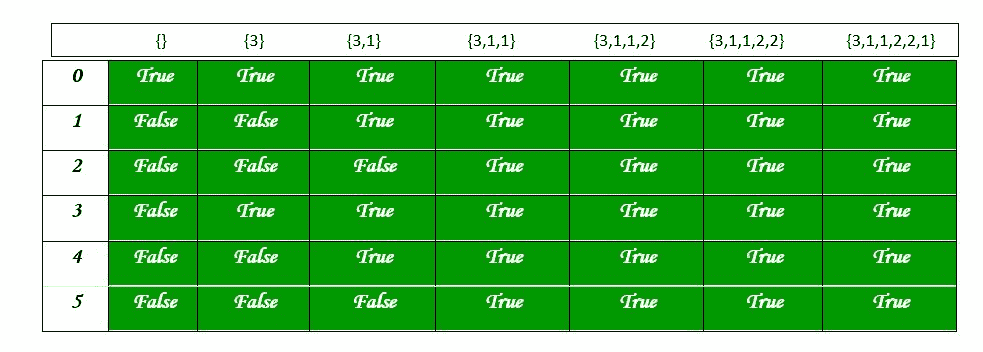

# 分区问题| DP-18

> 原文:[https://www.geeksforgeeks.org/partition-problem-dp-18/](https://www.geeksforgeeks.org/partition-problem-dp-18/)

划分问题是确定给定的集合是否可以划分为两个子集，使得两个子集的元素之和相同。

**示例:**

```
arr[] = {1, 5, 11, 5}
Output: true 
The array can be partitioned as {1, 5, 5} and {11}

arr[] = {1, 5, 3}
Output: false 
The array cannot be partitioned into equal sum sets.
```

## [我们强烈建议您点击此处进行练习，然后再进入解决方案。](https://practice.geeksforgeeks.org/problems/subset-sum-problem2014/1)

下面是解决这个问题的两个主要步骤:
1)计算数组的和。如果和是奇数，不能有两个和相等的子集，所以返回 false。
2)如果数组元素的和为偶数，计算和/2，找到和等于和/2 的数组子集。
第一步很简单。第二步至关重要，可以使用递归或动态编程来解决。

**递归解**
下面是上面提到的第二步的递归性质。

```
Let isSubsetSum(arr, n, sum/2) be the function that returns true if 
there is a subset of arr[0..n-1] with sum equal to sum/2

The isSubsetSum problem can be divided into two subproblems
 a) isSubsetSum() without considering last element 
    (reducing n to n-1)
 b) isSubsetSum considering the last element 
    (reducing sum/2 by arr[n-1] and n to n-1)
If any of the above subproblems return true, then return true. 
isSubsetSum (arr, n, sum/2) = isSubsetSum (arr, n-1, sum/2) ||
                              isSubsetSum (arr, n-1, sum/2 - arr[n-1])
```

下面是上述代码的实现:

## C++

```
// A recursive C++ program for partition problem
#include <bits/stdc++.h>
using namespace std;

// A utility function that returns true if there is
// a subset of arr[] with sun equal to given sum
bool isSubsetSum(int arr[], int n, int sum)
{
    // Base Cases
    if (sum == 0)
        return true;
    if (n == 0 && sum != 0)
        return false;

    // If last element is greater than sum, then
    // ignore it
    if (arr[n - 1] > sum)
        return isSubsetSum(arr, n - 1, sum);

    /* else, check if sum can be obtained by any of
        the following
        (a) including the last element
        (b) excluding the last element
    */
    return isSubsetSum(arr, n - 1, sum)
           || isSubsetSum(arr, n - 1, sum - arr[n - 1]);
}

// Returns true if arr[] can be partitioned in two
// subsets of equal sum, otherwise false
bool findPartiion(int arr[], int n)
{
    // Calculate sum of the elements in array
    int sum = 0;
    for (int i = 0; i < n; i++)
        sum += arr[i];

    // If sum is odd, there cannot be two subsets
    // with equal sum
    if (sum % 2 != 0)
        return false;

    // Find if there is subset with sum equal to
    // half of total sum
    return isSubsetSum(arr, n, sum / 2);
}

// Driver code
int main()
{
    int arr[] = { 3, 1, 5, 9, 12 };
    int n = sizeof(arr) / sizeof(arr[0]);

    // Function call
    if (findPartiion(arr, n) == true)
        cout << "Can be divided into two subsets "
                "of equal sum";
    else
        cout << "Can not be divided into two subsets"
                " of equal sum";
    return 0;
}

// This code is contributed by rathbhupendra
```

## C

```
// A recursive C program for partition problem
#include <stdbool.h>
#include <stdio.h>

// A utility function that returns true if there is
// a subset of arr[] with sun equal to given sum
bool isSubsetSum(int arr[], int n, int sum)
{
    // Base Cases
    if (sum == 0)
        return true;
    if (n == 0 && sum != 0)
        return false;

    // If last element is greater than sum, then
    // ignore it
    if (arr[n - 1] > sum)
        return isSubsetSum(arr, n - 1, sum);

    /* else, check if sum can be obtained by any of
       the following
       (a) including the last element
       (b) excluding the last element
    */
    return isSubsetSum(arr, n - 1, sum)
           || isSubsetSum(arr, n - 1, sum - arr[n - 1]);
}

// Returns true if arr[] can be partitioned in two
//  subsets of equal sum, otherwise false
bool findPartiion(int arr[], int n)
{
    // Calculate sum of the elements in array
    int sum = 0;
    for (int i = 0; i < n; i++)
        sum += arr[i];

    // If sum is odd, there cannot be two subsets
    // with equal sum
    if (sum % 2 != 0)
        return false;

    // Find if there is subset with sum equal to
    // half of total sum
    return isSubsetSum(arr, n, sum / 2);
}

// Driver code
int main()
{
    int arr[] = { 3, 1, 5, 9, 12 };
    int n = sizeof(arr) / sizeof(arr[0]);

    // Function call
    if (findPartiion(arr, n) == true)
        printf("Can be divided into two subsets "
               "of equal sum");
    else
        printf("Can not be divided into two subsets"
               " of equal sum");
    return 0;
}
```

## Java 语言(一种计算机语言，尤用于创建网站)

```
// A recursive Java solution for partition problem
import java.io.*;

class Partition {
    // A utility function that returns true if there is a
    // subset of arr[] with sun equal to given sum
    static boolean isSubsetSum(int arr[], int n, int sum)
    {
        // Base Cases
        if (sum == 0)
            return true;
        if (n == 0 && sum != 0)
            return false;

        // If last element is greater than sum, then ignore
        // it
        if (arr[n - 1] > sum)
            return isSubsetSum(arr, n - 1, sum);

        /* else, check if sum can be obtained by any of
           the following
        (a) including the last element
        (b) excluding the last element
        */
        return isSubsetSum(arr, n - 1, sum)
            || isSubsetSum(arr, n - 1, sum - arr[n - 1]);
    }

    // Returns true if arr[] can be partitioned in two
    // subsets of equal sum, otherwise false
    static boolean findPartition(int arr[], int n)
    {
        // Calculate sum of the elements in array
        int sum = 0;
        for (int i = 0; i < n; i++)
            sum += arr[i];

        // If sum is odd, there cannot be two subsets
        // with equal sum
        if (sum % 2 != 0)
            return false;

        // Find if there is subset with sum equal to half
        // of total sum
        return isSubsetSum(arr, n, sum / 2);
    }

    // Driver code
    public static void main(String[] args)
    {

        int arr[] = { 3, 1, 5, 9, 12 };
        int n = arr.length;

        // Function call
        if (findPartition(arr, n) == true)
            System.out.println("Can be divided into two "
                               + "subsets of equal sum");
        else
            System.out.println(
                "Can not be divided into "
                + "two subsets of equal sum");
    }
}
/* This code is contributed by Devesh Agrawal */
```

## 蟒蛇 3

```
# A recursive Python3 program for
# partition problem

# A utility function that returns
# true if there is a subset of
# arr[] with sun equal to given sum

def isSubsetSum(arr, n, sum):
    # Base Cases
    if sum == 0:
        return True
    if n == 0 and sum != 0:
        return False

    # If last element is greater than sum, then
    # ignore it
    if arr[n-1] > sum:
        return isSubsetSum(arr, n-1, sum)

    ''' else, check if sum can be obtained by any of
    the following
    (a) including the last element
    (b) excluding the last element'''

    return isSubsetSum(arr, n-1, sum) or isSubsetSum(arr, n-1, sum-arr[n-1])

# Returns true if arr[] can be partitioned in two
# subsets of equal sum, otherwise false

def findPartion(arr, n):
    # Calculate sum of the elements in array
    sum = 0
    for i in range(0, n):
        sum += arr[i]
    # If sum is odd, there cannot be two subsets
    # with equal sum
    if sum % 2 != 0:
        return false

    # Find if there is subset with sum equal to
    # half of total sum
    return isSubsetSum(arr, n, sum // 2)

# Driver code
arr = [3, 1, 5, 9, 12]
n = len(arr)

# Function call
if findPartion(arr, n) == True:
    print("Can be divided into two subsets of equal sum")
else:
    print("Can not be divided into two subsets of equal sum")

# This code is contributed by shreyanshi_arun.
```

## C#

```
// A recursive C# solution for partition problem
using System;

class GFG {

    // A utility function that returns true if there is a
    // subset of arr[] with sun equal to given sum
    static bool isSubsetSum(int[] arr, int n, int sum)
    {
        // Base Cases
        if (sum == 0)
            return true;
        if (n == 0 && sum != 0)
            return false;

        // If last element is greater than sum, then ignore
        // it
        if (arr[n - 1] > sum)
            return isSubsetSum(arr, n - 1, sum);

        /* else, check if sum can be obtained by any of
        the following
        (a) including the last element
        (b) excluding the last element
        */
        return isSubsetSum(arr, n - 1, sum)
            || isSubsetSum(arr, n - 1, sum - arr[n - 1]);
    }

    // Returns true if arr[] can be partitioned in two
    // subsets of equal sum, otherwise false
    static bool findPartition(int[] arr, int n)
    {
        // Calculate sum of the elements in array
        int sum = 0;
        for (int i = 0; i < n; i++)
            sum += arr[i];

        // If sum is odd, there cannot be two subsets
        // with equal sum
        if (sum % 2 != 0)
            return false;

        // Find if there is subset with sum equal to half
        // of total sum
        return isSubsetSum(arr, n, sum / 2);
    }

    // Driver code
    public static void Main()
    {

        int[] arr = { 3, 1, 5, 9, 12 };
        int n = arr.Length;

        // Function call
        if (findPartition(arr, n) == true)
            Console.Write("Can be divided into two "
                          + "subsets of equal sum");
        else
            Console.Write("Can not be divided into "
                          + "two subsets of equal sum");
    }
}

// This code is contributed by Sam007
```

## 服务器端编程语言（Professional Hypertext Preprocessor 的缩写）

```
<?php
// A recursive PHP solution for partition problem

// A utility function that returns true if there is
// a subset of arr[] with sun equal to given sum
function isSubsetSum ($arr, $n, $sum)
{
    // Base Cases
    if ($sum == 0)
        return true;
    if ($n == 0 && $sum != 0)
        return false;

    // If last element is greater than
    // sum, then ignore it
    if ($arr[$n - 1] > $sum)
        return isSubsetSum ($arr, $n - 1, $sum);

    /* else, check if sum can be obtained
       by any of the following
        (a) including the last element
        (b) excluding the last element
    */
    return isSubsetSum ($arr, $n - 1, $sum) ||
           isSubsetSum ($arr, $n - 1,
                        $sum - $arr[$n - 1]);
} 

// Returns true if arr[] can be partitioned
// in two subsets of equal sum, otherwise false
function findPartiion ($arr, $n)
{
    // Calculate sum of the elements
    // in array
    $sum = 0;
    for ($i = 0; $i < $n; $i++)
    $sum += $arr[$i];

    // If sum is odd, there cannot be
    // two subsets with equal sum
    if ($sum % 2 != 0)
    return false;

    // Find if there is subset with sum
    // equal to half of total sum
    return isSubsetSum ($arr, $n, $sum / 2);
}

// Driver Code
$arr = array(3, 1, 5, 9, 12);
$n = count($arr);

// Function call
if (findPartiion($arr, $n) == true)
    echo "Can be divided into two subsets of equal sum";
else
    echo "Can not be divided into two subsets of equal sum";

// This code is contributed by rathbhupendra
?>
```

## java 描述语言

```
<script>
// A recursive Javascript solution for partition problem

    // A utility function that returns true if there is a
    // subset of arr[] with sun equal to given sum
    function isSubsetSum(arr,n,sum)
    {
        // Base Cases
        if (sum == 0)
            return true;
        if (n == 0 && sum != 0)
            return false;

        // If last element is greater than sum, then ignore
        // it
        if (arr[n - 1] > sum)
            return isSubsetSum(arr, n - 1, sum);

        /* else, check if sum can be obtained by any of
           the following
        (a) including the last element
        (b) excluding the last element
        */
        return isSubsetSum(arr, n - 1, sum)
            || isSubsetSum(arr, n - 1, sum - arr[n - 1]);
    }

    // Returns true if arr[] can be partitioned in two
    // subsets of equal sum, otherwise false
    function findPartition(arr,n)
    {
        // Calculate sum of the elements in array
        let sum = 0;
        for (let i = 0; i < n; i++)
            sum += arr[i];

        // If sum is odd, there cannot be two subsets
        // with equal sum
        if (sum % 2 != 0)
            return false;

        // Find if there is subset with sum equal to half
        // of total sum
        return isSubsetSum(arr, n, Math.floor(sum / 2));
    }

    // Driver code
    let arr=[3, 1, 5, 9, 12 ];
    let n = arr.length;
    // Function call
    if (findPartition(arr, n) == true)
        document.write("Can be divided into two "
                               + "subsets of equal sum");
    else
        document.write(
                "Can not be divided into "
                + "two subsets of equal sum");

    // This code is contributed by unknown2108
</script>
```

**Output**

```
Can be divided into two subsets of equal sum
```

**时间复杂度:** O(2^n)在最坏的情况下，这个解决方案为每个元素尝试了两种可能性(是包含还是排除)。

**动态规划解**
当元素之和不太大时，可以用动态规划来解决问题。我们可以创建一个大小为(sum/2 + 1)*(n+1)的 2D 数组部分[][]。我们可以以自下而上的方式构建解决方案，使得每个填充的条目都具有以下属性

```
part[i][j] = true if a subset of {arr[0], arr[1], ..arr[j-1]} has sum 
             equal to i, otherwise false
```

## C++

```
// A Dynamic Programming based
// C++ program to partition problem
#include <bits/stdc++.h>
using namespace std;

// Returns true if arr[] can be partitioned
// in two subsets of equal sum, otherwise false
bool findPartiion(int arr[], int n)
{
    int sum = 0;
    int i, j;

    // Calculate sum of all elements
    for (i = 0; i < n; i++)
        sum += arr[i];

    if (sum % 2 != 0)
        return false;

    bool part[sum / 2 + 1][n + 1];

    // initialize top row as true
    for (i = 0; i <= n; i++)
        part[0][i] = true;

    // initialize leftmost column,
    // except part[0][0], as 0
    for (i = 1; i <= sum / 2; i++)
        part[i][0] = false;

    // Fill the partition table in bottom up manner
    for (i = 1; i <= sum / 2; i++) {
        for (j = 1; j <= n; j++) {
            part[i][j] = part[i][j - 1];
            if (i >= arr[j - 1])
                part[i][j] = part[i][j]
                             || part[i - arr[j - 1]][j - 1];
        }
    }

    /* // uncomment this part to print table
    for (i = 0; i <= sum/2; i++)
    {
    for (j = 0; j <= n; j++)
        cout<<part[i][j];
    cout<<endl;
    } */

    return part[sum / 2][n];
}

// Driver Code
int main()
{
    int arr[] = { 3, 1, 1, 2, 2, 1 };
    int n = sizeof(arr) / sizeof(arr[0]);

    // Function call
    if (findPartiion(arr, n) == true)
        cout << "Can be divided into two subsets of equal "
                "sum";
    else
        cout << "Can not be divided into"
             << " two subsets of equal sum";
    return 0;
}

// This code is contributed by rathbhupendra
```

## C

```
// A Dynamic Programming based C program to partition
// problem
#include <stdio.h>

// Returns true if arr[] can be partitioned in two subsets
// of equal sum, otherwise false
bool findPartiion(int arr[], int n)
{
    int sum = 0;
    int i, j;

    // Calculate sum of all elements
    for (i = 0; i < n; i++)
        sum += arr[i];

    if (sum % 2 != 0)
        return false;

    bool part[sum / 2 + 1][n + 1];

    // initialize top row as true
    for (i = 0; i <= n; i++)
        part[0][i] = true;

    // initialize leftmost column, except part[0][0], as 0
    for (i = 1; i <= sum / 2; i++)
        part[i][0] = false;

    // Fill the partition table in bottom up manner
    for (i = 1; i <= sum / 2; i++) {
        for (j = 1; j <= n; j++) {
            part[i][j] = part[i][j - 1];
            if (i >= arr[j - 1])
                part[i][j] = part[i][j]
                             || part[i - arr[j - 1]][j - 1];
        }
    }

    /* // uncomment this part to print table
     for (i = 0; i <= sum/2; i++)
     {
       for (j = 0; j <= n; j++)
          printf ("%4d", part[i][j]);
       printf("\n");
     } */

    return part[sum / 2][n];
}

// Driver code
int main()
{
    int arr[] = { 3, 1, 1, 2, 2, 1 };
    int n = sizeof(arr) / sizeof(arr[0]);

    // Function call
    if (findPartiion(arr, n) == true)
        printf(
            "Can be divided into two subsets of equal sum");
    else
        printf("Can not be divided into two subsets of "
               "equal sum");
    getchar();
    return 0;
}
```

## Java 语言(一种计算机语言，尤用于创建网站)

```
// A dynamic programming based Java program for partition
// problem
import java.io.*;

class Partition {

    // Returns true if arr[] can be partitioned in two
    // subsets of equal sum, otherwise false
    static boolean findPartition(int arr[], int n)
    {
        int sum = 0;
        int i, j;

        // Calculate sum of all elements
        for (i = 0; i < n; i++)
            sum += arr[i];

        if (sum % 2 != 0)
            return false;

        boolean part[][] = new boolean[sum / 2 + 1][n + 1];

        // initialize top row as true
        for (i = 0; i <= n; i++)
            part[0][i] = true;

        // initialize leftmost column, except part[0][0], as
        // 0
        for (i = 1; i <= sum / 2; i++)
            part[i][0] = false;

        // Fill the partition table in bottom up manner
        for (i = 1; i <= sum / 2; i++) {
            for (j = 1; j <= n; j++) {
                part[i][j] = part[i][j - 1];
                if (i >= arr[j - 1])
                    part[i][j]
                        = part[i][j]
                          || part[i - arr[j - 1]][j - 1];
            }
        }

        /* // uncomment this part to print table
        for (i = 0; i <= sum/2; i++)
        {
            for (j = 0; j <= n; j++)
                printf ("%4d", part[i][j]);
            printf("\n");
        } */

        return part[sum / 2][n];
    }

    // Driver code
    public static void main(String[] args)
    {
        int arr[] = { 3, 1, 1, 2, 2, 1 };
        int n = arr.length;
        if (findPartition(arr, n) == true)
            System.out.println(
                "Can be divided into two " "subsets of equal sum");
        else
            System.out.println(
                "Can not be divided into" " two subsets of equal sum");
    }
}
/* This code is contributed by Devesh Agrawal */
```

## 蟒蛇 3

```
# Dynamic Programming based python
# program to partition problem

# Returns true if arr[] can be
# partitioned in two subsets of
# equal sum, otherwise false

def findPartition(arr, n):
    sum = 0
    i, j = 0, 0

    # calculate sum of all elements
    for i in range(n):
        sum += arr[i]

    if sum % 2 != 0:
        return false

    part = [[True for i in range(n + 1)]
            for j in range(sum // 2 + 1)]

    # initialize top row as true
    for i in range(0, n + 1):
        part[0][i] = True

    # initialize leftmost column,
    # except part[0][0], as 0
    for i in range(1, sum // 2 + 1):
        part[i][0] = False

    # fill the partition table in
    # bottom up manner
    for i in range(1, sum // 2 + 1):

        for j in range(1, n + 1):
            part[i][j] = part[i][j - 1]

            if i >= arr[j - 1]:
                part[i][j] = (part[i][j] or
                              part[i - arr[j - 1]][j - 1])

    return part[sum // 2][n]

# Driver Code
arr = [3, 1, 1, 2, 2, 1]
n = len(arr)

# Function call
if findPartition(arr, n) == True:
    print("Can be divided into two",
          "subsets of equal sum")
else:
    print("Can not be divided into ",
          "two subsets of equal sum")

# This code is contributed
# by mohit kumar 29
```

## C#

```
// A dynamic programming based C# program
// for partition problem
using System;

class GFG {

    // Returns true if arr[] can be partitioned
    // in two subsets of equal sum, otherwise
    // false
    static bool findPartition(int[] arr, int n)
    {

        int sum = 0;
        int i, j;

        // Calculate sum of all elements
        for (i = 0; i < n; i++)
            sum += arr[i];

        if (sum % 2 != 0)
            return false;

        bool[, ] part = new bool[sum / 2 + 1, n + 1];

        // initialize top row as true
        for (i = 0; i <= n; i++)
            part[0, i] = true;

        // initialize leftmost column, except
        // part[0][0], as 0
        for (i = 1; i <= sum / 2; i++)
            part[i, 0] = false;

        // Fill the partition table in bottom
        // up manner
        for (i = 1; i <= sum / 2; i++) {
            for (j = 1; j <= n; j++) {
                part[i, j] = part[i, j - 1];
                if (i >= arr[j - 1])
                    part[i, j]
                        = part[i, j - 1]
                          || part[i - arr[j - 1], j - 1];
            }
        }

        /* // uncomment this part to print table
        for (i = 0; i <= sum/2; i++)
        {
            for (j = 0; j <= n; j++)
                printf ("%4d", part[i][j]);
            printf("\n");
        } */

        return part[sum / 2, n];
    }

    // Driver code
    public static void Main()
    {
        int[] arr = { 3, 1, 1, 2, 2, 1 };
        int n = arr.Length;

        // Function call
        if (findPartition(arr, n) == true)
            Console.Write("Can be divided"
                          + " into two subsets of"
                          + " equal sum");
        else
            Console.Write("Can not be "
                          + "divided into two subsets"
                          + " of equal sum");
    }
}

// This code is contributed by Sam007.
```

## java 描述语言

```
<script>

// A dynamic programming based javascript
// program for partition
// problemclass Partition

    // Returns true if arr can be partitioned in two
    // subsets of equal sum, otherwise false
    function findPartition(arr , n)
    {
        var sum = 0;
        var i, j;

        // Calculate sum of all elements
        for (i = 0; i < n; i++)
            sum += arr[i];

        if (sum % 2 != 0)
            return false;

        var part = Array(parseInt(sum / 2) + 1).
        fill().map(()=>Array(n + 1).fill(0));

        // initialize top row as true
        for (i = 0; i <= n; i++)
            part[0][i] = true;

        // initialize leftmost column,
        // except part[0][0], as
        // 0
        for (i = 1; i <= parseInt(sum / 2); i++)
            part[i][0] = false;

        // Fill the partition table in bottom up manner
        for (i = 1; i <= parseInt(sum / 2); i++) {
            for (j = 1; j <= n; j++) {
                part[i][j] = part[i][j - 1];
                if (i >= arr[j - 1])
                    part[i][j] = part[i][j] ||
                    part[i - arr[j - 1]][j - 1];
            }
        }

        /*
         uncomment this part to print table
         for (i = 0; i <= sum/2; i++)
         { for (j = 0; j <= n; j++)
         printf ("%4d", part[i][j]); printf("\n"); }
         */

        return part[parseInt(sum / 2)][n];
    }

    // Driver code

        var arr = [ 3, 1, 1, 2, 2, 1 ];
        var n = arr.length;
        if (findPartition(arr, n) == true)
            document.write(
            "Can be divided into two subsets of equal sum"
            );
        else
            document.write(
            "Can not be divided into two subsets of equal sum"
            );

// This code contributed by Rajput-Ji

</script>
```

**Output**

```
Can be divided into two subsets of equal sum
```

下图显示了分区表中的值。



**时间复杂度:** O(和*n)
T3】辅助空间: O(和* n)

请注意，这种解决方案对于具有大和的阵列是不可行的。

**动态规划解(空间复杂度优化)**

我们可以仅使用大小(sum/2 + 1)的数组来解决这个问题，而不是创建大小(sum/2 + 1)*(n + 1)的二维数组。

> part[j] =如果存在和等于 j 的子集，则为 true，否则为 false。

下面是上述方法的实现:

## C++

```
// A Dynamic Programming based
// C++ program to partition problem
#include <bits/stdc++.h>
using namespace std;

// Returns true if arr[] can be partitioned
// in two subsets of equal sum, otherwise false
bool findPartiion(int arr[], int n)
{
    int sum = 0;
    int i, j;

    // Calculate sum of all elements
    for (i = 0; i < n; i++)
        sum += arr[i];

    if (sum % 2 != 0)
        return false;

    bool part[sum / 2 + 1];

    // Initialize the part array
    // as 0
    for (i = 0; i <= sum / 2; i++) {
        part[i] = 0;
    }

    // Fill the partition table in bottom up manner

    for (i = 0; i < n; i++) {
        // the element to be included
        // in the sum cannot be
        // greater than the sum
        for (j = sum / 2; j >= arr[i];
             j--) { // check if sum - arr[i]
            // could be formed
            // from a subset
            // using elements
            // before index i
            if (part[j - arr[i]] == 1 || j == arr[i])
                part[j] = 1;
        }
    }

    return part[sum / 2];
}

// Driver Code
int main()
{
    int arr[] = { 1, 3, 3, 2, 3, 2 };
    int n = sizeof(arr) / sizeof(arr[0]);

    // Function call
    if (findPartiion(arr, n) == true)
        cout << "Can be divided into two subsets of equal "
                "sum";
    else
        cout << "Can not be divided into"
             << " two subsets of equal sum";
    return 0;
}
```

## Java 语言(一种计算机语言，尤用于创建网站)

```
// A Dynamic Programming based
// Java program to partition problem
import java.io.*;

class GFG{

// Returns true if arr[] can be partitioned
// in two subsets of equal sum, otherwise false
public static boolean findPartiion(int arr[], int n)
{
    int sum = 0;
    int i, j;

    // Calculate sum of all elements
    for(i = 0; i < n; i++)
        sum += arr[i];

    if (sum % 2 != 0)
        return false;

    boolean[] part = new boolean[sum / 2 + 1];

    // Initialize the part array
    // as 0
    for(i = 0; i <= sum / 2; i++)
    {
        part[i] = false;
    }

    // Fill the partition table in
    // bottom up manner
    for(i = 0; i < n; i++)
    {

        // The element to be included
        // in the sum cannot be
        // greater than the sum
        for(j = sum / 2; j >= arr[i]; j--)
        {

            // Check if sum - arr[i] could be
            // formed from a subset using elements
            // before index i
            if (part[j - arr[i]] == true || j == arr[i])
                part[j] = true;
        }
    }
    return part[sum / 2];
}

// Driver code
public static void main(String[] args)
{
    int arr[] = { 1, 3, 3, 2, 3, 2 };
    int n = 6;

    // Function call
    if (findPartiion(arr, n) == true)
        System.out.println("Can be divided into two " +
                           "subsets of equal sum");
    else
        System.out.println("Can not be divided into " +
                           "two subsets of equal sum");
}
}

// This code is contributed by RohitOberoi
```

## 蟒蛇 3

```
# A Dynamic Programming based
# Python3 program to partition problem

# Returns true if arr[] can be partitioned
# in two subsets of equal sum, otherwise false
def findPartiion(arr, n) :
    Sum = 0

    # Calculate sum of all elements
    for i in range(n) :
        Sum += arr[i]
    if (Sum % 2 != 0) :
        return 0
    part = [0] * ((Sum // 2) + 1)

    # Initialize the part array as 0
    for i in range((Sum // 2) + 1) :
        part[i] = 0

    # Fill the partition table in bottom up manner
    for i in range(n) :

        # the element to be included
        # in the sum cannot be
        # greater than the sum
        for j in range(Sum // 2, arr[i] - 1, -1) :

            # check if sum - arr[i]
            # could be formed
            # from a subset
            # using elements
            # before index i
            if (part[j - arr[i]] == 1 or j == arr[i]) :
                part[j] = 1

    return part[Sum // 2]

# Drive code 
arr = [ 1, 3, 3, 2, 3, 2 ]
n = len(arr)

# Function call
if (findPartiion(arr, n) == 1) :
    print("Can be divided into two subsets of equal sum")
else :
    print("Can not be divided into two subsets of equal sum")

    # This code is contributed by divyeshrabadiya07
```

## C#

```
// A Dynamic Programming based
// C# program to partition problem
using System;
class GFG
{

    // Returns true if arr[] can be partitioned
    // in two subsets of equal sum, otherwise false
    static bool findPartiion(int[] arr, int n)
    {
        int sum = 0;
        int i, j;

        // Calculate sum of all elements
        for(i = 0; i < n; i++)
            sum += arr[i];    
        if (sum % 2 != 0)
            return false;
        bool[] part = new bool[sum / 2 + 1];

        // Initialize the part array
        // as 0
        for(i = 0; i <= sum / 2; i++)
        {
            part[i] = false;
        }

        // Fill the partition table in
        // bottom up manner
        for(i = 0; i < n; i++)
        {

            // The element to be included
            // in the sum cannot be
            // greater than the sum
            for(j = sum / 2; j >= arr[i]; j--)
            {

                // Check if sum - arr[i] could be
                // formed from a subset using elements
                // before index i
                if (part[j - arr[i]] == true || j == arr[i])
                    part[j] = true;
            }
        }
        return part[sum / 2];
    }

  // Driver code
  static void Main()
  {
    int[] arr = { 1, 3, 3, 2, 3, 2 };
    int n = 6;

    // Function call
    if (findPartiion(arr, n) == true)
        Console.WriteLine("Can be divided into two " +
                           "subsets of equal sum");
    else
        Console.WriteLine("Can not be divided into " +
                           "two subsets of equal sum");
  }
}

// This code is contributed by divyesh072019
```

## java 描述语言

```
<script>

// A Dynamic Programming based Javascript
// program to partition problem

// Returns true if arr[] can be partitioned
// in two subsets of equal sum, otherwise false
function findPartiion(arr, n)
{
    let sum = 0;
    let i, j;

    // Calculate sum of all elements
    for(i = 0; i < n; i++)
        sum += arr[i];

    if (sum % 2 != 0)
        return false;

    let part = new Array(parseInt(sum / 2 + 1, 10));

    // Initialize the part array
    // as 0
    for(i = 0; i <= parseInt(sum / 2, 10); i++)
    {
        part[i] = false;
    }

    // Fill the partition table in
    // bottom up manner
    for(i = 0; i < n; i++)
    {

        // The element to be included
        // in the sum cannot be
        // greater than the sum
        for(j = parseInt(sum / 2, 10);
            j >= arr[i];
            j--)
        {
            // Check if sum - arr[i] could be
            // formed from a subset using
            // elements before index i
            if (part[j - arr[i]] == true ||
                    j == arr[i])
                part[j] = true;
        }
    }
    return part[parseInt(sum / 2, 10)];
}

// Driver code   
let arr = [ 1, 3, 3, 2, 3, 2 ];
let n = arr.length;

// Function call
if (findPartiion(arr, n) == true)
    document.write("Can be divided into two " +
                   "subsets of equal sum");
else
    document.write("Can not be divided into " +
                   "two subsets of equal sum");

// This code is contributed by suresh07            

</script>
```

**Output**

```
Can be divided into two subsets of equal sum
```

**时间复杂度:** O(和* n)
T3】辅助空间 : O(和)

请注意，这种解决方案对于具有大和的阵列是不可行的。
**参考文献:**
[http://en.wikipedia.org/wiki/Partition_problem](http://en.wikipedia.org/wiki/Partition_problem)

如果你发现任何不正确的地方，或者你想分享更多关于上面讨论的话题的信息，请写评论。