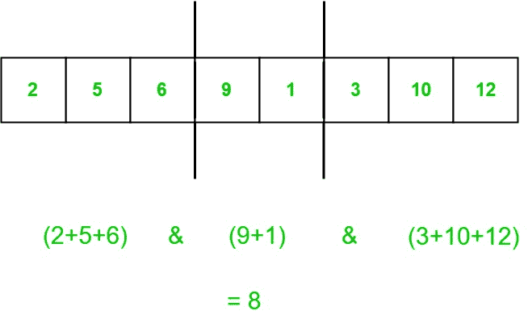

# 将数组划分为 K 个段，使得单个段和的位“与”最大化

> 原文:[https://www . geeksforgeeks . org/对 k 段中的数组进行分区，以便最大化单个段的位与和/](https://www.geeksforgeeks.org/partition-the-array-in-k-segments-such-that-bitwise-and-of-individual-segment-sum-is-maximized/)

给定一个大小为 **N** 的数组和一个整数 **K** 。任务是在 **K** 段中划分数组，使得单个段和的位**和**最大化。求按位**和**的最大值，可以得到。



**例:**

> **输入:** a[] = { 2，5，6，9，1，3，10，12 }，K = 3
> **输出:** 8
> **解释:**
> 通过在第 3 个元素和第 5 个元素(基于 1 的索引)处进行剪切可以获得最大按位 AND
> (2+5+6)&(9+1)&(3+10+12)= 8
> **输入:** a K = 2
> **输出:** 41
> **解释** :
> 最大位“与”可以通过在第 5 个元素(基于 1 的索引)处进行剪切来获得
> (1+2+7+10+23)&(21+6+8+7+3)= 41

**方法:**
首先，试着回答一个更简单的问题:给定一个整数 **x** ，并确定是否有可能将给定的数组划分为 **K** 段，使得段和的位**和**具有 **x** 的所有设置位？
我们用来表示**和**段的元素之和。另外，如果有 **x** 的所有设定位，我们称一个段**为好**。现在很明显，对于一个好的片段**我**、**和** ( 、 **x** )= **x** 。
还有，所有 **K** 段都应该是**好的**才能得到 **x** 的按位 AND。现在来检查一下我们是否可以把数组分割成 **k 好的**段。我们可以在这里使用[动态编程](https://www.geeksforgeeks.org/dynamic-programming/)。
让 **dp[i][j]= true** ，表示可以先将 **i** 元素分割成 **j** 段，这样所有 **j** 都是**好的**段，否则**为 false** 。
上述 dp 的重现性为:

> dp[i][j]是 1，如果对于某些索引 k

贪婪地从可能答案的最高有效位开始构建 **dp** 表。
以下是上述办法的实施情况:

## C++

```
// CPP program to find maximum possible AND
#include <bits/stdc++.h>
using namespace std;

// Function to check whether a k segment partition
// is possible such that bitwise AND is 'mask'
bool checkpossible(int mask, int* arr, int* prefix, int n,
                                                  int k)
{
    // dp[i][j] stores whether it is possible to partition
    // first i elements into j segments such that all j
    // segments are 'good'
    bool dp[n + 1][k + 1];

    // Initialising dp
    memset(dp, 0, sizeof(dp));
    dp[0][0] = 1;

    // Filling dp in bottom-up manner
    for (int i = 1; i <= n; i++) {
        for (int j = 1; j <= k; j++) {
            // Finding a cut such that first l elements
            // can be partitioned into j-1 'good' segments
            // and arr[l+1]+...+arr[i] is a 'good' segment
            for (int l = i - 1; l >= 0; --l) {
                if (dp[l][j - 1] && (((prefix[i] - prefix[l])
                           & mask) == mask)) {
                    dp[i][j] = 1;
                    break;
                }
            }
        }
    }

    return dp[n][k];
}

// Function to find maximum possible AND
int Partition(int arr[], int n, int k)
{
    // Array to store prefix sums
    int prefix[n+1];

    for (int i = 1; i <= n; i++) {
        prefix[i] = prefix[i - 1] + arr[i];
    }

    // Maximum no of bits in the possible answer
    int LOGS = 20;

    // This will store the final answer
    int ans = 0;

    // Constructing answer greedily selecting
    // from the higher most bit
    for (int i = LOGS; i >= 0; --i) {
        // Checking if array can be partitioned
        // such that the bitwise AND is ans|(1<<i)
        if (checkpossible(ans | (1 << i), arr, prefix, n, k))
        {
            // if possible, update the answer
            ans = ans | (1 << i);
        }
    }

    // Return the final answer
    return ans;
}

// Driver code
int main()
{

    int arr[]={0, 1, 2, 7, 10, 23, 21, 6, 8, 7, 3}, k = 2;

    // n = 11 , first element is zero
    // to make array 1 based indexing. So, number of
    // elements are 10
    int n = sizeof(arr)/sizeof(arr[0])-1;

    // Function call
    cout << Partition(arr, n, k);

    return 0;
}
```

## Java 语言(一种计算机语言，尤用于创建网站)

```
// Java program to find maximum possible AND

class GFG
{

    // Function to check whether a k segment partition
    // is possible such that bitwise AND is 'mask'
    static boolean checkpossible(int mask, int arr[],
                                int prefix[], int n, int k)
    {
        int i,j;

        // dp[i][j] stores whether it is possible to partition
        // first i elements into j segments such that all j
        // segments are 'good'
        boolean dp[][] = new boolean[n + 1][k + 1];

        // Initialising dp
        for(i = 0; i < n + 1; i++)
        {
            for(j = 0; j < k + 1; j++)
            {
                dp[i][j] = false ;
            }
        }

        dp[0][0] = true;

        // Filling dp in bottom-up manner
        for ( i = 1; i <= n; i++)
        {
            for (j = 1; j <= k; j++)
            {
                // Finding a cut such that first l elements
                // can be partitioned into j-1 'good' segments
                // and arr[l+1]+...+arr[i] is a 'good' segment
                for (int l = i - 1; l >= 0; --l)
                {
                    if (dp[l][j - 1] && (((prefix[i] - prefix[l])
                            & mask) == mask))
                    {
                        dp[i][j] = true;
                        break;
                    }
                }
            }
        }

        return dp[n][k];
    }

    // Function to find maximum possible AND
    static int Partition(int arr[], int n, int k)
    {
        // Array to store prefix sums
        int prefix[] = new int[n+1];

        for (int i = 1; i <= n; i++)
        {
            prefix[i] = prefix[i - 1] + arr[i];
        }

        // Maximum no of bits in the possible answer
        int LOGS = 20;

        // This will store the final answer
        int ans = 0;

        // Constructing answer greedily selecting
        // from the higher most bit
        for (int i = LOGS; i >= 0; --i)
        {
            // Checking if array can be partitioned
            // such that the bitwise AND is ans|(1<<i)
            if (checkpossible(ans | (1 << i), arr, prefix, n, k))
            {
                // if possible, update the answer
                ans = ans | (1 << i);
            }
        }

        // Return the final answer
        return ans;
    }

    // Driver code
    public static void main (String[] args)
    {

        int arr[] = {0, 1, 2, 7, 10, 23, 21, 6, 8, 7, 3}, k = 2;

        // n = 11 , first element is zero
        // to make array 1 based indexing. So, number of
        // elements are 10
        int n = arr.length - 1 ;

        // Function call
        System.out.println(Partition(arr, n, k));
    }
}

// This code is contributed by AnkitRai01
```

## 蟒蛇 3

```
# Python3 program to find maximum possible AND

# Function to check whether a k segment partition
# is possible such that bitwise AND is 'mask'
def checkpossible(mask,arr,prefix, n,k):

    # dp[i][j] stores whether it is possible to partition
    # first i elements into j segments such that all j
    # segments are 'good'
    dp=[[0 for i in range(k+1)] for i in range(n + 1)]

    # Initialising dp
    dp[0][0] = 1

    # Filling dp in bottom-up manner
    for i in range(1, n+1):
        for j in range(1, k+1):

            # Finding a cut such that first l elements
            # can be partitioned into j-1 'good' segments
            # and arr[l+1]+...+arr[i] is a 'good' segment
            for l in range(i-1,-1,-1):
                if (dp[l][j - 1] and (((prefix[i] - prefix[l]) & mask) == mask)):
                    dp[i][j] = 1
                    break

    return dp[n][k]

# Function to find maximum possible AND
def Partition(arr, n, k):
    # Array to store prefix sums
    prefix=[0 for i in range(n+1)]

    for i in range(1,n+1):
        prefix[i] = prefix[i - 1] + arr[i]

    # Maximum no of bits in the possible answer
    LOGS = 20

    # This will store the final answer
    ans = 0

    # Constructing answer greedily selecting
    # from the higher most bit
    for i in range(LOGS,-1,-1):
        # Checking if array can be partitioned
        # such that the bitwise AND is ans|(1<<i)
        if (checkpossible(ans | (1 << i), arr, prefix, n, k)):
            # if possible, update the answer
            ans = ans | (1 << i)

    # Return the final answer
    return ans

# Driver code

arr = [0, 1, 2, 7, 10, 23, 21, 6, 8, 7, 3]
k = 2

# n = 11 , first element is zero
# to make array 1 based indexing. So, number of
# elements are 10
n = len(arr)-1

# Function call
print(Partition(arr, n, k))

# This code is contributed by mohit kumar 29
```

## C#

```
// C# program to find maximum possible AND
using System;

class GFG
{

    // Function to check whether a
    // k-segment partition is possible
    // such that bitwise AND is 'mask'
    static Boolean checkpossible(int mask, int []arr,
                                 int []prefix,
                                 int n, int k)
    {
        int i, j;

        // dp[i,j] stores whether it is possible
        // to partition first i elements into
        // j-segments such that all j-segments are 'good'
        Boolean[,] dp = new Boolean[n + 1, k + 1];

        // Initialising dp
        for(i = 0; i < n + 1; i++)
        {
            for(j = 0; j < k + 1; j++)
            {
                dp[i, j] = false;
            }
        }

        dp[0, 0] = true;

        // Filling dp in bottom-up manner
        for ( i = 1; i <= n; i++)
        {
            for (j = 1; j <= k; j++)
            {
                // Finding a cut such that first l elements
                // can be partitioned into j-1 'good' segments
                // and arr[l+1]+...+arr[i] is a 'good' segment
                for (int l = i - 1; l >= 0; --l)
                {
                    if (dp[l, j - 1] &&
                     (((prefix[i] - prefix[l]) &
                        mask) == mask))
                    {
                        dp[i, j] = true;
                        break;
                    }
                }
            }
        }
        return dp[n, k];
    }

    // Function to find maximum possible AND
    static int Partition(int []arr, int n, int k)
    {
        // Array to store prefix sums
        int []prefix = new int[n + 1];

        for (int i = 1; i <= n; i++)
        {
            prefix[i] = prefix[i - 1] + arr[i];
        }

        // Maximum no of bits in the possible answer
        int LOGS = 20;

        // This will store the final answer
        int ans = 0;

        // Constructing answer greedily selecting
        // from the higher most bit
        for (int i = LOGS; i >= 0; --i)
        {
            // Checking if array can be partitioned
            // such that the bitwise AND is ans|(1<<i)
            if (checkpossible(ans | (1 << i),
                          arr, prefix, n, k))
            {
                // if possible, update the answer
                ans = ans | (1 << i);
            }
        }

        // Return the final answer
        return ans;
    }

    // Driver code
    public static void Main (String[] args)
    {

        int []arr = {0, 1, 2, 7, 10, 23,
                         21, 6, 8, 7, 3};
        int k = 2;

        // n = 11 , first element is zero
        // to make array 1 based indexing.
        // So, number of elements are 10
        int n = arr.Length - 1 ;

        // Function call
        Console.WriteLine(Partition(arr, n, k));
    }
}

// This code is contributed by 29AjayKumar
```

## java 描述语言

```
<script>
    // Javascript program to find maximum possible AND

    // Function to check whether a k segment partition
    // is possible such that bitwise AND is 'mask'
    function checkpossible(mask, arr, prefix, n, k)
    {
        let i,j;

        // dp[i][j] stores whether it is possible to partition
        // first i elements into j segments such that all j
        // segments are 'good'
        let dp = new Array(n + 1);

        // Initialising dp
        for(i = 0; i < n + 1; i++)
        {
            dp[i] = new Array(k + 1);
            for(j = 0; j < k + 1; j++)
            {
                dp[i][j] = false ;
            }
        }

        dp[0][0] = true;

        // Filling dp in bottom-up manner
        for (i = 1; i <= n; i++)
        {
            for (j = 1; j <= k; j++)
            {
                // Finding a cut such that first l elements
                // can be partitioned into j-1 'good' segments
                // and arr[l+1]+...+arr[i] is a 'good' segment
                for (let l = i - 1; l >= 0; --l)
                {
                    if (dp[l][j - 1] && (((prefix[i] - prefix[l])
                            & mask) == mask))
                    {
                        dp[i][j] = true;
                        break;
                    }
                }
            }
        }

        return dp[n][k];
    }

    // Function to find maximum possible AND
    function Partition(arr, n, k)
    {
        // Array to store prefix sums
        let prefix = new Array(n+1);
        prefix.fill(0);

        for (let i = 1; i <= n; i++)
        {
            prefix[i] = prefix[i - 1] + arr[i];
        }

        // Maximum no of bits in the possible answer
        let LOGS = 20;

        // This will store the final answer
        let ans = 0;

        // Constructing answer greedily selecting
        // from the higher most bit
        for (let i = LOGS; i >= 0; --i)
        {
            // Checking if array can be partitioned
            // such that the bitwise AND is ans|(1<<i)
            if (checkpossible(ans | (1 << i), arr, prefix, n, k))
            {
                // if possible, update the answer
                ans = ans | (1 << i);
            }
        }

        // Return the final answer
        return ans;
    }

    let arr = [0, 1, 2, 7, 10, 23, 21, 6, 8, 7, 3], k = 2;

    // n = 11 , first element is zero
    // to make array 1 based indexing. So, number of
    // elements are 10
    let n = arr.length - 1 ;

    // Function call
    document.write(Partition(arr, n, k));

// This code is contributed by divyeshrabadiya07.
</script>
```

**Output:** 

```
41
```

**时间复杂度:** O(  klog(S))，其中 S =  +  +…。+ 。