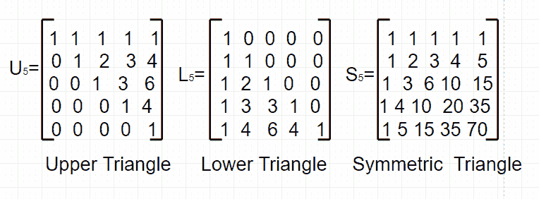
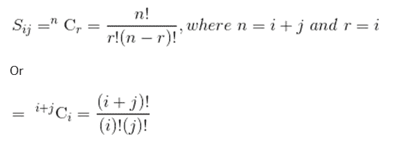

# 帕斯卡矩阵

> 原文:[https://www.geeksforgeeks.org/pascal-matrix/](https://www.geeksforgeeks.org/pascal-matrix/)

在数学中，特别是在矩阵理论和组合学中，**帕斯卡矩阵**是包含二项式系数作为其元素的无限矩阵。有三种方法可以实现:作为上三角矩阵、下三角矩阵或对称矩阵。这些的 5 x 5 截断如下所示:



对称帕斯卡矩阵的元素是二项式系数，即



给定正整数 **n** 。任务是打印大小为 n×n 的对称帕斯卡矩阵
**示例:**

```
Input : n = 5
Output :
1 1 1 1 1
1 2 3 4 5
1 3 6 10 15
1 4 10 20 35
1 5 15 35 70
```

下面是实现 n×n 对称帕斯卡矩阵的代码:

## C++

```
// CPP Program to print symmetric pascal matrix.
#include <bits/stdc++.h>
using namespace std;

// Print Pascal Matrix
void printpascalmatrix(int n)
{
    int C[2 * n + 1][2 * n + 1] = { 0 };

    // Calculate value of Binomial Coefficient in
    // bottom up manner
    for (int i = 0; i <= 2 * n; i++) {
        for (int j = 0; j <= min(i, 2 * n); j++) {

            // Base Cases
            if (j == 0 || j == i)
                C[i][j] = 1;

            // Calculate value using previously
            // stored values
            else
                C[i][j] = C[i - 1][j - 1] + C[i - 1][j];
        }
    }

    // Printing the pascal matrix
    for (int i = 0; i < n; i++) {
        for (int j = 0; j < n; j++)
            cout << C[i + j][i] << " ";

        cout << endl;
    }
}

// Driven Program
int main()
{
    int n = 5;
    printpascalmatrix(n);
    return 0;
}
```

## Java 语言(一种计算机语言，尤用于创建网站)

```
// java Program to print
// symmetric pascal matrix.
import java.io.*;

class GFG
{
    // Print Pascal Matrix
    static void printpascalmatrix(int n)
    {
        int C[][] = new int[2 * n + 1][2 * n + 1];

        // Calculate value of Binomial Coefficient in
        // bottom up manner
        for (int i = 0; i <= 2 * n; i++)
        {
            for (int j = 0; j <= Math.min(i, 2 * n); j++)
            {
                // Base Cases
                if (j == 0 || j == i)
                    C[i][j] = 1;

                // Calculate value using previously
                // stored values
                else
                    C[i][j] = C[i - 1][j - 1]
                              + C[i - 1][j];
            }
        }

        // Printing the pascal matrix
        for (int i = 0; i < n; i++)
        {
            for (int j = 0; j < n; j++)
                System.out.print ( C[i + j][i] +" ");
                System.out.println();

        }
    }

    // Driven Program
    public static void main (String[] args)
    {
        int n = 5;
        printpascalmatrix(n);

    }
}

// This code is contributed by vt_m.
```

## 蟒蛇 3

```
# Python3 Program to print
# symmetric pascal matrix.

# Print Pascal Matrix
def printpascalmatrix(n):
    C = [[0 for x in range(2 * n + 1)]
            for y in range(2 * n + 1)]

    # Calculate value of
    # Binomial Coefficient
    # in ottom up manner
    for i in range(2 * n + 1):
        for j in range(min(i, 2 * n) + 1):

            # Base Cases
            if (j == 0 or j == i):
                C[i][j] = 1;

            # Calculate value
            # using previously
            # stored values
            else:
                C[i][j] = (C[i - 1][j - 1] +
                           C[i - 1][j]);

    # Printing the
    # pascal matrix
    for i in range(n):
        for j in range(n):
            print(C[i + j][i],
                   end = " ");
        print();

# Driver Code
n = 5;
printpascalmatrix(n);

# This code is contributed by mits
```

## C#

```
// C# program to print
// symmetric pascal matrix.
using System;

class GFG {

    // Print Pascal Matrix
    static void printpascalmatrix(int n)
    {
        int[, ] C = new int[2 * n + 1, 2 * n + 1];

        // Calculate value of Binomial Coefficient
        // in bottom up manner
        for (int i = 0; i <= 2 * n; i++) {

            for (int j = 0; j <= Math.Min(i, 2 * n); j++) {

                // Base Cases
                if (j == 0 || j == i)
                    C[i, j] = 1;

                // Calculate value using previously
                // stored values
                else
                    C[i, j] = C[i - 1, j - 1]
                            + C[i - 1, j];
            }
        }

        // Printing the pascal matrix
        for (int i = 0; i < n; i++) {
            for (int j = 0; j < n; j++)
                Console.Write(C[i + j, i] + " ");
            Console.WriteLine();
        }
    }

    // Driven Program
    public static void Main()
    {
        int n = 5;
        printpascalmatrix(n);
    }
}

// This code is contributed by vt_m.
```

## 服务器端编程语言（Professional Hypertext Preprocessor 的缩写）

```
<?php
// PHP Program to print symmetric
// pascal matrix.

// Print Pascal Matrix
function printpascalmatrix($n)
{
    $C[2 * $n + 1][2 * $n + 1] = (0);

    // Calculate value of Binomial
    // Coefficient in ottom up manner
    for ($i = 0; $i <= 2 * $n; $i++)
    {
        for ($j = 0; $j <= min($i, 2 * $n); $j++)
        {

            // Base Cases
            if ($j == 0 || $j == $i)
                $C[$i][$j] = 1;

            // Calculate value
            // using previously
            // stored values
            else
                $C[$i][$j] = $C[$i - 1][$j - 1] +
                                 $C[$i - 1][$j];
        }
    }

    // Printing the pascal matrix
    for ($i = 0; $i < $n; $i++) {
        for ( $j = 0; $j < $n; $j++)
            echo $C[$i + $j][$i], " ";

        echo "\n";
    }
}

    // Driver Code
    $n = 5;
    printpascalmatrix($n);

// This code is contributed by aj_36
?>
```

## java 描述语言

```
<script>

// JavaScript Program to print
// symmetric pascal matrix.

    // Print Pascal Matrix
    function printpascalmatrix(n)
    {
        let C = new Array(2 * n + 1);

        // Loop to create 2D array using 1D array
        for (var i = 0; i < C.length; i++) {
            C[i] = new Array(2);
        }

        // Calculate value of Binomial Coefficient in
        // bottom up manner
        for (let i = 0; i <= 2 * n; i++)
        {
            for (let j = 0; j <= Math.min(i, 2 * n); j++)
            {
                // Base Cases
                if (j == 0 || j == i)
                    C[i][j] = 1;

                // Calculate value using previously
                // stored values
                else
                    C[i][j] = C[i - 1][j - 1]
                              + C[i - 1][j];
            }
        }

        // Printing the pascal matrix
        for (let i = 0; i < n; i++)
        {
            for (let j = 0; j < n; j++)
                document.write( C[i + j][i] +" ");
                document.write("<br/>");

        }
    }

// Driver code

        let n = 5;
        printpascalmatrix(n);

</script>
```

**输出:**

```
1 1 1 1 1
1 2 3 4 5
1 3 6 10 15
1 4 10 20 35
1 5 15 35 70
```