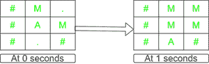

# 从 2D 网格中的给定单元到达边界单元的路径，而不穿过特殊标记的单元

> 原文:[https://www . geeksforgeeks . org/从 2d 网格中的给定单元到达边界单元的路径-无交叉-特殊标记单元/](https://www.geeksforgeeks.org/path-to-reach-border-cells-from-a-given-cell-in-a-2d-grid-without-crossing-specially-marked-cells/)

给定尺寸为 **N*M** 的[矩阵](https://www.geeksforgeeks.org/matrix/)，该矩阵由字符**【M】******组成**和**‘A’**只有一个实例。任务是根据以下规则打印从值为 **A** 的单元格到矩阵任何边界单元格的任意一条路径:**

*   **每秒钟，从单元**‘A’**开始的路径可以在具有**‘的所有四个相邻单元中移动**仅限字符。字符 **L** 、 **R** 、 **U** 、 **D** 分别代表单元格**(X–1，Y)** 、 **(X + 1，Y)** 、 **(X，Y–1)**和 **(X，Y + 1)** 从单元格 **(X，Y)** 移动的方向。**
*   **具有字符 **'#'** 和 **'M'** 的单元格是块单元格。**
*   **每秒钟，具有字符**‘M’**的细胞与字符**‘A’**同时向四个方向扩散。**

****注意:**如果从 **A** 到矩阵的任何边界单元都不存在这样的路径，那么打印**-1”**。**

****示例:****

> ****输入:** mat[][] = {{'# '，' M '，' '}、{“#”、“A”、“M”}、{“#”、“.”，' # ' }
> 输出:D
> T6】说明:T8】矩阵变化如下:**
> 
>  **
> 
> 因此，向下移动 1 个单元格，就可以到达边界单元格。
> 
> **输入:**mat[][]= {“#”、“#”、“#”、“#”、“#”、“#”、“#”、“#”、“#”}、{“#”、“M”、“.”, '.'，' A '，'等', '.', '#'}, {'#', '#', '#', '.'，' M '，' # '，' ', '#'}, {'#', '.', '#', '.', '.', '#', '.', '.'}, {'5', '#', '.'、“#”、“#”、“#”、“#”、“#”、“#”}
> T3】输出: RRDDR**

****方法:**给定的问题可以这样解决:首先在网格上为所有的块单元**【M】**模拟[多源 BFS，然后从单元**【A】**执行 BFS，检查是否可以到达任何边界单元。按照以下步骤解决问题:](https://www.geeksforgeeks.org/multi-source-shortest-path-in-unweighted-graph/)**

*   **初始化一个矩阵，比如说 **G[][]** ，它存储达到具有值**的单元的最小值**来自所有具有值**‘M’**的细胞。**
*   **[对所有具有值**【M】**的单元格](https://www.geeksforgeeks.org/multi-source-shortest-path-in-unweighted-graph/)执行多源 BFS，以找到从其最近的具有**【M】**的单元格到达每个单元格的最短时间，并将其存储在矩阵 **G[][]** 中。**
*   **初始化一个矩阵，说**父[][]** 存储每个单元格的父，说 **(X，Y)** 当对单元格进行任何移动时 **(X，Y)** 。**
*   **从**‘A’**出现的位置开始在网格上执行 [BFS 遍历，使用以下步骤说出 **(SX，SY)** :](https://www.geeksforgeeks.org/breadth-first-traversal-bfs-on-a-2d-array/)

    *   在[队列](https://www.geeksforgeeks.org/queue-data-structure/)中推当前单元格 **(SX，SY)** ，距离为 **0** 。
    *   迭代直到[队列不为空](https://www.geeksforgeeks.org/queueempty-queuesize-c-stl/)并执行以下步骤:
        *   [弹出队列中存储的前单元格](https://www.geeksforgeeks.org/queuepush-and-queuepop-in-cpp-stl/)。
        *   遍历当前弹出节点的所有有效相邻单元，并从队列中弹出的单元中推送发现时间增加的相邻单元。
        *   在上述步骤中，从当前单元格更新移动单元格的父单元格。
        *   如果相邻单元格是边界单元格，则存储该单元格，如 **(EX，EY)** ，[跳出循环](https://www.geeksforgeeks.org/break-statement-cc/)。** 
*   **如果没有到达矩阵的边界，则打印**-1”**。否则，使用以下步骤打印路径:

    *   迭代直到结束单元格 **(EX，EY)** 和开始单元格 **(SX，SY)** 不一样:
        *   找到结束单元格的父单元格，并将单元格 **(EX，EY)** 更新为其父单元格。
        *   根据当前结束单元格与其父单元格的差异打印方向 **L** 、 **R** 、 **U** 、 **D** 。** 

**下面是上述方法的一个实现:**

## **C++**

```
// C++ program for tha above approach
#include <bits/stdc++.h>
using namespace std;

#define largest 10000000

// store the grid (2-d grid)
vector<vector<int> > g;

// store the coordinates of the 'M' cells
vector<pair<int, int> > M;

// record the parent of a index
vector<vector<pair<pair<int, int>, int> > > parent;

// start indices of A
int sx, sy;

// For traversing to adjacent cells
int dx[] = { 1, 0, -1, 0 };
int dy[] = { 0, -1, 0, 1 };

// rows, columns, end-x, end-y
int n, m, ex = -1, ey = -1;

// function to check if the index
// to be processed is valid or not
bool isvalid(int x, int y)
{
    // should not exceed any of the boundary walls
    if (x < 1 || x > n || y < 0 || y > m)
        return false;

    // if current cell has '#'
    if (g[x][y] == largest + 1)
        return false;

    return true;
}

// function to check if the current
// index is at border ornot
bool isborder(int x, int y)
{
    if (x == 1 || y == 1 || x == n || y == m)
        return true;

    return false;
}

// function to get the direction when
// movement is made from (x --> ex) and (y --> ey)
char cal(int x, int y, int ex, int ey)
{
    if (x + 1 == ex && y == ey)
        return 'D';

    if (x - 1 == ex && y == ey)
        return 'U';

    if (x == ex && y + 1 == ey)
        return 'R';

    return 'L';
}

// Function for the multisource
// bfs on M's to store the timers
void fillMatrix()
{
    // queue to store index
    // for bfs and shortest time
    // for each (i, j)
    queue<pair<pair<int, int>, int> > q;
    for (auto m : M) {

        // time at this moment is passed as zero
        q.push({ m, 0 });

        // insert time 0 for this (x, y)
        g[m.first][m.second] = 0;
    }

    // process till the queue becomes empty
    while (!q.empty()) {

        // get the index and time of
        // the element at front of queue
        int x = q.front().first.first;
        int y = q.front().first.second;
        int time = q.front().second;

        // remove it
        q.pop();

        // iterate to all the positions
        // from the given position i.e.
        // (x+1, y), (x-1, y), (x, y+1), (x, y-1)
        for (auto i : { 0, 1, 2, 3 }) {

            int newx = x + dx[i];
            int newy = y + dy[i];

            // check for validity of current index
            if (!isvalid(newx, newy))
                continue;

            // not visited before
            if (g[newx][newy] == -1) {

                // update time
                g[newx][newy] = (time + 1);

                // push it into the queue
                q.push({ { newx, newy }, time + 1 });
            }
        }
    }

    // in the end if there are some places on grid
    // that were blocked and BFS couldn't reach there
    // then just manually iterate over them and
    // change them to largest +1 i.e. treat them as '#'

    for (int i = 1; i <= n; i++) {
        for (int j = 1; j <= m; j++) {
            if (g[i][j] == -1) {
                g[i][j] = largest;
            }
        }
    }
}

// A's BFS. It will return the time
// when A reaches boundary
// if it is not possible, it will return -1
int bfs()
{
    queue<pair<pair<int, int>, int> > q;

    // push the starting (x, y)
    // and it's time as 0
    q.push({ { sx, sy }, 0 });

    while (!q.empty()) {
        int x = q.front().first.first;
        int y = q.front().first.second;
        int time = q.front().second;

        q.pop();

        for (auto i : { 0, 1, 2, 3 }) {
            int newx = x + dx[i];
            int newy = y + dy[i];

            if (!isvalid(newx, newy))
                continue;

            // Moving to this index is not possible
            if ((time + 1) >= (g[newx][newy]))
                continue;

            // index to move on already has
            // a parent i.e. already visited
            if (parent[newx][newy].first.first != -1)
                continue;

            // Move to this index and mark the parents
            parent[newx][newy].first.first = x;
            parent[newx][newy].first.second = y;
            parent[newx][newy].second = time + 1;

            q.push({ { newx, newy }, time + 1 });

            // if this index is a border
            if (isborder(newx, newy)) {

                // update ex and ey
                ex = newx;
                ey = newy;
                return time + 1;
            }
        }
    }

    // if not possible
    return -1;
}

// Function to solve the above problem
void isItPossible(vector<vector<char> > Mat)
{
    // Resize the global vectors
    g.resize(n + 1, vector<int>(m + 1));
    parent.resize(
        n + 1, vector<pair<pair<int, int>, int> >(m + 1));

    for (int i = 1; i <= n; i++) {
        for (int j = 1; j <= m; j++) {

            // initialize that no one is currently the
            // parent of (i, j)
            parent[i][j].first.first = -1;
            parent[i][j].first.second = -1;
            parent[i][j].second = -1;

            char x = Mat[i - 1][j - 1];
            if (x == 'M') {
                // if the input character is 'M',
                // push the coordinates in M and
                // in the grid take 0 as input
                M.push_back({ i, j });
                g[i][j] = 0;
            }

            else if (x == 'A') {
                // this is the start x and start y

                sx = i, sy = j;
                g[i][j] = -1;
            }

            else if (x == '.')
                g[i][j] = -1;

            // denote '#' with largest+1
            else
                g[i][j] = largest + 1;
        }
    }

    // if already at the border
    if (isborder(sx, sy)) {
        cout << "Already a boundary cell\n";
        return;
    }

    // Multisource bfs
    fillMatrix();

    // bfs of A
    int time = bfs();

    // if (end x) index is -1 and
    // boundary has not been
    if (ex == -1) {
        cout << ex;
    }
    else {

        vector<char> ans; // record the path

        while (!(ex == sx && ey == sy)) {
            int x = parent[ex][ey].first.first;
            int y = parent[ex][ey].first.second;

            // get the direction of movement
            char dir = cal(x, y, ex, ey);

            ans.push_back(dir);
            ex = x;
            ey = y;
        }

        reverse(ans.begin(), ans.end());

        for (auto x : ans) {
            cout << x;
        }
    }
}
// Driver code
int main()
{
    // Input
    vector<vector<char> > Mat = { { '#', 'M', '.' },
                                  { '#', 'A', 'M' },
                                  { '#', '.', '#' } };
    n = Mat.size();
    m = Mat[0].size();

    // Function call
    isItPossible(Mat);
    return 0;
}
```

****Output**

```
D
```** 

*****时间复杂度:**O(n * m)*
T5**辅助空间:** O(n*m)**