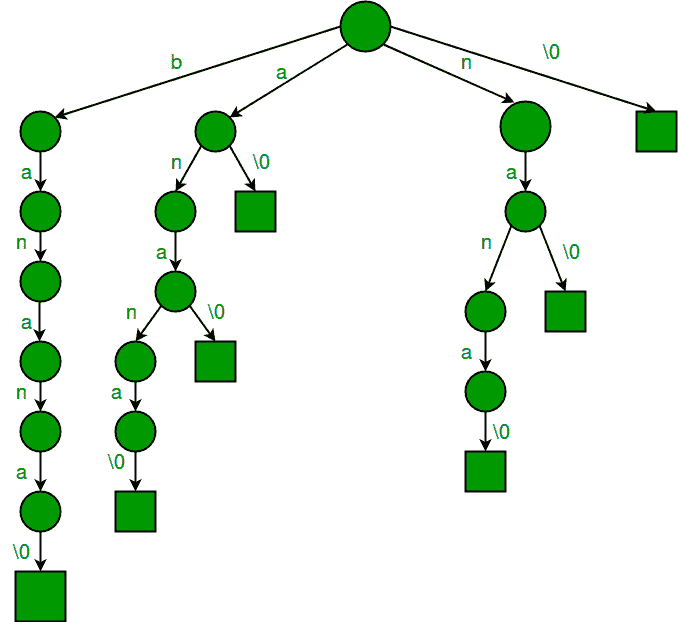

# 使用所有后缀的三元组进行模式搜索

> 原文:[https://www . geesforgeks . org/pattern-search-use-trie-后缀/](https://www.geeksforgeeks.org/pattern-searching-using-trie-suffixes/)

问题陈述:给定一个文本 txt[0..n-1]和模式 pat[0..m-1]，编写一个函数搜索(char pat[]，char txt[])，打印所有出现在 txt[]中的 pat[]。你可以假设 n > m.
正如在[之前的帖子](https://www.geeksforgeeks.org/pattern-searching-set-8-suffix-tree-introduction/)中所讨论的，我们讨论过有两种方法可以有效地解决上述问题。
**1)** 预处理模式: [KMP 算法](https://www.geeksforgeeks.org/searching-for-patterns-set-2-kmp-algorithm/)[拉宾卡普算法](https://www.geeksforgeeks.org/searching-for-patterns-set-3-rabin-karp-algorithm/)[有限自动机](https://www.geeksforgeeks.org/searching-for-patterns-set-5-finite-automata/)[博耶摩尔算法](https://www.geeksforgeeks.org/pattern-searching-set-7-boyer-moore-algorithm-bad-character-heuristic/)。
**2)** 预处理文本:[后缀树](https://www.geeksforgeeks.org/pattern-searching-set-8-suffix-tree-introduction/)

第一种(预处理模式)实现的最佳时间复杂度是 O(n)，第二种(预处理文本)实现的最佳时间复杂度是 O(m)，其中 m 和 n 分别是模式和文本的长度。
注意，第二种方式只在 O(m)时间内进行搜索，在文本变化不是很频繁且搜索查询较多时优先。我们已经讨论了[后缀树(文本所有后缀的压缩特里)](https://www.geeksforgeeks.org/pattern-searching-set-8-suffix-tree-introduction/)。
后缀树的实现对于要在技术访谈或编程环境中编码的问题可能是耗时的。在这篇文章中，讨论了所有后缀的[标准的简单实现。实现接近后缀树，唯一的是，它是一个](https://www.geeksforgeeks.org/trie-insert-and-search/)[简单的 Trie](https://www.geeksforgeeks.org/trie-insert-and-search/) 而不是压缩的 Trie。

正如[后缀树](https://www.geeksforgeeks.org/pattern-searching-set-8-suffix-tree-introduction/)帖子中所讨论的，想法是，文本中存在的每个模式(或者我们可以说文本的每个子串)都必须是所有可能后缀之一的前缀。所以如果我们建立一个所有后缀的 Trie，我们可以在 O(m)时间内找到模式，其中 m 是模式长度。

**建立后缀的 Trie**
1)生成给定文本的所有后缀。
2)将所有后缀视为单个单词，并构建一个 trie。
让我们考虑一个示例文本“香蕉\0”，其中“\0”是字符串终止字符。以下是“香蕉\ 0”
的所有后缀

```
banana\0
anana\0
nana\0
ana\0
na\0
a\0
\0
```

如果我们把上面所有的后缀都看作是单独的单词，并建立一个 Trie，我们会得到以下结果。



**如何在构建的 Trie 中搜索一个模式？**
以下是在构建的特里中搜索模式的步骤。
**1)** 从模式的第一个字符和 Trie 的根开始，对每个字符执行以下操作。
….. **a)** 对于模式的当前字符，如果当前节点有一条边，则跟随该边。
….. **b)** 如果没有边缘，打印“文字中不存在图案”并返回。
**2)** 如果图案的所有字符都已处理，即给定图案的字符有一个从根开始的路径，则打印打印存在图案的所有索引。为了存储索引，我们在每个节点上使用一个列表来存储从该节点开始的后缀索引。

以下是上述想法的实现。

## C++

```
// A simple C++ implementation of substring search using trie of suffixes
#include<iostream>
#include<list>
#define MAX_CHAR 256
using namespace std;

// A Suffix Trie (A Trie of all suffixes) Node
class SuffixTrieNode
{
private:
    SuffixTrieNode *children[MAX_CHAR];
    list<int> *indexes;
public:
    SuffixTrieNode() // Constructor
    {
        // Create an empty linked list for indexes of
        // suffixes starting from this node
        indexes = new list<int>;

        // Initialize all child pointers as NULL
        for (int i = 0; i < MAX_CHAR; i++)
          children[i] = NULL;
    }

    // A recursive function to insert a suffix of the txt
    // in subtree rooted with this node
    void insertSuffix(string suffix, int index);

    // A function to search a pattern in subtree rooted
    // with this node.The function returns pointer to a linked
    // list containing all indexes where pattern is present.
    // The returned indexes are indexes of last characters
    // of matched text.
    list<int>* search(string pat);
};

// A Trie of all suffixes
class SuffixTrie
{
private:
    SuffixTrieNode root;
public:
    // Constructor (Builds a trie of suffies of the given text)
    SuffixTrie(string txt)
    {
        // Consider all suffixes of given string and insert
        // them into the Suffix Trie using recursive function
        // insertSuffix() in SuffixTrieNode class
        for (int i = 0; i < txt.length(); i++)
            root.insertSuffix(txt.substr(i), i);
    }

    // Function to searches a pattern in this suffix trie.
    void search(string pat);
};

// A recursive function to insert a suffix of the txt in
// subtree rooted with this node
void SuffixTrieNode::insertSuffix(string s, int index)
{
    // Store index in linked list
    indexes->push_back(index);

    // If string has more characters
    if (s.length() > 0)
    {
        // Find the first character
        char cIndex = s.at(0);

        // If there is no edge for this character, add a new edge
        if (children[cIndex] == NULL)
            children[cIndex] = new SuffixTrieNode();

        // Recur for next suffix
        children[cIndex]->insertSuffix(s.substr(1), index+1);
    }
}

// A recursive function to search a pattern in subtree rooted with
// this node
list<int>* SuffixTrieNode::search(string s)
{
    // If all characters of pattern have been processed,
    if (s.length() == 0)
        return indexes;

    // if there is an edge from the current node of suffix trie,
    // follow the edge.
    if (children[s.at(0)] != NULL)
        return (children[s.at(0)])->search(s.substr(1));

    // If there is no edge, pattern doesn’t exist in text
    else return NULL;
}

/* Prints all occurrences of pat in the Suffix Trie S (built for text)*/
void SuffixTrie::search(string pat)
{
    // Let us call recursive search function for root of Trie.
    // We get a list of all indexes (where pat is present in text) in
    // variable 'result'
    list<int> *result = root.search(pat);

    // Check if the list of indexes is empty or not
    if (result == NULL)
        cout << "Pattern not found" << endl;
    else
    {
       list<int>::iterator i;
       int patLen = pat.length();
       for (i = result->begin(); i != result->end(); ++i)
         cout << "Pattern found at position " << *i - patLen<< endl;
    }
}

// driver program to test above functions
int main()
{
    // Let us build a suffix trie for text "geeksforgeeks.org"
    string txt = "geeksforgeeks.org";
    SuffixTrie S(txt);

    cout << "Search for 'ee'" << endl;
    S.search("ee");

    cout << "\nSearch for 'geek'" << endl;
    S.search("geek");

    cout << "\nSearch for 'quiz'" << endl;
    S.search("quiz");

    cout << "\nSearch for 'forgeeks'" << endl;
    S.search("forgeeks");

    return 0;
}
```

## Java 语言(一种计算机语言，尤用于创建网站)

```
import java.util.LinkedList;
import java.util.List;
class SuffixTrieNode {

    final static int MAX_CHAR = 256;

    SuffixTrieNode[] children = new SuffixTrieNode[MAX_CHAR];
    List<Integer> indexes;

    SuffixTrieNode() // Constructor
    {
        // Create an empty linked list for indexes of
        // suffixes starting from this node
        indexes = new LinkedList<Integer>();

        // Initialize all child pointers as NULL
        for (int i = 0; i < MAX_CHAR; i++)
            children[i] = null;
    }

    // A recursive function to insert a suffix of
    // the text in subtree rooted with this node
    void insertSuffix(String s, int index) {

        // Store index in linked list
        indexes.add(index);

        // If string has more characters
        if (s.length() > 0) {

            // Find the first character
            char cIndex = s.charAt(0);

            // If there is no edge for this character,
            // add a new edge
            if (children[cIndex] == null)
                children[cIndex] = new SuffixTrieNode();

            // Recur for next suffix
            children[cIndex].insertSuffix(s.substring(1),
                                              index + 1);
        }
    }

    // A function to search a pattern in subtree rooted
    // with this node.The function returns pointer to a
    // linked list containing all indexes where pattern 
    // is present. The returned indexes are indexes of 
    // last characters of matched text.
    List<Integer> search(String s) {

        // If all characters of pattern have been
        // processed,
        if (s.length() == 0)
            return indexes;

        // if there is an edge from the current node of
        // suffix tree, follow the edge.
        if (children[s.charAt(0)] != null)
            return (children[s.charAt(0)]).search(s.substring(1));

        // If there is no edge, pattern doesnt exist in
        // text
        else
            return null;
    }
}

// A Trie of all suffixes
class Suffix_tree{

    SuffixTrieNode root = new SuffixTrieNode();

    // Constructor (Builds a trie of suffies of the
    // given text)
    Suffix_tree(String txt) {

        // Consider all suffixes of given string and
        // insert them into the Suffix Trie using
        // recursive function insertSuffix() in
        // SuffixTrieNode class
        for (int i = 0; i < txt.length(); i++)
            root.insertSuffix(txt.substring(i), i);
    }

    /* Prints all occurrences of pat in the Suffix Trie S
    (built for text) */
    void search_tree(String pat) {

        // Let us call recursive search function for
        // root of Trie.
        // We get a list of all indexes (where pat is
        // present in text) in variable 'result'
        List<Integer> result = root.search(pat);

        // Check if the list of indexes is empty or not
        if (result == null)
            System.out.println("Pattern not found");
        else {

            int patLen = pat.length();

            for (Integer i : result)
                System.out.println("Pattern found at position " +
                                                (i - patLen));
        }
    }

    // driver program to test above functions
    public static void main(String args[]) {

        // Let us build a suffix trie for text
        // "geeksforgeeks.org"
        String txt = "geeksforgeeks.org";
        Suffix_tree S = new Suffix_tree(txt);

        System.out.println("Search for 'ee'");
        S.search_tree("ee");

        System.out.println("\nSearch for 'geek'");
        S.search_tree("geek");

        System.out.println("\nSearch for 'quiz'");
        S.search_tree("quiz");

        System.out.println("\nSearch for 'forgeeks'");
        S.search_tree("forgeeks");
    }
}
// This code is contributed by Sumit Ghosh
```

## C#

```
// C# implementation of the approach
using System;
using System.Collections.Generic;
class SuffixTrieNode
{
    static int MAX_CHAR = 256;

    public SuffixTrieNode[] children = new SuffixTrieNode[MAX_CHAR];
    public List<int> indexes;

    public SuffixTrieNode() // Constructor
    {
        // Create an empty linked list for indexes of
        // suffixes starting from this node
        indexes = new List<int>();

        // Initialize all child pointers as NULL
        for (int i = 0; i < MAX_CHAR; i++)
            children[i] = null;
    }

    // A recursive function to insert a suffix of
    // the text in subtree rooted with this node
    public void insertSuffix(String s, int index)
    {

        // Store index in linked list
        indexes.Add(index);

        // If string has more characters
        if (s.Length > 0)
        {

            // Find the first character
            char cIndex = s[0];

            // If there is no edge for this character,
            // add a new edge
            if (children[cIndex] == null)
                children[cIndex] = new SuffixTrieNode();

            // Recur for next suffix
            children[cIndex].insertSuffix(s.Substring(1),
                                              index + 1);
        }
    }

    // A function to search a pattern in subtree rooted
    // with this node.The function returns pointer to a
    // linked list containing all indexes where pattern
    // is present. The returned indexes are indexes of
    // last characters of matched text.
    public List<int> search(String s)
    {

        // If all characters of pattern have been
        // processed,
        if (s.Length == 0)
            return indexes;

        // if there is an edge from the current node of
        // suffix tree, follow the edge.
        if (children[s[0]] != null)
            return (children[s[0]]).search(s.Substring(1));

        // If there is no edge, pattern doesnt exist in
        // text
        else
            return null;
    }
}

// A Trie of all suffixes
public class Suffix_tree
{

    SuffixTrieNode root = new SuffixTrieNode();

    // Constructor (Builds a trie of suffies of the
    // given text)
    Suffix_tree(String txt)
    {

        // Consider all suffixes of given string and
        // insert them into the Suffix Trie using
        // recursive function insertSuffix() in
        // SuffixTrieNode class
        for (int i = 0; i < txt.Length; i++)
            root.insertSuffix(txt.Substring(i), i);
    }

    /* Prints all occurrences of pat in the
    Suffix Trie S (built for text) */
    void search_tree(String pat)
    {

        // Let us call recursive search function
        // for root of Trie.
        // We get a list of all indexes (where pat is
        // present in text) in variable 'result'
        List<int> result = root.search(pat);

        // Check if the list of indexes is empty or not
        if (result == null)
            Console.WriteLine("Pattern not found");
        else
        {
            int patLen = pat.Length;

            foreach (int i in result)
                Console.WriteLine("Pattern found at position " +
                                                  (i - patLen));
        }
    }

    // Driver Code
    public static void Main(String []args)
    {

        // Let us build a suffix trie for text
        // "geeksforgeeks.org"
        String txt = "geeksforgeeks.org";
        Suffix_tree S = new Suffix_tree(txt);

        Console.WriteLine("Search for 'ee'");
        S.search_tree("ee");

        Console.WriteLine("\nSearch for 'geek'");
        S.search_tree("geek");

        Console.WriteLine("\nSearch for 'quiz'");
        S.search_tree("quiz");

        Console.WriteLine("\nSearch for 'forgeeks'");
        S.search_tree("forgeeks");
    }
}

// This code is contributed by 29AjayKumar
```

## java 描述语言

```
<script>
let MAX_CHAR = 256;

class SuffixTrieNode
{

    // Constructor
    constructor()   
    {
        this.indexes = [];
        this.children = new Array(MAX_CHAR);

        for(let i = 0; i < MAX_CHAR; i++)
        {
            this.children[i] = 0;
        }
    }

// A recursive function to insert a suffix of
// the text in subtree rooted with this node
insertSuffix(s,index)
{

    // Store index in linked list
    this.indexes.push(index);

    // If string has more characters
    if (s.length > 0)
    {

        // Find the first character
        let cIndex = s[0];

        // If there is no edge for this character,
        // add a new edge
        if (this.children[cIndex] == null)
            this.children[cIndex] = new SuffixTrieNode();

        // Recur for next suffix
        this.children[cIndex].insertSuffix(s.substring(1),
                                           index + 1);
    }
}

// A function to search a pattern in subtree rooted
// with this node.The function returns pointer to a
// linked list containing all indexes where pattern 
// is present. The returned indexes are indexes of 
// last characters of matched text.
search(s)
{

    // If all characters of pattern have been
    // processed,
    if (s.length == 0)
        return this.indexes;

    // If there is an edge from the current node of
    // suffix tree, follow the edge.
    if (this.children[s[0]] != null)
        return(this.children[s[0]].search(
                  s.substring(1)));

    // If there is no edge, pattern doesnt exist in
    // text
    else
        return null;
}
}

let root = new SuffixTrieNode();

// Constructor (Builds a trie of suffies of the
// given text)
function Suffix_tree(txt)
{

    // Consider all suffixes of given string and
    // insert them into the Suffix Trie using
    // recursive function insertSuffix() in
    // SuffixTrieNode class
    for(let i = 0; i < txt.length; i++)
        root.insertSuffix(txt.substring(i), i);
}

/* Prints all occurrences of pat in the Suffix
Trie S (built for text) */
function search_tree(pat)
{

    // Let us call recursive search function for
    // root of Trie.
    // We get a list of all indexes (where pat is
    // present in text) in variable 'result'
    let result = root.search(pat);

    // Check if the list of indexes is empty or not
    if (result == null)
        document.write("Pattern not found<br>");
    else
    {
        let patLen = pat.length;

        for(let i of result.values())
            document.write("Pattern found at position " +
                           (i - patLen)+"<br>");
    }
}

// Driver code

// Let us build a suffix trie for text
// "geeksforgeeks.org"
let txt = "geeksforgeeks.org";
Suffix_tree(txt);

document.write("Search for 'ee'<br>");
search_tree("ee");

document.write("<br>Search for 'geek'<br>");
search_tree("geek");

document.write("<br>Search for 'quiz'<br>");
search_tree("quiz");

document.write("<br>Search for 'forgeeks'<br>");
search_tree("forgeeks");

// This code is contributed by unknown2108

</script>
```

**输出:**

```
Search for 'ee'
Pattern found at position 1
Pattern found at position 9

Search for 'geek'
Pattern found at position 0
Pattern found at position 8

Search for 'quiz'
Pattern not found

Search for 'forgeeks'
Pattern found at position 5
```

上述搜索函数的时间复杂度为 O(m+k)，其中 m 是模式的长度，k 是模式在文本中出现的次数。
本文由 Ashish Anand 供稿。如果你发现任何不正确的地方，或者你想分享更多关于上面讨论的话题的信息，请写评论。