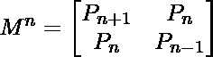
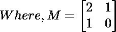

# 佩尔号

> 原文:[https://www.geeksforgeeks.org/pell-number/](https://www.geeksforgeeks.org/pell-number/)

佩尔数是类似于斐波那契数的数字，由以下公式
生成

```
Pn = 2*Pn-1 + Pn-2 
with seeds P0 = 0 and P1 = 1
```

前几个佩尔数字是 0，1，2，5，12，29，70，169，408，985，2378，5741，13860，33461，…
写一个返回 P <sub>n</sub> 的函数 int pell(int n)。
示例:

```
Input : n = 4
Output :12

Input  : n = 7
Output : 169
```

**方法 1(使用递归)**

## C++

```
// Pell Number Series using Recursion in C++
#include <bits/stdc++.h>
using namespace std;

// calculate nth pell number
int pell(int n)
{
    if (n <= 2)
        return n;
    return 2 * pell(n - 1) + pell(n - 2);
}

// Driver Code
int main()
{
    int n = 4;
    cout << " " << pell(n);
    return 0;
}

// This code is contributed by shivanisinghss2110
```

## C

```
// Pell Number Series using Recursion in C
#include <stdio.h>

// calculate nth pell number
int pell(int n)
{
    if (n <= 2)
        return n;
    return 2 * pell(n - 1) + pell(n - 2);
}

// driver function
int main()
{
    int n = 4;
    printf("%d", pell(n));
    return 0;
}
```

## Java 语言(一种计算机语言，尤用于创建网站)

```
// Pell Number Series using Recursion in JAVA
class PellNumber {

    // calculate n-th Pell number
    public static int pell(int n)
    {
        if (n <= 2)
            return n;
        return 2 * pell(n - 1) + pell(n - 2);
    }

    // driver function
    public static void main(String args[])
    {
        int n = 4;
        System.out.println(pell(n));
    }
}
```

## 蟒蛇 3

```
# Pell Number Series using
# Recursion in Python3

# Calculate nth pell number
def pell(n) :
    if (n <= 2) :
        return n
    return (2 * pell(n - 1) + pell(n - 2))

# Driver function
n = 4;
print(pell(n))

# This code is contributed by Nikita Tiwari.
```

## C#

```
// Pell Number Series using Recursion in C#
using System;

class PellNumber {

    // calculate n-th Pell number
    public static int pell(int n)
    {
        if (n <= 2)
            return n;
        return 2 * pell(n - 1) + pell(n - 2);
    }

    // Driver function
    public static void Main()
    {
        int n = 4;
        Console.Write(pell(n));
    }
}

// This code is contributed by vt_m.
```

## 服务器端编程语言（Professional Hypertext Preprocessor 的缩写）

```
<?php
// Pell Number Series using
// Recursion in PHP

// calculate nth pell number
function pell($n)
{
    if ($n <= 2)
        return $n;
    return 2 * pell($n - 1) +
               pell($n - 2);
}

// Driver Code
$n = 4;
echo(pell($n));

// This code is contributed by Ajit.
?>
```

## java 描述语言

```
<script>
// Pell Number Series using
// Recursion in Javascript

// calculate nth pell number
function pell(n)
{
    if (n <= 2)
        return n;
    return 2 * pell(n - 1) +
            pell(n - 2);
}

// Driver Code
let n = 4;
document.write(pell(n));

// This code is contributed by _saurabh_jaiswal.
</script>
```

输出:

```
12
```

**方法 2(迭代)**

## C++

```
// Iterative Pell Number Series in C++
#include <bits/stdc++.h>
using namespace std;

// Calculate nth pell number
int pell(int n)
{
    if (n <= 2)
        return n;

    int a = 1;
    int b = 2;
    int c, i;
    for(i = 3; i <= n; i++)
    {
       c = 2 * b + a;
       a = b;
       b = c;
    }
    return b;
}

// Driver Code
int main()
{
    int n = 4;

    cout << pell(n);
    return 0;
}

// This code is contributed by nidhi_biet
```

## C

```
// Iterative Pell Number Series in C
#include <stdio.h>

// calculate nth pell number
int pell(int n)
{
    if (n <= 2)
        return n;

    int a = 1;
    int b = 2;
    int c, i;
    for (i = 3; i <= n; i++) {
        c = 2 * b + a;
        a = b;
        b = c;
    }
    return b;
}

// driver function
int main()
{
    int n = 4;
    printf("%d", pell(n));
    return 0;
}
```

## Java 语言(一种计算机语言，尤用于创建网站)

```
// Iterative Pell Number Series in Java
class PellNumber {

    // calculate nth pell number
    public static int pell(int n)
    {
        if (n <= 2)
            return n;
        int a = 1;
        int b = 2;
        int c;
        for (int i = 3; i <= n; i++) {
            c = 2 * b + a;
            a = b;
            b = c;
        }
        return b;
    }

    // driver function
    public static void main(String args[])
    {
        int n = 4;
        System.out.println(pell(n));
    }
}
```

## 计算机编程语言

```
# Iterative Pell Number
# Series in Python 3

# calculate nth pell number
def pell(n) :
    if (n <= 2) :
        return n

    a = 1
    b = 2
    for i in range(3, n+1) :
        c = 2 * b + a
        a = b
        b = c

    return b

# driver function
n = 4
print(pell(n))

# This code is contributed by Nikita Tiwari.
```

## C#

```
// Iterative Pell Number Series in C#
using System;
class PellNumber {

    // calculate nth pell number
    public static int pell(int n)
    {
        if (n <= 2)
            return n;
        int a = 1;
        int b = 2;
        int c;
        for (int i = 3; i <= n; i++) {
            c = 2 * b + a;
            a = b;
            b = c;
        }
        return b;
    }

    // Driver function
    public static void Main()
    {
        int n = 4;
        Console.Write(pell(n));
    }
}

// This code is contributed by vt_m.
```

## 服务器端编程语言（Professional Hypertext Preprocessor 的缩写）

```
<?php
// Iterative Pell Number Series in PHP

// calculate nth pell number
function pell($n)
{
    if ($n <= 2)
        return $n;

    $a = 1;
    $b = 2;
    $c; $i;
    for ($i = 3; $i <= $n; $i++)
    {
        $c = 2 * $b + $a;
        $a = $b;
        $b = $c;
    }
    return $b;
}

// Driver Code
$n = 4;
echo(pell($n));

// This code is contributed by Ajit.
?>
```

## java 描述语言

```
<script>
    // Iterative Pell Number Series in Javascript

    // calculate nth pell number
    function pell(n)
    {
        if (n <= 2)
            return n;
        let a = 1;
        let b = 2;
        let c;
        for (let i = 3; i <= n; i++) {
            c = 2 * b + a;
            a = b;
            b = c;
        }
        return b;
    }

    let n = 4;
      document.write(pell(n));

</script>
```

输出:

```
12
```

时间复杂度:O(n)
额外空间:O(1)
**使用矩阵计算** :
这是另一个 O(n)，它依赖于这样一个事实:如果我们 n 次将矩阵 M = {{2，1}，{1，0}}乘以它本身(换句话说，计算幂(M，n))，那么我们得到第(n+1)个 Pell 数作为结果矩阵中行和列(0，0)的元素。


时间复杂度:由于我们可以在 O(log n)时间内计算出 2 × 2 矩阵的 n 次方，所以这个解的时间复杂度为 O(log n)
本文由 **Pavan Gopal Rayapati** 供稿。如果你喜欢 GeeksforGeeks 并想投稿，你也可以使用[contribute.geeksforgeeks.org](http://www.contribute.geeksforgeeks.org)写一篇文章或者把你的文章邮寄到 contribute@geeksforgeeks.org。看到你的文章出现在极客博客主页上，帮助其他极客。
如果发现有不正确的地方，或者想分享更多关于上述话题的信息，请写评论。