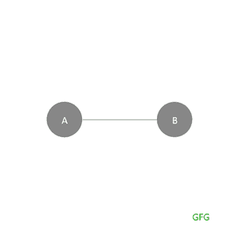
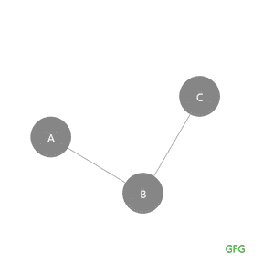
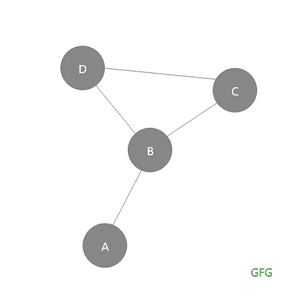

# 图形中的悬垂顶点、非悬垂顶点、悬垂边和非悬垂边

> 原文:[https://www . geeksforgeeks . org/挂件-顶点-非挂件-顶点-挂件-边-和-非挂件-边-图中/](https://www.geeksforgeeks.org/pendant-vertices-non-pendant-vertices-pendant-edges-and-non-pendant-edges-in-graph/)

前提:[握手定理。](https://www.geeksforgeeks.org/handshaking-lemma-and-interesting-tree-properties/)

### <u>在顶点期间</u>

设 **G** 为[图](https://www.geeksforgeeks.org/graph-data-structure-and-algorithms/)，当且仅当 **v** 有**度 1** 时， **G** 的顶点 **v** 称为**垂悬顶点**。换句话说，悬垂顶点是具有**度 1** 的顶点，也称为**悬垂顶点**。

> **注:**度=连接到顶点的边数

就树木而言，**悬垂顶点**被称为**末端节点**或**叶节点**，或**叶**，因为它只有 **1** 度。请记住，叶节点只有 1 度，因此悬垂顶点在树的情况下称为叶节点。

**示例:**在给定的图中 **A** 和 **B** 是悬垂顶点，因为它们每个都有度数 **1** 。



图表 1.0

让我们以这个例子来打印图形中的所有悬挂顶点。

## C++

```
// C++ program for the above approach
#include <bits/stdc++.h>
using namespace std;

// Function to print all the pendant
// vertices
void printPendantVertices(map<char, vector<char> > graph)
{

    // All the vectors which contain only 1
    // vertex i.e, size 1 has only 1 edge
    // hence a pendant vertex.
    for (auto x : graph) {
        if (x.second.size() == 1) {
            cout << x.first << " ";
        }
    }
}

// Driver Code
int main()
{

    map<char, vector<char> > graph;
    graph['A'].push_back('B');
    graph['B'].push_back('A');
    graph['C'].push_back('B');
    graph['B'].push_back('C');

    printPendantVertices(graph);

    return 0;
}
```

## java 描述语言

```
<script>
// Javascript program for the above approach

// Function to print all the pendant
// vertices
function printPendantVertices(graph) {
  // All the vectors which contain only 1
  // vertex i.e, size 1 has only 1 edge
  // hence a pendant vertex.
  for (x of graph) {
    if (x[1].length == 1) {
      document.write(x[0] + " ");
    }
  }
}

// Driver Code

let graph = new Map();
graph.set("A", ["B"]);
graph.set("B", ["A"]);
graph.set("C", ["B"]);
graph.set("B", [...graph.get("B")].push("A"));

printPendantVertices(graph);

// This code is contributed by saurabh_jaiswal.
</script>
```

**Output**

```
A C 
```

### **<u>【非顶点】</u>**

非悬挂顶点是除了 **1** 以外的**度**的顶点。在树的情况下，非悬挂顶点是**非叶节点**，因为它没有度 **1** (叶节点有度 **1** )。

**示例:**在给定的图中 **A** 和 **C** 是悬垂顶点，因为 **A** 和 **C** 有度数 **1** ，B 是非悬垂顶点，因为它包含除 **1** 以外的度数，而后者是 **2** 。



图表 2.0

### **<u>边上</u>**

当且仅当**图的一个顶点是悬垂顶点时，该图的一条边称为悬垂边。**

**示例:**在给定的图中 **AB** 是悬垂边，因为它包含悬垂顶点作为其顶点之一。


图表 3.0

### **<u>【无边】</u>**

如果图形的边不包含作为其顶点之一的 **悬垂顶点，则称该边是非悬垂边。**

**示例:**在给定的图中 **AB** 是一条悬垂边，因为它的一个顶点是悬垂顶点(A)。 **BD，BC，DC** 是非挂件顶点。



图表 4.0

### **<u>例:</u>**

让我们看一些基于上述主题的问题示例:

**Q1。假设一棵树 T 有 2 个 2 度的顶点，4 个 3 度的顶点**，**和 3 个 4 度的顶点。找出 t 中垂悬顶点的数量**

> 寻找悬挂顶点的数量只不过是寻找叶节点的数量。
> 我们用握手定理公式
> 
> 所有度数之和= 2 *(边之和)
> 
> (2 个顶点)* (2 度)+ (4 个顶点)* (3 度)+ (3 个顶点)* (4 度)+ (k 个顶点)* (1 度)= (2 *边)
> 
> 其中
> **k** 是具有 1 度的悬垂顶点或叶节点
> **e** 是树中边的总数
> 
> 2 * 2+4 * 3+3 * 4+k * 1 = 2 * e—-(1)
> 
> 记住:**边数=顶点数–1**
> 
> e=(2+4+3+k)-1
> 
> e=9+k-1
> 
> e=8+k ——-(2)
> 
> 将等式 2 放在 1 中给出
> 
> 4 + 12 + 12 + k = 2(8+k)
> 
> 28 + k = 16 + 2k
> 
> -2k+k = 16–28
> 
> -k = -12
> 
> k = 12
> 
> 所以悬垂顶点的总数是 12

**Q2。如果一棵树 T 有 4 个 2 度的顶点，1 个 3 度的顶点，2 个 4 度的顶点和 1 个 5 度的顶点。求 t 中垂悬顶点的数量**

> 寻找悬挂顶点的数量只不过是寻找叶节点的数量。
> 
> 让我们使用握手定理公式
> 
> 所有度数之和= 2 *(边之和)
> 
> (4 个顶点)*(2 度)+ (1 个顶点)*(3 度)+ (2 个顶点)*(4 度)+ (1 个顶点)*(5 度)+ (k 个顶点)*(1 度)= (2 *边)
> 
> 其中
> **k** 是具有 1 度的悬垂顶点或叶节点
> **e** 是树中边的总数
> 
> 4*2 + 1*3 + 2*4 + 1*5 + k*1 = 2*e ——-(1)
> 
> 记住边数=顶点数–1
> 
> e=(4+1+2+1+k)-1
> 
> e=8+k-1
> 
> e=7+k ——-(2)
> 
> 将等式 2 放在 1 中给出
> 
> 8 + 3 + 8 + 5 + k = 2(7+k)
> 
> 24 + k = 14 + 2k
> 
> -2k+k = 14–24
> 
> -k = -10
> 
> k = 10
> 
> 所以悬垂顶点的总数是 10