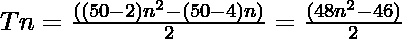

# 五角数

> 哎哎哎:# t0]https://www . geeksforgeeks . org/Pentagon-number/

给定一个编号 **N** ，任务是找到**N<sup>th</sup>T5[五角星编号](https://en.wikipedia.org/wiki/Pentacontagon)。** 

> 一个[五角星号](https://en.wikipedia.org/wiki/Pentacontagon)是一类图形号。它有一个 50 边的多边形，叫做五角形。第 N 个五角形点数是 50 个点，所有其他点都被一个公共共享角包围并形成一个图案。前几个五角星数字是 **1，50，147，292……**

**例:**

> **输入:** N = 2
> **输出:** 50
> **说明:**
> 第二个五角星号是 50。
> **输入:** N = 3
> **输出:** 147

**方法:**第 N 个五角星数由公式给出:

*   s 边多边形的第 n 项= 

*   因此 50 边多边形的第 n 项是

> 

以下是上述方法的实现:

## C++

```
// C++ program for above approach
#include <bits/stdc++.h>
using namespace std;

// Finding the nth pentacontagon Number
int pentacontagonNum(int n)
{
    return (48 * n * n - 46 * n) / 2;
}

// Driver Code
int main()
{
    int n = 3;
    cout << "3rd pentacontagon Number is = "
         << pentacontagonNum(n);

    return 0;
}

// This code is contributed by Akanksha_Rai
```

## C

```
// C program for above approach
#include <stdio.h>
#include <stdlib.h>

// Finding the nth pentacontagon Number
int pentacontagonNum(int n)
{
    return (48 * n * n - 46 * n) / 2;
}

// Driver program to test above function
int main()
{
    int n = 3;
    printf("3rd pentacontagon Number is = %d",
           pentacontagonNum(n));

    return 0;
}
```

## Java 语言(一种计算机语言，尤用于创建网站)

```
// Java program for above approach
import java.util.*;

class GFG {

// Finding the nth pentacontagon number
static int pentacontagonNum(int n)
{
    return (48 * n * n - 46 * n) / 2;
}

// Driver code
public static void main(String[] args)
{
    int n = 3;

    System.out.println("3rd pentacontagon Number is = " +
                                    pentacontagonNum(n));
}
}

// This code is contributed by offbeat
```

## 蟒蛇 3

```
# Python3 program for above approach

# Finding the nth pentacontagon Number
def pentacontagonNum(n):

    return (48 * n * n - 46 * n) // 2

# Driver Code
n = 3
print("3rd pentacontagon Number is = ",
                   pentacontagonNum(n))

# This code is contributed by divyamohan123
```

## C#

```
// C# program for above approach
using System;

class GFG {

// Finding the nth pentacontagon number
static int pentacontagonNum(int n)
{
    return (48 * n * n - 46 * n) / 2;
}

// Driver code
public static void Main(string[] args)
{
    int n = 3;

    Console.Write("3rd pentacontagon Number is = " +
                               pentacontagonNum(n));
}
}

// This code is contributed by rutvik_56   
```

## java 描述语言

```
<script>

// javascript program for above approach

// Finding the nth pentacontagon Number
function pentacontagonNum( n)
{
    return (48 * n * n - 46 * n) / 2;
}

// Driver code
let n = 3;
document.write("3rd pentacontagon Number is " + pentacontagonNum(n));

// This code contributed by gauravrajput1

</script>
```

**Output:** 

```
3rd pentacontagon Number is = 147
```

***时间复杂度:** O(1)*

***辅助空间:** O(1)*

**参考资料:**[https://en . Wikipedia . org/wiki/Pentagon](https://en.wikipedia.org/wiki/Pentacontagon)