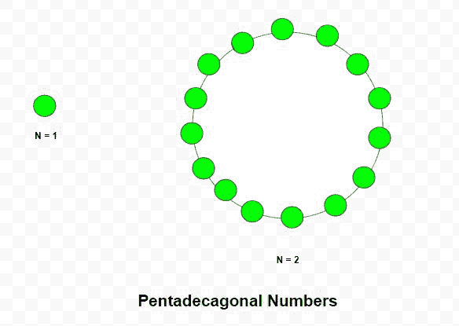

# 五边形数

> 原文:[https://www.geeksforgeeks.org/pentadecagonal-number/](https://www.geeksforgeeks.org/pentadecagonal-number/)

给定一个数 N，任务是找到第 N<sup>个五边形数。</sup> 

> 五边形数是将三角形和正方形的概念扩展到五边形(一个 15 边的多边形)的图形数。第 N <sup>个</sup>五边形数计算 N 个嵌套五边形图案中的点数，所有五边形共享一个公共角，其中图案中的第 i <sup>个</sup>三边形具有由相互间隔一个单位的“I”个点组成的边。前几个十边形数字是 **1、15、42、82、135、201、280……**

**例:**

> **输入:** N = 2
> **输出:** 15
> **说明:**
> 第二个五边形数是 15。
> **输入:** N = 6
> **输出:** 201



**方法:**第 N 个<sup>五边形数由公式给出:</sup> 

以下是上述方法的实现:

## C++

```
// C++ program to find Nth
// Pentadecagonal number
#include <bits/stdc++.h>
using namespace std;

// Function to find N-th
// Pentadecagonal number
int Pentadecagonal_num(int n)
{
    // Formula to calculate nth
    // Pentadecagonal number
    return (13 * n * n - 11 * n) / 2;
}

// Driver code
int main()
{
    int n = 3;
    cout << Pentadecagonal_num(n) << endl;

    n = 10;
    cout << Pentadecagonal_num(n) << endl;

    return 0;
}
```

## Java 语言(一种计算机语言，尤用于创建网站)

```
// Java program to find Nth
// pentadecagonal number
import java.io.*;
import java.util.*;

class GFG{

// Function to find N-th
// pentadecagonal number
static int Pentadecagonal_num(int n)
{

    // Formula to calculate nth
    // Pentadecagonal number
    return (13 * n * n - 11 * n) / 2;
}

// Driver code
public static void main(String[] args)
{
    int n = 3;
    System.out.println(Pentadecagonal_num(n));

    n = 10;
    System.out.println(Pentadecagonal_num(n));
}
}

// This code is contributed by coder001
```

## 蟒蛇 3

```
# Python3 program to find Nth
# pentadecagonal number

# Function to find N-th
# pentadecagonal number
def Pentadecagonal_num(n):

    # Formula to calculate nth
    # pentadecagonal number
    return (13 * n * n - 11 * n) / 2

# Driver code   
n = 3
print(int(Pentadecagonal_num(n)))

n = 10
print(int(Pentadecagonal_num(n)))

# This code is contributed by divyeshrabadiya07
```

## C#

```
// C# program to find Nth
// pentadecagonal number
using System;
class GFG{

// Function to find N-th
// pentadecagonal number
static int Pentadecagonal_num(int n)
{

    // Formula to calculate nth
    // Pentadecagonal number
    return (13 * n * n - 11 * n) / 2;
}

// Driver code
public static void Main(string[] args)
{
    int n = 3;
    Console.Write(Pentadecagonal_num(n) + "\n");

    n = 10;
    Console.Write(Pentadecagonal_num(n) + "\n");
}
}

// This code is contributed by rutvik_56
```

## java 描述语言

```
<script>

    // Javascript program to find Nth
    // Pentadecagonal number

    // Function to find N-th
    // Pentadecagonal number
    function Pentadecagonal_num(n)
    {
        // Formula to calculate nth
        // Pentadecagonal number
        return (13 * n * n - 11 * n) / 2;
    }

    let n = 3;
    document.write(Pentadecagonal_num(n) + "</br>");

    n = 10;
    document.write(Pentadecagonal_num(n));

</script>
```

**Output:** 

```
42
595
```

参考:[https://en.wikipedia.org/wiki/Polygonal_number](https://en.wikipedia.org/wiki/Polygonal_number)