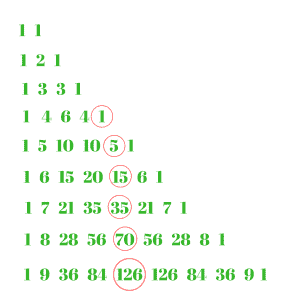

# 五胞胎号

> 原文:[https://www.geeksforgeeks.org/pentatope-number/](https://www.geeksforgeeks.org/pentatope-number/)

给定一个数 n，求第 n 个 Pentatope 数。一个五元数由[帕斯卡三角形](https://www.geeksforgeeks.org/pascal-triangle/)任意一行的第五个数表示。因为它是第五个数字，所以应该从至少有 5 个数字的行开始。从第 1 4 6 4 1 行开始。第 n 个五题号的**公式**为: **n (n+1) (n+2) (n+3) / 24**
起始五题号为:1、5、15、35、70、126、210、330、495…..
**pentoppe 编号:**



在上图中，红色圈出的数字是五元数字。
**例:**

```
Input : 4
Output : 35

Input : 8
Output : 330
```

以下是第 n 个 Pentatope 编号的实现:

## C++

```
// CPP Program to find the
// nth Pentatope number
#include <bits/stdc++.h>
using namespace std;

// function for Pentatope
// number
int Pentatope_number(int n)
{
    // formula for find Pentatope
    // nth term
    return n * (n + 1) * (n + 2) * (n + 3) / 24;
}

// Driver Code
int main()
{
    int n = 7;
    cout << n << "th Pentatope number :"
         << Pentatope_number(n) << endl;

    n = 12;
    cout << n << "th Pentatope number :"
         << Pentatope_number(n) << endl;

    return 0;
}
```

## Java 语言(一种计算机语言，尤用于创建网站)

```
// Java Program to find the nth Pentatope
// number
import java.io.*;

class GFG {

    // function for Pentatope
    // number
    static int Pentatope_number(int n)
    {

        // formula for find Pentatope
        // nth term
        return n * (n + 1) * (n + 2) *
                         (n + 3) / 24;
    }

    // Driver Code
    public static void main (String[] args)
    {
        int n = 7;
        System.out.println( n + "th "
                   + "Pentatope number :"
                  + Pentatope_number(n));

        n = 12;
        System.out.println( n + "th "
                  + "Pentatope number :"
                 + Pentatope_number(n));
    }
}

// This code is contributed by anuj_67.
```

## 蟒蛇 3

```
# Python3 program to find
# nth Pentatope number

# Function to calculate
# Pentatope number
def Pentatope_number(n):

    # Formula to calculate nth
    # Pentatope number
    return (n * (n + 1) * (n + 2)
                 * (n + 3) // 24)

# Driver Code
n = 7
print("%sth Pentatope number : " %n,
                    Pentatope_number(n))
n = 12
print("%sth Pentatope number : " %n,
                    Pentatope_number(n))

# This code is contributed by ajit.    
```

## C#

```
// C# Program to find the nth Pentatope
// number
using System;

class GFG {

    // function for Pentatope
    // number
    static int Pentatope_number(int n)
    {

        // formula for find Pentatope
        // nth term
        return n * (n + 1) * (n + 2) *
                         (n + 3) / 24;
    }

    // Driver Code
    public static void Main ()
    {
        int n = 7;
        Console.WriteLine( n + "th "
                + "Pentatope number :"
               + Pentatope_number(n));

        n = 12;
        Console.WriteLine( n + "th "
                + "Pentatope number :"
               + Pentatope_number(n));
    }
}

// This code is contributed by anuj_67.
```

## 服务器端编程语言（Professional Hypertext Preprocessor 的缩写）

```
<?php
// PHP Program to find the
// nth Pentatope number

// function for Pentatope
// number
function Pentatope_number($n)
{

    // formula for find Pentatope
    // nth term
    return $n * ($n + 1) *
          ($n + 2) * ($n + 3)
                       / 24;
}

    // Driver Code
    $n = 7;
    echo $n , "th Pentatope number :"
            , Pentatope_number($n), "\n";

    $n = 12;
    echo $n , "th Pentatope number :"
            , Pentatope_number($n) ;

// This code is contributed by anuj_67.

?>
```

## java 描述语言

```
<script>

// Javascript  Program to find the
// nth Pentatope number

// function for Pentatope
// number
function Pentatope_number(n)
{

    // formula for find Pentatope
    // nth term
    return n * (n + 1) *(n + 2) * (n + 3)/ 24;
}

    // Driver Code
    let n = 7;
    document.write( n + "th "
                   + "Pentatope number : "
                  + Pentatope_number(n)+"<br>") ;

     n = 12;
    document.write( n + "th "
                   + "Pentatope number : "
                  + Pentatope_number(n)) ;

// This code is contributed by sravan kumar

</script>
```

**输出:**

```
7th Pentatope number : 210
12th Pentatope number : 1365
```

**参考资料:**[https://en . Wikipedia . org/wiki/penttope _ number/](https://en.wikipedia.org/wiki/Pentatope_number)