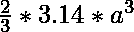
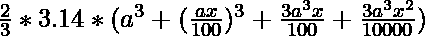
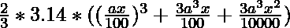
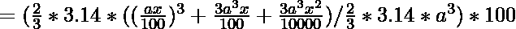

# 半径改变时半球体积的百分比变化

> 原文:[https://www . geeksforgeeks . org/半球体积百分比变化-如果半径发生变化/](https://www.geeksforgeeks.org/percentage-change-in-hemisphere-volume-if-radius-is-changed/)

假设[半球](https://www.geeksforgeeks.org/program-calculate-volume-surface-area-hemisphere/)的半径以固定的百分比变化，那么目标是计算半球体积变化的百分比。

> **例:**
> **输入:** r = 20%
> **输出:** 72.80%
> **输入:** r = 70%
> **输出:** 391.30 %

**进场:**

*   让，半球的半径= 

*   给定百分比增加= 

*   音量增大前= 

*   增加后新半径= 

*   所以，新卷= 

*   体积变化= 

*   
    
    体积百分比增加

以下是上述方法的实现:

## 卡片打印处理机（Card Print Processor 的缩写）

```
// C++ program to find percentage change
// in hemisphere volume wrt change in radius

#include <iostream>
#include <math.h>
using namespace std;

// Function to find the change
// in hemispheric volume
void new_vol(double x)
{

    if (x > 0) {

        cout << "% change in the "
             << "volume of the hemisphere: "
             << pow(x, 3) / 10000 + 3 * x
                    + (3 * pow(x, 2)) / 100
             << "%"
             << " increase\n";
    }

    else if (x < 0) {

        cout << "% change in the "
             << "volume of the hemisphere: "
             << pow(x, 3) / 10000 + 3 * x
                    + (3 * pow(x, 2)) / 100
             << "% decrease\n";
    }

    else {
        cout << "Volume remains the same.";
    }
}

// Driver code
int main()
{

    // Get the change in radius
    double x = -10.0;

    // Calculate the change in hemispheric volume
    new_vol(x);

    return 0;
}
```

## Java 语言(一种计算机语言，尤用于创建网站)

```
// Java program to find percentage change
// in hemisphere volume wrt change in radius
class GFG
{

// Function to find the change
// in hemispheric volume
static void new_vol(double x)
{

    if (x > 0)
    {

        System.out.print("% change in the "
            + "volume of the hemisphere: "
            + (Math.pow(x, 3) / 10000 + 3 * x
                    + (3 * Math.pow(x, 2)) / 100)
            + "%"
            + " increase\n");
    }

    else if (x < 0)
    {

        System.out.print("% change in the "
            + "volume of the hemisphere: "
            + (Math.pow(x, 3) / 10000 + 3 * x
                    + (3 * Math.pow(x, 2)) / 100)
            + "% decrease\n");
    }

    else
    {
        System.out.print("Volume remains the same.");
    }
}

// Driver code
public static void main(String[] args)
{

    // Get the change in radius
    double x = -10.0;

    // Calculate the change in hemispheric volume
    new_vol(x);
}
}

// This code is contributed by Rajput-Ji
```

## 计算机编程语言

```
# Python3 program to find percentage change
# in hemisphere volume wrt change in radius

# Function to find the change
# in hemispheric volume
def new_vol(x):

    if (x > 0):

        print("% change in the volume of the hemisphere: ", pow(x, 3) / 10000 + 3 * x + (3 * pow(x, 2)) / 100,"% increase")

    elif (x < 0):

        print("% change in the volume of the hemisphere: ", pow(x, 3) / 10000 + 3 * x + (3 * pow(x, 2)) / 100,"% decrease")

    else:
        print("Volume remains the same.")
# Driver code

# Get the change in radius
x = -10.0

# Calculate the change in hemispheric volume
new_vol(x)

# This code is contributed by mohit kumar 29
```

## C#

```
// C# program to find percentage change
// in hemisphere volume wrt change in radius
using System;

class GFG
{

    // Function to find the change
    // in hemispheric volume
    static void new_vol(double x)
    {
        if (x > 0)
        {

            Console.Write("% change in the "
                + "volume of the hemisphere: "
                + (Math.Pow(x, 3) / 10000 + 3 * x
                        + (3 * Math.Pow(x, 2)) / 100)
                + "%"
                + " increase\n");
        }

        else if (x < 0)
        {

            Console.Write("% change in the "
                + "volume of the hemisphere: "
                + (Math.Pow(x, 3) / 10000 + 3 * x
                        + (3 * Math.Pow(x, 2)) / 100)
                + "% decrease\n");
        }

        else
        {
            Console.Write("Volume remains the same.");
        }
    }

    // Driver code
    public static void Main()
    {

        // Get the change in radius
        double x = -10.0;

        // Calculate the change in hemispheric volume
        new_vol(x);
    }
}

// This code is contributed by AnkitRai01
```

## java 描述语言

```
// javascript program to find percentage change
// in hemisphere volume wrt change in radius

    // Function to find the change
    // in hemispheric volume
    function new_vol(x)
    {
        if (x > 0)
        {

            document.write("% change in the "
                + "volume of the hemisphere: "
                + (Math.pow(x, 3) / 10000 + 3 * x
                        + (3 * Math.pow(x, 2)) / 100)
                + "%"
                + " increase\n");
        }

        else if (x < 0)
        {

            document.write("% change in the "
                + "volume of the hemisphere: "
                + (Math.pow(x, 3) / 10000 + 3 * x
                        + (3 * Math.pow(x, 2)) / 100)
                + "% decrease\n");
        }

        else
        {
            document.write("Volume remains the same.");
        }
    }

    // Driver code

        // Get the change in radius
        var x = -10.0;

        // Calculate the change in hemispheric volume
        new_vol(x);

// This code is contributed by bunnyram19. 
```

**Output:** 

```
% change in the volume of the hemisphere: -27.1% decrease
```