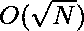

# 一个数的完美平方因子

> 原文:[https://www . geeksforgeeks . org/完美平方因子数/](https://www.geeksforgeeks.org/perfect-square-factors-of-a-number/)

给定一个整数 **N** ，任务是找出 **N** 的因子个数，这是一个[完美平方](https://www.geeksforgeeks.org/check-if-a-given-number-is-a-perfect-square-using-binary-search/)。

**示例:**

> **输入:** N = 100
> **输出:** 4
> **说明:**
> 100(1，4，25，100)有四个因子是完美平方。
> **输入:** N = 900
> **输出:** 8
> **说明:**
> 900 有 8 个因子(1，4，9，25，36，100，225，900)是完美平方。

**天真法:**解决这个问题最简单的方法就是[找到给定数**N**T5】的所有可能因子，对于每个因子，检查](https://www.geeksforgeeks.org/find-divisors-natural-number-set-1/)[因子是否为完美平方](https://www.geeksforgeeks.org/check-if-given-number-is-perfect-square-in-cpp/)。对于发现的每一个因素，增加**计数**。打印最终**计数**。
***时间复杂度:** O(N)*
***辅助空间:** O(1)*
**高效方法:**
优化上述方法需要进行以下观察:
一个数的因子数由下式给出:

> N =(1+a<sub>1</sub>)*(1+a<sub>2</sub>)*(1+a<sub>3</sub>)因素*..*(1 + a <sub>n</sub> )
> 其中 a <sub>1</sub> ，a <sub>2</sub> ，a <sub>3</sub> ，…，a <sub>n</sub> 是 n 的不同素因子的计数。

在一个完美的正方形中，不同质因数的计数必须能被 2 整除。因此，完美平方因子的计数由下式给出:

> 完美平方的 N 的因子=(1+a<sub>1</sub>/2)*(1+a<sub>2</sub>/2)*……*(1+a<sub>N</sub>/2)其中 a <sub>1</sub> ，a <sub>2</sub> ，a <sub>3</sub> ，…，a <sub>n</sub> 是 N 的不同素因子的计数。

插图:

> N = 100 的质因数是 2，2，5，5。
> 因此，完美平方的因子个数为(1 + 2/2) * (1 + 2/2) = 4。
> 因子为 1、4、25、100。

因此，找到质因数的计数，并应用上述公式找到完美平方的因数计数。
以下是上述方法的实现:

## C++

```
// C++ Program to implement
// the above approach
#include <bits/stdc++.h>
using namespace std;

// Function that returns the count of
// factors that are perfect squares
int noOfFactors(int N)
{
    if (N == 1)
        return 1;

    // Stores the count of number
    // of times a prime number
    // divides N.
    int count = 0;

    // Stores the number of factors
    // that are perfect square
    int ans = 1;

    // Count number of 2's
    // that divides N
    while (N % 2 == 0) {
        count++;
        N = N / 2;
    }

    // Calculate ans according
    // to above formula
    ans *= (count / 2 + 1);

    // Check for all the possible
    // numbers that can divide it
    for (int i = 3;
         i * i <= N; i = i + 2) {
        count = 0;

        // Check the number of
        // times prime number
        // i divides it
        while (N % i == 0) {
            count++;
            N = N / i;
        }

        // Calculate ans according
        // to above formula
        ans *= (count / 2 + 1);
    }

    // Return final count
    return ans;
}

// Driver Code
int main()
{
    int N = 100;

    cout << noOfFactors(N);

    return 0;
}
```

## Java 语言(一种计算机语言，尤用于创建网站)

```
// Java program to implement
// the above approach
import java.util.*;

class GFG{

// Function that returns the count of
// factors that are perfect squares
static int noOfFactors(int N)
{
    if (N == 1)
        return 1;

    // Stores the count of number
    // of times a prime number
    // divides N.
    int count = 0;

    // Stores the number of factors
    // that are perfect square
    int ans = 1;

    // Count number of 2's
    // that divides N
    while (N % 2 == 0)
    {
        count++;
        N = N / 2;
    }

    // Calculate ans according
    // to above formula
    ans *= (count / 2 + 1);

    // Check for all the possible
    // numbers that can divide it
    for(int i = 3; i * i <= N; i = i + 2)
    {
        count = 0;

        // Check the number of
        // times prime number
        // i divides it
        while (N % i == 0)
        {
            count++;
            N = N / i;
        }

        // Calculate ans according
        // to above formula
        ans *= (count / 2 + 1);
    }

    // Return final count
    return ans;
}

// Driver Code
public static void main(String[] args)
{
    int N = 100;

    System.out.print(noOfFactors(N));
}
}

// This code is contributed by 29AjayKumar
```

## 蟒蛇 3

```
# Python3 program to implement
# the above approach

# Function that returns the count of
# factors that are perfect squares
def noOfFactors(N):

    if (N == 1):
        return 1

    # Stores the count of number
    # of times a prime number
    # divides N.
    count = 0

    # Stores the number of factors
    # that are perfect square
    ans = 1

    # Count number of 2's
    # that divides N
    while (N % 2 == 0):
        count += 1
        N = N // 2

    # Calculate ans according
    # to above formula
    ans *= (count // 2 + 1)

    # Check for all the possible
    # numbers that can divide it
    i = 3
    while i * i <= N:
        count = 0

        # Check the number of
        # times prime number
        # i divides it
        while (N % i == 0):
            count += 1
            N = N // i

        # Calculate ans according
        # to above formula
        ans *= (count // 2 + 1)
        i += 2

    # Return final count
    return ans

# Driver Code
if __name__ == "__main__":

    N = 100

    print(noOfFactors(N))

# This code is contributed by chitranayal
```

## C#

```
// C# program to implement
// the above approach
using System;

class GFG{

// Function that returns the count of
// factors that are perfect squares
static int noOfFactors(int N)
{
    if (N == 1)
        return 1;

    // Stores the count of number
    // of times a prime number
    // divides N.
    int count = 0;

    // Stores the number of factors
    // that are perfect square
    int ans = 1;

    // Count number of 2's
    // that divides N
    while (N % 2 == 0)
    {
        count++;
        N = N / 2;
    }

    // Calculate ans according
    // to above formula
    ans *= (count / 2 + 1);

    // Check for all the possible
    // numbers that can divide it
    for(int i = 3; i * i <= N; i = i + 2)
    {
        count = 0;

        // Check the number of
        // times prime number
        // i divides it
        while (N % i == 0)
        {
            count++;
            N = N / i;
        }

        // Calculate ans according
        // to above formula
        ans *= (count / 2 + 1);
    }

    // Return final count
    return ans;
}

// Driver Code
public static void Main(String[] args)
{
    int N = 100;

    Console.Write(noOfFactors(N));
}
}

// This code is contributed by PrinciRaj1992
```

## java 描述语言

```
<script>

// Javascript program for
// the above approach

// Function that returns the count of
// factors that are perfect squares
function noOfFactors(N)
{
    if (N == 1)
        return 1;

    // Stores the count of number
    // of times a prime number
    // divides N.
    let count = 0;

    // Stores the number of factors
    // that are perfect square
    let ans = 1;

    // Count number of 2's
    // that divides N
    while (N % 2 == 0)
    {
        count++;
        N = N / 2;
    }

    // Calculate ans according
    // to above formula
    ans *= (count / 2 + 1);

    // Check for all the possible
    // numbers that can divide it
    for(let i = 3; i * i <= N; i = i + 2)
    {
        count = 0;

        // Check the number of
        // times prime number
        // i divides it
        while (N % i == 0)
        {
            count++;
            N = N / i;
        }

        // Calculate ans according
        // to above formula
        ans *= (count / 2 + 1);
    }

    // Return final count
    return ans;
}

// Driver Code

   let N = 100;

  document.write(noOfFactors(N));

</script>
```

**Output:** 

```
4
```

***时间复杂度:*** 
***空间复杂度:** O(1)*