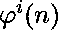
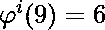
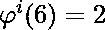
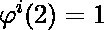

# 完美全能号

> 原文:[https://www.geeksforgeeks.org/perfect-totient-number/](https://www.geeksforgeeks.org/perfect-totient-number/)

一个**完全数**是一个等于其迭代总数的整数。表示完全数。
**例如:**

> 、Now、、和 9 == 6 + 2 + 1，因此，9 是一个完美的全能数。

### 检查 N 是否是一个完全数

给定一个整数 **N** ，任务是检查 **N** 是否为完美全能数。
**例:**

> **输入:** N = 9
> **输出:**是
> **输入:** N = 10
> **输出:**否

**逼近:**思路是求给定数的[欧拉全能值](https://www.geeksforgeeks.org/eulers-totient-function/)，假设我们得到 N 的欧拉全能值为 V，那么我们将再次求 V 的欧拉全能值，直到新的欧拉全能值 V 变为 1。我们还将保留到目前为止得到的所有欧拉全能值 V 的总和，并检查总和是否等于 N。如果相等，那么给定的数就是一个完美的欧拉全能数。
以下是上述方法的实施:

## C++

```
// C++ implementation to find
// the number of digits in
// a Nth fibonacci number

#include <bits/stdc++.h>
using namespace std;

// Function to find the Totient
// number of the given value
int phi(int n)
{
    // Initialize result as n
    int result = n;

    // Consider all prime factors
    // of n and subtract their
    // multiples from result
    for (int p = 2; p * p <= n; ++p) {

        // Check if p is a prime factor.
        if (n % p == 0) {

            // If yes, then update N
            // and result
            while (n % p == 0)
                n /= p;
            result -= result / p;
        }
    }

    // If n has a prime factor
    // greater than sqrt(n)
    // (There can be at-most one
    // such prime factor)
    if (n > 1)
        result -= result / n;
    return result;
}

// Function to check if the number
// is a perfect totient number
int isPerfectTotientNum(int n)
{
    // store original value of n
    int temp = n;
    int sum = 0;

    // loop to calculate sum
    // of iterated totients
    while(n > 1){
        sum = sum + phi(n);
        n = phi(n);
    }
    // condition for Perfect
    // Totient Number
    if(sum == temp)
    return true;

    return false;
}

// Driver Code
int main()
{
    int n = 9;
    if(isPerfectTotientNum(n))
        cout << "Yes";
    else
        cout << "No";
    return 0;
}
```

## Java 语言(一种计算机语言，尤用于创建网站)

```
// Java implementation to find the 
// number of digits in a Nth
// fibonacci number
class GFG{

// Function to find the Totient
// number of the given value
static int phi(int n)
{

    // Initialize result as n
    int result = n;

    // Consider all prime factors
    // of n and subtract their
    // multiples from result
    for(int p = 2; p * p <= n; ++p)
    {

       // Check if p is a prime factor
       if (n % p == 0)
       {

           // If yes, then update N
           // and result
           while (n % p == 0)
           {
               n /= p;
           }
           result -= result / p;
       }
    }

    // If n has a prime factor
    // greater than sqrt(n)
    // (There can be at-most one
    // such prime factor)
    if (n > 1)
        result -= result / n;
    return result;
}

// Function to check if the number
// is a perfect totient number
static boolean isPerfectTotientNum(int n)
{

    // Store original value of n
    int temp = n;
    int sum = 0;

    // Loop to calculate sum
    // of iterated totients
    while(n > 1)
    {
        sum = sum + phi(n);
        n = phi(n);
    }

    // Condition for Perfect
    // Totient Number
    if(sum == temp)
       return true;

    return false;
}

// Driver Code
public static void main(String[] args)
{
    int n = 9;

    if(isPerfectTotientNum(n))
    {
        System.out.println("Yes");
    }
    else
    {
        System.out.println("No");
    }
}
}

// This code is contributed by Ritik Bansal
```

## 蟒蛇 3

```
# Python3 implementation to find
# the number of digits in
# a Nth fibonacci number

# Function to find the Totient
# number of the given value
def phi(n):

    # Initialize result as n
    result = n

    # Consider all prime factors
    # of n and subtract their
    # multiples from result
    for p in range(2, n):
        if p * p > n:
            break

        # Check if p is a prime factor.
        if (n % p == 0):

            # If yes, then update N
            # and result
            while (n % p == 0):
                n //= p

            result -= result // p

    # If n has a prime factor
    # greater than sqrt(n)
    # (There can be at-most one
    # such prime factor)
    if (n > 1):
        result -= result // n

    return result

# Function to check if the number
# is a perfect totient number
def isPerfectTotientNum(n):

    # Store original value of n
    temp = n
    sum = 0

    # Loop to calculate sum
    # of iterated totients
    while (n > 1):
        sum = sum + phi(n)
        n = phi(n)

    # Condition for Perfect
    # Totient Number
    if (sum == temp):
        return True

    return False

# Driver Code
if __name__ == '__main__':

    n = 9

    if (isPerfectTotientNum(n)):
        print("Yes")
    else:
        print("No")

# This code is contributed by mohit kumar 29
```

## C#

```
// C# implementation to find the
// number of digits in a Nth
// fibonacci number
using System;
class GFG{

// Function to find the Totient
// number of the given value
static int phi(int n)
{

    // Initialize result as n
    int result = n;

    // Consider all prime factors
    // of n and subtract their
    // multiples from result
    for(int p = 2; p * p <= n; ++p)
    {

       // Check if p is a prime factor
       if (n % p == 0)
       {

           // If yes, then update N
           // and result
           while (n % p == 0)
           {
               n /= p;
           }
           result -= result / p;
       }
    }

    // If n has a prime factor
    // greater than sqrt(n)
    // (There can be at-most one
    // such prime factor)
    if (n > 1)
        result -= result / n;
    return result;
}

// Function to check if the number
// is a perfect totient number
static bool isPerfectTotientNum(int n)
{

    // Store original value of n
    int temp = n;
    int sum = 0;

    // Loop to calculate sum
    // of iterated totients
    while(n > 1)
    {
        sum = sum + phi(n);
        n = phi(n);
    }

    // Condition for Perfect
    // Totient Number
    if(sum == temp)
    return true;

    return false;
}

// Driver Code
public static void Main()
{
    int n = 9;

    if(isPerfectTotientNum(n))
    {
        Console.Write("Yes");
    }
    else
    {
        Console.Write("No");
    }
}
}

// This code is contributed by Code_Mech
```

## java 描述语言

```
<script>
// Javascript implementation to find the 
// number of digits in a Nth
// fibonacci number

    // Function to find the Totient
    // number of the given value
    function phi( n)
    {

        // Initialize result as n
        let result = n;

        // Consider all prime factors
        // of n and subtract their
        // multiples from result
        for ( let p = 2; p * p <= n; ++p)
        {

            // Check if p is a prime factor
            if (n % p == 0)
            {

                // If yes, then update N
                // and result
                while (n % p == 0)
                {
                    n = parseInt(n/p);
                }
                result -= parseInt(result / p);
            }
        }

        // If n has a prime factor
        // greater than sqrt(n)
        // (There can be at-most one
        // such prime factor)
        if (n > 1)
            result -= parseInt(result / n);
        return result;
    }

    // Function to check if the number
    // is a perfect totient number
    function isPerfectTotientNum( n) {

        // Store original value of n
        let temp = n;
        let sum = 0;

        // Loop to calculate sum
        // of iterated totients
        while (n > 1) {
            sum = sum + phi(n);
            n = phi(n);
        }

        // Condition for Perfect
        // Totient Number
        if (sum == temp)
            return true;

        return false;
    }

    // Driver Code
    let n = 9;

    if (isPerfectTotientNum(n)) {
        document.write("Yes");
    } else {
        document.write("No");
    }
// This code is contributed by aashish1995
</script>
```

**Output:** 

```
Yes
```

**时间复杂度:** O(n <sup>1/2</sup>

**辅助空间:** O(1)

**参考文献:**T2https://en.wikipedia.org/wiki/Perfect_totient_number