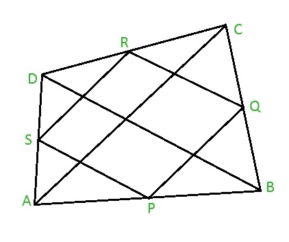

# 瓦里侬平行四边形的周长和面积

> 原文:[https://www . geesforgeks . org/varignons 周长和面积-平行四边形/](https://www.geeksforgeeks.org/perimeter-and-area-of-varignons-parallelogram/)

给定 **a 和 b** 是四边形 ABCD 的对角线 AC 和 BD 的长度，四边形的面积为 **s** 。任务是找到瓦里侬平行四边形 PQRS 的周长和面积。
**注:**当我们连接任意四边形边的中点时，内部形成的新四边形将永远是平行四边形，这个平行四边形被称为**瓦里侬平行四边形**，以法国数学家皮埃尔·伐里农的名字命名。因此，PQRS 将是一个平行四边形，因为它是通过连接四边形 ABCD 的中点形成的，如下所示:



**例:**

> **输入:** a = 7，b = 8，s = 10
> **输出:**周长= 15，面积= 5

**逼近:**瓦里侬平行四边形 PQRS 的周长等于四边形 ABCD 的对角线长度之和。
因此，**周长= a + b** ，其中 a 和 b 是对角线 AC 和 BD 的长度。
另外，瓦里侬平行四边形的面积总是四边形 ABCD 面积的一半。
因此，**面积= s / 2** ，其中 s 为四边形 ABCD 的面积。
以下是上述方法的实施:

## C

```
// C program to find the perimeter and area
#include <stdio.h>

// Function to find the perimeter
float per( float a, float b )
{
    return ( a + b );
}

// Function to find the area
float area( float s )
{
    return ( s/2 );
}

// Driver code
int main()
{
    float a = 7, b = 8, s = 10;
    printf("%f\n",
           per( a, b ));
    printf("%f",
           area( s ));
    return 0;
}
```

## Java 语言(一种计算机语言，尤用于创建网站)

```
// Java code to find the perimeter and area
import java.lang.*;

class GFG {

    // Function to find the perimeter
    public static double per(double a, double b)
    {
        return (a + b);
    }
    // Function to find the area
    public static double area(double s)
    {
        return (s / 2);
    }

    // Driver code
    public static void main(String[] args)
    {
        double a = 7, b = 8, s = 10;
        System.out.println(per(a, b));
        System.out.println(area(s));
    }
}
```

## 蟒蛇 3

```
# Python3 code to find the perimeter and area

# Function to find the perimeter
def per( a, b ):
    return ( a + b )
# Function to find the area
def area( s ):
    return ( s / 2 )

# Driver code
a = 7
b = 8
s = 10
print( per( a, b ))
print( area( s ))
```

## C#

```
// C# code to find the perimeter and area
using System;

class GFG {

    // Function to find the perimeter
    public static double per(double a, double b)
    {
        return (a + b);
    }
    // Function to find the area
    public static double area(double s)
    {
        return (s / 2);
    }

    // Driver code
    public static void Main()
    {
        double a = 7.0, b = 8.0, s = 10.0;
        Console.WriteLine(per(a, b));
        Console.Write(area(s));
    }
}
```

## 服务器端编程语言（Professional Hypertext Preprocessor 的缩写）

```
<?php
// PHP program to find perimeter and area

// Function to find the perimeter
function per( $a, $b )
{

    return ( $a + $b );
}
// Function to find the area
function area( $s )
{

    return ( $s / 2 );
}
// Driver code
$a=7;
$b=8;
$s=10;
echo(per( $a, $b )"");
echo "\n";
echo(area( $s ));
?>
```

## java 描述语言

```
<script>
// javascript code to find the perimeter and area

// Function to find the perimeter
function per(a , b)
{
    return (a + b);
}

// Function to find the area
function area(s)
{
    return (s / 2);
}

// Driver code
var a = 7, b = 8, s = 10;
document.write(per(a, b));
document.write(area(s));

// This code is contributed by shikhasingrajput
</script>
```

**Output:** 

```
15
5
```