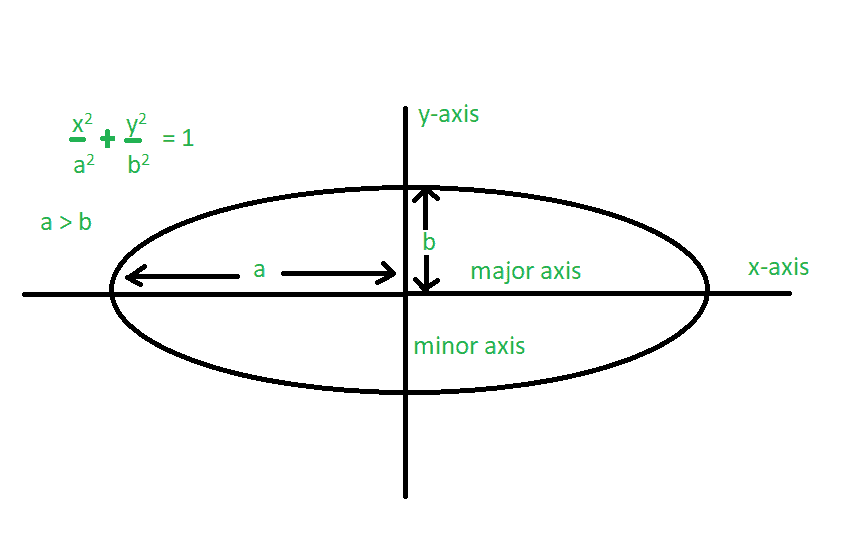

# 椭圆的周长

> 原文:[https://www.geeksforgeeks.org/perimeter-of-an-ellipse/](https://www.geeksforgeeks.org/perimeter-of-an-ellipse/)

椭圆被描述为围绕两个焦点的平面上的曲线，使得曲线上每个点到两个焦点的距离之和是恒定的。椭圆有两种类型的轴——长轴和短轴。椭圆最长的弦是长轴。与长轴垂直的弦是在中心平分长轴的短轴。
给定椭圆的短轴和长轴的长度，任务是找到椭圆的周长。



**例:**

> **输入:** a = 3，b = 2
> **输出:** 16.0109
> **输入:** a = 9，b = 5
> **输出:** 45.7191

**椭圆的周长为** :

> 周长:2π* sqrt((a<sup>2</sup>+b<sup>2</sup>)/2)

其中 a 和 b 分别为半长轴和半短轴。
以下是上述方法的实施:

## C++

```
// C++ program to find perimeter of an Ellipse
#include <bits/stdc++.h>
using namespace std;

// Function to find the perimeter of an Ellipse
void Perimeter(int a, int b)
{
    float perimeter;

    // Compute perimeter
    perimeter = 2 * 3.14 * sqrt((a * a + b * b) / (2 * 1.0));

    cout << perimeter;
}

// Driver code
int main()
{
    int a = 3, b = 2;

    // Function call
    Perimeter(a, b);

    return 0;
}
```

## Java 语言(一种计算机语言，尤用于创建网站)

```
// Java program to find perimeter of
// an Ellipse.
import java.lang.Math;
class GFG1{

    // Function to find perimeter of an
    // ellipse.
    static void Perimeter( double a, double b)
    {
        double Perimeter;

        // formula to find the Perimeter
        // of an Ellipse.
        Perimeter = (double)2 * 3.14 * Math.sqrt((a * a + b * b) / (2 * 1.0)) ;

        // Display the result
        System.out.println("Perimeter: " + Perimeter);
    }

    // Driver code
    public static void main (String[] args)
    {
        double a = 3, b = 2;

        Perimeter(a , b);
    }
}
```

## 蟒蛇 3

```
# Python3 program to find perimeter
# of an Ellipse
from math import sqrt

# Function to find the perimeter
# of an Ellipse
def Perimeter(a, b):
    perimeter = 0

    # Compute perimeter
    perimeter = (2 * 3.14 *
                sqrt((a * a + b * b) /
                           (2 * 1.0)));

    print(perimeter)

# Driver code
a = 3
b = 2

# Function call
Perimeter(a, b)

# This code is contributed
# by Mohit Kumar
```

## C#

```
// C# program to find perimeter of
// an Ellipse.
using System;

class GFG1
{

    // Function to find perimeter of an
    // ellipse.
    static void Perimeter(double a, double b)
    {
        double Perimeter;

        // formula to find the Perimeter
        // of an Ellipse.
        Perimeter = (double)2 * 3.14 *
                     Math.Sqrt((a * a + b * b) / (2 * 1.0));

        // Display the result
        Console.WriteLine("Perimeter: " + Perimeter);
    }

    // Driver code
    public static void Main (String[] args)
    {
        double a = 3, b = 2;

        Perimeter(a , b);
    }
}

// This code is contributed by Princi Singh
```

## java 描述语言

```
<script>

// javascript program to find perimeter of
// an Ellipse.

    // Function to find perimeter of an
    // ellipse.
    function Perimeter(a , b) {
        var Perimeter;

        // formula to find the Perimeter
        // of an Ellipse.
        Perimeter = 2 * 3.14 * Math.sqrt((a * a + b * b) / (2 * 1.0));

        // Display the result
        document.write("Perimeter: " + Perimeter);
    }

    // Driver code

        var a = 3, b = 2;

        Perimeter(a, b);

// This code contributed by aashish1995

</script>
```

**输出:**

```
 16.010921272681344
```