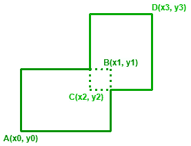

# 两个矩形并集的周长

> 原文:[https://www . geeksforgeeks . org/两个矩形结合的周长/](https://www.geeksforgeeks.org/perimeter-of-the-union-of-two-rectangles/)

给定两个[数组](https://www.geeksforgeeks.org/introduction-to-arrays/)**X【】**和**Y【】**，每个长度 **4** ，其中 **(X[0]，Y[0])** 和 **(X[1]，Y[1])** 代表一个矩形的左下角和右上角 **(X[2]，Y[2])** 和 **(X[3]，Y[3])** 代表

[](https://media.geeksforgeeks.org/wp-content/uploads/20201008145545/PeriUnionRect02.png)

**示例:**

> **输入:** X[] = {-1，2，0，4}，Y[] = {2，5，-3，3}
> **输出:** 26
> **说明:**所需周长= 2 *(4 –(-1))+(5 –(-3)))= 2 *(8+5)= 26。
> 
> **输入:** X[] = {-3，1，1，4}，Y[] = {-2，3，1，5}
> **输出:** 26
> **说明:**所需周长= 2 *(4 –(-3))+(5 –(-2)))= 2 *(7+7)= 28。

**方法:**按照以下步骤解决问题:

*   [检查给定点形成的矩形是否相交](https://www.geeksforgeeks.org/intersecting-rectangle-when-bottom-left-and-top-right-corners-of-two-rectangles-are-given/)。
*   如果发现相交，那么周长可以通过公式**2 *(X[1]–X[0])+(X[3]–X[2])+(Y[1]–Y[0])+(Y[3]–Y[2])**来计算。
*   否则，分别打印 **X** 和 **Y** 坐标最大差值之和的两倍，即 **2 *(最大(X[])–最小(X[]) +最大(Y[])–最小(Y[]))** 。

下面是上述方法的实现:

## C++

```
// C++ program for the above approach

#include <bits/stdc++.h>
using namespace std;

// Function to check if two
// rectangles are intersecting or not
bool doIntersect(vector<int> X,
                 vector<int> Y)
{
    // If one rectangle is to the
    // right of other's right edge
    if (X[0] > X[3] || X[2] > X[1])
        return false;

    // If one rectangle is on the
    // top of other's top edge
    if (Y[0] > Y[3] || Y[2] > Y[1])
        return false;

    return true;
}

// Function to return the perimeter of
// the Union of Two Rectangles
int getUnionPerimeter(vector<int> X,
                      vector<int> Y)
{
    // Stores the resultant perimeter
    int perimeter = 0;

    // If rectangles do not interesect
    if (!doIntersect(X, Y)) {

        // Perimeter of Rectangle 1
        perimeter
            += 2 * (abs(X[1] - X[0])
                    + abs(Y[1] - Y[0]));

        // Perimeter of Rectangle 2
        perimeter
            += 2 * (abs(X[3] - X[2])
                    + abs(Y[3] - Y[2]));
    }

    // If the rectangles intersect
    else {

        // Get width of combined figure
        int w = *max_element(X.begin(),
                             X.end())
                - *min_element(X.begin(),
                               X.end());

        // Get length of combined figure
        int l = *max_element(Y.begin(),
                             Y.end())
                - *min_element(Y.begin(),
                               Y.end());

        perimeter = 2 * (l + w);
    }

    // Return the perimeter
    return perimeter;
}

// Driver Code
int main()
{
    vector<int> X{ -1, 2, 4, 6 };
    vector<int> Y{ 2, 5, 3, 7 };

    cout << getUnionPerimeter(X, Y);
}
```

## Java 语言(一种计算机语言，尤用于创建网站)

```
// Java program for the above approach
import java.util.*;
class GFG
{

// Function to check if two
// rectangles are intersecting or not
static boolean doIntersect(int []X,
                 int []Y)
{
    // If one rectangle is to the
    // right of other's right edge
    if (X[0] > X[3] || X[2] > X[1])
        return false;

    // If one rectangle is on the
    // top of other's top edge
    if (Y[0] > Y[3] || Y[2] > Y[1])
        return false;

    return true;
}

// Function to return the perimeter of
// the Union of Two Rectangles
static int getUnionPerimeter(int []X,
                      int []Y)
{
    // Stores the resultant perimeter
    int perimeter = 0;

    // If rectangles do not interesect
    if (!doIntersect(X, Y)) {

        // Perimeter of Rectangle 1
        perimeter
            += 2 * (Math.abs(X[1] - X[0])
                    + Math.abs(Y[1] - Y[0]));

        // Perimeter of Rectangle 2
        perimeter
            += 2 * (Math.abs(X[3] - X[2])
                    + Math.abs(Y[3] - Y[2]));
    }

    // If the rectangles intersect
    else {

        // Get width of combined figure
        int w = Arrays.stream(X).max().getAsInt()
                - Arrays.stream(X).min().getAsInt();

        // Get length of combined figure
        int l = Arrays.stream(Y).max().getAsInt()
                - Arrays.stream(Y).min().getAsInt();

        perimeter = 2 * (l + w);
    }

    // Return the perimeter
    return perimeter;
}

// Driver Code
public static void main(String[] args)
{
    int []X = { -1, 2, 4, 6 };
    int []Y = { 2, 5, 3, 7 };

    System.out.print(getUnionPerimeter(X, Y));
}
}

// This code is contributed by 29AjayKumar
```

## 蟒蛇 3

```
# Python3 program for the above approach

# Function to check if two
# rectangles are intersecting or not
def doIntersect(X, Y):

    # If one rectangle is to the
    # right of other's right edge
    if (X[0] > X[3] or X[2] > X[1]):
        return False

    # If one rectangle is on the
    # top of other's top edge
    if (Y[0] > Y[3] or Y[2] > Y[1]):
        return False
    return True

# Function to return the perimeter of
# the Union of Two Rectangles
def getUnionPerimeter(X, Y):

    # Stores the resultant perimeter
    perimeter = 0

    # If rectangles do not interesect
    if (not doIntersect(X, Y)):

        # Perimeter of Rectangle 1
        perimeter += 2 * (abs(X[1] - X[0]) + abs(Y[1] - Y[0]))

        # Perimeter of Rectangle 2
        perimeter += 2 * (abs(X[3] - X[2]) + abs(Y[3] - Y[2]))

    # If the rectangles intersect
    else:

        # Get width of combined figure
        w = max(X) -  min(X)

        # Get length of combined figure
        l = max(Y) - min(Y)
        perimeter = 2 * (l + w)

    # Return the perimeter
    return perimeter

# Driver Code
if __name__ == '__main__':
    X = [ -1, 2, 4, 6]
    Y = [ 2, 5, 3, 7 ]

    print (getUnionPerimeter(X, Y))

# This code is contributed by mohit kumar 29.
```

## C#

```
// C# program for the above approach
using System;
using System.Linq;
public class GFG
{

// Function to check if two
// rectangles are intersecting or not
static bool doIntersect(int []X,
                 int []Y)
{

    // If one rectangle is to the
    // right of other's right edge
    if (X[0] > X[3] || X[2] > X[1])
        return false;

    // If one rectangle is on the
    // top of other's top edge
    if (Y[0] > Y[3] || Y[2] > Y[1])
        return false;

    return true;
}

// Function to return the perimeter of
// the Union of Two Rectangles
static int getUnionPerimeter(int []X,
                      int []Y)
{

    // Stores the resultant perimeter
    int perimeter = 0;

    // If rectangles do not interesect
    if (!doIntersect(X, Y))
    {

        // Perimeter of Rectangle 1
        perimeter
            += 2 * (Math.Abs(X[1] - X[0])
                    + Math.Abs(Y[1] - Y[0]));

        // Perimeter of Rectangle 2
        perimeter
            += 2 * (Math.Abs(X[3] - X[2])
                    + Math.Abs(Y[3] - Y[2]));
    }

    // If the rectangles intersect
    else
    {

        // Get width of combined figure
        int w = X.Max()
                - X.Min();

        // Get length of combined figure
        int l = X.Max()
                - Y.Min();

        perimeter = 2 * (l + w);
    }

    // Return the perimeter
    return perimeter;
}

// Driver Code
public static void Main(String[] args)
{
    int []X = { -1, 2, 4, 6 };
    int []Y = { 2, 5, 3, 7 };

    Console.Write(getUnionPerimeter(X, Y));
}
}

// This code contributed by shikhasingrajput
```

## java 描述语言

```
<script>
// Javascript program for the above approach

// Function to check if two
// rectangles are intersecting or not
function doIntersect(X,Y)
{
    // If one rectangle is to the
    // right of other's right edge
    if (X[0] > X[3] || X[2] > X[1])
        return false;

    // If one rectangle is on the
    // top of other's top edge
    if (Y[0] > Y[3] || Y[2] > Y[1])
        return false;

    return true;
}

// Function to return the perimeter of
// the Union of Two Rectangles
function getUnionPerimeter(X,Y)
{
    // Stores the resultant perimeter
    let perimeter = 0;

    // If rectangles do not interesect
    if (!doIntersect(X, Y)) {

        // Perimeter of Rectangle 1
        perimeter
            += 2 * (Math.abs(X[1] - X[0])
                    + Math.abs(Y[1] - Y[0]));

        // Perimeter of Rectangle 2
        perimeter
            += 2 * (Math.abs(X[3] - X[2])
                    + Math.abs(Y[3] - Y[2]));
    }

    // If the rectangles intersect
    else {

        // Get width of combined figure
        let w = Math.max(...X)
                - Math.min(...X);

        // Get length of combined figure
        let l = Math.max(...Y)
                - Math.min(...Y);

        perimeter = 2 * (l + w);
    }

    // Return the perimeter
    return perimeter;
}

// Driver Code
let X = [-1, 2, 4, 6 ];
let Y = [ 2, 5, 3, 7 ];
document.write(getUnionPerimeter(X, Y));

// This code is contributed by patel2127
</script>
```

**Output:** 

```
24
```

***时间复杂度:**O(1)*
T5**辅助空间:** O(1)