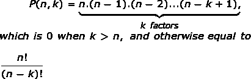

# 置换系数

> 原文:[https://www.geeksforgeeks.org/permutation-coefficient/](https://www.geeksforgeeks.org/permutation-coefficient/)

排列是指将给定集合的所有成员排列成一个序列的过程。一组 n 个元素上的排列数由 n 给出！，哪里“！”代表阶乘。

由 P(n，k)表示的**置换系数**用于表示从一组 n 个元素中获得具有 k 个元素的有序子集的方式的数量。
数学上，它被给出为:



图片来源: [Wiki](https://en.wikipedia.org/wiki/Permutation)
**示例:**

```
P(10, 2) = 90
P(10, 3) = 720
P(10, 0) = 1
P(10, 1) = 10
```

也可以使用以下递归公式递归计算系数:

```
P(n, k) = P(n-1, k) + k* P(n-1, k-1)   
```

如果我们仔细观察，我们可以分析问题有重叠子结构，因此我们可以在这里应用动态规划。下面是一个实现同样想法的程序。

## C

```
// A Dynamic Programming based
// solution that uses table P[][]
// to calculate the Permutation
// Coefficient
#include<bits/stdc++.h>

// Returns value of Permutation
// Coefficient P(n, k)
int permutationCoeff(int n, int k)
{
    int P[n + 1][k + 1];

    // Calculate value of Permutation
    // Coefficient in bottom up manner
    for (int i = 0; i <= n; i++)
    {
        for (int j = 0; j <= std::min(i, k); j++)
        {
            // Base Cases
            if (j == 0)
                P[i][j] = 1;

            // Calculate value using
            // previously stored values
            else
                P[i][j] = P[i - 1][j] +
                        (j * P[i - 1][j - 1]);

            // This step is important
            // as P(i,j)=0 for j>i
            P[i][j + 1] = 0;
        }
    }
    return P[n][k];
}

// Driver Code
int main()
{
    int n = 10, k = 2;
    printf("Value of P(%d, %d) is %d ",
            n, k, permutationCoeff(n, k));
    return 0;
}
```

## Java 语言(一种计算机语言，尤用于创建网站)

```
// Java code for Dynamic Programming based
// solution that uses table P[][] to
// calculate the Permutation Coefficient
import java.io.*;
import java.math.*;

class GFG
{

    // Returns value of Permutation
    // Coefficient P(n, k)
    static int permutationCoeff(int n,
                                int k)
    {
        int P[][] = new int[n + 2][k + 2];

        // Calculate value of Permutation
        // Coefficient in bottom up manner
        for (int i = 0; i <= n; i++)
        {
            for (int j = 0;
                j <= Math.min(i, k);
                j++)
            {
                // Base Cases
                if (j == 0)
                    P[i][j] = 1;

                // Calculate value using previously
                // stored values
                else
                    P[i][j] = P[i - 1][j] +
                            (j * P[i - 1][j - 1]);

                // This step is important
                // as P(i,j)=0 for j>i
                P[i][j + 1] = 0;
            }
        }
        return P[n][k];
    }

    // Driver Code
    public static void main(String args[])
    {
        int n = 10, k = 2;
        System.out.println("Value of P( " + n + ","+ k +")" +
                        " is " + permutationCoeff(n, k) );
    }
}

// This code is contributed by Nikita Tiwari.
```

## 蟒蛇 3

```
# A Dynamic Programming based
# solution that uses
# table P[][] to calculate the
# Permutation Coefficient

# Returns value of Permutation
# Coefficient P(n, k)
def permutationCoeff(n, k):

    P = [[0 for i in range(k + 1)]
            for j in range(n + 1)]

    # Calculate value of Permutation
    # Coefficient in
    # bottom up manner
    for i in range(n + 1):
        for j in range(min(i, k) + 1):

            # Base cases
            if (j == 0):
                P[i][j] = 1

            # Calculate value using
            # previously stored values
            else:
                P[i][j] = P[i - 1][j] + (
                        j * P[i - 1][j - 1])

            # This step is important
            # as P(i, j) = 0 for j>i
            if (j < k):
                P[i][j + 1] = 0
    return P[n][k]

# Driver Code
n = 10
k = 2
print("Value fo P(", n, ", ", k, ") is ",
    permutationCoeff(n, k), sep = "")

# This code is contributed by Soumen Ghosh.
```

## C#

```
// C# code for Dynamic Programming based
// solution that uses table P[][] to
// calculate the Permutation Coefficient
using System;

class GFG
{

    // Returns value of Permutation
    // Coefficient P(n, k)
    static int permutationCoeff(int n,
                                int k)
    {
        int [,]P = new int[n + 2,k + 2];

        // Calculate value of Permutation
        // Coefficient in bottom up manner
        for (int i = 0; i <= n; i++)
        {
            for (int j = 0;
                j <= Math.Min(i, k);
                j++)
            {
                // Base Cases
                if (j == 0)
                    P[i,j] = 1;

                // Calculate value using previously
                // stored values
                else
                    P[i,j] = P[i - 1,j] +
                            (j * P[i - 1,j - 1]);

                // This step is important
                // as P(i,j)=0 for j>i
                P[i,j + 1] = 0;
            }
        }
        return P[n,k];
    }

    // Driver Code
    public static void Main()
    {
        int n = 10, k = 2;
        Console.WriteLine("Value of P( " + n +
                        ","+ k +")" + " is " +
                        permutationCoeff(n, k) );
    }
}

// This code is contributed by anuj_67..
```

## 服务器端编程语言（Professional Hypertext Preprocessor 的缩写）

```
<?php
// A Dynamic Programming based
// solution that uses table P[][]
// to calculate the Permutation
// Coefficient

// Returns value of Permutation
// Coefficient P(n, k)
function permutationCoeff( $n, $k)
{
    $P = array(array());

    // Calculate value of Permutation
    // Coefficient in bottom up manner
    for($i = 0; $i <= $n; $i++)
    {
        for($j = 0; $j <= min($i, $k); $j++)
        {

            // Base Cases
            if ($j == 0)
                $P[$i][$j] = 1;

            // Calculate value using
            // previously stored values
            else
                $P[$i][$j] = $P[$i - 1][$j] +
                            ($j * $P[$i - 1][$j - 1]);

            // This step is important
            // as P(i,j)=0 for j>i
            $P[$i][$j + 1] = 0;
        }
    }
    return $P[$n][$k];
}

    // Driver Code
    $n = 10; $k = 2;
    echo "Value of P(",$n," ,",$k,") is ",
            permutationCoeff($n, $k);

// This code is contributed by anuj_67.
?>
```

## java 描述语言

```
<script>
    // Javascript code for Dynamic Programming based
    // solution that uses table P[][] to
    // calculate the Permutation Coefficient

    // Returns value of Permutation
    // Coefficient P(n, k)
    function permutationCoeff(n, k)
    {
        let P = new Array(n + 2);

        for(let i = 0; i < n + 2; i++)
        {
            P[i] = new Array(k + 2);
        }

        // Calculate value of Permutation
        // Coefficient in bottom up manner
        for (let i = 0; i <= n; i++)
        {
            for (let j = 0; j <= Math.min(i, k); j++)
            {
                // Base Cases
                if (j == 0)
                    P[i][j] = 1;

                // Calculate value using previously
                // stored values
                else
                    P[i][j] = P[i - 1][j] + (j * P[i - 1][j - 1]);

                // This step is important
                // as P(i,j)=0 for j>i
                P[i][j + 1] = 0;
            }
        }
        return P[n][k];
    }

    let n = 10, k = 2;
    document.write("Value of P(" + n + ","+ k +")" + " is " + permutationCoeff(n, k) );

    // This code is contributed by decode2207.
</script>
```

**输出:**

```
Value of P(10, 2) is 90 
```

这里我们可以看到时间复杂度是 O(n*k)，空间复杂度是 O(n*k)，因为程序使用了一个辅助矩阵来存储结果。

**我们能在 O(n)时间内完成吗？**
让我们假设我们维护一个 1D 数组来计算 n 的阶乘。我们可以使用计算的阶乘值并应用公式 P(n，k) = n！/ (n-k)！。下面是一个说明相同概念的程序。

## C++

```
// A O(n) solution that uses
// table fact[] to calculate
// the Permutation Coefficient
#include<bits/stdc++.h>
using namespace std;

// Returns value of Permutation
// Coefficient P(n, k)
int permutationCoeff(int n, int k)
{
    int fact[n + 1];

    // Base case
    fact[0] = 1;

    // Calculate value
    // factorials up to n
    for(int i = 1; i <= n; i++)
    fact[i] = i * fact[i - 1];

    // P(n,k) = n! / (n - k)!
    return fact[n] / fact[n - k];
}

// Driver Code
int main()
{
    int n = 10, k = 2;

    cout << "Value of P(" << n << ", "
        << k << ") is "
        << permutationCoeff(n, k);

    return 0;
}

// This code is contributed by shubhamsingh10
```

## C

```
// A O(n) solution that uses
// table fact[] to calculate
// the Permutation Coefficient
#include<bits/stdc++.h>

// Returns value of Permutation
// Coefficient P(n, k)
int permutationCoeff(int n, int k)
{
    int fact[n + 1];

    // base case
    fact[0] = 1;

    // Calculate value
    // factorials up to n
    for (int i = 1; i <= n; i++)
        fact[i] = i * fact[i - 1];

    // P(n,k) = n! / (n - k)!
    return fact[n] / fact[n - k];
}

// Driver Code
int main()
{
    int n = 10, k = 2;
    printf ("Value of P(%d, %d) is %d ",
            n, k, permutationCoeff(n, k) );
    return 0;
}
```

## Java 语言(一种计算机语言，尤用于创建网站)

```
// A O(n) solution that uses
// table fact[] to calculate
// the Permutation Coefficient
import java .io.*;

public class GFG {

    // Returns value of Permutation
    // Coefficient P(n, k)
    static int permutationCoeff(int n,
                                int k)
    {
        int []fact = new int[n+1];

        // base case
        fact[0] = 1;

        // Calculate value
        // factorials up to n
        for (int i = 1; i <= n; i++)
            fact[i] = i * fact[i - 1];

        // P(n,k) = n! / (n - k)!
        return fact[n] / fact[n - k];
    }

    // Driver Code
    static public void main (String[] args)
    {
        int n = 10, k = 2;
        System.out.println("Value of"
        + " P( " + n + ", " + k + ") is "
        + permutationCoeff(n, k) );
    }
}

// This code is contributed by anuj_67.
```

## 蟒蛇 3

```
# A O(n) solution that uses
# table fact[] to calculate
# the Permutation Coefficient

# Returns value of Permutation
# Coefficient P(n, k)
def permutationCoeff(n, k):
    fact = [0 for i in range(n + 1)]

    # base case
    fact[0] = 1

    # Calculate value
    # factorials up to n
    for i in range(1, n + 1):
        fact[i] = i * fact[i - 1]

    # P(n, k) = n!/(n-k)!
    return int(fact[n] / fact[n - k])

# Driver Code
n = 10
k = 2
print("Value of P(", n, ", ", k, ") is ",
        permutationCoeff(n, k), sep = "")

# This code is contributed
# by Soumen Ghosh
```

## C#

```
// A O(n) solution that uses
// table fact[] to calculate
// the Permutation Coefficient
using System;

public class GFG {

    // Returns value of Permutation
    // Coefficient P(n, k)
    static int permutationCoeff(int n,
                                int k)
    {
        int []fact = new int[n+1];

        // base case
        fact[0] = 1;

        // Calculate value
        // factorials up to n
        for (int i = 1; i <= n; i++)
            fact[i] = i * fact[i - 1];

        // P(n,k) = n! / (n - k)!
        return fact[n] / fact[n - k];
    }

    // Driver Code
    static public void Main ()
    {
        int n = 10, k = 2;
        Console.WriteLine("Value of"
        + " P( " + n + ", " + k + ") is "
        + permutationCoeff(n, k) );
    }
}

// This code is contributed by anuj_67.
```

## 服务器端编程语言（Professional Hypertext Preprocessor 的缩写）

```
<?php
// A O(n) Solution that
// uses table fact[] to
// calculate the Permutation
// Coefficient

// Returns value of Permutation
// Coefficient P(n, k)
function permutationCoeff($n, $k)
{
    $fact = array();

    // base case
    $fact[0] = 1;

    // Calculate value
    // factorials up to n
    for ($i = 1; $i <= $n; $i++)
        $fact[$i] = $i * $fact[$i - 1];

    // P(n,k)= n!/(n-k)!
    return $fact[$n] / $fact[$n - $k];
}

    // Driver Code
    $n = 10;
    $k = 2;
    echo"Value of P(",$n," ", $k,") is ",
            permutationCoeff($n, $k) ;

// This code is contributed by anuj_67.            
?>
```

## java 描述语言

```
<script>
    // A O(n) solution that uses
    // table fact[] to calculate
    // the Permutation Coefficient

    // Returns value of Permutation
    // Coefficient P(n, k)
    function permutationCoeff(n, k)
    {
        let fact = new Array(n+1);

        // base case
        fact[0] = 1;

        // Calculate value
        // factorials up to n
        for (let i = 1; i <= n; i++)
            fact[i] = i * fact[i - 1];

        // P(n,k) = n! / (n - k)!
        return parseInt(fact[n] / fact[n - k], 10);
    }

    let n = 10, k = 2;
    document.write("Value of"
                   + " P(" + n + ", " + k + ") is "
                   + permutationCoeff(n, k) );

</script>
```

**输出:**

```
Value of P(10, 2) is 90 
```

**一个 O(n)时间和 O(1)额外空间解**

## C++

```
// A O(n) time and O(1) extra
// space solution to calculate
// the Permutation Coefficient
#include <iostream>
using namespace std;

int PermutationCoeff(int n, int k)
{
    int P = 1;

    // Compute n*(n-1)*(n-2)....(n-k+1)
    for (int i = 0; i < k; i++)
        P *= (n-i) ;

    return P;
}

// Driver Code
int main()
{
    int n = 10, k = 2;
    cout << "Value of P(" << n << ", " << k
         << ") is " << PermutationCoeff(n, k);

    return 0;
}
```

## Java 语言(一种计算机语言，尤用于创建网站)

```
// A O(n) time and O(1) extra
// space solution to calculate
// the Permutation Coefficient
import java.io.*;

class GFG
{
    static int PermutationCoeff(int n,
                                int k)
    {
        int Fn = 1, Fk = 1;

        // Compute n! and (n-k)!
        for (int i = 1; i <= n; i++)
        {
            Fn *= i;
            if (i == n - k)
            Fk = Fn;
        }
        int coeff = Fn / Fk;
        return coeff;
    }

    // Driver Code
    public static void main(String args[])
    {
        int n = 10, k = 2;
        System.out.println("Value of P( " + n + "," +
                                         k +") is " +
                            PermutationCoeff(n, k) );
    }
}

// This code is contributed by Nikita Tiwari.
```

## C#

```
// A O(n) time and O(1) extra
// space solution to calculate
// the Permutation Coefficient
using System;

class GFG {

    static int PermutationCoeff(int n,
                                int k)
    {
        int Fn = 1, Fk = 1;

        // Compute n! and (n-k)!
        for (int i = 1; i <= n; i++)
        {
            Fn *= i;
            if (i == n - k)
                Fk = Fn;
        }
        int coeff = Fn / Fk;

        return coeff;
    }

    // Driver Code
    public static void Main()
    {
        int n = 10, k = 2;
        Console.WriteLine("Value of P( "
                   + n + "," + k +") is "
              + PermutationCoeff(n, k) );
    }
}

// This code is contributed by anuj_67.
```

## 服务器端编程语言（Professional Hypertext Preprocessor 的缩写）

```
<?php
// A O(n) time and O(1) extra
// space PHP solution to calculate
// the Permutation Coefficient

function PermutationCoeff( $n, $k)
{
    $Fn = 1; $Fk;

    // Compute n! and (n-k)!
    for ( $i = 1; $i <= $n; $i++)
    {
        $Fn *= $i;
        if ($i == $n - $k)
        $Fk = $Fn;
    }
    $coeff = $Fn / $Fk;
    return $coeff;
}

// Driver Code
$n = 10; $k = 2;
echo "Value of P(" , $n , ", " , $k , ")
        is " , PermutationCoeff($n, $k);

// This code is contributed by anuj_67.
?>
```

## java 描述语言

```
<script>

// A O(n) time and O(1) extra
// space solution to calculate
// the Permutation Coefficient   
function PermutationCoeff(n, k)
{
    let P = 1;

    // Compute n*(n-1)*(n-2)....(n-k+1)
    for(let i = 0; i < k; i++)
        P *= (n - i);

    return P;
}

// Driver code
let n = 10, k = 2;
document.write("Value of P(" + n +
                        ", " + k + ") is " +
                        PermutationCoeff(n, k));

// This code is contributed by divyesh072019

</script>
```

## 蟒蛇 3

```
# A O(n) solution that uses
# table fact[] to calculate
# the Permutation Coefficient

# Returns value of Permutation
# Coefficient P(n, k)
def permutationCoeff(n, k):

  f=1

  for i in range(k): #P(n,k)=n*(n-1)*(n-2)*....(n-k-1)
    f*=(n-i)

  return f  #This code is contributed by Suyash Saxena

# Driver Code
n = 10
k = 2
print("Value of P(", n, ", ", k, ") is ",
        permutationCoeff(n, k))
```

**输出:**

```
Value of P(10, 2) is 90 
```

感谢希瓦·库马尔提出这个解决方案。
本文由[阿舒托什·库马尔](https://www.linkedin.com/in/ashutosh-kumar-9527a7105?trk=nav_responsive_tab_profile)供稿。如果发现有不正确的地方，请写评论，或者想分享更多关于以上讨论话题的信息