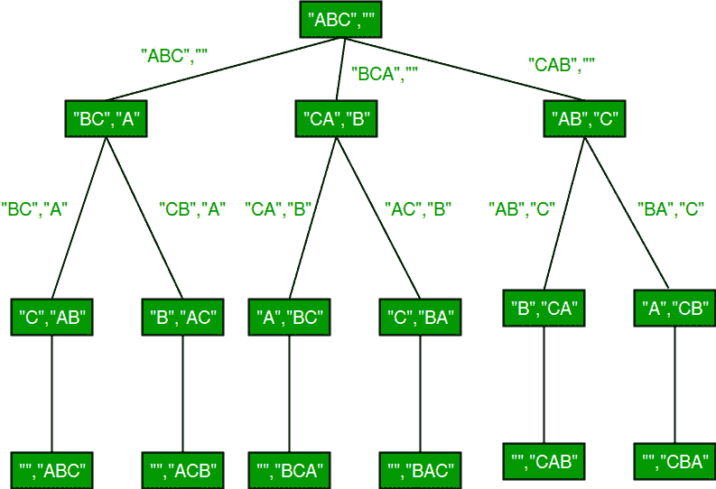

# 使用 STL 对给定字符串进行排列

> 原文:[https://www . geesforgeks . org/给定字符串的排列使用-stl/](https://www.geeksforgeeks.org/permutations-of-a-given-string-using-stl/)

排列，也称为“排列数”或“顺序”，是将有序列表 S 的元素重新排列成与 S 本身一一对应的关系。长度为 n 的字符串有 n！排列。
来源: [Mathword](http://mathworld.wolfram.com/Permutation.html)

以下是字符串 ABC 的排列。

> ABC、ACB、BAC、BCA、CBA、CAB

我们已经讨论了使用回溯[打印给定字符串的所有排列的 C 实现。在这篇文章中，讨论了使用 STL 的 C++实现。](https://www.geeksforgeeks.org/write-a-c-program-to-print-all-permutations-of-a-given-string/)

**方法 1(使用 rotate())**
std::rotate 函数旋转矢量/字符串的元素，使传递的中间元素成为第一个。例如，如果我们调用“ABCD”的 rotate，中间作为第二个元素，则字符串变为“BCDA”，如果我们再次调用“rotate”，中间作为第二个元素，则字符串变为“CDAB”。参考本中的[示例程序。](https://ide.geeksforgeeks.org/KVH6Do) 



下面是 C++实现。

## C++

```
// C++ program to print all permutations with
// duplicates allowed using rotate() in STL
#include <bits/stdc++.h>
using namespace std;

// Function to print permutations of string str,
// out is used to store permutations one by one
void permute(string str, string out)
{
    // When size of str becomes 0, out has a
    // permutation (length of out is n)
    if (str.size() == 0)
    {
        cout << out << endl;
        return;
    }

    // One be one move all characters at
    // the beginning of out (or result)
    for (int i = 0; i < str.size(); i++)
    {
        // Remove first character from str and
        // add it to out
        permute(str.substr(1), out + str[0]);

        // Rotate string in a way second character
        // moves to the beginning.
        rotate(str.begin(), str.begin() + 1, str.end());
    }
}

// Driver code
int main()
{
    string str = "ABC";
    permute(str, "");
    return 0;
}
```

**Output**

```
ABC
ACB
BCA
BAC
CAB
CBA
```

**方法 2(使用 next _ replacement)**
我们可以使用[next _ replacement](https://www.geeksforgeeks.org/find-the-next-lexicographically-greater-word-than-a-given-word/)来修改字符串，使其按照字典顺序存储下一个置换。如果当前字符串在字典序上最大，即“CBA”，那么 next _ 置换返回 false。

我们首先对字符串进行排序，以便将其转换为字典上最小的排列。然后我们一个接一个地调用 next _ arrangement，直到它返回 false。

## C++

```
// C++ program to print all permutations with
// duplicates allowed using next_permutation
#include <bits/stdc++.h>
using namespace std;

// Function to print permutations of string str
// using next_permutation
void permute(string str)
{
    // Sort the string in lexicographically
    // ascending order
    sort(str.begin(), str.end());

    // Keep printing next permutation while there
    // is next permutation
    do {
       cout << str << endl;
    } while (next_permutation(str.begin(), str.end()));
}

// Driver code
int main()
{
    string str = "CBA";
    permute(str);
    return 0;
}
```

**Output**

```
ABC
ACB
BAC
BCA
CAB
CBA
```

请注意，第二种方法总是以字典顺序排序的顺序打印排列，而不考虑输入字符串。
本文由**阿迪亚·戈尔**供稿。如果你喜欢极客博客并想投稿，你也可以写一篇文章并把你的文章邮寄到 contribute@geeksforgeeks.org。看到你的文章出现在极客博客主页上，帮助其他极客。
如发现任何不正确的地方，请写评论，或者您想分享更多关于上述话题的信息