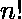
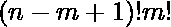

# n 个事物一次全部排列，m 个事物永远不会在一起

> 原文:[https://www . geeksforgeeks . org/n-things 的排列-以 m-things-never-together-together-together-together-together-together-together-together-together-together-together-together-together-to-together-together-to](https://www.geeksforgeeks.org/permutations-of-n-things-taken-all-at-a-time-with-m-things-never-come-together/)

给定 **n** 和 **m** ，任务是找到 **n** 个不同事物的排列数量，一次取全部，使得 **m** 个特定事物永远不会在一起。
**举例:**

```
Input  : 7, 3
Output : 420

Input  : 9, 2
Output : 282240
```

**方法:**
**公式推导–**
使用 n 个不同的物体一次取全部的可能排列总数= 
当 m 个特定的事物总是聚集在一起时，n 个不同的事物一次取全部的排列数是
因此，当个特定的事物从不聚集在一起时–
个不同的事物一次取全部的排列数

```
Permutations = n! - (n-m+1)! × m!
```

**下面是上述方法的 Python 实现–**

## C++

```
#include<bits/stdc++.h>
using namespace std;

int factorial(int n)
{
    int fact = 1;
    for (int i = 2; i <= n; i++)
        fact = fact * i ;
    return (fact);
}

int result(int n, int m)
{
    return(factorial(n) -  
           factorial(n - m + 1) *
           factorial(m));
}

// Driver Code
int main()
{
    cout(result(5, 3));
}

// This code is contributed by Mohit Kumar
```

## Java 语言(一种计算机语言，尤用于创建网站)

```
class GFG
{
static int factorial(int n)
{
    int fact = 1;
    for (int i = 2; i <= n; i++)
        fact = fact * i ;
    return (fact);
}

static int result(int n, int m)
{
    return(factorial(n) -
           factorial(n - m + 1) *
           factorial(m));
}

// Driver Code
public static void main(String args[])
{
    System.out.println(result(5, 3));
}
}

// This code is contributed by Arnab Kundu
```

## 蟒蛇 3

```
def factorial(n):
    fact = 1;
    for i in range(2, n + 1):
        fact = fact * i
    return (fact)

def result(n, m):
    return(factorial(n) - factorial(n - m + 1) * factorial(m))

# driver code
print(result(5, 3))
```

## C#

```
using System;

class GFG
{
    static int factorial(int n)
    {
        int fact = 1;
        for (int i = 2; i <= n; i++)
            fact = fact * i ;
        return (fact);
    }

    static int result(int n, int m)
    {
        return(factorial(n) -
               factorial(n - m + 1) *
               factorial(m));
    }

    // Driver Code
    public static void Main()
    {
        Console.WriteLine(result(5, 3));
    }
}

// This code is contributed by AnkitRai01
```

## java 描述语言

```
<script>

// Below is the JavaScript implementation of above approach

function factorial(n)
{
    let fact = 1;
    for (let i = 2; i <= n; i++)
        fact = fact * i ;
    return (fact);
}

function result(n, m)
{
    return(factorial(n) -
        factorial(n - m + 1) *
        factorial(m));
}

// Driver Code

document.write(result(5, 3));

// This code is contributed by Surbhi Tyagi.

</script>
```

**输出:**

```
84
```