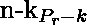
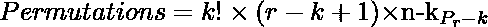

# 一次取 r 的 n 个事物与 k 个事物排列在一起

> 原文:[https://www . geesforgeks . org/n-things-take-r-at-time-with-k-things-together/](https://www.geeksforgeeks.org/permutations-of-n-things-taken-r-at-a-time-with-k-things-together/)

给定 n、r 和 k，任务是找出不同事物在的排列数量，使得特定事物总是一起出现。
**示例:**

```
Input : n = 8, r = 5, k = 2
Output : 960

Input : n = 6, r = 2, k = 2
Output : 2
```

**进场:**

1.  一捆具体的东西可以(r–k+1)种方式放在 r 个地方。
2.  捆中的 k 个具体的东西可以自己排列成 k 个！方法。
3.  现在(n–k)个东西会以的方式排列在(r–k)个地方。

因此，使用计数的基本原理，所需的排列数量将是:

> 

以下是上述方法的实现:

## C++

```
// CPP program to find the number of permutations of
// n different things taken r at a time
// with k things grouped together

#include <bits/stdc++.h>
using namespace std;

// Function to find factorial
// of a number
int factorial(int n)
{
    int fact = 1;

    for (int i = 2; i <= n; i++)
        fact = fact * i;

    return fact;
}

// Function to calculate p(n, r)
int npr(int n, int r)
{
    int pnr = factorial(n) / factorial(n - r);

    return pnr;
}

// Function to find the number of permutations of
// n different things taken r at a time
// with k things grouped together
int countPermutations(int n, int r, int k)
{
    return factorial(k) * (r - k + 1) * npr(n - k, r - k);
}

// Driver code
int main()
{
    int n = 8;
    int r = 5;
    int k = 2;

    cout << countPermutations(n, r, k);

    return 0;
}
```

## Java 语言(一种计算机语言，尤用于创建网站)

```
// Java program to find the number of permutations of
// n different things taken r at a time
// with k things grouped together

class GFG{
// Function to find factorial
// of a number
static int factorial(int n)
{
    int fact = 1;

    for (int i = 2; i <= n; i++)
        fact = fact * i;

    return fact;
}

// Function to calculate p(n, r)
static int npr(int n, int r)
{
    int pnr = factorial(n) / factorial(n - r);

    return pnr;
}

// Function to find the number of permutations of
// n different things taken r at a time
// with k things grouped together
static int countPermutations(int n, int r, int k)
{
    return factorial(k) * (r - k + 1) * npr(n - k, r - k);
}

// Driver code
public static void main(String[] args)
{
    int n = 8;
    int r = 5;
    int k = 2;

    System.out.println(countPermutations(n, r, k));
}
}
// this code is contributed by mits
```

## 蟒蛇 3

```
# Python3 program to find the number of permutations of
# n different things taken r at a time
# with k things grouped together

# def to find factorial
# of a number
def factorial(n):

    fact = 1;

    for i in range(2,n+1):
        fact = fact * i;

    return fact;

# def to calculate p(n, r)
def npr(n, r):

    pnr = factorial(n) / factorial(n - r);

    return pnr;

# def to find the number of permutations of
# n different things taken r at a time
# with k things grouped together
def countPermutations(n, r, k):

    return int(factorial(k) * (r - k + 1) * npr(n - k, r - k));

# Driver code
n = 8;
r = 5;
k = 2;

print(countPermutations(n, r, k));

# this code is contributed by mits
```

## C#

```
// C# program to find the number of
// permutations of n different things
// taken r at a time with k things
// grouped together
using System;

class GFG
{

// Function to find factorial
// of a number
static int factorial(int n)
{
    int fact = 1;

    for (int i = 2; i <= n; i++)
        fact = fact * i;

    return fact;
}

// Function to calculate p(n, r)
static int npr(int n, int r)
{
    int pnr = factorial(n) /
              factorial(n - r);

    return pnr;
}

// Function to find the number of
// permutations of n different
// things taken r at a time with
// k things grouped together
static int countPermutations(int n,
                             int r, int k)
{
    return factorial(k) * (r - k + 1) *
                    npr(n - k, r - k);
}

// Driver code
static void Main()
{
    int n = 8;
    int r = 5;
    int k = 2;

    Console.WriteLine(countPermutations(n, r, k));
}
}

// This code is contributed by mits
```

## 服务器端编程语言（Professional Hypertext Preprocessor 的缩写）

```
<?php
// PHP program to find the number
// of permutations of n different
// things taken r at a time
// with k things grouped together

// Function to find factorial
// of a number
function factorial($n)
{
    $fact = 1;

    for ($i = 2; $i <= $n; $i++)
        $fact = $fact * $i;

    return $fact;
}

// Function to calculate p(n, r)
function npr($n, $r)
{
    $pnr = factorial($n) /
           factorial($n - $r);

    return $pnr;
}

// Function to find the number of
// permutations of n different
// things taken r at a time
// with k things grouped together
function countPermutations($n, $r, $k)
{
    return factorial($k) * ($r - $k + 1) *
                   npr($n - $k, $r - $k);
}

// Driver code
$n = 8;
$r = 5;
$k = 2;

echo countPermutations($n, $r, $k);

// This code is contributed by mits
?>
```

## java 描述语言

```
<script>

// JavaScript program to find the number of permutations of
// n different things taken r at a time
// with k things grouped together

// Function to find factorial
// of a number
function factorial(n)
{
    let fact = 1;

    for (let i = 2; i <= n; i++)
        fact = fact * i;

    return fact;
}

// Function to calculate p(n, r)
function npr(n, r)
{
    let pnr = Math.floor(factorial(n) / factorial(n - r));

    return pnr;
}

// Function to find the number of permutations of
// n different things taken r at a time
// with k things grouped together

function countPermutations(n, r, k)
{
    return factorial(k) * (r - k + 1) * npr(n - k, r - k);
}

// Driver code
    let n = 8;
    let r = 5;
    let k = 2;

    document.write(countPermutations(n, r, k));

// This code is contributed by Surbhi Tyagi.

</script>
```

**Output:** 

```
960
```