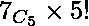

# 没有两个元音相邻的字符串排列

> 原文:[https://www . geeksforgeeks . org/字符串排列使得没有两个元音是相邻的/](https://www.geeksforgeeks.org/permutations-of-string-such-that-no-two-vowels-are-adjacent/)

给定由元音和辅音组成的字符串。任务是找到字符串中的字符排列方式的数量，使得没有两个元音彼此相邻。
**注**:鉴于**元音数量< =辅音数量**。

**示例:**

```
Input: str = "permutation"
Output : 907200

Input: str = "geeksforgeeks"
Output: 3175200 
```

**方法:**
考虑上面的例子字符串“排列”:

*   首先将所有辅音放在如下交替的位置:

```
-- p -- r -- m -- t -- t -- n --
```

*   放置辅音的方式数= **6！/ 2!**。出现两次，应该考虑一次。
*   然后把元音放在剩下的位置。我们还有 7 个剩余位置和 5 个元音来填充这 7 个位置。
    因此，补元音的方式数= 。

```
Total no. of ways =  
= 907200
```

假设在一个字符串中，元音的数量是 **vowelCount** ，辅音的数量是**辅音 Count** 。

> 因此，
> **总方式** =(辅音 Count！/copy econ sonant！)* **C** (辅音 Count+1，vowelCount) * (vowelCount！/copy Evo wel！)

下面是上述方法的实现:

## C++

```
// CPP program to count permutations of string
// such that no two vowels are adjacent

#include <bits/stdc++.h>
using namespace std;

// Factorial of a number
int factorial(int n)
{

    int fact = 1;
    for (int i = 2; i <= n; i++)
        fact = fact * i;

    return fact;
}

// Function to find c(n, r)
int ncr(int n, int r)
{
    return factorial(n) / (factorial(r) * factorial(n - r));
}

// Function to count permutations of string
// such that no two vowels are adjacent
int countWays(string str)
{
    int freq[26] = { 0 };
    int nvowels = 0, nconsonants = 0;

    int vplaces, cways, vways;

    // Finding the frequencies of
    // the characters
    for (int i = 0; i < str.length(); i++)
        ++freq[str[i] - 'a'];

    // finding the no. of vowels and
    // consonants in given word
    for (int i = 0; i < 26; i++) {

        if (i == 0 || i == 4 || i == 8
            || i == 14 || i == 20)
            nvowels += freq[i];
        else
            nconsonants += freq[i];
    }
    // finding places for the vowels
    vplaces = nconsonants + 1;

    // ways to fill consonants 6! / 2!
    cways = factorial(nconsonants);
    for (int i = 0; i < 26; i++) {
        if (i != 0 && i != 4 && i != 8 && i != 14
            && i != 20 && freq[i] > 1) {

            cways = cways / factorial(freq[i]);
        }
    }

    // ways to put vowels 7C5 x 5!
    vways = ncr(vplaces, nvowels) * factorial(nvowels);
    for (int i = 0; i < 26; i++) {
        if (i == 0 || i == 4 || i == 8 || i == 14
            || i == 20 && freq[i] > 1) {
            vways = vways / factorial(freq[i]);
        }
    }

    return cways * vways;
}

// Driver code
int main()
{
    string str = "permutation";

    cout << countWays(str) << endl;

    return 0;
}
```

## Java 语言(一种计算机语言，尤用于创建网站)

```
// Java program to count permutations of string
// such that no two vowels are adjacent

class GFG
{

        // Factorial of a number
        static int factorial(int n)
        {

            int fact = 1;
            for (int i = 2; i <= n; i++)
                fact = fact * i;

            return fact;
        }

        // Function to find c(n, r)
        static int ncr(int n, int r)
        {
            return factorial(n) / (factorial(r) * factorial(n - r));
        }

        // Function to count permutations of string
        // such that no two vowels are adjacent
        static int countWays(String str)
        {
            int freq[]=new int[26];

            for(int i=0;i<26;i++)
            {
                freq[i]=0;
            }

            int nvowels = 0, nconsonants = 0;

            int vplaces, cways, vways;

            // Finding the frequencies of
            // the characters
            for (int i = 0; i < str.length(); i++)
                ++freq[str.charAt(i) - 'a'];

            // finding the no. of vowels and
            // consonants in given word
            for (int i = 0; i < 26; i++) {

                if (i == 0 || i == 4 || i == 8
                    || i == 14 || i == 20)
                    nvowels += freq[i];
                else
                    nconsonants += freq[i];
            }
            // finding places for the vowels
            vplaces = nconsonants + 1;

            // ways to fill consonants 6! / 2!
            cways = factorial(nconsonants);
            for (int i = 0; i < 26; i++) {
                if (i != 0 && i != 4 && i != 8 && i != 14
                    && i != 20 && freq[i] > 1) {

                    cways = cways / factorial(freq[i]);
                }
            }

            // ways to put vowels 7C5 x 5!
            vways = ncr(vplaces, nvowels) * factorial(nvowels);
            for (int i = 0; i < 26; i++) {
                if (i == 0 || i == 4 || i == 8 || i == 14
                    || i == 20 && freq[i] > 1) {
                    vways = vways / factorial(freq[i]);
                }
            }

            return cways * vways;
        }

        // Driver code
        public static void main(String []args)
        {
            String str = "permutation";

            System.out.println(countWays(str));

        }
}

// This code is contributed
// by ihritik
```

## 蟒蛇 3

```
# Python3 program to count permutations of
# string such that no two vowels are adjacent

# Factorial of a number
def factorial(n) :

    fact = 1;
    for i in range(2, n + 1) :
        fact = fact * i

    return fact

# Function to find c(n, r)
def ncr(n, r) :

    return factorial(n) // (factorial(r) *
                            factorial(n - r))

# Function to count permutations of string
# such that no two vowels are adjacent
def countWays(string) :

    freq = [0] * 26
    nvowels, nconsonants = 0, 0

    # Finding the frequencies of
    # the characters
    for i in range(len(string)) :
        freq[ord(string[i]) - ord('a')] += 1

    # finding the no. of vowels and
    # consonants in given word
    for i in range(26) :

        if (i == 0 or i == 4 or i == 8
            or i == 14 or i == 20) :
            nvowels += freq[i]
        else :
            nconsonants += freq[i]

    # finding places for the vowels
    vplaces = nconsonants + 1

    # ways to fill consonants 6! / 2!
    cways = factorial(nconsonants)
    for i in range(26) :
        if (i != 0 and i != 4 and i != 8 and
            i != 14 and i != 20 and freq[i] > 1) :

            cways = cways // factorial(freq[i])

    # ways to put vowels 7C5 x 5!
    vways = ncr(vplaces, nvowels) * factorial(nvowels)
    for i in range(26) :
        if (i == 0 or i == 4 or i == 8 or i == 14
            or i == 20 and freq[i] > 1) :
            vways = vways // factorial(freq[i])

    return cways * vways;

# Driver code
if __name__ == "__main__" :

    string = "permutation"

    print(countWays(string))

# This code is contributed by Ryuga
```

## C#

```
// C# program to count permutations of string
// such that no two vowels are adjacent

using System;
class GFG
{

        // Factorial of a number
        static int factorial(int n)
        {

            int fact = 1;
            for (int i = 2; i <= n; i++)
                fact = fact * i;

            return fact;
        }

        // Function to find c(n, r)
        static int ncr(int n, int r)
        {
            return factorial(n) / (factorial(r) * factorial(n - r));
        }

        // Function to count permutations of string
        // such that no two vowels are adjacent
        static int countWays(String str)
        {
            int []freq=new int[26];

            for(int i=0;i<26;i++)
            {
                freq[i]=0;
            }

            int nvowels = 0, nconsonants = 0;

            int vplaces, cways, vways;

            // Finding the frequencies of
            // the characters
            for (int i = 0; i < str.Length; i++)
                ++freq[str[i] - 'a'];

            // finding the no. of vowels and
            // consonants in given word
            for (int i = 0; i < 26; i++) {

                if (i == 0 || i == 4 || i == 8
                    || i == 14 || i == 20)
                    nvowels += freq[i];
                else
                    nconsonants += freq[i];
            }
            // finding places for the vowels
            vplaces = nconsonants + 1;

            // ways to fill consonants 6! / 2!
            cways = factorial(nconsonants);
            for (int i = 0; i < 26; i++) {
                if (i != 0 && i != 4 && i != 8 && i != 14
                    && i != 20 && freq[i] > 1) {

                    cways = cways / factorial(freq[i]);
                }
            }

            // ways to put vowels 7C5 x 5!
            vways = ncr(vplaces, nvowels) * factorial(nvowels);
            for (int i = 0; i < 26; i++) {
                if (i == 0 || i == 4 || i == 8 || i == 14
                    || i == 20 && freq[i] > 1) {
                    vways = vways / factorial(freq[i]);
                }
            }

            return cways * vways;
        }

        // Driver code
        public static void Main()
        {
            String str = "permutation";

            Console.WriteLine(countWays(str));

        }
}

// This code is contributed
// by ihritik
```

## 服务器端编程语言（Professional Hypertext Preprocessor 的缩写）

```
<?php
// CPP program to count permutations of string
// such that no two vowels are adjacent

// Factorial of a number
function factorial($n)
{
    $fact = 1;
    for ($i = 2; $i <= $n; $i++)
        $fact = $fact * $i;

    return $fact;
}

// Function to find c(n, r)
function ncr($n, $r)
{
    return factorial($n) / (factorial($r) * factorial($n - $r));
}

// Function to count permutations of string
// such that no two vowels are adjacent
function countWays($str)
{
    $freq = array_fill(0,26,NULL);
    $nvowels = 0;
    $nconsonants = 0;

    // Finding the frequencies of
    // the characters
    for ($i = 0; $i < strlen($str); $i++)
        ++$freq[ord($str[$i]) - ord('a')];

    // finding the no. of vowels and
    // consonants in given word
    for ($i = 0; $i < 26; $i++) {

        if ($i == 0 || $i == 4 || $i == 8
            || $i == 14 || $i == 20)
            $nvowels += $freq[$i];
        else
            $nconsonants += $freq[$i];
    }
    // finding places for the vowels
    $vplaces = $nconsonants + 1;

    // ways to fill consonants 6! / 2!
    $cways = factorial($nconsonants);
    for ($i = 0; $i < 26; $i++) {
        if ($i != 0 && $i != 4 && $i != 8 && $i != 14
            && $i != 20 && $freq[$i] > 1) {

            $cways = $cways / factorial($freq[$i]);
        }
    }

    // ways to put vowels 7C5 x 5!
    $vways = ncr($vplaces, $nvowels) * factorial($nvowels);
    for ($i = 0; $i < 26; $i++) {
        if ($i == 0 || $i == 4 || $i == 8 || $i == 14
            || $i == 20 && $freq[$i] > 1) {
            $vways = $vways / factorial($freq[$i]);
        }
    }
    return $cways * $vways;
}

// Driver code

$str = "permutation";
echo countWays($str)."\n";
return 0;
// this code is contributed by Ita_c.
?>
```

## java 描述语言

```
<script>
// Javascript program to count permutations of string
// such that no two vowels are adjacent

    // Factorial of a number
    function factorial(n)
    {
        let fact = 1;
            for (let i = 2; i <= n; i++)
                fact = fact * i;

            return fact;
    }

     // Function to find c(n, r)
    function ncr(n,r)
    {
        return Math.floor(factorial(n) / (factorial(r) * factorial(n - r)));
    }

    // Function to count permutations of string
        // such that no two vowels are adjacent
    function countWays(str)
    {

            let freq=new Array(26);

              for(let i=0;i<26;i++)
            {
                freq[i]=0;
            }

            let nvowels = 0, nconsonants = 0;

            let vplaces, cways, vways;

            // Finding the frequencies of
            // the characters
            for (let i = 0; i < str.length; i++)
                ++freq[str[i].charCodeAt(0) - 'a'.charCodeAt(0)];

            // finding the no. of vowels and
            // consonants in given word
            for (let i = 0; i < 26; i++) {

                if (i == 0 || i == 4 || i == 8
                    || i == 14 || i == 20)
                    nvowels += freq[i];
                else
                    nconsonants += freq[i];
            }
            // finding places for the vowels
            vplaces = nconsonants + 1;

            // ways to fill consonants 6! / 2!
            cways = factorial(nconsonants);
            for (let i = 0; i < 26; i++) {
                if (i != 0 && i != 4 && i != 8 && i != 14
                    && i != 20 && freq[i] > 1) {

                    cways = Math.floor(cways / factorial(freq[i]));
                }
            }

            // ways to put vowels 7C5 x 5!
            vways = ncr(vplaces, nvowels) * factorial(nvowels);
            for (let i = 0; i < 26; i++) {
                if (i == 0 || i == 4 || i == 8 || i == 14
                    || i == 20 && freq[i] > 1) {
                    vways = Math.floor(vways / factorial(freq[i]));
                }
            }

            return cways * vways;

    }

     // Driver code
    let str = "permutation";
    document.write(countWays(str));

// This code is contributed by rag2127
</script>
```

**输出:**

```
907200
```