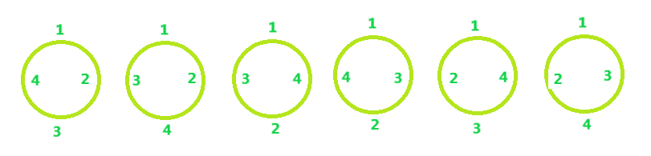

# 排列成圆形桌子周围的 N 个人

> 原文:[https://www . geeksforgeeks . org/排列-排列-n-人-围绕一个圆形表/](https://www.geeksforgeeks.org/permutations-to-arrange-n-persons-around-a-circular-table/)

给定 N，人数。任务是围绕一张圆形桌子安排 N 个人。
**例** :

```
Input: N = 4
Output: 6

Input: N = 5
Output: 24
```

**做法:**是**循环排列的概念**即排列中没有具体的起点，任何元素都可以认为是排列的起点。
**N = 4，安排为:**



下面是寻找圆形排列的公式:

```
Circular Permutations = (N - 1)!
```

以下是上述想法的实现:

## C++

```
// C++ code to demonstrate Circular Permutation
#include <bits/stdc++.h>
using namespace std;

// Function to find no. of permutations
int Circular(int n)
{

    int Result = 1;

    while (n > 0) {
        Result = Result * n;
        n--;
    }

    return Result;
}

// Driver Code
int main()
{
    int n = 4;

    cout << Circular(n - 1);
}
```

## Java 语言(一种计算机语言，尤用于创建网站)

```
// Java code to demonstrate
// Circular Permutation
import java.io.*;

class GFG
{
// Function to find no.
// of permutations
static int Circular(int n)
{

    int Result = 1;

    while (n > 0)
    {
        Result = Result * n;
        n--;
    }

    return Result;
}

// Driver Code
public static void main(String[] args)
{
    int n = 4;

    System.out.println(Circular(n - 1));
}
}

// This code is contributed
// by Naman_Garg
```

## 蟒蛇 3

```
# Python 3 Program to demonstrate Circular Permutation 

# Function to find no. of permutations
def Circular(n) :
    Result = 1

    while n > 0 :
        Result = Result * n
        n -= 1

    return Result

# Driver Code
if __name__ == "__main__" :
    n = 4

    # function calling
    print(Circular(n-1))

# This code is contributed by ANKITRAI1
```

## C#

```
// C# code to demonstrate
// Circular Permutation
using System;

public class GFG {

// Function to find no.
// of permutations
static int Circular(int n)
{

    int Result = 1;

    while (n > 0)
    {
        Result = Result * n;
        n--;
    }

    return Result;
}

// Driver Code
public static void Main()
{
    int n = 4;

    Console.Write(Circular(n - 1));
}
}

/* This Java code is contributed by 29AjayKumar*/
```

## 服务器端编程语言（Professional Hypertext Preprocessor 的缩写）

```
<?php
// PHP code to demonstrate Circular Permutation

// Function to find no. of permutations
function Circular($n)
{
    $Result = 1;

    while ($n > 0)
    {
        $Result = $Result * $n;
        $n--;
    }

    return $Result;
}

// Driver Code
$n = 4;

echo Circular($n - 1);

// This code is contributed by mits
?>
```

## java 描述语言

```
<script>
// javascript code to demonstrate
// Circular Permutation

    // Function to find no.
    // of permutations
    function Circular(n)
    {
        var Result = 1;
        while (n > 0)
        {
            Result = Result * n;
            n--;
        }

        return Result;
    }

    // Driver Code
    var n = 4;
    document.write(Circular(n - 1));

// This code is contributed by Rajput-Ji
</script>
```

**Output:** 

```
6
```