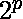

# 流毒数

> 原文:[https://www.geeksforgeeks.org/pernicious-number/](https://www.geeksforgeeks.org/pernicious-number/)

一个**有害数**是一个正整数，在其二进制表示中有*个素数。第一个有害数是 3，因为 3 = (11)(在二进制表示中)和 1 + 1 = 2 是一个素数。
**流毒数属性:**
1。没有任何有害的数字也是 2 的*次幂*，因为二进制形式的 2 的次幂表示为 1 后跟 0。所以，1 不被认为是质数。
2。形式 + 1 的每一个带有 n 的数字> 0 都是有害的数字，因为二进制形式的 1 的数量是 2，它是质数。
3。带素数 p 的形式为–1 的数是一个有害的数，称为[梅森数](https://en.wikipedia.org/wiki/Mersenne_prime)。* 

打印前 n 个有害数字的想法很简单。
对从 1 到 n 的每个数字执行以下操作。
1) [计数当前数字中的设置位](https://www.geeksforgeeks.org/count-set-bits-in-an-integer/)
2)如果设置位的计数为质数，则打印当前数字。为此，我们使用[简单素性检查](https://www.geeksforgeeks.org/primality-test-set-1-introduction-and-school-method/)。
下面是打印前 25 个流毒号的程序。
以下是上述办法的实施情况。

## C++

```
// CPP program to print first n pernicious numbers
#include <bits/stdc++.h>
using namespace std;

// function to check prime number
bool isPrime(int x)
{
    if (x < 2)
        return false;
    for (int i = 2; i < x; i++) {
        if (x % i == 0)
            return false;
    }
    return true;
}

// Prints first n Pernicious numbers
void printPernicious(int n)
{
    for (int i=1,count=0; count<n; i++) {

        // "__builtin_popcount(i)" count no
        // of ones in binary representation
        if (isPrime(__builtin_popcount(i))) {
            cout << i << " ";

            count++;
        }
    }
}

int main()
{
   int n = 25;
   printPernicious(n);
   return 0;
}
```

## Java 语言(一种计算机语言，尤用于创建网站)

```
// Java program to print first
// n pernicious numbers
import java.util.*;

class GFG {
    // function to count no of
    // ones in binary representation
    static int countSetBits(int n)
    {
        int count = 0;

        while (n > 0)
        {
            n &= (n - 1) ;
            count++;
        }
        return count;
    }

    // function to check prime number
    static boolean isPrime(int x)
    {
        if (x < 2)
            return false;
        for (int i = 2; i < x; i++) {
            if (x % i == 0)
                return false;
        }
        return true;
    }

    // Prints first n Pernicious numbers
    static void printPernicious(int n)
    {
        for (int i=1,count=0; count<n; i++) {

            if (isPrime(countSetBits(i))) {
                System.out.print( i + " ");

                count++;
            }
        }
    }

    // Driver Code
    public static void main (String[] args) {
        int n = 25;
        printPernicious(n);
    }
}

// This code is contributed by Ansu Kumari
```

## 蟒蛇 3

```
# Python program to print
# first n pernicious numbers

# function to check
# prime number
def isPrime(x):

    if x < 2:
        return False

    for i in range(2, x):
        if not x % i:
            return False

    return True

# Prints first n Pernicious
# numbers
def printPernicious(n):

    i, count = 1, 0

    while count < n:

        # "bin(i).count('1')" count
        # no of ones in binary
        # representation
        if (isPrime(bin(i).count('1'))):
            print(i, end=' ')
            count += 1

        i += 1

# Driver Code
n = 25
printPernicious(n)

# This code is contributed by Ansu Kumari
```

## C#

```
// C#program to print first
// n pernicious numbers
using System;

class GFG
{
    // function to count no of
    // ones in binary representation
    static int countSetBits(int n)
    {
        int count = 0;

        while (n > 0)
        {
            n &= (n - 1) ;
            count++;
        }
        return count;
    }

    // function to check prime number
    static bool isPrime(int x)
    {
        if (x < 2)
            return false;
        for (int i = 2; i < x; i++) {
            if (x % i == 0)
                return false;
        }
        return true;
    }

    // Prints first n Pernicious numbers
    static void printPernicious(int n)
    {
        for (int i=1,count=0; count<n; i++) {

            if (isPrime(countSetBits(i))) {
                Console.Write( i + " ");

                count++;
            }
        }
    }

    // Driver Code
    public static void Main ()
    {
        int n = 25;
        printPernicious(n);
    }
}

// This code is contributed by vt_m
```

## 服务器端编程语言（Professional Hypertext Preprocessor 的缩写）

```
<?php
// PHP program to print first
// n pernicious numbers

// function to check prime number
function isPrime($x)
{
    if ($x < 2)
        return false;
    for ($i = 2; $i < $x; $i++)
    {
        if ($x % $i == 0)
            return false;
    }
    return true;
}
//this function count no of
// ones in binary representation
function getBitCount($value)
{

    $count = 0;
    while($value)
    {
        $count += ($value & 1);
        $value = $value >> 1;
    }

    return $count;
}

// Prints first n Pernicious numbers
function printPernicious($n)
{
    for ($i = 1, $count = 0;
                $count < $n; $i++)
    {

        //count no of ones in
        // binary representation
        if (isPrime(getBitCount($i)))
        {
            echo $i." ";

            $count++;
        }
    }
}

// Driver code
$n = 25;
printPernicious($n);

// This code is contributed by mits
?>
```

## java 描述语言

```
<script>

// JavaScript program to print first
// n pernicious numbers

    // function to count no of
    // ones in binary representation
    function countSetBits(n)
    {
        let count = 0;

        while (n > 0)
        {
            n &= (n - 1) ;
            count++;
        }
        return count;
    }

    // function to check prime number
    function isPrime(x)
    {
        if (x < 2)
            return false;
        for (let i = 2; i < x; i++) {
            if (x % i == 0)
                return false;
        }
        return true;
    }

    // Prints first n Pernicious numbers
    function printPernicious(n)
    {
        for (let i=1,count=0; count<n; i++) {

            if (isPrime(countSetBits(i))) {
                document.write( i + " ");

                count++;
            }
        }
    }

// Driver code

        let n = 25;
        printPernicious(n);

</script>
```

**输出:**

```
3 5 6 7 9 10 11 12 13 14 17 18 19 20 21 22 24 25 26 28 31 33 34 35 36
```

**参考文献:**
[维基](https://en.wikipedia.org/wiki/Pernicious_number)