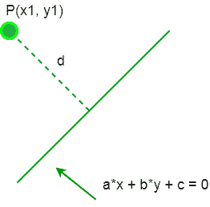

# 2d 中点和直线的垂直距离

> 原文:[https://www . geeksforgeeks . org/垂线-2-d 中点线间距离/](https://www.geeksforgeeks.org/perpendicular-distance-between-a-point-and-a-line-in-2-d/)

给定点(x1，y1)和直线(ax + by + c = 0)。任务是找到给定点和直线之间的垂直距离。



**例:**

> **输入:** x1 = 5，y1 = 6，a = -2，b = 3，c = 4
> **输出:** 3.32820117735
> **输入:** x1 = -1，y1 = 3，a = 4，b = -3，c =–5
> **输出:** 3.6

**进近:**从给定点到一条线的距离(即最短距离)是从该点到给定线的垂直距离。平面中直线的方程由方程 ax + by + c = 0 给出，其中 a、b 和 c 是实常数。点的坐标是(x1，y1)
二维空间中点和线之间的距离公式如下:

```
Distance = (| a*x1 + b*y1 + c |) / (sqrt( a*a + b*b))
```

以下是上述公式的实现:
**程序 1:**

## C

```
// C program to find the distance
// between a given point and a
// given line in 2 D.
#include<stdio.h>
#include<math.h>

// Function to find distance
void shortest_distance(float x1, float y1,
                       float a, float b,
                       float c)
{
    float d = fabs((a * x1 + b * y1 + c)) /
             (sqrt(a * a + b * b));
    printf("Perpendicular distance is %f\n", d);
    return;
}

// Driver Code
int main()
{
    float x1 = 5;
    float y1 = 6;
    float a = -2;
    float b = 3;
    float c = 4;
    shortest_distance(x1, y1, a, b, c);
    return 0;
}

// This code is contributed
// by Amber_Saxena.
```

## Java 语言(一种计算机语言，尤用于创建网站)

```
// Java program to find
// the distance between
// a given point and a
// given line in 2 D.
import java.io.*;

class GFG
{

    // Function to find distance
    static void shortest_distance(float x1, float y1,
                                  float a, float b,
                                  float c)
    {
        double d = Math.abs(((a * x1 + b * y1 + c)) /
                  (Math.sqrt(a * a + b * b)));
        System.out.println("Perpendicular " +
                         "distance is " + d);
        return;
    }

    // Driver code
    public static void main (String[] args)
    {
        float x1 = 5;
        float y1 = 6;
        float a = -2;
        float b = 3;
        float c = 4;
        shortest_distance(x1, y1, a, b, c);
    }
}

// This code is contributed
// by Mahadev.
```

## 计算机编程语言

```
# Python program to find the distance between
# a given point and a given line in 2 D.

import math

# Function to find distance
def shortest_distance(x1, y1, a, b, c):

    d = abs((a * x1 + b * y1 + c)) / (math.sqrt(a * a + b * b))
    print("Perpendicular distance is"),d

# Driver Code
x1 = 5
y1 = 6
a = -2
b = 3
c = 4
shortest_distance(x1, y1, a, b, c) 
```

## C#

```
// C# program to find
// the distance between
// a given point and a
// given line in 2 D.
using System;

class GFG
{

    // Function to find distance
    static void shortest_distance(float x1, float y1,
                                float a, float b,
                                float c)
    {
        double d = Math.Abs(((a * x1 + b * y1 + c)) /
                (Math.Sqrt(a * a + b * b)));
        Console.WriteLine("Perpendicular " +
                        "distance is " + d);
        return;
    }

    // Driver code
    public static void Main ()
    {
        float x1 = 5;
        float y1 = 6;
        float a = -2;
        float b = 3;
        float c = 4;
        shortest_distance(x1, y1, a, b, c);
    }
}

// This code is contributed
// by inder_verma..
```

## 服务器端编程语言（Professional Hypertext Preprocessor 的缩写）

```
<?php
// PHP program to find the distance
// between a given point and a
// given line in 2 D.

// Function to find distance
function shortest_distance($x1, $y1, $a, $b, $c)
{
    $d = abs(($a * $x1 + $b * $y1 + $c)) /
               (sqrt($a * $a + $b * $b));
    echo"Perpendicular distance is ", $d;
}

// Driver Code
$x1 = 5;
$y1 = 6;
$a = -2;
$b = 3;
$c = 4;
shortest_distance($x1, $y1, $a, $b, $c);

// This code is contributed
// by inder_verma..
?>
```

## java 描述语言

```
<script>

// Javascript program to find
// the distance between
// a given point and a
// given line in 2 D.

    // Function to find distance
    function shortest_distance(x1 , y1 , a , b , c)
    {
        var d = Math.abs((
        (a * x1 + b * y1 + c)) / (Math.sqrt(a * a + b * b)));
        document.write("Perpendicular " +
        "distance is " + d.toFixed(11));
        return;
    }

    // Driver code

        var x1 = 5;
        var y1 = 6;
        var a = -2;
        var b = 3;
        var c = 4;
        shortest_distance(x1, y1, a, b, c);

// This code is contributed by todaysgaurav

</script>
```

**Output:** 

```
Perpendicular distance is 3.32820117735
```

**节目 2** :

## C

```
// C program to find the distance
// between a given point and a
// given line in 2 D.
#include<stdio.h>
#include<math.h>

// Function to find distance
void shortest_distance(float x1, float y1,
                       float a, float b,
                       float c)
{
    float d = fabs((a * x1 + b * y1 + c)) /
              (sqrt(a * a + b * b));
    printf("Perpendicular distance is %f\n", d);
    return;
}

// Driver Code
int main()
{
    float x1 = -1;
    float y1 = 3;
    float a = 4;
    float b = -3;
    float c = - 5;
    shortest_distance(x1, y1, a, b, c);
    return 0;
}

// This code is contributed
// by Amber_Saxena.
```

## Java 语言(一种计算机语言，尤用于创建网站)

```
// Java program to find the distance
// between a given point and a
// given line in 2 D.
class GFG
{
// Function to find distance
static void shortest_distance(double x1, double y1,
                              double a, double b,
                              double c)
{
    double d = Math.abs((a * x1 + b * y1 + c)) /
              (Math.sqrt(a * a + b * b));
    System.out.println("Perpendicular distance is " + d);
    return;
}

// Driver Code
public static void main(String[] args)
{
    double x1 = -1;
    double y1 = 3;
    double a = 4;
    double b = -3;
    double c = - 5;
    shortest_distance(x1, y1, a, b, c);
}
}

// This code is contributed
// by mits
```

## 计算机编程语言

```
# Python program to find the distance between
# a given point and a given line in 2 D.

import math

# Function to find distance
def shortest_distance(x1, y1, a, b, c):

    d = abs((a * x1 + b * y1 + c)) / (math.sqrt(a * a + b * b))
    print("Perpendicular distance is"),d

# Driver Code
x1 = -1
y1 = 3
a = 4
b = -3
c = - 5
shortest_distance(x1, y1, a, b, c) 
```

## C#

```
// C# program to find the distance
// between a given point and a
// given line in 2 D.
using System;

class GFG
{
// Function to find distance
static void shortest_distance(double x1, double y1,
                              double a, double b,
                              double c)
{
    double d = Math.Abs((a * x1 + b * y1 + c)) /
              (Math.Sqrt(a * a + b * b));
    Console.WriteLine("Perpendicular distance is " + d);
    return;
}

// Driver Code
public static void Main()
{
    double x1 = -1;
    double y1 = 3;
    double a = 4;
    double b = -3;
    double c = - 5;
    shortest_distance(x1, y1, a, b, c);
}
}

// This code is contributed
// by Akanksha Rai
```

## 服务器端编程语言（Professional Hypertext Preprocessor 的缩写）

```
<?php
// PHP program to find the distance
// between a given point and a
// given line in 2 D.

// Function to find distance
function shortest_distance($x1, $y1, $a,
                           $b, $c)
{
    $d = abs((int)($a * $x1 + $b * $y1 + $c) /
              sqrt($a * $a + $b * $b));
    echo"Perpendicular distance is ", $d;
}

// Driver Code
$x1 = -1;
$y1 = 3;
$a = 4;
$b = -3;
$c = -5;
shortest_distance($x1, $y1, $a, $b, $c);

// This code is contributed
// by inder_verma..
?>
```

## java 描述语言

```
<script>

// Javascript program to find the distance
// between a given point and a
// given line in 2 D.

// Function to find distance
function shortest_distance(x1, y1, a, b, c)
{
    let d = Math.abs((a * x1 + b * y1 + c)) /
              (Math.sqrt(a * a + b * b));
    document.write("Perpendicular distance is " + d);
    return;
}

// driver program
    let x1 = -1;
    let y1 = 3;
    let a = 4;
    let b = -3;
    let c = - 5;
    shortest_distance(x1, y1, a, b, c);

  // This code is contributed by susmitakundugoaldanga.
</script>
```

**Output:** 

```
Perpendicular distance is 3.6
```