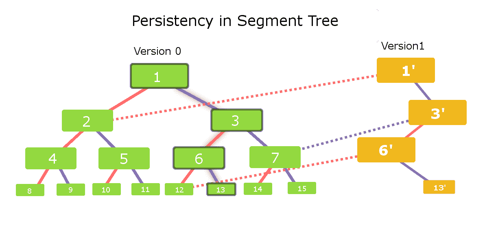

# 持久段树|集合 1(简介)

> 原文:[https://www . geesforgeks . org/persistent-segment-tree-set-1-introduction/](https://www.geeksforgeeks.org/persistent-segment-tree-set-1-introduction/)

```
Prerequisite : Segment Tree
               Persistency in Data Structure
```

“段树”本身就是一个很好的数据结构，在很多情况下都会发挥作用。在这篇文章中，我们将介绍这个数据结构中持久性的概念。坚持，简单地说就是保持变化。但是很明显，保留更改会导致额外的内存消耗，从而影响时间复杂度。

我们的目标是在段树中应用持久性，并确保每次更改不会花费超过 **O(log n)的时间和空间**。

让我们从版本的角度来考虑，也就是说，对于我们的细分树中的每一个变化，我们都会创建一个新的版本。
我们将考虑我们的初始版本为版本-0。现在，当我们在细分树中进行任何更新时，我们将为它创建一个新版本，并以类似的方式跟踪所有版本的记录。

但是为每个版本创建整个树将需要额外的空间和时间。所以，对于大量版本来说，这个想法耗尽了时间和内存。

让我们利用这样一个事实:对于段树中的每个新更新(为了简单起见，称之为点更新)，将修改最大 logn 节点。因此，我们的新版本将只包含这些日志 n 个新节点，其余节点将与以前的版本相同。因此，很明显，对于每个新版本，我们只需要创建这些新节点，而其余节点可以从以前的版本中共享。

考虑下图以获得更好的可视化效果(单击图像以获得更好的视图):-



考虑带有绿色节点的段树。让我们称这个段树为**版本-0** 。每个节点的左子节点与实心红色边连接，其中每个节点的右子节点与实心紫色边连接。显然，这个段树由 15 个节点组成。

现在考虑我们需要在版本-0 的叶节点 13 中进行更改。
因此，受影响的节点将是–**节点 13、节点 6、节点 3、节点 1** 。
因此，对于新版本**(版本-1)** 我们只需要创建这些 **4 个新节点**。

现在，让我们为段树中的这个变化构建版本 1。我们需要一个新的节点 1，因为它受到节点 13 中所做的更改的影响。因此，我们将首先创建一个新的**节点 1′**(黄色)。节点 1 '的左子节点将与版本-0 中节点 1 的左子节点相同。因此，我们将节点 1’的左子节点与版本-0 的节点 2 连接起来(图中红色虚线)。现在让我们检查版本 1 中节点 1’的正确子节点。我们需要创建一个受影响的新节点。因此，我们创建了一个名为节点 3’的新节点，并使其成为节点 1’的正确子节点(纯紫色边连接)。

以类似的方式，我们现在将检查**节点 3′**。左侧子节点受到影响，因此我们创建了一个名为**节点 6′**的新节点，并将其与节点 3′的实心红色边连接起来，其中节点 3′的右侧子节点将与版本-0 中节点 3 的右侧子节点相同。因此，我们将使版本-0 中节点 3 的右子节点成为版本-1 中节点 3’的右子节点(参见紫色虚线边缘。)

对节点 6’执行相同的过程，我们看到节点 6’的左子节点将是版本-0 中节点 6 的左子节点(红色虚线连接)，右子节点是新创建的名为**节点 13’**(实心紫色虚线边缘)的节点。
每个**黄色节点**是一个新创建的节点，虚线边缘是不同版本的线段树之间的相互连接。

现在，问题出现了:**如何跟踪所有版本？**
–我们只需要跟踪所有版本的第一个根节点，这将用于跟踪不同版本中所有新创建的节点。为此，我们可以为所有版本维护一个指向段树第一个节点的指针数组。

让我们考虑一个非常基本的问题，看看如何在段树中实现持久性

```
Problem : Given an array A[] and different point update operations.Considering 
each point operation to create a new version of the array. We need to answer 
the queries of type
Q v l r : output the sum of elements in range l to r just after the v-th update.
```

我们将创建所有版本的段树，并跟踪它们的根节点。然后，对于每个范围总和查询，我们将在查询函数中传递所需版本的根节点，并输出所需的总和。

**以下是上述问题的实现:-**

## C++

```
// C++ program to implement persistent segment
// tree.
#include "bits/stdc++.h"
using namespace std;

#define MAXN 100

/* data type for individual
 * node in the segment tree */
struct node
{
    // stores sum of the elements in node
    int val;

    // pointer to left and right children
    node* left, *right;

    // required constructors........
    node() {}
    node(node* l, node* r, int v)
    {
        left = l;
        right = r;
        val = v;
    }
};

// input array
int arr[MAXN];

// root pointers for all versions
node* version[MAXN];

// Constructs Version-0
// Time Complexity : O(nlogn)
void build(node* n,int low,int high)
{
    if (low==high)
    {
        n->val = arr[low];
        return;
    }
    int mid = (low+high) / 2;
    n->left = new node(NULL, NULL, 0);
    n->right = new node(NULL, NULL, 0);
    build(n->left, low, mid);
    build(n->right, mid+1, high);
    n->val = n->left->val + n->right->val;
}

/**
 * Upgrades to new Version
 * @param prev : points to node of previous version
 * @param cur  : points to node of current version
 * Time Complexity : O(logn)
 * Space Complexity : O(logn)  */
void upgrade(node* prev, node* cur, int low, int high,
                                   int idx, int value)
{
    if (idx > high or idx < low or low > high)
        return;

    if (low == high)
    {
        // modification in new version
        cur->val = value;
        return;
    }
    int mid = (low+high) / 2;
    if (idx <= mid)
    {
        // link to right child of previous version
        cur->right = prev->right;

        // create new node in current version
        cur->left = new node(NULL, NULL, 0);

        upgrade(prev->left,cur->left, low, mid, idx, value);
    }
    else
    {
        // link to left child of previous version
        cur->left = prev->left;

        // create new node for current version
        cur->right = new node(NULL, NULL, 0);

        upgrade(prev->right, cur->right, mid+1, high, idx, value);
    }

    // calculating data for current version
    // by combining previous version and current
    // modification
    cur->val = cur->left->val + cur->right->val;
}

int query(node* n, int low, int high, int l, int r)
{
    if (l > high or r < low or low > high)
       return 0;
    if (l <= low and high <= r)
       return n->val;
    int mid = (low+high) / 2;
    int p1 = query(n->left,low,mid,l,r);
    int p2 = query(n->right,mid+1,high,l,r);
    return p1+p2;
}

int main(int argc, char const *argv[])
{
    int A[] = {1,2,3,4,5};
    int n = sizeof(A)/sizeof(int);

    for (int i=0; i<n; i++)
       arr[i] = A[i];

    // creating Version-0
    node* root = new node(NULL, NULL, 0);
    build(root, 0, n-1);

    // storing root node for version-0
    version[0] = root;

    // upgrading to version-1
    version[1] = new node(NULL, NULL, 0);
    upgrade(version[0], version[1], 0, n-1, 4, 1);

    // upgrading to version-2
    version[2] = new node(NULL, NULL, 0);
    upgrade(version[1],version[2], 0, n-1, 2, 10);

    cout << "In version 1 , query(0,4) : ";
    cout << query(version[1], 0, n-1, 0, 4) << endl;

    cout << "In version 2 , query(3,4) : ";
    cout << query(version[2], 0, n-1, 3, 4) << endl;

    cout << "In version 0 , query(0,3) : ";
    cout << query(version[0], 0, n-1, 0, 3) << endl;
    return 0;
}
```

## Java 语言(一种计算机语言，尤用于创建网站)

```
// Java program to implement persistent
// segment tree.
class GFG{

// Declaring maximum number
static Integer MAXN = 100;

// Making Node for tree
static class node
{

    // Stores sum of the elements in node
    int val;

    // Reference to left and right children
    node left, right;

    // Required constructors..
    node() {}

    // Node constructor for l,r,v
    node(node l, node r, int v)
    {
        left = l;
        right = r;
        val = v;
    }
}

// Input array
static int[] arr = new int[MAXN];

// Root pointers for all versions
static node version[] = new node[MAXN];

// Constructs Version-0
// Time Complexity : O(nlogn)
static void build(node n, int low, int high)
{
    if (low == high)
    {
        n.val = arr[low];
        return;
    }

    int mid = (low + high) / 2;
    n.left = new node(null, null, 0);
    n.right = new node(null, null, 0);
    build(n.left, low, mid);
    build(n.right, mid + 1, high);
    n.val = n.left.val + n.right.val;
}

/*  Upgrades to new Version
 * @param prev : points to node of previous version
 * @param cur  : points to node of current version
 * Time Complexity : O(logn)
 * Space Complexity : O(logn)  */
static void upgrade(node prev, node cur, int low,
                      int high, int idx, int value)
{
    if (idx > high || idx < low || low > high)
        return;

    if (low == high)
    {

        // Modification in new version
        cur.val = value;
        return;
    }
    int mid = (low + high) / 2;

    if (idx <= mid)
    {

        // Link to right child of previous version
        cur.right = prev.right;

        // Create new node in current version
        cur.left = new node(null, null, 0);

        upgrade(prev.left, cur.left, low,
                mid, idx, value);
    }
    else
    {

        // Link to left child of previous version
        cur.left = prev.left;

        // Create new node for current version
        cur.right = new node(null, null, 0);

        upgrade(prev.right, cur.right, mid + 1,
                high, idx, value);
    }

    // Calculating data for current version
    // by combining previous version and current
    // modification
    cur.val = cur.left.val + cur.right.val;
}

static int query(node n, int low, int high,
                         int l, int r)
{
    if (l > high || r < low || low > high)
        return 0;
    if (l <= low && high <= r)
        return n.val;

    int mid = (low + high) / 2;
    int p1 = query(n.left, low, mid, l, r);
    int p2 = query(n.right, mid + 1, high, l, r);
    return p1 + p2;
}

// Driver code
public static void main(String[] args)
{
    int A[] = { 1, 2, 3, 4, 5 };
    int n = A.length;

    for(int i = 0; i < n; i++)
        arr[i] = A[i];

    // Creating Version-0
    node root = new node(null, null, 0);
    build(root, 0, n - 1);

    // Storing root node for version-0
    version[0] = root;

    // Upgrading to version-1
    version[1] = new node(null, null, 0);
    upgrade(version[0], version[1], 0, n - 1, 4, 1);

    // Upgrading to version-2
    version[2] = new node(null, null, 0);
    upgrade(version[1], version[2], 0, n - 1, 2, 10);

    // For print
    System.out.print("In version 1 , query(0,4) : ");
    System.out.print(query(version[1], 0, n - 1, 0, 4));

    System.out.print("\nIn version 2 , query(3,4) : ");
    System.out.print(query(version[2], 0, n - 1, 3, 4));

    System.out.print("\nIn version 0 , query(0,3) : ");
    System.out.print(query(version[0], 0, n - 1, 0, 3));
}
}

// This code is contributed by mark_85
```

## C#

```
// C# program to implement persistent
// segment tree.
using System;

class node
{

    // Stores sum of the elements in node
    public int val;

    // Reference to left and right children
    public node left, right;

    // Required constructors..
    public node()
    {}

    // Node constructor for l,r,v
    public node(node l, node r, int v)
    {
        left = l;
        right = r;
        val = v;
    }
}

class GFG{

// Declaring maximum number
static int MAXN = 100;

// Making Node for tree
// Input array
static int[] arr = new int[MAXN];

// Root pointers for all versions
static node[] version = new node[MAXN];

// Constructs Version-0
// Time Complexity : O(nlogn)
static void build(node n, int low, int high)
{
    if (low == high)
    {
        n.val = arr[low];
        return;
    }

    int mid = (low + high) / 2;
    n.left = new node(null, null, 0);
    n.right = new node(null, null, 0);
    build(n.left, low, mid);
    build(n.right, mid + 1, high);
    n.val = n.left.val + n.right.val;
}

/* Upgrades to new Version
 * @param prev : points to node of previous version
 * @param cur  : points to node of current version
 * Time Complexity : O(logn)
 * Space Complexity : O(logn)  */
static void upgrade(node prev, node cur, int low,
                      int high, int idx, int value)
{
    if (idx > high || idx < low || low > high)
        return;

    if (low == high)
    {

        // Modification in new version
        cur.val = value;
        return;
    }

    int mid = (low + high) / 2;

    if (idx <= mid)
    {

        // Link to right child of previous version
        cur.right = prev.right;

        // Create new node in current version
        cur.left = new node(null, null, 0);
        upgrade(prev.left, cur.left, low,
                mid, idx, value);
    }
    else
    {

        // Link to left child of previous version
        cur.left = prev.left;

        // Create new node for current version
        cur.right = new node(null, null, 0);
        upgrade(prev.right, cur.right,
                mid + 1, high, idx, value);
    }

    // Calculating data for current version
    // by combining previous version and current
    // modification
    cur.val = cur.left.val + cur.right.val;
}

static int query(node n, int low, int high,
                         int l, int r)
{
    if (l > high || r < low || low > high)
        return 0;

    if (l <= low && high <= r)
        return n.val;

    int mid = (low + high) / 2;
    int p1 = query(n.left, low, mid, l, r);
    int p2 = query(n.right, mid + 1, high, l, r);
    return p1 + p2;
}

// Driver code
public static void Main(String[] args)
{
    int[] A = { 1, 2, 3, 4, 5 };
    int n = A.Length;

    for(int i = 0; i < n; i++)
        arr[i] = A[i];

    // Creating Version-0
    node root = new node(null, null, 0);
    build(root, 0, n - 1);

    // Storing root node for version-0
    version[0] = root;

    // Upgrading to version-1
    version[1] = new node(null, null, 0);
    upgrade(version[0], version[1], 0,
            n - 1, 4, 1);

    // Upgrading to version-2
    version[2] = new node(null, null, 0);
    upgrade(version[1], version[2], 0,
            n - 1, 2, 10);

    // For print
    Console.Write("In version 1 , query(0,4) : ");
    Console.Write(query(version[1], 0, n - 1, 0, 4));

    Console.Write("\nIn version 2 , query(3,4) : ");
    Console.Write(query(version[2], 0, n - 1, 3, 4));

    Console.Write("\nIn version 0 , query(0,3) : ");
    Console.Write(query(version[0], 0, n - 1, 0, 3));
}
}

// This code is contributed by sanjeev2552
```

## java 描述语言

```
<script>

// JavaScript program to implement persistent
// segment tree.
class node
{
    // Node constructor for l,r,v
    constructor(l, r, v)
    {
        this.left = l;
        this.right = r;
        this.val = v;
    }
}

// Declaring maximum number
var MAXN = 100;

// Making Node for tree
// Input array
var arr = Array(MAXN);

// Root pointers for all versions
var version = Array(MAXN);

// Constructs Version-0
// Time Complexity : O(nlogn)
function build(n, low, high)
{
    if (low == high)
    {
        n.val = arr[low];
        return;
    }

    var mid = parseInt((low + high) / 2);
    n.left = new node(null, null, 0);
    n.right = new node(null, null, 0);
    build(n.left, low, mid);
    build(n.right, mid + 1, high);
    n.val = n.left.val + n.right.val;
}

/* Upgrades to new Version
 * @param prev : points to node of previous version
 * @param cur  : points to node of current version
 * Time Complexity : O(logn)
 * Space Complexity : O(logn)  */
function upgrade(prev, cur, low, high, idx, value)
{
    if (idx > high || idx < low || low > high)
        return;

    if (low == high)
    {

        // Modification in new version
        cur.val = value;
        return;
    }

    var mid = parseInt((low + high) / 2);

    if (idx <= mid)
    {

        // Link to right child of previous version
        cur.right = prev.right;

        // Create new node in current version
        cur.left = new node(null, null, 0);
        upgrade(prev.left, cur.left, low,
                mid, idx, value);
    }
    else
    {

        // Link to left child of previous version
        cur.left = prev.left;

        // Create new node for current version
        cur.right = new node(null, null, 0);
        upgrade(prev.right, cur.right,
                mid + 1, high, idx, value);
    }

    // Calculating data for current version
    // by combining previous version and current
    // modification
    cur.val = cur.left.val + cur.right.val;
}

function query(n, low, high, l, r)
{
    if (l > high || r < low || low > high)
        return 0;

    if (l <= low && high <= r)
        return n.val;

    var mid = parseInt((low + high) / 2);
    var p1 = query(n.left, low, mid, l, r);
    var p2 = query(n.right, mid + 1, high, l, r);
    return p1 + p2;
}

// Driver code
var A = [1, 2, 3, 4, 5];
var n = A.length;

for(var i = 0; i < n; i++)
    arr[i] = A[i];

// Creating Version-0
var root = new node(null, null, 0);
build(root, 0, n - 1);

// Storing root node for version-0
version[0] = root;

// Upgrading to version-1
version[1] = new node(null, null, 0);
upgrade(version[0], version[1], 0,
        n - 1, 4, 1);

// Upgrading to version-2
version[2] = new node(null, null, 0);
upgrade(version[1], version[2], 0,
        n - 1, 2, 10);

// For print
document.write("In version 1 , query(0,4) : ");
document.write(query(version[1], 0, n - 1, 0, 4));

document.write("<br>In version 2 , query(3,4) : ");
document.write(query(version[2], 0, n - 1, 3, 4));

document.write("<br>In version 0 , query(0,3) : ");
document.write(query(version[0], 0, n - 1, 0, 3));

</script>
```

**输出:**

```
In version 1 , query(0,4) : 11
In version 2 , query(3,4) : 5
In version 0 , query(0,3) : 10
```

注意:上述问题也可以通过脱机处理查询来解决，方法是相对于版本对其进行排序，并在相应的更新后立即回答查询。

**时间复杂度:**时间复杂度将与段树中的查询和点更新操作相同，因为我们可以考虑在 O(1)中完成额外的节点创建步骤。因此，新版本创建和范围总和查询的每个查询的总时间复杂度将是 **O(对数 n)** 。

本文由 [**尼提什·库马尔**](https://in.linkedin.com/in/nk17kumar) 供稿。如果你喜欢 GeeksforGeeks 并想投稿，你也可以使用[write.geeksforgeeks.org](https://write.geeksforgeeks.org)写一篇文章或者把你的文章邮寄到 review-team@geeksforgeeks.org。看到你的文章出现在极客博客主页上，帮助其他极客。
如果发现有不正确的地方，或者想分享更多关于上述话题的信息，请写评论。