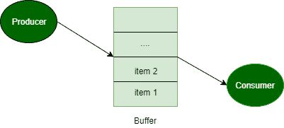

# 过程同步中的彼得森算法

> 原文:[https://www . geeksforgeeks . org/petersons-进程中算法-同步/](https://www.geeksforgeeks.org/petersons-algorithm-in-process-synchronization/)

先决条件–[同步](https://www.geeksforgeeks.org/process-synchronization-set-1/)、[临界区](https://www.geeksforgeeks.org/g-fact-70/)

**问题:**生产者消费者问题(或有界缓冲区问题)描述了两个进程，生产者和消费者，它们共享一个公共的、固定大小的缓冲区，用作队列。生产者生产一个项目，并把它放入缓冲区。如果缓冲区已经满了，那么生产者将不得不等待缓冲区中的空块。消费者从缓冲区消费一个项目。如果缓冲区已经是空的，那么消费者将不得不等待缓冲区中的项目。使用共享内存为两个进程实现彼得森算法，以便它们之间存在互斥。解决方案应该没有同步问题。



**彼得森算法–**

```
// code for producer (j)

// producer j is ready
// to produce an item
flag[j] = true;

// but consumer (i) can consume an item
turn = i;

// if consumer is ready to consume an item
// and if its consumer's turn
while (flag[i] == true && turn == i)

    { // then producer will wait }

    // otherwise producer will produce
    // an item and put it into buffer (critical Section)

    // Now, producer is out of critical section
    flag[j] = false;
    // end of code for producer

    //--------------------------------------------------------
    // code for consumer i

    // consumer i is ready
    // to consume an item
    flag[i] = true;

    // but producer (j) can produce an item
    turn = j;

    // if producer is ready to produce an item
    // and if its producer's turn
    while (flag[j] == true && turn == j)

        { // then consumer will wait }

        // otherwise consumer will consume
        // an item from buffer (critical Section)

        // Now, consumer is out of critical section
        flag[i] = false;
// end of code for consumer
```

**彼得森算法解释–**

彼得森算法用于同步两个进程。它使用两个变量，大小为 2 的布尔数组**标志**和 int 变量**转折**来完成它。
在解决方案中，我代表消费者，j 代表生产者。最初这些标志是假的。当一个进程想要执行它的关键部分时，它会将其标志设置为 true，并将其作为另一个进程的索引。这意味着该进程想要执行，但它将允许另一个进程先运行。该进程执行繁忙的等待，直到另一个进程完成它自己的关键部分。
之后，当前进程进入其关键部分，并从共享缓冲区中添加或删除一个随机数。完成关键部分后，它将自己的标志设置为 false，表示它不想再执行了。

程序在退出前运行一段固定的时间。这个时间可以通过改变宏 RT 的值来改变

```
// C program to implement Peterson’s Algorithm
// for producer-consumer problem.
#include <stdio.h>
#include <stdlib.h>
#include <unistd.h>
#include <time.h>
#include <sys/types.h>
#include <sys/ipc.h>
#include <sys/shm.h>
#include <stdbool.h>
#define _BSD_SOURCE
#include <sys/time.h>
#include <stdio.h>

#define BSIZE 8 // Buffer size
#define PWT 2 // Producer wait time limit
#define CWT 10 // Consumer wait time limit
#define RT 10 // Program run-time in seconds

int shmid1, shmid2, shmid3, shmid4;
key_t k1 = 5491, k2 = 5812, k3 = 4327, k4 = 3213;
bool* SHM1;
int* SHM2;
int* SHM3;

int myrand(int n) // Returns a random number between 1 and n
{
    time_t t;
    srand((unsigned)time(&t));
    return (rand() % n + 1);
}

int main()
{
    shmid1 = shmget(k1, sizeof(bool) * 2, IPC_CREAT | 0660); // flag
    shmid2 = shmget(k2, sizeof(int) * 1, IPC_CREAT | 0660); // turn
    shmid3 = shmget(k3, sizeof(int) * BSIZE, IPC_CREAT | 0660); // buffer
    shmid4 = shmget(k4, sizeof(int) * 1, IPC_CREAT | 0660); // time stamp

    if (shmid1 < 0 || shmid2 < 0 || shmid3 < 0 || shmid4 < 0) {
        perror("Main shmget error: ");
        exit(1);
    }
    SHM3 = (int*)shmat(shmid3, NULL, 0);
    int ix = 0;
    while (ix < BSIZE) // Initializing buffer
        SHM3[ix++] = 0;

    struct timeval t;
    time_t t1, t2;
    gettimeofday(&t, NULL);
    t1 = t.tv_sec;

    int* state = (int*)shmat(shmid4, NULL, 0);
    *state = 1;
    int wait_time;

    int i = 0; // Consumer
    int j = 1; // Producer

    if (fork() == 0) // Producer code
    {
        SHM1 = (bool*)shmat(shmid1, NULL, 0);
        SHM2 = (int*)shmat(shmid2, NULL, 0);
        SHM3 = (int*)shmat(shmid3, NULL, 0);
        if (SHM1 == (bool*)-1 || SHM2 == (int*)-1 || SHM3 == (int*)-1) {
            perror("Producer shmat error: ");
            exit(1);
        }

        bool* flag = SHM1;
        int* turn = SHM2;
        int* buf = SHM3;
        int index = 0;

        while (*state == 1) {
            flag[j] = true;
            printf("Producer is ready now.\n\n");
            *turn = i;
            while (flag[i] == true && *turn == i)
                ;

            // Critical Section Begin
            index = 0;
            while (index < BSIZE) {
                if (buf[index] == 0) {
                    int tempo = myrand(BSIZE * 3);
                    printf("Job %d has been produced\n", tempo);
                    buf[index] = tempo;
                    break;
                }
                index++;
            }
            if (index == BSIZE)
                printf("Buffer is full, nothing can be produced!!!\n");
            printf("Buffer: ");
            index = 0;
            while (index < BSIZE)
                printf("%d ", buf[index++]);
            printf("\n");
            // Critical Section End

            flag[j] = false;
            if (*state == 0)
                break;
            wait_time = myrand(PWT);
            printf("Producer will wait for %d seconds\n\n", wait_time);
            sleep(wait_time);
        }
        exit(0);
    }

    if (fork() == 0) // Consumer code
    {
        SHM1 = (bool*)shmat(shmid1, NULL, 0);
        SHM2 = (int*)shmat(shmid2, NULL, 0);
        SHM3 = (int*)shmat(shmid3, NULL, 0);
        if (SHM1 == (bool*)-1 || SHM2 == (int*)-1 || SHM3 == (int*)-1) {
            perror("Consumer shmat error:");
            exit(1);
        }

        bool* flag = SHM1;
        int* turn = SHM2;
        int* buf = SHM3;
        int index = 0;
        flag[i] = false;
        sleep(5);
        while (*state == 1) {
            flag[i] = true;
            printf("Consumer is ready now.\n\n");
            *turn = j;
            while (flag[j] == true && *turn == j)
                ;

            // Critical Section Begin
            if (buf[0] != 0) {
                printf("Job %d has been consumed\n", buf[0]);
                buf[0] = 0;
                index = 1;
                while (index < BSIZE) // Shifting remaining jobs forward
                {
                    buf[index - 1] = buf[index];
                    index++;
                }
                buf[index - 1] = 0;
            } else
                printf("Buffer is empty, nothing can be consumed!!!\n");
            printf("Buffer: ");
            index = 0;
            while (index < BSIZE)
                printf("%d ", buf[index++]);
            printf("\n");
            // Critical Section End

            flag[i] = false;
            if (*state == 0)
                break;
            wait_time = myrand(CWT);
            printf("Consumer will sleep for %d seconds\n\n", wait_time);
            sleep(wait_time);
        }
        exit(0);
    }
    // Parent process will now for RT seconds before causing child to terminate
    while (1) {
        gettimeofday(&t, NULL);
        t2 = t.tv_sec;
        if (t2 - t1 > RT) // Program will exit after RT seconds
        {
            *state = 0;
            break;
        }
    }
    // Waiting for both processes to exit
    wait();
    wait();
    printf("The clock ran out.\n");
    return 0;
}
```

输出:

```
Producer is ready now.

Job 9 has been produced
Buffer: 9 0 0 0 0 0 0 0 
Producer will wait for 1 seconds

Producer is ready now.

Job 8 has been produced
Buffer: 9 8 0 0 0 0 0 0 
Producer will wait for 2 seconds

Producer is ready now.

Job 13 has been produced
Buffer: 9 8 13 0 0 0 0 0 
Producer will wait for 1 seconds

Producer is ready now.

Job 23 has been produced
Buffer: 9 8 13 23 0 0 0 0 
Producer will wait for 1 seconds

Consumer is ready now.

Job 9 has been consumed
Buffer: 8 13 23 0 0 0 0 0 
Consumer will sleep for 9 seconds

Producer is ready now.

Job 15 has been produced
Buffer: 8 13 23 15 0 0 0 0 
Producer will wait for 1 seconds

Producer is ready now.

Job 13 has been produced
Buffer: 8 13 23 15 13 0 0 0 
Producer will wait for 1 seconds

Producer is ready now.

Job 11 has been produced
Buffer: 8 13 23 15 13 11 0 0 
Producer will wait for 1 seconds

Producer is ready now.

Job 22 has been produced
Buffer: 8 13 23 15 13 11 22 0 
Producer will wait for 2 seconds

Producer is ready now.

Job 23 has been produced
Buffer: 8 13 23 15 13 11 22 23 
Producer will wait for 1 seconds

The clock ran out.

```

本文由**纳巴尼特罗伊**供稿。如果你喜欢 GeeksforGeeks 并想投稿，你也可以使用[contribute.geeksforgeeks.org](http://www.contribute.geeksforgeeks.org)写一篇文章或者把你的文章邮寄到 contribute@geeksforgeeks.org。看到你的文章出现在极客博客主页上，帮助其他极客。

如果你发现任何不正确的地方，或者你想分享更多关于上面讨论的话题的信息，请写评论。