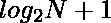

# 集邮角| TCS mockvida 2020

> 哎哎哎:# t0]https://www . geeksforgeeks . org/philaland-coin-TCS-mocckvida-2020/

#### **问题描述**

问题解决者发现了一个新的编码岛，并将其命名为菲兰岛。这些聪明人被赋予一项任务，通过分发不同价值的各种硬币，使在岛上购买物品变得更加容易。马尼什想出了一个解决方案，如果我们从 1 美元开始制作硬币，直到岛上物品的最高价格，那么我们可以很容易地购买任何物品。他补充了以下例子来证明他的观点。

假设一件物品的最高价格是 5 美元，那么我们可以用{$1，$2，$3，$4，$5}的硬币来购买从 1 美元到 5 美元的任何物品。现在，作为一个敏锐的观察者，马尼沙建议我们实际上可以最大限度地减少所需的硬币数量，并给出以下分配{$1，$2，$3}。据他说，任何物品都可以一次性购买，从 1 美元到 5 美元不等。每个人都对他们俩印象深刻。

你的任务是帮助马尼沙为菲拉兰的任意最高价格想出最小面额数。

**示例:**

> **输入:** N = 10
> **输出:** 4
> **说明:**
> 根据 Manish 的说法{$1，$2，$3，… $10}必须配送。
> 但根据 Manisha 的说法，只有{$1，$2，$3，$4}硬币足以购买 1 到 10 美元的任何物品。因此最小值为 4。同样，面额也可以是{$1，$2，$3，$5}。因此答案仍然是 4。
> 
> **输入:** N = 5
> **输出:** 3
> **说明:**
> 根据 Manish 的说法{$1，$2，$3，$4，$5}必须配送。
> 但是根据 Manisha 的说法，只有{$1，$2，$3}的硬币足以购买 1 到 5 美元的任何物品。因此最小值为 3。同样，面额也可以是{$1，$2，$4}。因此答案仍然是 3。

**进场:**问题的关键观察是[任意数都可以表示为二的幂](https://www.geeksforgeeks.org/powers-2-required-sum/)。因此，所需的最小面额为–



**例如:**

> 对于 N = 12，
> 如果我们选择的面额为{1，2，4，8}
> ，那么每一个 12 以内的数字都可以表示为–
> 
> 1 = = > 1
> 2 = =>2
> 3 = =>2+1
> 4 = =>4
> 5 = =>4+1
> 6 = =>4+2
> 7 = =>4+2+1
> 8 = =>8
> 9 = =>8+1
> 10 = =>8+2
> 11

下面是上述方法的实现:

## C++

```
// C++ implementation to find the
// minimum number of denominations
// required for any number

#include <bits/stdc++.h>
using namespace std;

// Function to find the minimum
// number of denomminations required
int findMinDenomin(int n)
{
    return log2(n) + 1;
}

// Driver Code
int main()
{
    int n = 10;

    // Function Call
    cout << findMinDenomin(n);
    return 0;
}
```

## Java 语言(一种计算机语言，尤用于创建网站)

```
// Java implementation to find the
// minimum number of denominations
// required for any number
import java.io.*;
class GFG
{

    // Function to find the minimum
    // number of denomminations required
    static int findMinDenomin(int n)
    {
        return ((int)(Math.log(n)/Math.log(2))+1);
    }

    // Driver Code
    public static void main (String[] args)
    {
        int n = 10;

        // Function Call
        System.out.println(findMinDenomin(n));
    }
}

//  This code is contributed by avanitrachhadiya2155
```

## 蟒蛇 3

```
# Python3 implementation to find the
# minimum number of denominations
# required for any number
from math import log2, floor

# Function to find the minimum
# number of denomminations required
def findMinDenomin(n):

    return log2(n) + 1

# Driver Code
if __name__ == '__main__':

    n = 10

    # Function call
    print(floor(findMinDenomin(n)))

# This code is contributed by mohit kumar 29
```

## C#

```
// C# implementation to find the
// minimum number of denominations
// required for any number
using System;
class GFG
{

  // Function to find the minimum
  // number of denomminations required
  static int findMinDenomin(int n)
  {
    return ((int)(Math.Log(n)/Math.Log(2))+1);
  }

  // Driver Code
  static public void Main ()
  {
    int n = 10;

    // Function Call
    Console.WriteLine(findMinDenomin(n));
  }
}

// This code is contributed by rag2127
```

## java 描述语言

```
<script>
// Javascript implementation to find the
// minimum number of denominations
// required for any number

// Function to find the minimum
// number of denomminations required
function findMinDenomin(n)
{
        return (Math.floor(Math.log(n)/Math.log(2)) + 1);
}

// Driver Code
let n = 10;

 // Function Call
document.write(findMinDenomin(n));

// This code is contributed by patel2127
</script>
```

**Output**

```
4
```

**性能分析:**

*   **时间复杂度:** O(logN)
*   **辅助空间:** O(1)