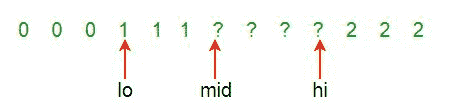
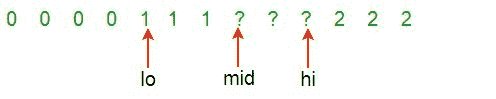
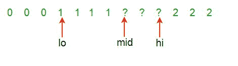
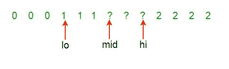

# 对 0、1 和 2s 的数组进行排序的 Php 程序

> 原文:[https://www . geesforgeks . org/PHP-用于排序的程序-0s-1s-和-2s 的数组/](https://www.geeksforgeeks.org/php-program-for-sorting-an-array-of-0s-1s-and-2s/)

给定一个由 0，1 和 2s 组成的数组 **A[]** 。任务是编写一个对给定数组进行排序的函数。这些函数应该将全 0 放在第一位，然后全 1 和全 2 放在最后。
**例:**

```
Input: {0, 1, 2, 0, 1, 2}
Output: {0, 0, 1, 1, 2, 2}

Input: {0, 1, 1, 0, 1, 2, 1, 2, 0, 0, 0, 1}
Output: {0, 0, 0, 0, 0, 1, 1, 1, 1, 1, 2, 2}
```

本文讨论了一个简单的解决方案([对 0、1 和 2s 的数组进行排序(简单计数)](https://www.geeksforgeeks.org/sort-array-0s-1s-2s-simple-counting/))。
**<u>方法 1:</u>**

**做法:**问题类似于我们老帖子[把 0 和 1 隔离成一个数组](https://www.geeksforgeeks.org/segregate-0s-and-1s-in-an-array-by-traversing-array-once/)，这两个问题都是著名的[荷兰国旗问题](http://www.csse.monash.edu.au/~lloyd/tildeAlgDS/Sort/Flag/)的变种。
*这个问题是用三种颜色提出的，这里是‘0’、‘1’和‘2’。阵列分为四个部分:*

1.  a[1-什么 Lo-1]零(红色)
2.  阿[洛..中 1]个(白色)
3.  一[中..嗨]未知
4.  [嗨+1..二(蓝色)
5.  如果 ith 元素为 0，则将元素交换到低范围，从而缩小未知范围。
6.  类似地，如果元素是 1，那么保持不变，但是缩小未知范围。
7.  如果元素是 2，那么用一个高范围的元素替换它。

**算法:**

1.  保持三个指数低= 1，中= 1 和高= N，有四个范围，1 到低(包含 0 的范围)，低到中(包含 1 的范围)，中到高(包含未知元素的范围)和高到 N(包含 2 的范围)。
2.  从头到尾遍历数组，mid 小于 high。(循环计数器为 1)
3.  如果元素为 0，则用索引低的元素交换元素，并更新低=低+ 1 和中=中+ 1
4.  如果元素为 1，则更新 mid = mid + 1
5.  如果元素为 2，则用索引高的元素交换元素，更新高=高–1，更新 I = I–1。因为交换的元素没有被处理
6.  Print the output array.

    **试运行:**
    在这个过程的部分过程中，一些红、白、蓝元素是已知的，并且处于“正确”的位置。未知元素的部分..嗨]，通过检查一个[中间]:

    > 
    > 
    > 检查一个[中间]。有三种可能:
    > a【Mid】是(0)红色，(1)白色或(2)蓝色。
    > 情况(0)a[中]为红色，交换 a[低]和 a[中]；lo++；Mid++
    > 
    > 
    > 
    > 案例(1) a[Mid]是白色的，Mid++
    > 
    > 
    > 
    > 情况(2)a[中]为蓝色，交换 a[中]和 a[高]；嗨–
    > 
    > 
    > 
    > 继续直到中间>嗨。

    **实施:**

    ## 服务器端编程语言（Professional Hypertext Preprocessor 的缩写）

    ```
    <?php 
    // PHP program to sort an array
    // with 0, 1 and 2 in a single pass

    // Sort the input array, the array is 
    // assumed to have values in {0, 1, 2}
    function sort012(&$a, $arr_size)
    {
        $lo = 0;
        $hi = $arr_size - 1;
        $mid = 0;

        while ($mid <= $hi)
        {
            switch ($a[$mid])
            {
            case 0:
                swap($a[$lo++], $a[$mid++]);
                break;
            case 1:
                $mid++;
                break;
            case 2:
                swap($a[$mid], $a[$hi--]);
                break;
            }
        }
    }

    // Utility functions
    function swap(&$a, &$b)
    {
        $temp = $a;
        $a = $b;
        $b = $temp;
    }

    /* Utility function to print 
       array arr[] */
    function printArray(&$arr, 
                        $arr_size)
    {
        for ($i = 0; $i < $arr_size; $i++)
            echo $arr[$i]." ";
        echo "";
    }

    // Driver Code
    $arr = array(0, 1, 1, 0, 1, 2, 
                 1, 2, 0, 0, 0, 1);
    $arr_size = sizeof($arr);
    sort012($arr, $arr_size);
    echo "array after segregation ";
    printArray($arr, $arr_size);
    // This code is contributed by ChitraNayal
    ?>
    ```

    **输出:**

    ```
    0 0 0 0 0 1 1 1 1 1 2 2
    ```

    **复杂度分析:**

    *   **时间复杂度:** O(n)。
        只需要两次遍历数组。
    *   **空间复杂度:** O(1)。
        因为不需要额外的空间。

    更多详情请参考[整理 0，1，2s](https://www.geeksforgeeks.org/sort-an-array-of-0s-1s-and-2s/) 数组的完整文章！